## 정형데이터 분류 2 - EDA

- EDA가 무엇인지
- EDA의 목적은 무엇인지
- EDA의 과정은 어떻게 진행하며
- EDA 를 통해 무엇을 하는지에 대해 알아보자

### 1. EDA(Exploratory Data Analysis)란?

1. 정의

- 탐색적 데이터 분석
- 데이터를 탐색하고 가설을 세우고 증명하는 과정
- 다양한 시각을 통해 데이터를 이해하고 특징을 찾아내는 과정
  - 특징을 시각화, 통계량으로 표현
  - 데이터를 특징과 문제들을 직과적으로 이해
- 정형, 비정형 데이터는 분석에 앞서서 EAD나 전처리 과정을 한다.
- 새로운 아이디어를 만들어내는 과정이다.

2. EDA 과정

- 데이터를 탐색하고 가설을 세우고 증명하는 과정
  - 주어진 문제를 데이터를 통해 해결하기 위해 데이터를 이해하는 과정
    - 문제를 해결하는 과정에서 데이터 이해는 필수이다.
    - 문제에 대한 이해와 데이터에 대한 이해를 통해 적절한 전처리와 방법론 들을 선택한다.
  - 데이터를 통한 문제를 해결하기 위해 데이털르 이해하고 적절한 방법들을 적용하는 것이라고 할 수 있다.
- EAD는 탐색하고 생각하고 증명하는 과정의 반복이다.
  - DATA에 대한 가설 혹은 의문
  - 시각화 , 통계량, 모델링을 통한 가설 검정
  - 위의 결론을 통해 다시 새로운 가설 혹은 문제 해결
- 데이터마다 도메인이 다르고 해결하고자 하는 문제들이 다르다.
  - 데이터의 종류, 사용하게 되는 모델에 따라 EDA의 방향성은 다르다.
  - 일반화가 어렵고 정해진 답이 없다.
- EDA의 시작을 아래와 같은 과정으로 시작하는 것이 좋다.
  - 개별 변수의 분포(Variation)
  - 변수간의 분포 관계 (Covariation)

### 2.EDA Titanic Data를 사용하여 EDA 과정을 알아보자

1. 데이터 파악
   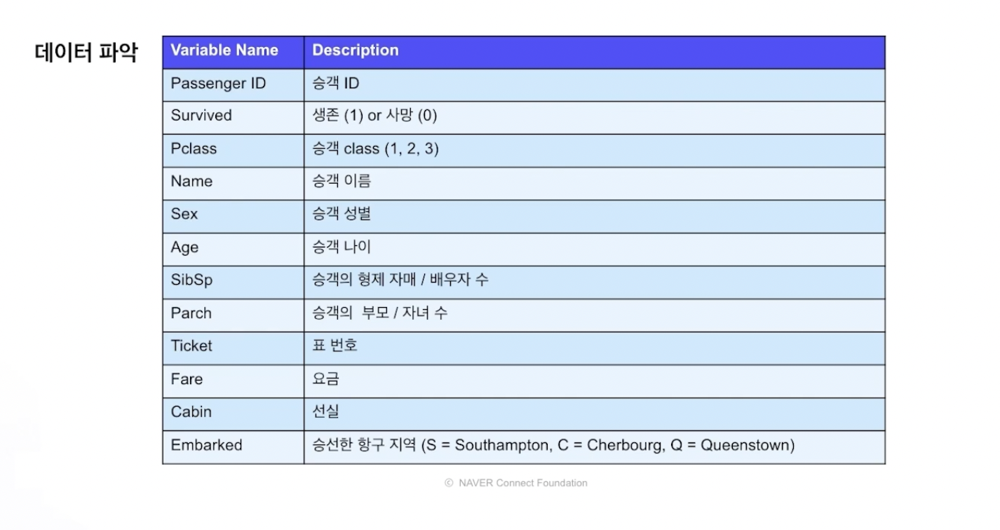
2. 개별 변수
   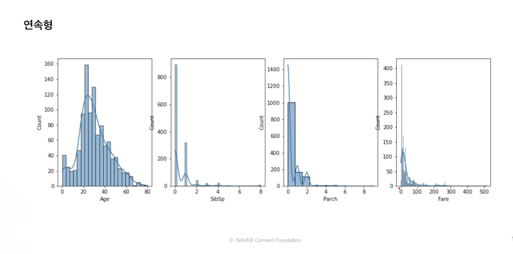

   - Age, SibSp, Parch,Fare 네 가지 변수에 대한 연속형 분포가 있다.
   - Age : 20~30대가 많다.
   - 나머지 데이터는 왼쪽으로 치우친 포아송 분포를 보인다.

3. 범주형 변수
   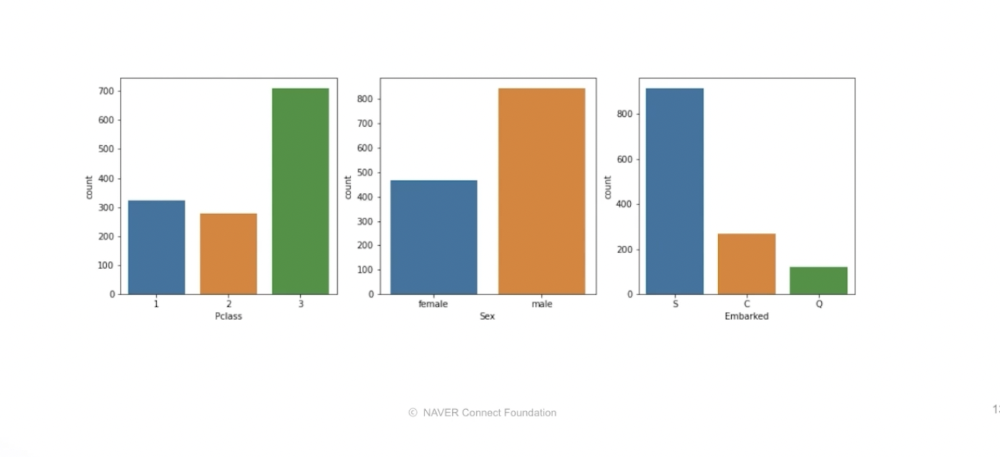
   - Pclass : 3등급이 많다. -> 상식적으로 1등급과 같은 고급 class는 데이터가 적은 경우가 많다.
   - Sex : 남성이 많다.
   - Embarked : S가 많고 Q가 적다.
4. 변수간의 관계
   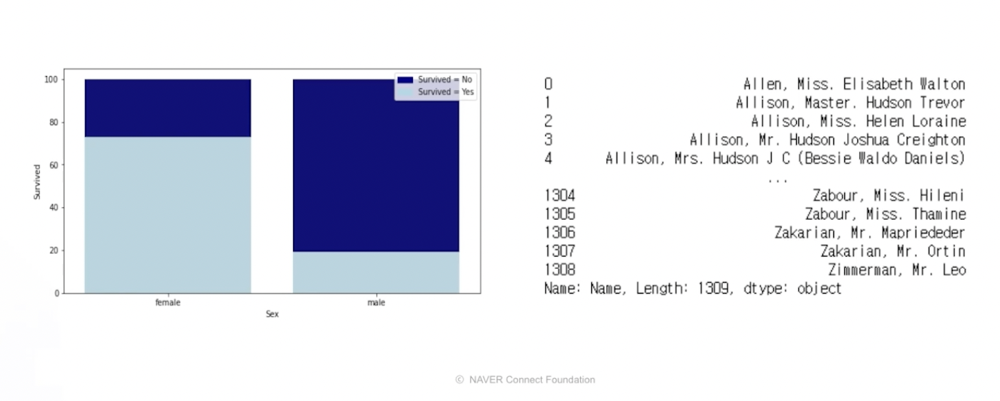

   - 예측하려는 target인 생존자와 변수를 묶어서 보는 것이 가장 중요하다.
   - 성별에 따른 생존 비율의 관계.
   - 남성이 여성보다 많이 사망함
   - 당시엔 여성을 우선적으로 탈출 시킴 -> 이런 식으로 가설을 세우고 데이터를 어떻게 확인할 수 있을지 고민해볼 수 있다. -> 데이터적 상상력
   - 그럼 같은 성별 내에서 어떤 차이가 있었을까?

     - Name을 통해 직위등을 통해 알아낼 수 있음
       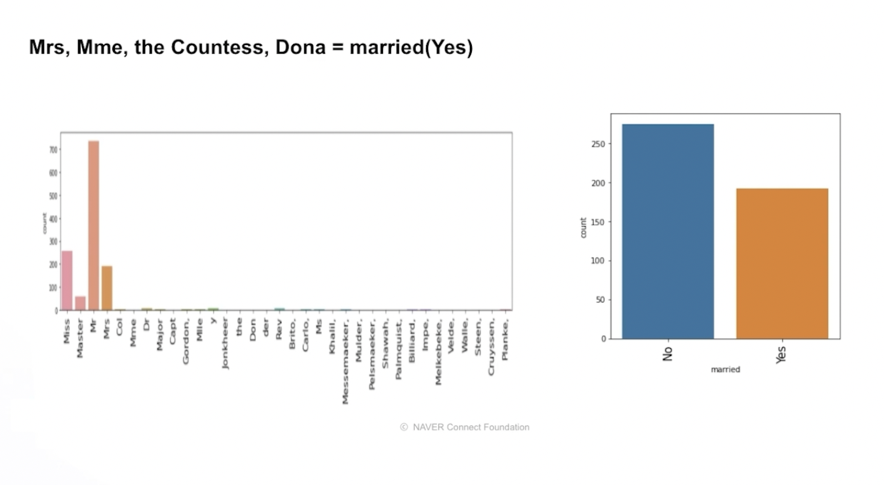

     - 미혼 여성이 기혼 여성보다 더 많음
       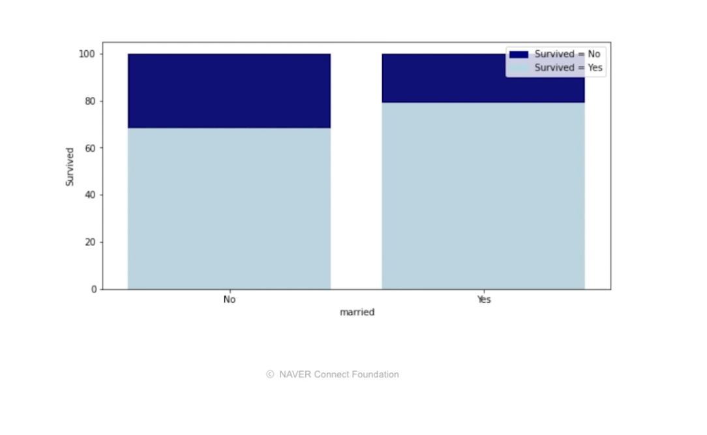

     - 기혼 여성이 생존률이 조금 더 높다. -> 아마 아이가 있어서 그런 것일까? -> 가족의 유무에 따라 생존률을 확인해볼 수 있다.
       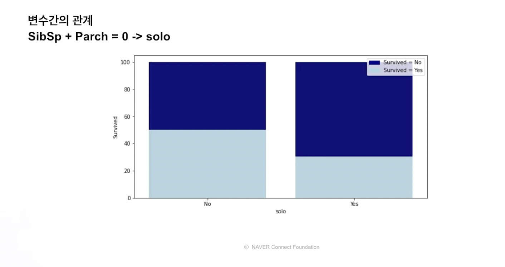
       - 독신의 경우가 사망률이 더 높음 -> 부양해야 할 가족이 있을수록 구명보트를 탔을 확률이 더 높았을 것이라고 생각해볼 수 있다.

   - 가족의 형태에 따른 생존률을 봐보자
     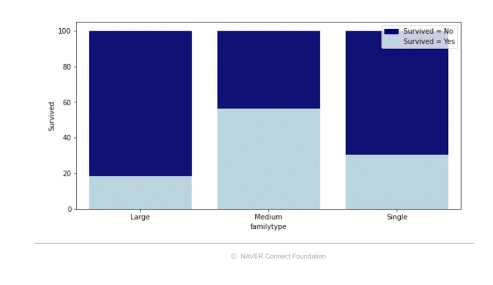
     - Large가 가장 생존률이 적었음 -> 가족이 너무 많아서 기회를 놓쳤는지.. 등을 생각해볼 수 있음

5. 결론
   - 데이터를 통해 의문을 갖고 꼬리에 꼬리를 무는 작업을 하는 것이 EDA과정이다.
   - 개별 변수와 변수간 관계를 보면서 생각,확인,문제이해,데이터이해를 해나가는 것이다.

### 3.강의에서 사용할 데이터로 EDA해보기

- 사용 할 데이터는 고객들의 구매 기록에 대한 데이터이다.
- 시계열 데이터로 구성되어져 있음

1. 문제 이해 및 가설 세우기

- 문제 이해
  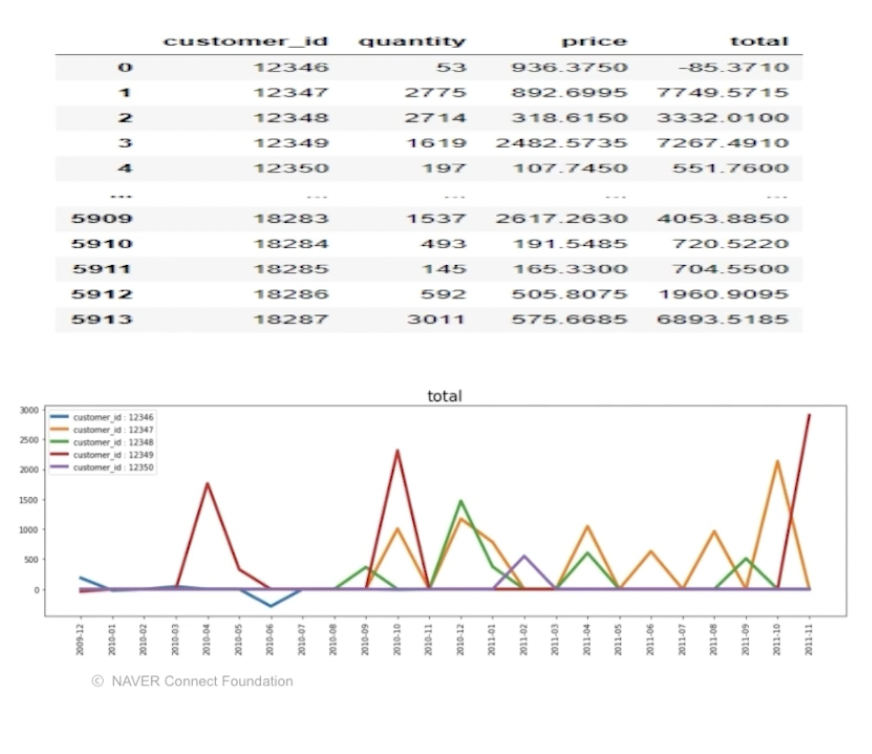
  - aggregation? time series? aggregation + time series?
  - 위의 두 가지 방법으로 가능성을 두고 EDA를 해보자
  - 참고로 풀어야 할 문제는 2011년 12월에 고객별 총 구매액을 예측하는 것이다.
- 가설 세우기
  - 아래와 같은 가설을 확인하면서 데이터의 특성을 파악하고 데이터를 이해
    - 이전 달의 total이 영향을 끼치지 않을까?
    - 작년 12월 달의 total이 영향을 끼치지 않을까?
    - 거주 국적에 따른 영향이 있을까?
    - 고객마다 주고 구매하는 품목이 있을까? 있다면 target에 어떤 영향을 미칠까?
- 2011년 12월 데이터는 예측해야 할 결과이고 2011년 11월 구매액의 합으로 target 레이블을 만들어서 EDA를 해보자

2. 가설 검정 - 연속형

- total
  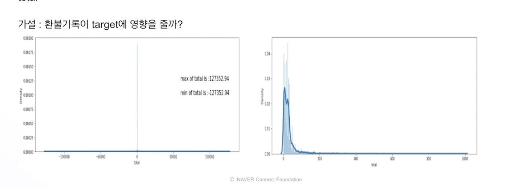

  - 음수인 이유 : 구매액이 '-' 이면 환불 금앧
  - total의 분포 : 대부분이 0 - 200 사이에 몰려있고 가끔 큰 값이 존재
  - 이렇게 보았을 때 환불을 많이 받는 경우가 2011년 12월의 레이블에 영향을 끼칠 수 있지 않을지 생각해볼 수 있다. -> 이를 데이터를 통해 확인 해보고 다른 인사이트를 얻을 수 있다.

  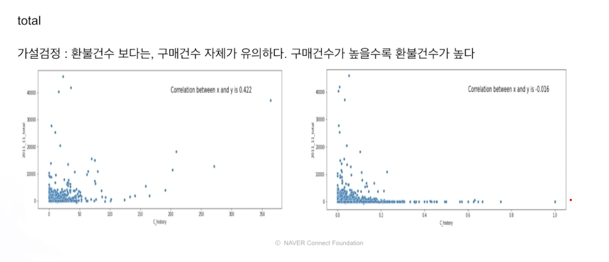

  - 왼쪽 :
    - 고객의 환불 건수 & 2011.11월 total scatter plot,
    - 2011.11 total과 어느정도 상관 관계가 있음을 확인할 수 있다.
    - 그럼 환불을 많이 하면 total과 어느정도 관계가 있나? 라고 생각해 볼 수 있다.
  - 오른쪽 : 환불 비율

    - 고객의 환불 비율,즉 전체 환불 건수를 구매 건수로 나눈 것과 2011.11월 total scatter plot
    - 환불과의 관계가 거의 0에 가까움 -> 환불이 많이 되어도 total과는 관계가 없다는 것을 알 수 있다.
    - 결국, 이를 통해 유주할 수 있는 것은, 구매 건수가 많으면 환불 건수도 많을 것 이므로 구매건수 자체가 환불과 관계까 있지 않으까, 라는 가설을 세울 수 있다.

  

  - 구매 건수와 target은 유의한 상관관계를 보인다.
  - 대부분이 특정 값에 몰려있음. 몇 몇 고객이 굉장한 우량 고객이다.
  - 우측의 구매 건수와 2011.11월 total과의 상관관계를 보면, 구매건수와 2011.11 total간 어느 정도의 유의미한 상관관계가 있음을 알 수 있다.
  - 결론
    - total의 분포를 살펴보고 환불과 total간의 관계를 확인해보고 이를 통해 구매 건수하는 유믜이한 변수를 생각해낼 수 있다.
  - 연속형 변수간의 관계

    - 고객의 total을 월단위로 묶어 sum을 취한 total sum
      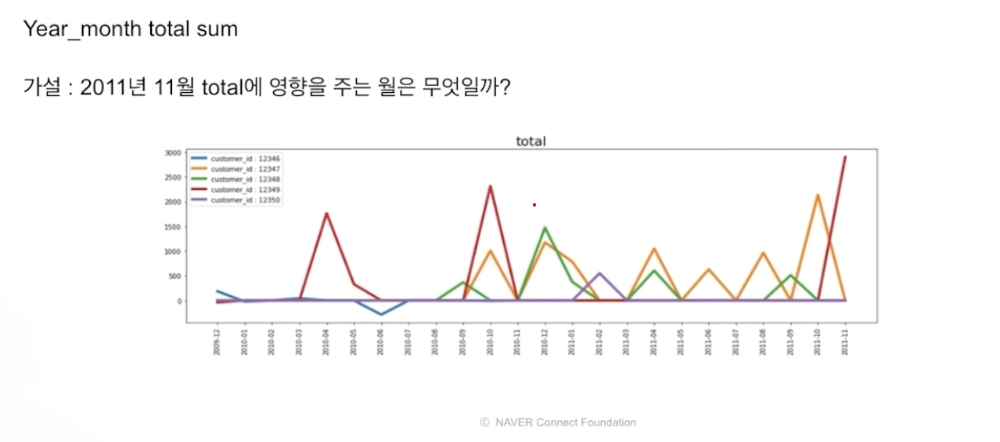

      - 이를 통해 다른 의문들을 생각하고 검증
      - 특정 월에는 구매를 안 할 수 있으므로 0인 데이터가 보일 수 있다.
      - 환불이 많은 경우 -인 데이터도 있다.
      - 이런 데이터는 시계열 데이터로도 볼 수 있다. -> 혹시 시간과의 관계가 있지 않을까 유추해볼 수 있다.

      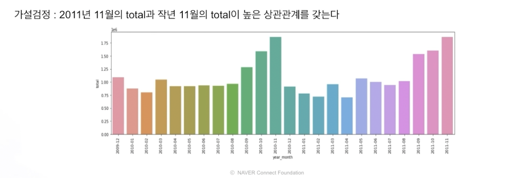

      - 연말에 전반적으로 total이 올라가는 것을 확인할 수 있다.
      - 12월은 total이 놓지 않다. -> 혹시 사람들이 12월의 물건들을 미리 구매하는 것은 아닌가? 하는 생각을 할 수 있다. -> 그렇다면 데이터의 구매 고객은 일반 고객이 아닌 상점이나 소매상 고객의 구매데이터이지 않을까? 하는 생각을 할 수 있다. -> 만약 그렇다면 12월에 장사를 하기 전에 12월 이전에 상품을 미리 구매해서 이런 pattern이 나오는 것은 아닐까? 그렇다면, 상점이나 소매상에서 사는 물품에 따라 어떤 물품을 주로 취급하는 가게인지 알아낼 수 있지 않을까?라는 생각도 할 수 있다.

      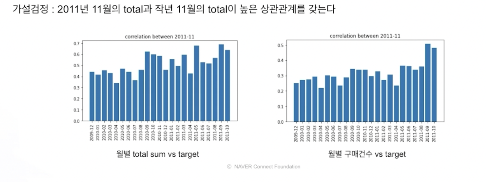

      - 월별 total sum 구매 건수로 2011.11월 간의 상관 관계를 bar로 표현
      - 왼쪽 : 2011.11월 과 가까운 월이 상관 관계가 높음 -> 즉, 월별 total sum은 이전의 가까운 월 & 작년의 비슷한 월에서 높은 상관 관계를 맺고있다. -> 시계열 적인 주기성이 있음
      - 오른쪽 :작년과 비슷한 월에는 상관관계가 없고 가까운 과거의 월과 상관관계가 있음을 볼 수 있다. -> 왼쪽과는 다르다. 이런 모든 것은 변수로 활용하거나 모델링할 때 고려해야 할 부분이 될 수 있다.
      - 이런 과정을 통해 feature를 생각해내고 모델에 적용하면서 모델의 성능을 올릴 수 있는 것임.

3. 가설 검정 - 범수형

- 구매 당시의 거주 국가
  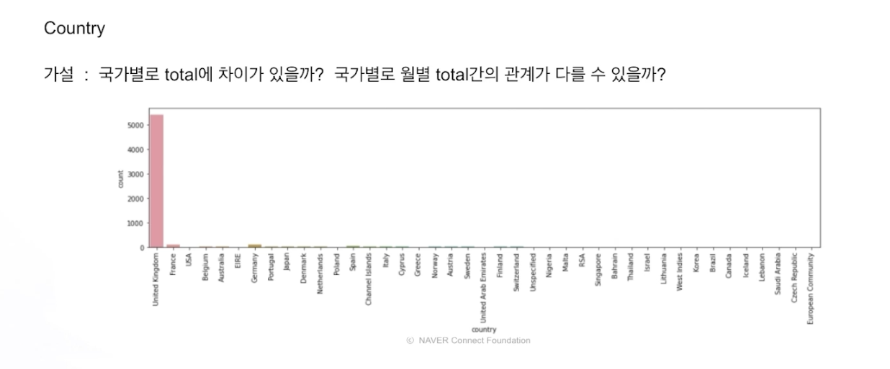
  - 대부분 영국, 나머지는 거의 소수 국가
  - 국가별로 total에 차이가 있는지, 월별 tital간의 관계가 다를 수 있는지 파악해보자.
    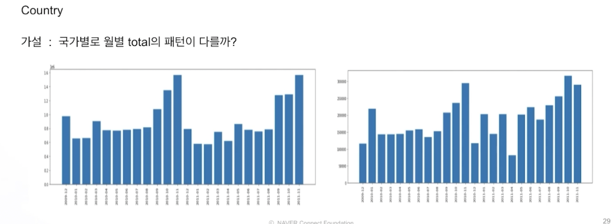
    - 왼쪽 : 영국의 월별 total sum pattern, 오른쪽 나머지 국가의 월병 total sum pattern
    - 일부 차이는 있지만 크게 나지는 않는다. -> 굳이 국가라는 변수를 모델링에 써야할까? -> 사용하지 않는 것으로
- 상품 코드
  
  - product_id는 일반적으로 5자리 숫자로 이루어져 있지만 왼쪽을 보면 다른 문자로 이루어져있다.
  - POST 또는 Discount로 나와있는데, 이런 데이터는 어떻게 처리해야할 지 고민해볼 수 있다.
  - product_id롤 보고 생각해볼 수 있는 것은, 일반적인 상품코드의 경우 숫자 단위로 어떤 제품의 정보를 유추할 수 있는 의미를 내포할 수 있는데 이러한 가설을 바탕으로 의문을 품고 데이터를 통해 확인해 볼 수도 있다.
  - 가설을 확인하기 위해 상품코드 앞의 두 자리 숫자만 뽑아서 확인해보자
    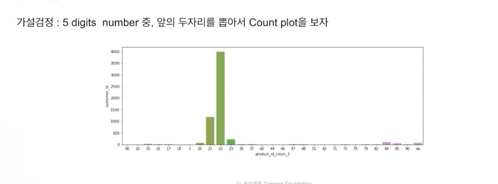
    - 대부분 20,21,23이 대부분임 -> 너무 수가 적은 경우 제거를 하거나 하나로 묶어도 좋음
  - 앞의 두 자리만 뽑아서 description을 살펴보자
    
    - 왼쪽 850- 인 경우 : sweetheart, candle등 비슷한 상품이 모여있는 것 같음. 유사도를 뽑으면 상품간 어떤 관걔가 있는지 살펴볼 수 있을 것 같음.
    - 오른쪽 200-인 경우 : Pater, tree 등 비슷한 느낌의 상품들..이 모여있다.
    - 이렇게 대략적인 시각화를 통해 상품을 어느정도 분류할 수 있고 description을 통해 유사항 상품끼리 클러스터링 또는 그룹핑을 하면 product_id이 수를 줄여서 feature를 쓸 수 있겠다는 생각을 할 수 있음
  - 특정 고객 한 명의 데이터에서 product*id 앞 두 자리 까지만 뽑아서 사용
    
    - 오른쪽 : 왼쪽 - 고객의 데이터를 히트맵으로 시각화. 21,23 사이의 상품을 계속 구매한 pattern이 보임.
  - Description은 NLP 영역임 . 이를 다양한 영역으로 활용해서 feature로 만드는 생각도 해볼 수 있다.

### 4. 결론

- 결국 EDA는 많은 가설과 검증을 통해 데이터를 이해하는 과정이다.
