## 0. 데이터 전처리란?

- 데이터 전처리(preprocessing)은 머신러닝 모델에 데이터를 입력하기 위해 처리하는 과정
- EDA와도 관련이 있다.EDA를 적절히 하기 위해서 데이터를 처리하는 것도 전처리
- EDA의 목적에 따라 달라짐
- 선형 모델을 사용할지 트리 모델을 사용할지 딥러닝 모델을 사용할지에 따라 전처리 방식은 달라진다.
- 데이터 전처리의 방법론
  - 연속형, 범주형 처리
  - 결측치 처리
  - 이상치 처리
- sklearn의 Boston Data를 사용하여 알아보자
  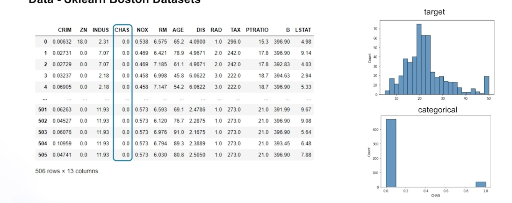
  - 예측할 target변수는 집값으로 회귀문제를 위한 데이터셋이다.
  - chas를 제외하고는 모두 연속형 변수이다.

## 1. 연속형, 범주형 처리

### 1. continuous type

- 연속형 변수를 처리하는 방법론

  - Scaling

    - 데이터 단위 또는 분포를 변경한다.
    - 선형기반의 모델(선형회귀, 딥러닝 등)인 경우 변수들간의 스케일을 맞추는 것이 필수적이다.
    - Scaling 방법으로는 Scale만 바꾼 경우, Scale + Distribution을 바꾸는 경우, 추가적으로 Binning 이라는 것도 있다.
    - Scaleㅎ만 만 바꾼 경우

      - Min Max scaling :
        - 데이터의 최소값과 최대값을 이용하여 0~1 사이의 값으로 변환 x_new = (x - min(x)) / (max(x) - min(x))
      - Standard scaling :
        - 데이터의 평균과 표준편차를 이용하여 정규분포로 변환
        - x_new = (x - mean(x)) / std(x)
      - Robust scaling :
        - 데이터의 중앙값과 IQR을 이용하여 변환
        - x_new = (x - median(x)) / IQR(x)
        - IQR(x) : x_75 - x_25
        - 이 방법이 이상치의 영향을 덜 받는다고한다.
      - Scaling에 따른 선형 모델의 변화
        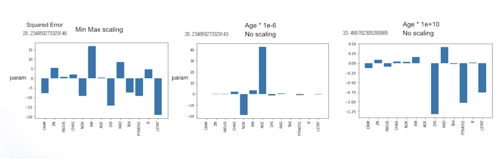
        - 왼쪽 : min max scaling을 적용한 경우
          - squared error는 26.2 정도이고 age feature의 계수값은 아주 작다.
        - 중간 : age feature에 10^-6을 곱해서 아주 작게 만들고 스케일링을 하지 앟는 경우
          - age feature가 커져거 target에 가장 큰 영향을 주는 feature가 되었다.
        - 오른쪽 : age feature에 10^10을 곱해서 아주 크데 만들고 스케일링을 하지 않음
          - age feature의 계수값이 아주 작아짐 모델의 error도 33.4정도로 커짐
        - 이렇게 스케일링증 잘못하면 계수값에 따른 모델의 해석적인 측면에서도 문제가 있고 모델의 성능에도 영향을 줄 수 있으므로 적절하게 스케일링을 하는 것은 매주 중요하다.

    - Scaling + Distribution
      - Log transformation
        - 아래와 같이 변수의 분포가 치우쳐져있는 경우 Log formation을 하면 우측과 같이 정규분포화 가까운 분포를 만들어낼 수 있다.
          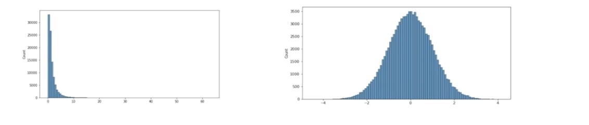
      - Quantile transformation
        - 값을 uniform하게 변환 or 정규 분포로 변환해줌
        - Log formation과의 차이점은 어떤 변수가 들어와도 uniform or 정규 분포로 맞출 수 있다는 것임
        - 값을 나열하고 해당 분포에서 그 값이 위치하는 분위수로 변환을 시키기 때문에 유용하게 쓰일 수 있다.
          - 예를 들어, 데이터 세트에서 특정 값이 전체 데이터의 하위 30%에 위치한다면, 이 값은 0.3의 분위수 값을 갖게 된다. 이 방식은 데이터의 원래 분포에 관계없이 일정한 분포 형태를 갖도록 만들 수 있기 때문에, 모델의 성능을 향상시키는 데 유용하게 사용된다.
        - 변수의 분포를 변환하면 어떠 장점이 있는가?
          - target과의 관계가 저 직접적으로 가까워질 수 있다
            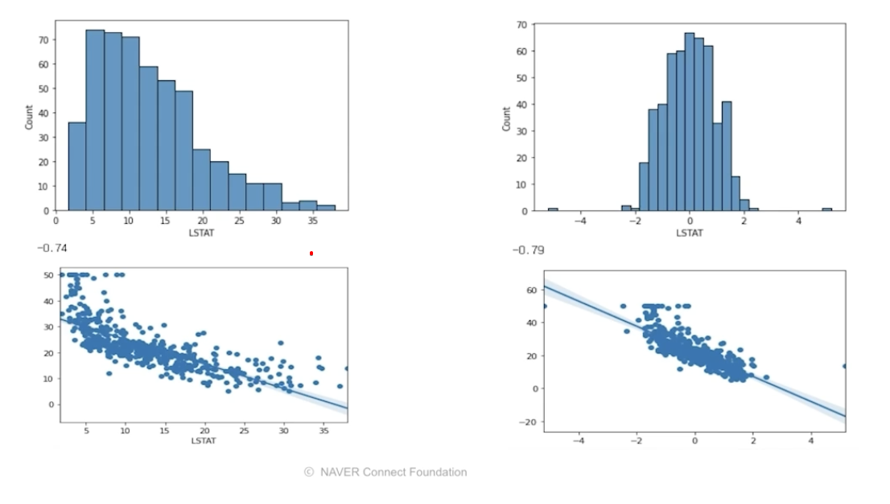
            - Bostan data의 LSTAT 변수로 Quantile transformation을 적용한 예시
            - 왼쪽 : 원해 LSTAT의 분포화 target과늬 scatter chart로 상관관계가 -0.74
            - 우측 : Quantile transformation을 통해 정규분포로 변경 후에는 -0.79로 target가 좀 더 직접적인 관계를 갖게됨을 볼 수 있다.
        - Bostan data에서 Quantile transformation을 했을 때 target과 상관관계가 높은 feature만 뽑아서 모델의 성능을 확인해보자
          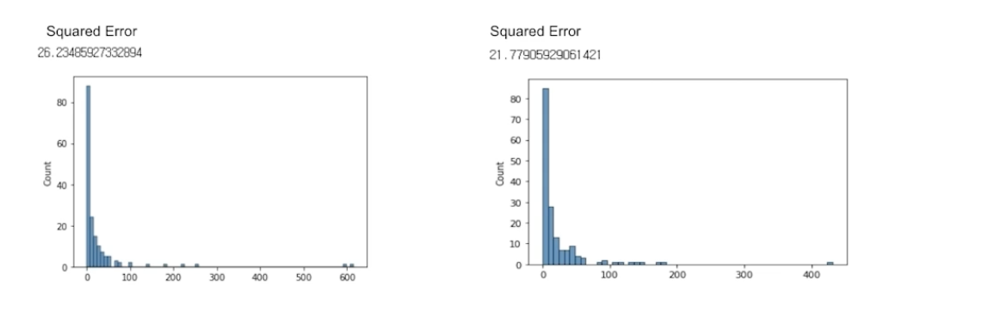
          - 왼쪽 : 그대로했을 때의 모델의 예측값 분포. squared error가 26.2 정도
          - 우측 : Quantile transformation 을 취했을 때의 모델 예측값 분포, 21.7로 성능이 더 좋아짐
          - 이렇게 적절한 분포를 통해 모델의 성능을 올릴 수 있다.
    - Binning
      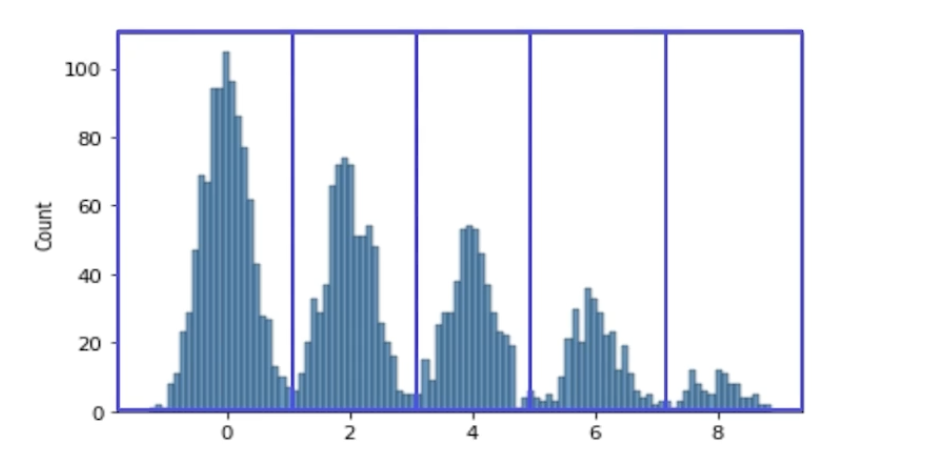
      - Binning은 연속형 변수를 구간별로 나누어 범주형 변수로 만드는 것
      - 트리모델을 사용했을 때 이런 부분이 있다면 Overfitting이 있을 수 있음
      - 연속형으로 존재함으로써 봉우리 사이사이 유의미하지 않은 정보들이 있을 수 있다.
      - 넓고 얇은 다봉분포

### 2. categrical type

- 연속형 변수보다 더 주의를 기울여야한다.
- 범주형 변수란 일종의 카테고리를 갖는 변수를 의미한다.(식물의 종, 자동차의 종류..)
- 보통 문자열로 되어있어서 머신러닝 모델의 입력 데이터로 사용할 수 없어서 수치형 변수로 인코딩을 해주는 작업이 필요하다.
- 대표적인 인코딩 기법

  - One hot encoding
    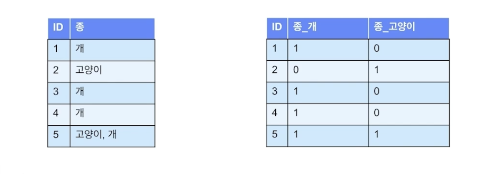
    - 변수를 1과 영으로 나눔
    - 해당 값이 존재하면 1 아니면 0
    - 장점 : 모델이 변수의 의므릴 정확하게 파악한다.
    - 단점 : 변수의 종이 많다면 많은 활성 행렬이 만들어질 것임. 모델의 메모리,성능에 좋지 않음
  - Label encoding
    - One hot encoding의 보안으로 컬럼을 한 개로 유지하고 각각의 종이 다른 값을 갖도록 하는 방법
      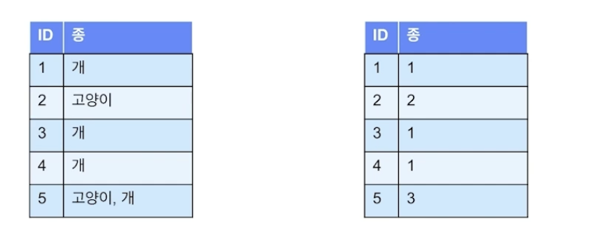
      - 단점은 모델이 이 숫자의 순서를 특징으로 인식할 수 있다는 것임 (의미없는 숫자로 대체하는 방법임)
      - 특히 선형모델에서는 lable encoding은 범주형 변수의 값이 순서를 갖고있고 순서에 맞게 레이블 인코딩을 했다면 사용가능하지만 그렇지 않다면 사용할 수 없으니 주의가 필요하다.
  - Frequency encoding
    - 해당 변슈의 값이 몇 번 나오는지에 대한 빈도수를 변수의 값으로 사용하는 방식
      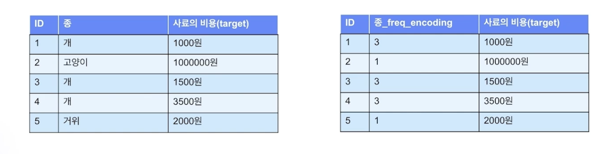
      - 개는 세 번 나오므로 3, 고양이는 한 번 나모으로 1, 거위는 1로 인코딩할 수 있다.
      - 장점
        - 하나의 컬럼에 모든 값을 표현할 수 있는 장점이 있고 순서의 영향도 받지 않는다.
        - 의미있는 값을 모델에 줄 수 있다.
        - 범주형 변수의 빈도수가 얼마나 되는지에 대한 연관성이 있다.
      - 단점
        - 하지만 인코딩한 값이 같아서 종이 겹치는 문제가 발생할 수 있다.
        - 미래의 새로 들어오는 종에 대해서도 인코딩할 수 없는 단점도 있다
  - Target encoding

    - 각각의 종이 갖는 targer 변수의 평균으로 인코딩을 하게 된다.
      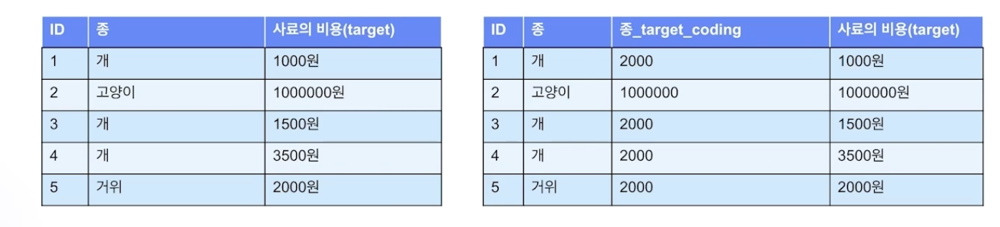
      - 개의 경우 사료의 비용을 더해서 3으로 나눈 2000원
      - 고양이의 경우 100만원을 1로 나눈 100만
      - 거위의 경우 2000원을 1로 나눈 2000
    - 장점
      - 하나의 컬럼에 모든 값을 표현할 수 있는 장점이 있고 순서의 영향도 받지 않는다.
      - 의미있는 값을 모델에 줄 수 있다.
      - target변수와 얼마나 연관되어있는지
    - 단점
      - 하지만 인코딩한 값이 같아서 종이 겹치는 문제가 발생할 수 있다.
      - 미래의 새로 들어오는 종에 대해서도 인코딩할 수 없는 단점도 있다(frequency encoding과 동일)
      - target변수와 직접적으로 연관되기때문에 모델에 사용하는 경우 verfitting되는 경우가 있을 수 있어서 이를 해결할 수 있는 적절한 처리가 필요하다

  - Embedding
    - Entity embedding이라고도 한다.
      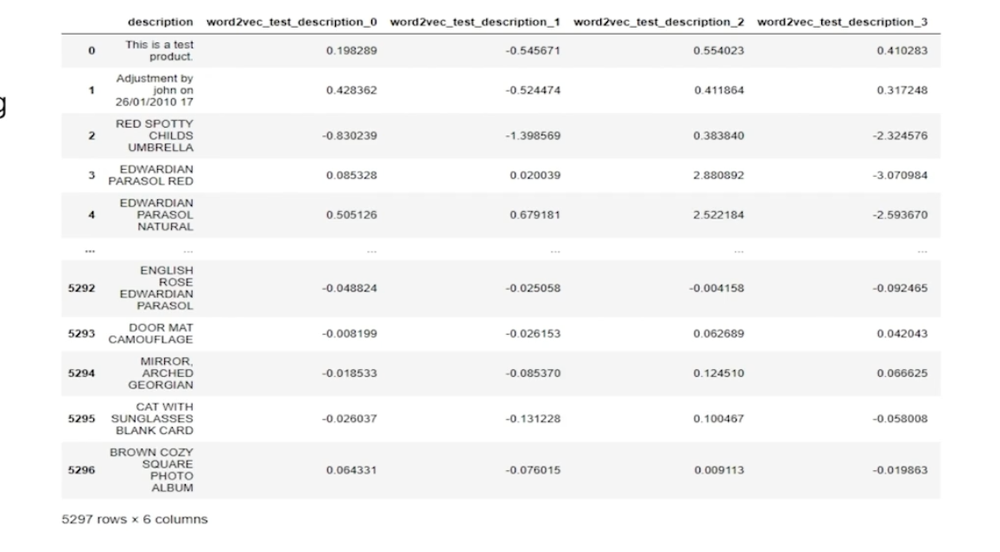
      - 위의 데이터는 Word2Vec을 사용해서 인코딩한 얘이다.
      - description은 텍스트데이터이기땨문에 기존의 인코딩 방법으로는 수치화하기가 어렵다.
      - Word2Vec과 같은 방법을 사용해서 조금 더 낮은 차원으로 임베딩을 처리한던가 해야함

## 2. 결측치 처리

- 결측치(Missing Value)란 결측값은 알려지지 않고, 수집되지 않거나 잘못 입력된 데이터 세트의 값

- 사용 할 데이터
  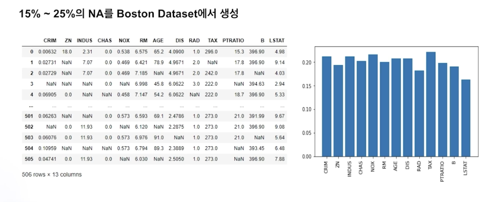
  - 우측차트는 각 변수별 결측치의 비율을 나타낸 것이다.

### 1. pattern (결측치의 pattern을 파악해서 처리하는 방법)

- Missing data patterns
  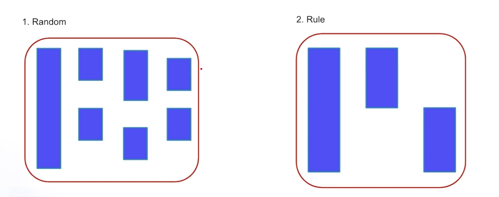

  - x축을 개별 변수, y축은 변수 순서대로 히트맵을 그린 것이다.
  - 비어있는 부분이 해당 변수의 결측치를 의미한다.
  - 일반적인 pattern은 random하게 발생하는 경우가 있고 어떤 규칙(rule)을 갖고 발생하는 경우가 있다.
  - 우측 그래프의 경우 두 번째는 밑에 부분이 결측치이고 세 번째 그래프는 윗 부분이 결측치이다. 이런 패턴을 파악해서 두 개의 변수 사이간 결측치에 규칙이 있다고 볼 수 있고 이를 이용해서 결측치 처리를 할 수 있다.

  - Boston data에서 임의의 결측치를 생성하고 히트맵으로 그린 그래프이다.
    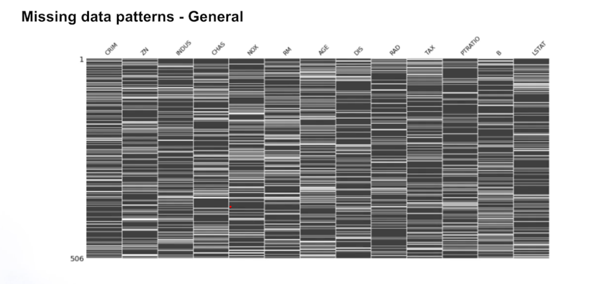
    - 결측치가 어떤 패턴을 갖고있어보이지는 않는다.
    - 이런 경우 패턴으로 분석이 안되기 때문에 단변량, 다변량들을 사용해서 결측치를 처리해야한다.
  - 다른 데이터셋의 결측치 여부를 히트맵으로 그린 것
    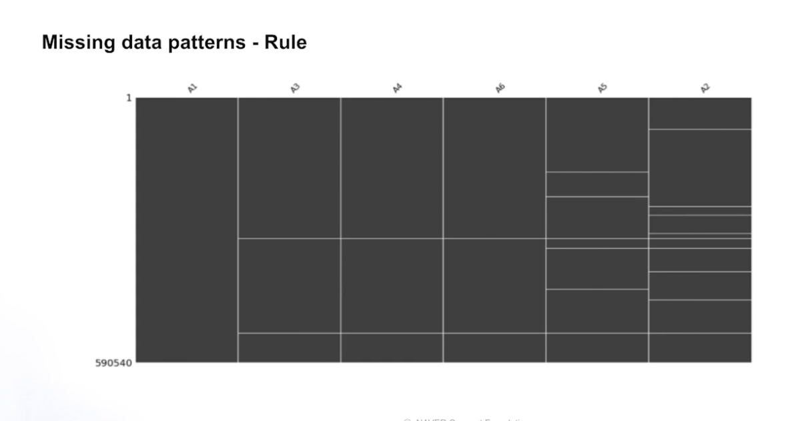
    - a1는 없는 반면에 a3,4,6는 동일한 데이터에 결측치가 있음을 알 수 있다.
    - 또한 a3,4,6에 결측치가 있드면 a5,3에도 결측치가 있음을 알 수 있다.
    - pattern이 있기 때문에 데이터를 직접 보고 어떤식으로 발생했는지 어떤식으로 채울 수 있는지 확이해야한다.
      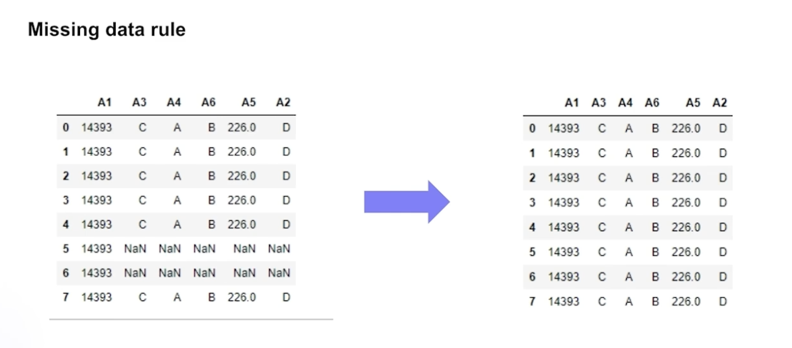
      - 위의 표를보면 5,6 번째에서 데이터가 없는 것을 볼 수 있고 결측치가 없는 데이터의 모든 값이 같으므로 이 데이터의 값을 채울 수 있다.

### 2. univariate(단변량)

1. 제거
   - 결측치가 너무 많은 경우
   - 해당 데이터 포인트를 제거하는 방법 -> 데이터가 충분히 많지 않으면 좋은 방법은 아니다
   - 변수를 제거하는 방법 -> 해당 변수에 결측치가 많다면 모델에 사용해도 도움이 안될 것이기 때문에 변수 자체를 제거할 수 있다.
2. 평균값 삽입
3. 중위값 삽입
4. 상수값 삽입

5. 문제점
   - 2,3,4 번 방법의 경우 결측치가 많다면 이런 값들도 문제가 될 수 있다.
   - 아래와 같이 분포가 망가질 수 있다. (우측의 그림들은 평균값을 넣었을 때의 예시이다.)
     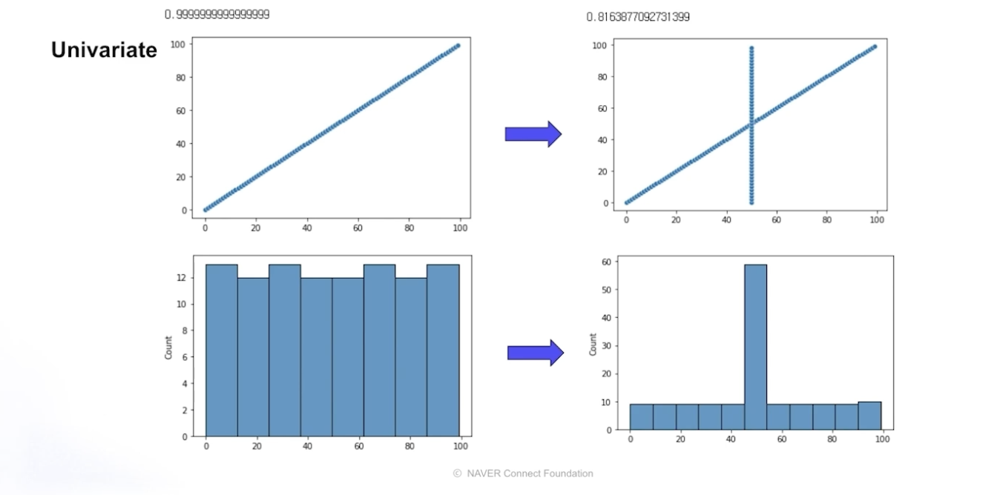
   - 아래 그림은 변수와 target간의 상관관계를 보여주는 그림이다.
     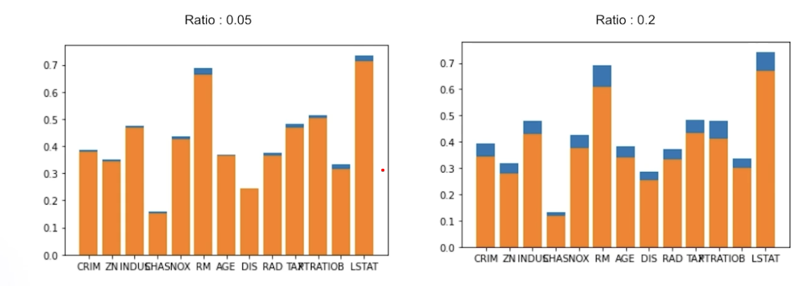
   - 결측치의 비율이 0.05 인 적은 경우 평균값이나 중위값으로 채워도 상관관계에 문제가 없지만
   - 우측의 경우 20%의 결측치를 갖고있을 때 평균으로 채워넣는 경우 상관관계가 많이 떨어지는 것을 볼 수 있다.

### 3. multivariate(다변량)

- 결측치를 채우는 방법으로는 채우는 것을 머신러닝 모델을 사용하여 주변 변수들을 통해 결측치를 예측하거나 결측치를 가진 sample과 가장 유사한 sample을 찾아서 그 값으로 넣어주는 방법
- 결측치가 많다면 시행하기 어렵고 데이터의 크기에 따라 시간이 많이 소모되기때문에 적절한 판단이 필요하다.
- 머신러닝 모델을 통해 결측치를 채운 예
  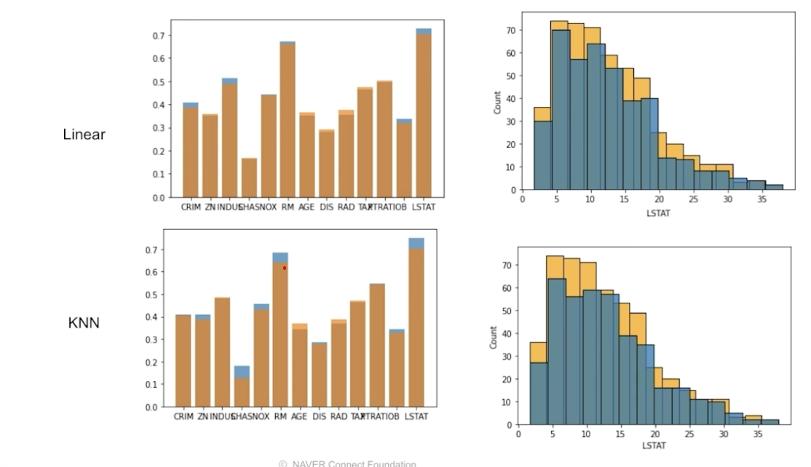
  - 왼쪽차트
    - x - 변수, y - target간의 상관관계
    - 파란색 : 결측치를 채우기 전의 상간관계, 주황생: 채운 후 상관관계
  - 우측차트
    - 결측치를 채우기 전,후의 LSTAT 변수의 분포
    - 위 : 선형모델 아래:KNN(유사한 값으로 채운 것)
- 의미를 보고 채우는 방법도 있다.
  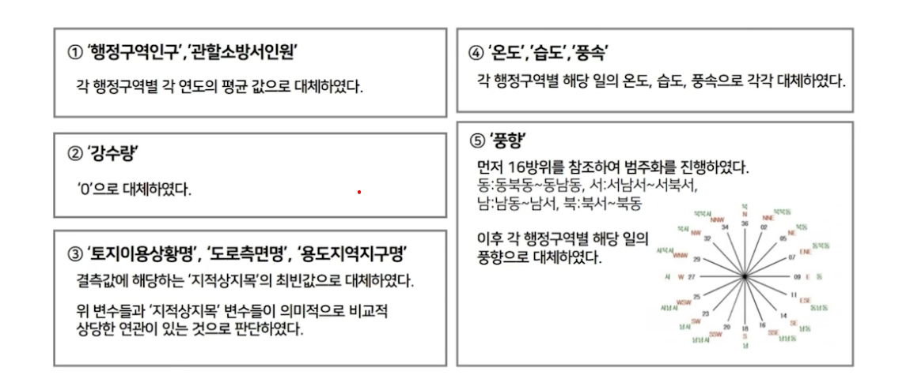

## 3. 이상치 처리

- 잘못하면 모델의 성능에 큰 영향을 끼칠 수 있다.

### 1. 이상치란?

- 일반적인 데이터랑 크게 다른 데이터를 의미한다.
- 이상치가 모델의 성능에 어떻게 영향을 줄 수 있는지에 대항 예시
  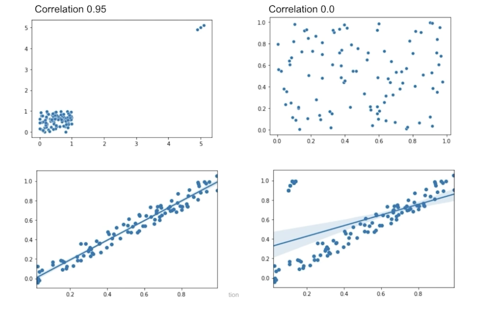
  - 위쪽 차트
    - 왼쪽 위는 x,y의 상관관계가 굉장히 높아보이는데, 이상치를 제거하고 보면 사실상 상관관계가 거의 없이 뿌려져있음을 알 수 있다.
  - 아래의 차트
    - 왼쪽은 이상치를 제거하려 x,y가 선형적인 관계를 갖고있지만 우측의 이상치들로인해 x,y의 관계를 확인하는데 문제가 될 수 있다.
- 그럼 이상치가 있음을 어떻게 알 수 있을까?

### 2. 이상치 탐색

    - 이상치가 있으면 선형 모델의 경우 학습이 잘 안되는 경우가 있을 수 있어서 이상치 처리가 중요하다.
    - 트리모델의 경우 선형보다 이상치에 영향을 덜 받아서 성능 여부를 보고 이상치를 처리할지에 대한 판단 여부를 고려해볼 수 있다.

    1. Z-Score

    2. IQR

### 3. 이상치 처리 관점

1. 정성적인 측면

   - 이상치 발생 이유

   - 이상치의 의미 - 예시

   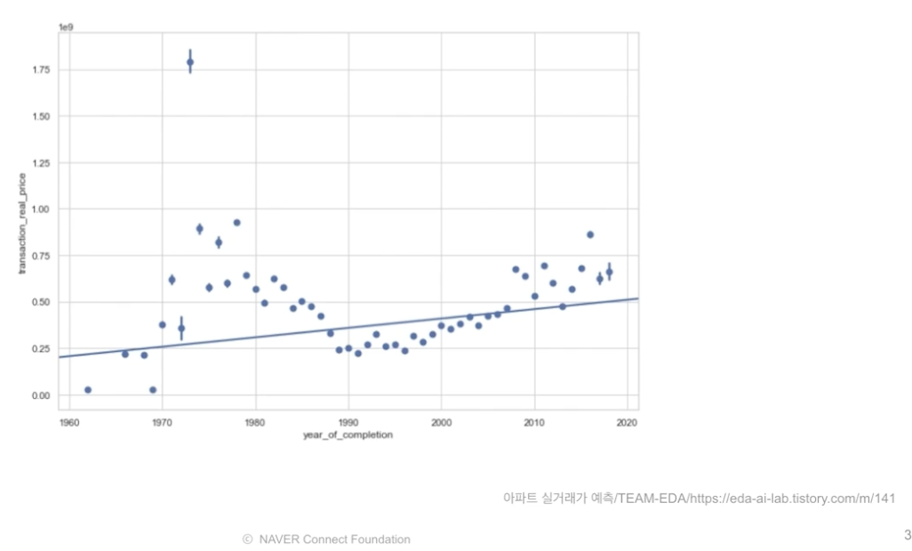

   - x : 아파트가 지어진 연도, y : 아파트 가격
   - 7,80년 대에 가격이 월등히 높은 이상치 데이터를 볼 수 있다. 왜 높은지에대해 조사를 해봤을 때 해당 아파트가 재개발이나 재건축 되었을 수 있고 이런 경우 재개발,재건축 여부를 변수로 넣어서 이상치 데이터를 해결할 수도 있을 것 같음

2. 성능적인 측면
   - Train Test Distribution
     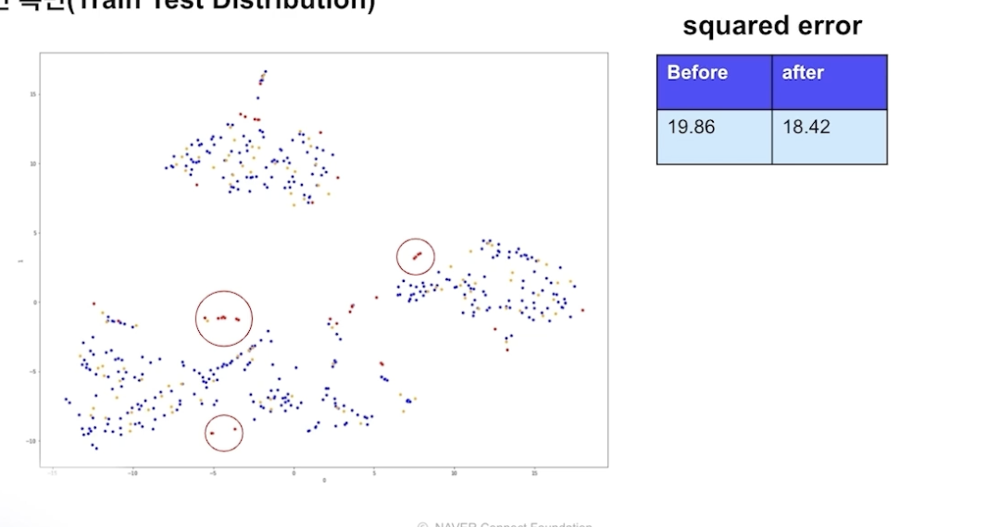
     - 파란색 : training data
     - 노란색 : Test data
     - 빨간색 : Z-Score 방식으로 탐색한 이상치 데이터
     - Trainig data와 이상치데이터의 분포는 조금 겹치지만 Test data와는 겹치지 않는 부분들이 있다. 이상치를 제거함으로써 성능이 향상됨
