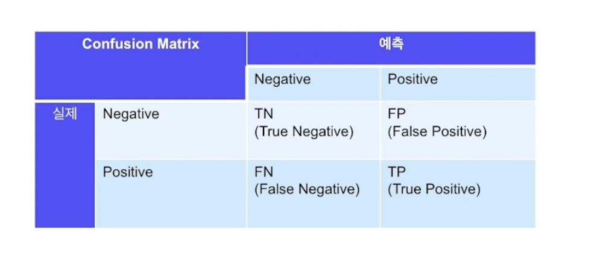
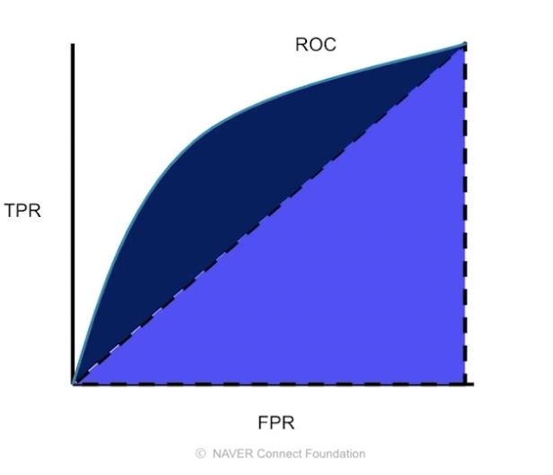

[⬅️ BACK ](./README.md)

## 1. 정형 데이터의 정의

- 정형 데이터 : 행, 열로 표현 가능한 데이터. 하나의 row는 하나의 데이터 instance, column은 데이터의 feature를 나타낸다.

- 비정형 데이터 : 이미지, 비디오, 음성, 자연어 등 정제되지 않은데이터. row,column으로 표현하기 어려움.

- 정형데이터의 분석 능력
  - 데이터에 대한 상상력
  - 데이터에 대한 통찰력

## 2. 데이터 및 문제 이해

- 문제를 풀기 위해서 어떻게 데이터를 처리하고 모델에 넣어줄지 고민을 해야한다
  - 어떤 데이터로 train 하고 valid하고 test를 할지에 대한 많은 가설을 세우고 실험하고 검증하는 과정을 거쳐야 한다.

## 3. 머신러닝 평가지표 이해

- 적절한 평가 지표를 성정하는 것은 중요하다
- 풀려는 문제의 목적에 맞게 평가 지표를 설정해야 모델의 성능을 잘 평가할 수 있다.
- 평가지표를 기준으로 모델의 성능을 높이는 작업을 할 수 있다.

1.  분류, 회귀 평가지표

    - 분류(Classification)

      - 예측해야항 대상의 개수가 정해져있는 문제
      - ex) 개,고양이 분류, 신용카드 거래가 사기 거래인지 정상 거래인지 분류

    - 회귀(Regression)

      - 예측해야할 대상이 연속적인 숫자인 문제
      - ex) 일기 예보에서 내일의 기온 예측, 주어진 데이터에서 집값 예측\

    - 평가지표(Evaluation Metric)

      - 분류, 회귀 머신러닝문제의 성능을 평가할 지표

2.  Confusion Matrix
    

    - 분류 문제의 평가지표를 계산하는데 사용하는 지표
    - 이진분류의 예측 오류가 얼마인지, 어떤한 유형의 예측오류가 발생하고 있는지를 나타내는 행렬
    - 분류문제의 대표적인 평가지표는 Accuracy , Precision, Recall이 있다.

3.  Accuracy (정확도)

    - Accuracy : (TP + TN) / (TP + TN + FP + FN) -> 정답의 비율
    - 정확도. 전체 데이터중 모델이 바르게 분류한 비율을 나타낸다.
    - 불균형 데이터에서는 부정확한 평가지표이다.

      - 만약 100명 중 1명만 암에 걸렸는데 예측은 모두 걸린다고 하면 정확도는 99%가 나오지만 실제로는 1명만 걸린 것이기 때문에 정확도가 높다고 할 수 없다.

        - 조금더 상세한 설명 : 정확도(Accuracy)는 모델이 전체 데이터 중에서 얼마나 정확하게 예측했는지를 나타내는 지표. 계산 방법은 (올바르게 예측한 데이터의 수) / (전체 데이터의 수)로, 예를 들어 100개의 데이터 중 90개를 올바르게 예측했다면 정확도는 90%가 됨.

        하지만, 데이터가 불균형할 경우(즉, 한 클래스의 데이터가 다른 클래스에 비해 매우 많거나 적을 경우) 정확도는 오해의 소지가 있음. 예를 들어, 100명 중 1명만 암에 걸렸다고 가정할 때, 모델이 모든 사람을 암이 아니라고 예측하면 99명은 정확하게 예측한 것이므로 정확도는 99%가 된다. 하지만 실제로는 암에 걸린 1명을 제대로 예측하지 못했기 때문에, 이 모델은 유용하지 않음. 이처럼 불균형 데이터에서는 정확도만으로 모델의 성능을 평가하기 어렵다.

4.  Precision (정밀도)
    - 모델이 positive가도 예측한 것 중 실제로 positive인 것의 비율
    - Precision : TP / (TP + FP) -> 예측한 것 중에 정답의 비율
    - Negative에 대한 데이터가 더 중요할 경우 사용한다. 실제로 Negative인 데이터를 positive로 얘측하면 안될 때 사용한다.
    - EX) 스팸메일 분류가 Precision이 중요한다.일반 메일을 스팸으로 분류하면 중요한 메일을 읽지 못하게 될 수도 있음. 스팸메일을 잘 걸 러내지 못해도 일반 메일을 스팸메일로 잘못 분류하지 않도록 할 때 쓰이는 지표이다.
      -> Q. 반대 아냐? Positive로 분류한 데이터를 Negative로 분류하면 안되는 경우에 사용하는 지표가 아닌가? 모델이 Positive로 예측한 경우 그 예측이 정말로 Positive인지를 정확하게 판단하는 것이 중요할 때 사용되는 것 아닌가? 예를 들어, 스팸 메일 분류에서 일반 메일을 스팸으로 잘못 분류하는 것을 최소화해야 할 때 정밀도가 중요한 것 아님?
5.  Recall (재현율)
    - Recall : TP / (TP + FN) -> 정답 중에 예측한 비율
    - 실제 값이 Positive인 것 중 모델이 Positive라고 예측한 것의 비율
    - Positive한 데이터가 더 중요한 경우 사용
      EX) 실제로 Positive인 데이터를 Negative로 예측하면 안될 때 사용한다.
      종양의 종류를 판단할 때 악성 종양을 음성 종양으로 잘못 분류하면 환자의 생명이 위급
6.  ROC(Receiver Operating Characteristic) - 수신사 조작 특성
    - True Positive Ratio(TPR) = TP/(TP+FN)
      - 1인 case에 대해 1로 잘 예측한 TPR -> Y축
    - False Positive Ratio(FPR) = FP/(FP+TN)
      - 0인 case에 1로 잘못 예측한 FPR -> X축
    - 모델의 임계값을 변경시켜가면서 그린 곡선을 나타낸다.
    - 이게 하는 일이 뭐지?
7.  AUC(Area Under the Curve)
    
    - ROC curve의 면적을 나타낸다.
    - 0과 1 사이의 값을 가진다.
    - 1에 가까울수록 좋은 모델이다.
    - 0.5면 랜덤한 모델이다. -> 최소 이것보다는 높게 나와야한다.
    - 1이면 완벽한 모델이다.

## 4. 정형데이터 분류 베이스라인 모델 1

    - 베이스라인 모델이란 모델의 성능을 비교하는 참조 지점으로 사용되는 모델 또는 휴리스틱
    - 머신러닝 모델이 의미있기 위헤 넘어야 하는 최소한의 성능을 제공하는 모델 -> 이런건 어떻게 얻지?
    - 첫번째 베이스라인 모델은 머신러닝 모델을 사용하지 않고 월 고객 구매액을 계산한 후에 이를 예측값으로 사용해서 베이스라인 모델 구현
    - 이전 월 고객 총 구매액이 300을 넘을 경우 확률을 1, 300 이하일 경우 총 구매액을 300으로 나눈 값을 예측 확률로 사용
    - 2011년 12월 데이터가 없기 때문에 2011년 10월을 train, 2011년 11월을 validation 데이터로 해서 베이스라인 모델의 validation을 측정
