[⬅️ BACK ](./README.md)

## 1. What is tree model

### 1. tree model의 기초 의사결정나무(decision tree)

- 컬럼(feature) 값들을 어떠한 기준으로 group을 나누어 목적에 맞는 의사결정을 만드는 방법
- 하나의 질문으로 yes or no로 descision을 내려서 분류

### 2. tree model의 발정

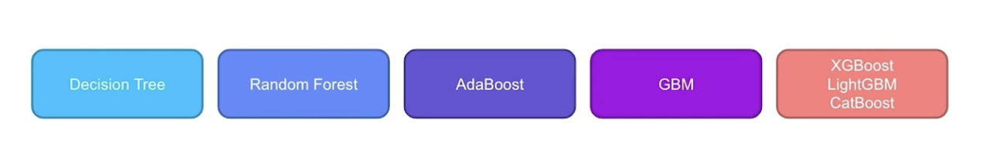

### 3. Bagging & Boosting

- 여러 개의 Decision tree를 이용하여 모델 생성
- Bagging 과 Boosting의 차이점은 train data를 어떻게 활용하느냐에 차이가 있다.
- Bagging
  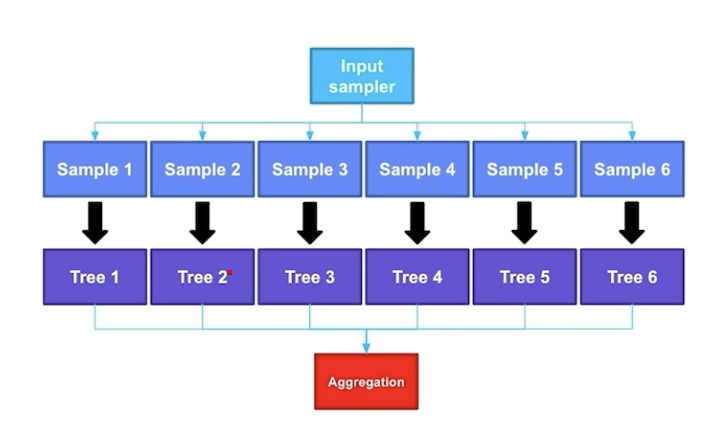
  - ramdom forest는 Bagging의 대표적인 예이다.
  - Data set을 랜덤하게 샘플링하여 tree를 생성하는 방법이 특징이다.
  - 데이터 셋을 샘플링 하여 모델을 만들어나가는 것이 특징이다.
  - 샘플링한 데이터 셋을 하나로 하나의 Decision Tree가 생성된다.
  - 생성한 Decision Tree의 Decision들을 취합(aggregation)하여 하나의 Decision을 생성한다.
  - Bagging = Bootstrap + Aggregation
    - Bootstrap : 데이터 셋을 랜덤하게 샘플링하는 방법
    - Aggregation : 종합(Ensemble)
- Desision tree는 train data의 모든 데이터를 사용하여 tree를 생성한다.
  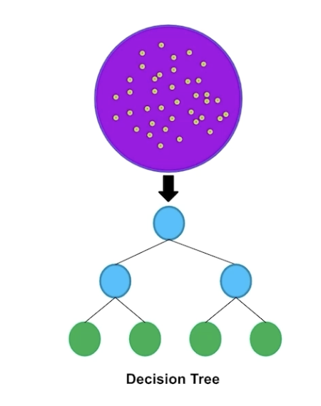
  - 분류기준을 설명항 뒤 데이터를 분류,예측하여 규칙을 찾는 모델
  - 특정 기준에따라 데이터를 구분하는 모델을 의사결정트리모델 이라고한다.
  - 결정트리에서 질문이나 정답은 node로 표형한다.
- Bagging
  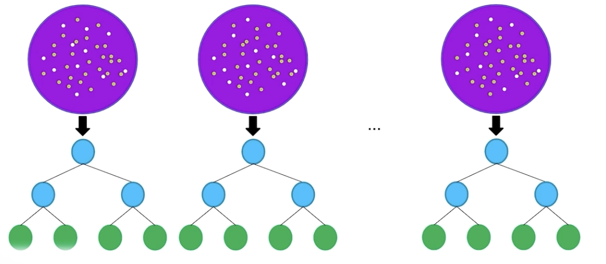
  - 하나의 data set에서 샘플링을 여러번 진행하여 다양한 데이터셋을 만들어 이를 기반으로 트리를 만들어낸다.
- Boosting
  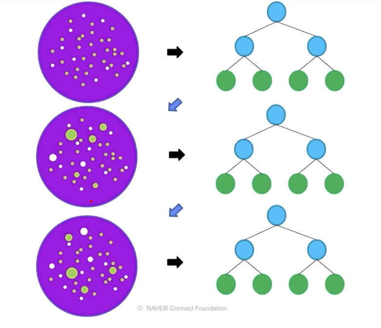
  - 초기에 ramdom하게 선택된 data set을 이용하여 하나의 트리를 만들고 잘 맞추지 못한 데이터에 weight를 부여하여 다음 트리를 생성한다.
- Bagging과 Boosting의 특징
  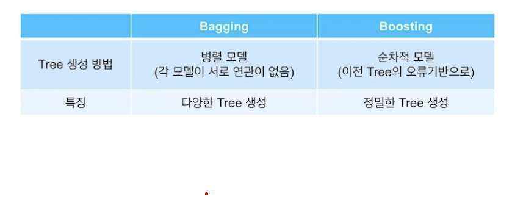

### 4. Boosting tree model중 대표적인 모델

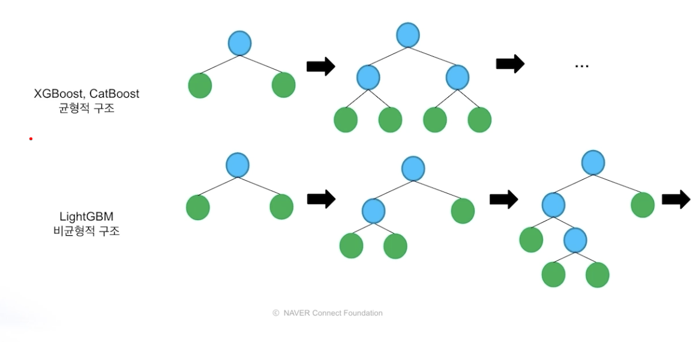

- XGBoost, CatBoost 는 균형적인 구조
- LightGBM은 비균형적인 구조. 한쪽의 가지가 지속적으로 성장 후 다른 가지가 생성되는 방식으로 성장한다.

  1. ## LightGBM
  2. XGBoost
  3. CatBoost

## 2. Three model with hyper-parameter

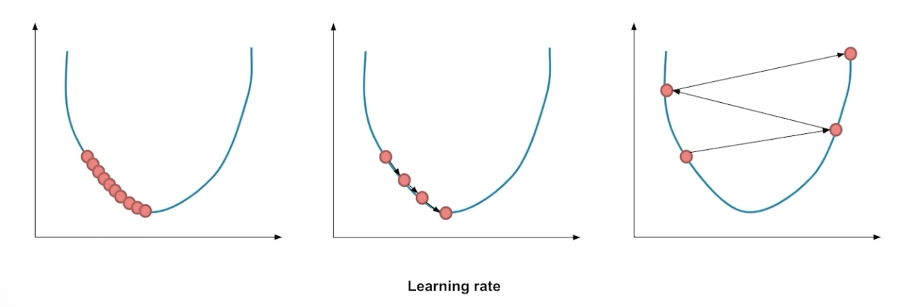

- 왼쪽 : learning rate가 작은 경우 -> 수렴 속도가 늦어진다
- 오른쪽 : learning rate가 큰 경우 -> 수렴이 아닌 발산
- 중간 : 적다한 값을 찾아야한다.

- model의 깊이와 잎사귀의 수를 조절할 수 있다.
- tree를 너무 깊게 만들거나 잎사귀들을 제한없이 모두 사용하면 overfitting의 위험이 있다.

- column sampling ratio

  - 전체 feature들 중 random하게 일부분만 사용하여 feature를 만든다
    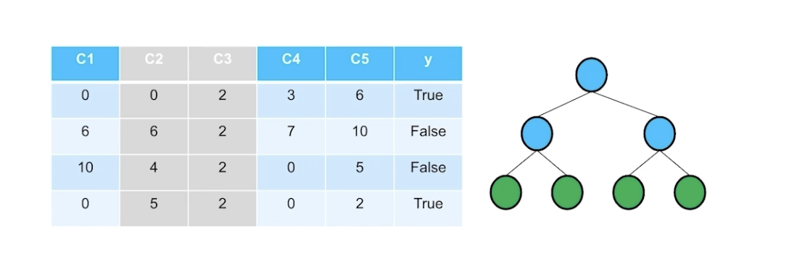
    - 피처를 ramdom하게 선택하여 특정 feature에 overfitting되는 것을 방지한다.
  - 다음 tree를 만들 때에도 ramdom하게 트리를 생성
    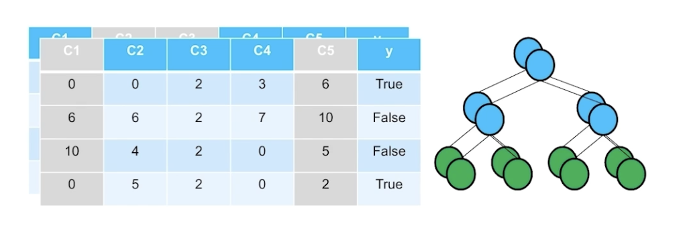
  - 꼐속 다른 feature로 여러 가지의 tree를 만들 수 있다.

- row sampling ratio
  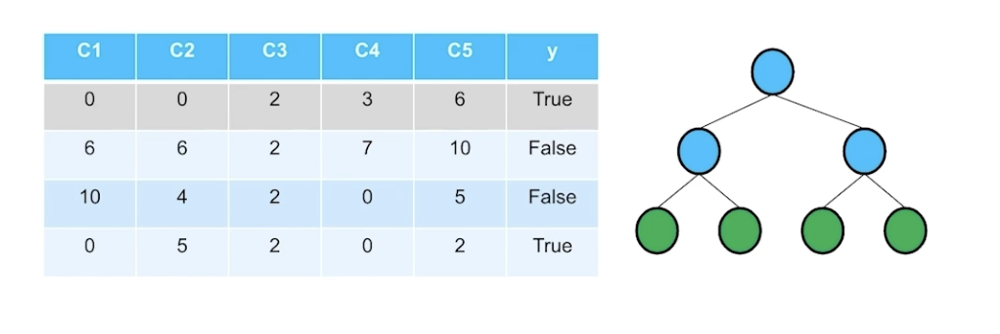

  - 특정 데이터에 overfitting 방지

- 각 boosting 모델에서 hyper parameter들이 다른 이름으로 불리고있어서 표로 정리

  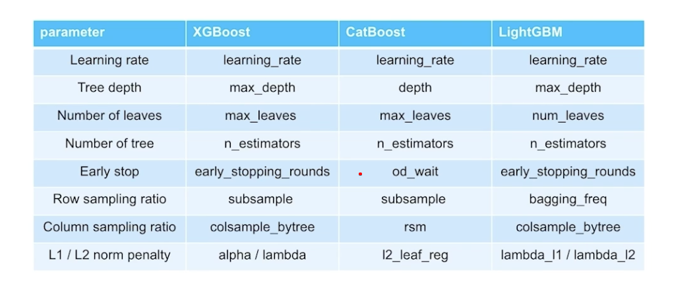

- Category 변수 다루기
  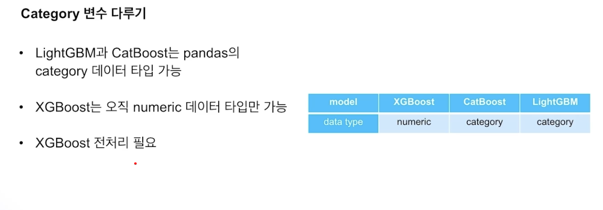
  - code에서 다룰 때 category 변수들이 object type으로 되어있어서 category tyepe으로 변환해주는 작업이 필요하다.
  - Best model?
    - XGBoost, LightGBM, CatBoost 전처리 방법이 모두 다르기 때문에 정확한 비교는 어렵다.
    - CatBoost는 category 변수 처리에 강점이 있음
