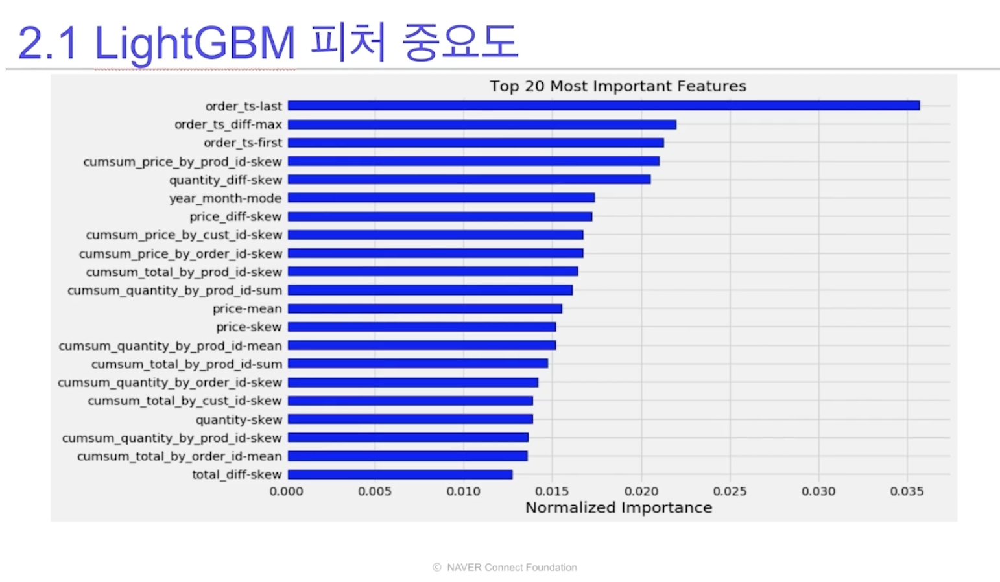
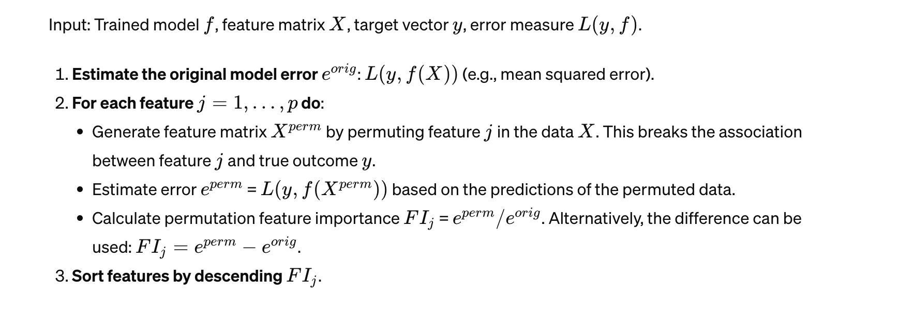
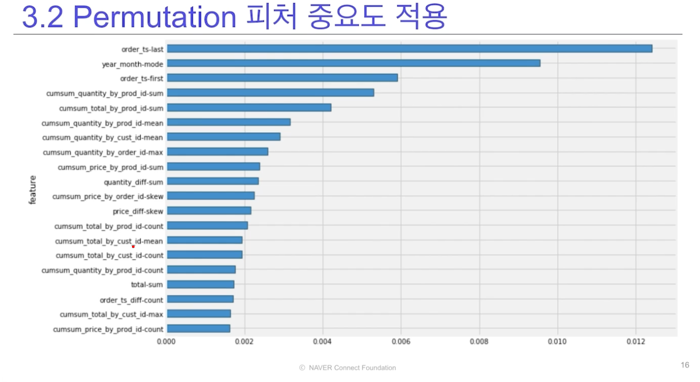
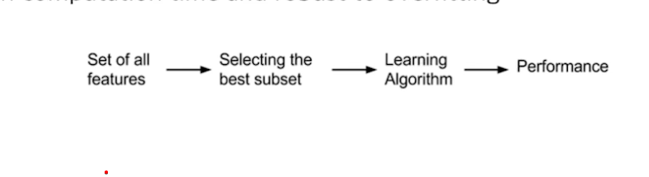
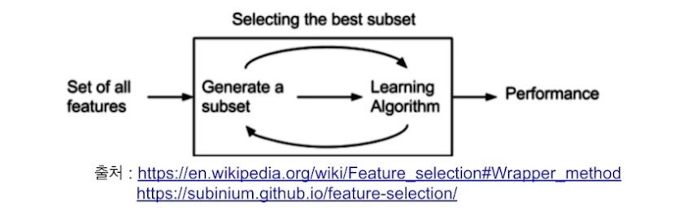

# 피처 중요도와 피처 선택

## 1. 피처 중요도란?

- 피처 중요도
  - 타켓 변수를 예측하는데 얼마나 유용한지에 따라 피처에 점수를 할당해서 중요도를 측정하는 방법
- Model-specific VS Model-agnostic
  - 머신러닝 모델 자체에서 피처 중요도는 계산이 가능하다면 Model-specific
  - 모델에서 제공하는 기능에 의존하지 않고 모델을 학습한 후에 적용되는 피처 중요도 계산 방법은 Model-agnostic

## 2. Boosting Tree 피처 중요도

1. LightGBM 피처 중요도
   

- training된 LightGBM 모델 클래스에 feature_importance(importance_type) 함수로 피처 중요도 계싼 기능 제공
- 인자의 importance_type 값에 'split' 또는 'gain' 사용 가능, 디폴트는 'split'
  - 'split' : numbers of times the feature is used in a model
  - 'gain' : total gains of splicts which use the feature

2. XGBoost 피처 중요도
   

- training된 모델 클레스에 get_score(importance_type) 함수로 피처 중요도 계산 기능 제공
- 인자의 importance_type, 디폴트는 'weight'

  - 'weight' : numbers of times the feature is used in a model
  - 'gain' : total gains of spplits which use the feature
  - 'cover' : the average coverage of splits which use the feature
  - 'total_gain' : the total gains of splits which use the feature
  - 'total_cover' : the total coverage of splits which use the feature

3. CatBoost 피처 중요도

- training된 CatBoost 모델 클래스에 get_feature_importance(type) 함수로 피처 중요도 계산 기능 제공
- 인자의 type, 디폴트는 FeatureImportance

  - FeatureImportance : Equal to PredictionValuesChange for not-ranking metrics and LossFuntinChange for ranking metrics

  - ShapeValues: A vector with contributions of each feature to the prediction for every input object and the expected valued of the model prediction for the object

  - Interaction: The value of the feature interaction strength for each pair of features

  - PredictionDiff: A vector with contributions of each feature to the RawFormulaVal difference for each pair of objects

4. Permutation 피저 중요도

   - Measure the importance of feature by calculating the increase in the model's prediction error after permuting the feature.

   - A feature is "important" if shuffling its values increase the model error, beacuse in this case the model relied on the feature for the prediction.

   - A feature is "unimportant" if shufflicng its values leaves the model error unchanged, because in this case the model ignored the feature for the prediction

   - 간단하게 설명하면, 피처에 있는 값들을 랜검하게 셔플링 해서 모델의 애러를 측정한다. 만약 그 피처가 중요한 피처면 애러가 굉장히 커질 것이고 아니라면 작을 것임

   - 많이 쓰고있다.

   - 수도코드는 아래와 같다
     

   - 중요도 적용 그래프
     

## 4. 피처 선택이란?

- 피처 선택
  - 머신러닝 모델에서 사용할 피처를 선택하는 과정
  - 머신러닝 모델이 타켓 변수를 예측하는데 유용한 피처와 유용하지 않은 피처를 구분해서 유용한 피처를 선택하는 과정
  - 피처 선택을 통해 모델의 복잡도를 낮품으로써 오버피팅 방지 및 모델의 속도 향상 가능
  - 피처 선택 방법
    - Filter Method
    - Wrapper Method
    - Embedded Method

1. Filter method
   

   - 통계적인 방법을 사용해서 피처들의 상관관계를 알아내는 방법
   - 가장 간단하게 사용할 수 있는 방식 중 하나이다.
   - These methods are particularly effective in computation time and robust to overfitting

2. Wapper method
   

- 변수들의 하위 집합을 평가하는 방식으로, 필터 접근법과는 달리 변수 간의 가능한 상호 작용을 감지할 수 있게 해준다.

- 이 방법의 두 가지 주요 단점

  - 관측치가 충분하지 않을 때 과적합(overfitting) 위험이 증가
  - 변수가 많을 때 상당한 계산 시간이 필요

- 예측 모델을 사용하여 피처의 subset을 계속 테스트
- 기존 데이터에서 성능을 측정할 수 있는 hold out data set을 둬서 validation성능을 측정할 수 있는 방법이 필요하다

3. Embedded method

- 위의 두 방법의 장점을 결합한 방법
- 학습알고리즘 자체에서 feature selection 기능이 들어가있음
