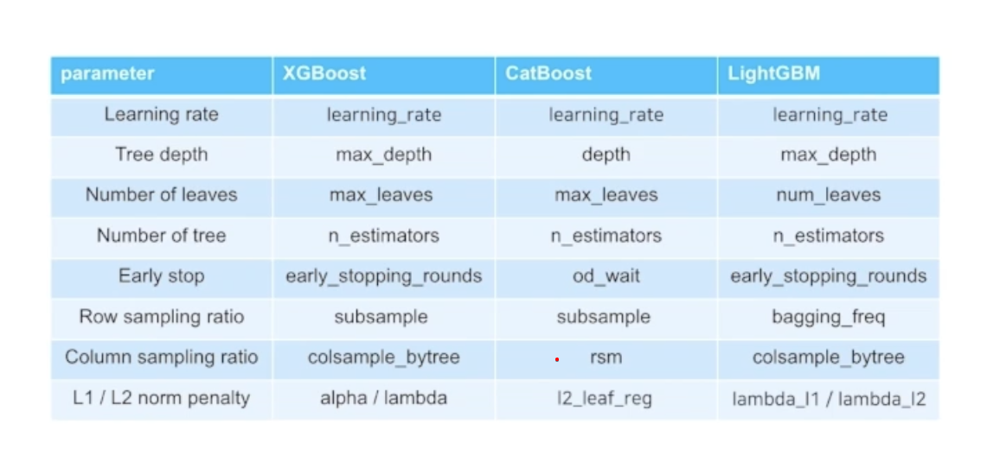
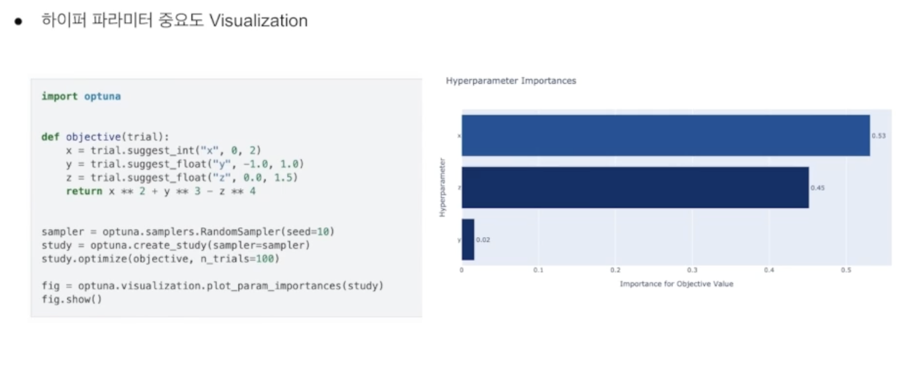
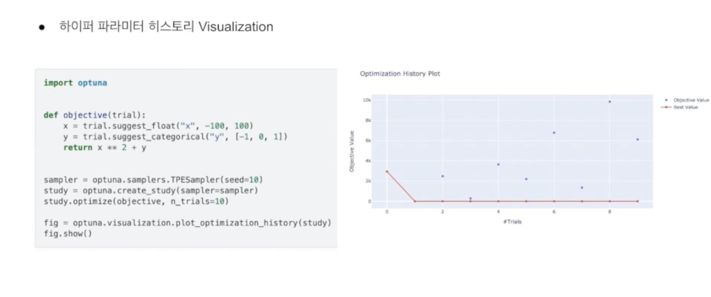
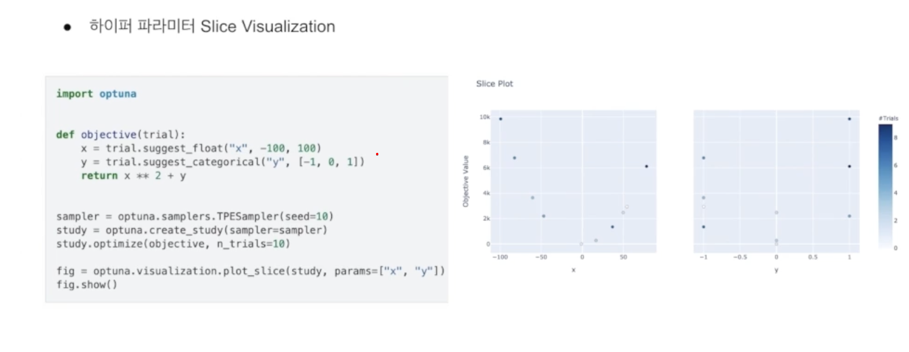

[⬅️ BACK ](./README.md)

# 하이퍼파라미터 튜닝

## 1. 하이퍼파라미터 튜닝이란?

- 하이퍼파라미너

  - 학습 과정에서 컨트롤하는 파리미터 value
  - 반대로 파라티머는 모델이 학습하는데 필요한 값
  - 하이퍼파라미터는 학습하는 파라미터가 아닌 학습 전에 사람이 설정해주어야 하는 값이다.

- 하이퍼 파라미너 튜닝

  - learning algorithm을 위한 적합한 hpyerparameter set을 찾는 것
  - 하이퍼파라미터는 최적화 하는 것

- 하이퍼파하미터 튜닝 방법
  - Manusl Search :메뉴얼하게 실험을 하여 하이퍼 파라미터 셋을 정하고 하나씩 바꿔가면서 테스트 해보는 방식
  - Grid Search : 모든 조합을 다 해보는 방식. 모든 조합을 다 해보기 때문에 시간이 많이 걸린다.
  - Random Search : 랜덤하게 하이퍼 파라미터를 선택해서 실험을 하는 방식. Grid Search 보다는 일반적으로 나음
  - Bayesian Optimization : 이전 결과를 바탕으로 다음 실험을 할 하이퍼 파라미터를 선택하는 방식. 처음에는 랜덤하게 하여 성능을 보다가 이전 결과를 바탕으로 다음 실험을 할 하이퍼 파라미터를 선택한다.

## 2. Bootsing Tree 하이퍼 파라미터

- 하이퍼파라미터들
  

## 3. Optuna 소개

- 하이퍼 파라미너 튜닝 프레임워크인 Optuna
- 오픈소스 하이퍼 파라미터 튜닝 프레임워크

1.  주요 기능

        - Eager search spaces

          - Pruning- Automated search for optimal hyperparameters using python conditionals, loops, and syntax

        - State-of-the-art algorithms

          - Efficiently search large spaces and prune unpromising trials for faster results

        - Easy parallelization

          - Paralize hyperparameter searches over multiple threads or processes without modifying code
          - 병렬화가 가능해서 대규모 하이퍼파라미터탐색도 적용 가능

        - 적용 얘시

          ```python
          import optuna

          def objective(trial): #  최적화할 목적 함수
              x = trial.suggest_uniform('x', -10, 10)  # 'x'에 대해 -10에서 10 사이의 부동 소수점 값을 제안
              return (x - 2) ** 2  # 목적 함수, (x - 2)^2의 값을 반환

          study = optuna.create_study()  # 새로운 study 객체를 생성
          study.optimize(objective, n_trials=100)  # 100번의 시도 동안 최적화 수행

          study.best_params  # 예: {'x': 2.002108042} 최적화 과정에서 가장 좋은 파라미터 값을 반환

          ```

2.  Optuna LightGBM적용

```python
 import optuna

 def objective(trial): #  최적화할 목적 함수
    # Suggest values of the hyperparameters using a trial object
    param = {...}
    dbm = lgb.train(param, dtrain)
    ...
    return accuracy

 # Create a study object and optimize the objective function.
 study = optuna.create_study(direction = 'maximize')
 study.optimize(objective, n_trials=100)
 # 위의 파라미터가 최적이 되는 것을 찾는다.
```

3. Optuna 하이퍼 파라미터 탐색 결과 저장

- Storage API를 사용해서 하이퍼 파라미터 검색 결과 저장 가능
- RDB, Redis와 같은 Persistant 저장소에 하이퍼 파라미터 탐색 결과를 저장함으로써 한 번 탐색하고, 다음에 다시 이어서 탐색 가능

- 하이퍼파라미터 중요도 Visualization
  
  - 어떤 하이퍼파라미터가 모델에 영향을 끼쳤는지 볼 수 있음
- 하이퍼파라미터 History Visualization
  
  - 첫 번째 나온 것이 best parameter임을 확인할 수 있다.
- 하이퍼파라미너 Slice Visualization
  
  - 각 하이퍼파라미터별로 최적화 하려는 목적함수가 어떻게 변하는지 확인할 수 있음
  - x,y모두 0에서 성능이 가장 좋게 나오는 것을 볼 수 있다.
  - 각 하이퍼퍼라미터별로 목적함수와 어떤 관걔가 있는지 확일할 수 있다
