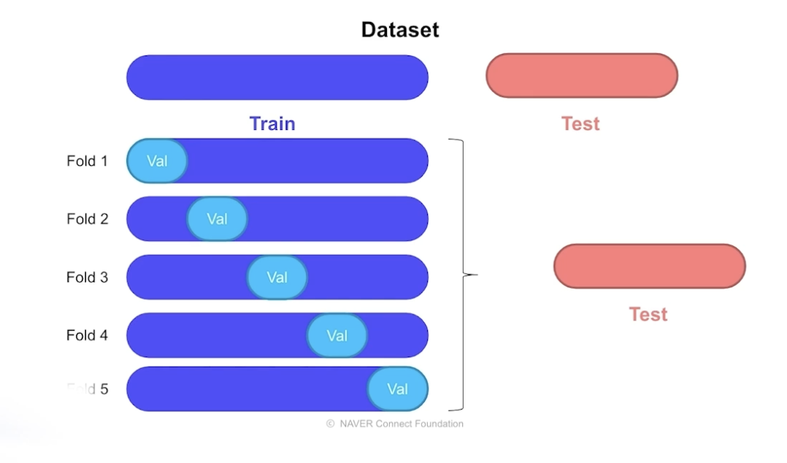

## 1. Underfittinf & Overfitting

- Underfitting: 데이터를 설명하지 못함

- Overfitting : 데이터를 과하게 설명함

- 예시
  

  - 왼쪽 : Underfitting
  - 오른쪽 : Overfitting
    - 모델이 모든 데이터를 맞추고 있기 때문에 오히려 이게 더 좋은 것 아닌가 하는 의문이 있을 수 있음
  - 중간 : 적절한 모델

  - 우리의 데이터셋은 전체 데이터셋에비해 매우 적고 full dataset과 sample data가 같은 경우는 거의 없다.
    
  - sample data에서 Train data와 validation data로 분리를 하는데 validation data는 train에 사용되지 않는다.
    
    - error를 보면 validation을 사용했을 때의 error가 더 높음을 알 수 있다. 이를 기준으로 현재의 모델이 overfit인지 underfit인지 판단할 수 있다.
  - Data set을 구성하는 방법에 따라 머신러닝모델의 성능과 일반화 새로운 데이터셋에서의 작동 등이 달라진다.

  - Underfitting을 방지하기위해서는 더 많은 데이터로 더 오래 훈련을 시키던지 feature를 더 많이 반영을 해준다던지 variance를 높이는 방법을 사용해야 한다.

- Overfitting을 제어할 수 있는 방법 - Regularization

  - 모델이 noise data에 민감하지 않게 모델을 규제하는 방법이다.
  - Early Stopping -> 정형데이터에서도 사용 가능
    
    - 딥러닝에서의 방법과 유사
    - validatin error가 지속적으로 증가하는 부분에서 stop
    - trade-off관계에 있다고도 한다.(최적의 결과를 찾는 과정)
  - Parameter Norm Penalty -> 정형데이터에서도 사용 가능
    

    - 이것도 딥러닝에서 사용
    - 각각 L1,L2 panalty를 적용한 차트이다.
    - panalty를 적용한 파란색의 경우 적절하게 fitting된 것을 볼 수 있다.
    - panalty를 적용하지 않는 초록색의 경우 overfitting이 발생한 것을 볼 수 있다.

  - Data augmentation -> 정형데이터에서도 사용 가능
    
    - data를 의도적으로 증가시켜 머신러닝 모델에게 다양한 경험을 하게 하는 기법
    - 정형데이터 분석에서는 SMOTE라는 방법을 이용한다.
    - SMOTE는 모든데이터셋에 대해서 agumentation을 하는 것이 아니라 불균형한 데이터셋에 대해서만 적용한다.
    - uninbalanced한 데이터를 하나 찾아 기준으로 하고 근처에 있는 데이터를 찾는다. uninbalanced한 데이터와 근처에있는 데이터 사이에 데이터를 생성하는 방식으로 데이터를 증가시키는 방법이다.
  - Noise robustness
  - Label Smoothing
  - Dropout -> 정형데이터에서도 사용 가능
    - 딥러닝에서의 dropout 예시
      
      - 무작위로 node의 연결을 끊어버리는 방식
      - 모든 feature를 사용하는 것이 아니라 feature의 일부분만 사용하여 모델을 생성하는 것이다.
      - 트리모델을 사용한다면 모든 node가 학습에 필요하지 않는 경우가 있으니 이런 것들을 제거하는 것임다.
      - 딥러닝에서는 이런 작업을 drop out이라고하고 정형데이터에서는 가지치기라고 한다.
      - dropout을 tree모델에 적용한 예시
        
        - 모든 컬럼을 사용하지 않고 일부만 사용하는 것을 볼 수 있다.
  - Batch Normalization

## 2. Validation strategy

- Test data set
  - 매우 중요하고 많은 노력을 투자해야한다.
  - 모델에 대한 정량적인 비교가 되어야하므로 중요하다
  - 최대한 전체 데이터셋을 대표하는 데이터면 좋다
  - 그렇기 때문에 Test 데이터를 변경하는 조심스럽기 때문에 보통 validation data를 컨트롤하는 것이 이상적이다.
- Validation data set
  
  - 주요 목적 : Test set에 적용하기 전에 모델의 성능을 파악하기 위함
  - Test data set과 최대한 유사하게 구성하는 것이 좋다
  - 하지만 test data set에대한 정보를 얻지 못하는 경우
    - 어제의 주식 데이터를 train data, 오늘의 주식 데이터를 validation data, 내일 주식데이터를 test data라고 했을 때 test data set의 정보는 알 수 없다.
  - 좋은 validation data set을 만드는 방법은 프로젝트나 해결하려는 문제의 배경을 파악하고 이를 바탕으로 전체 데이터셋과 유사한 데이터셋을 만드는 것이다.
- Train data set

  - 확보한 데이터의 품질에 따라 Noise data를 train data에 포함시킬지 고민해볼 수 있음
  - train set과 validation set을 나누는 방법

    - Hold-out Validation : validation을 고정. 하나의 train, 하나의 validation을 사용하는 방법
      - random sampling : 전체 data set을 대표하는 데이터가 아닐 가능성이 있음
      - Stratified sampling :
        
        - 많이 사용하는 방법
        - 카테고리, feature의 비율을 유지하면서 dataset을 split 하는 방법
        - 보통 8:2 , 데이터가 많으면 9:1, 테스트를 더 많이 하는 경우 7:3
        - skitlearn에서 제공하는 Stratified 옵션을 사용하면 쉽게 구현할 수 있다.
    - Cross Validation
      

      - train, validation 쌍을 여러 개 두는 것
      - 각 쌍에 적합한 여러 개의 모델을 생성하여 test data set에 여러개의 모델을 적용 후 스코어를 계산하는 방법이다. 이 방법을 k-fold cross validation이라고 한다.
      - cross validation에서도 위의 random sampling과 stratified sampling이 모두 존재한다.

        - Stratified K-Fold cross validation
          
          - 위의 그림은 lable이나 category feature를 기준으로 split한 방식이다.
          - 분류문제에서는 class별로 비율을 유지시켜야 모델의 성능이 좋아서 stratified K-fold cross validation을 사용하는 것이 더 적합하다.
        - Group K-Fold
          
          - group들을 하나의 덩어리로 생각해서 train, validation을 나눌 때 뭉쳐있게 구성을 하는 방식
          - 같은 그룹이 동일한 fold안에 들어가지 않게 하는 방식
          - group은 fold의 개수보다 커야 가능하다.
        - Time series split
          
          - 시계열 데이터의 경우 데이터의 순차 시간을 고려해서 선정하는 방법이 있다.
          - 미래데이터로 과거데이터를 예측하는데 사용하지 않기 위해서 사용한다.
          - 고려해야할 점은 앞쪽 fold일 수록 train data가 적어지는 것이다.
        - Baseline Stratified K-Fold
          
          - 총 구매액이 300이 넘는지에 대한 여부를 stratified k-fold를 이용함

## 3. Reproducibility(모델의 재현성)

- 모델으 성능은 매번 다르다. 반복해서 실행했을 때 똑같은 조건 하에서 sampling이 되어야 모델의 성능을 정확하게 측정할 수 있다.

- Fix seed
  - ramdom성을 제거하기위해 seed를 고정해주어야 한다

## 4. Machine learning workflow

- 일반적인 머신러닝 전체 워크플로우 간략화
