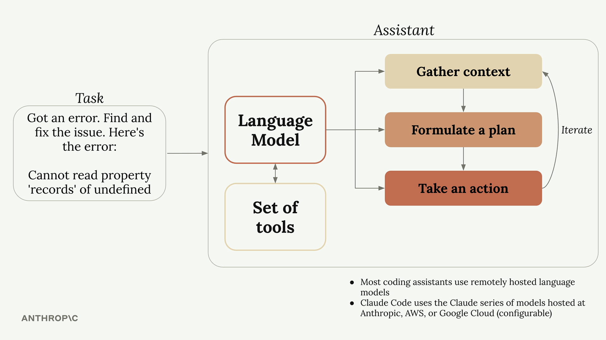

# What is a coding assistant?

- lesson : https://anthropic.skilljar.com/claude-code-in-action/303235
- ai assistant는 code를 작성하는 tool 이상의 기능을 한다.
- language model을 사용해서 복잡한 task를 다룰 수 있다

## How Coding Assistants Work

- llm은 문제가 주어지면 마치 개발자가 문제를 접근하는 과정과 같이 접근한다.
- 만약 erro를 주고 이슈를 수정하라는 지시를 하면
  - Gather context : 배경 정보 파악 - error가 무엇을 의미하는지, 코드의 어떤 부분이 영향을 받는지, 어떤 파일들이 관련되어있는지
  - Formulate a plan : 계획 수립 - 이슈를 해결 할 방법을 결정한다.코드를 수정하거나 수정 사항이 제대로 수정되었는지 확인하는 등의 방법을 결정한다.
  - Take action : 계획 실행 - 파일을 업데이트하고 명령어를 실행하여 실제 솔루션을 구현
- 여기서 Gater context , Take action의 경우 assistant가 파일을 읽거나 문서를 검색하거나 command를 실행하고 코드를 수정하는 등의 **외부 환경과의 상호작용**을 해야한다.

## The Tool Use Challenge

- Language model은 단순히 text를 받고 text를 return한다. 직접 command를 실행하거나 파일을 읽지 못한다. language model은 여러 Tool을 사용하여 이 작업들을 위임한다. "tool use"라고 한다.

## How Tool Use Works

- ai assistant는 language model에게 tool guide를 주고 langauge model은 자신이 접근 할 수 없는 일에 대해서는 ai assistant에게 tool 을 사용하도록 요청함으로써 작업을 수행한다
- tool guide를 예를 들면, 파일 읽기의 경우 ReadFile:main.go 등으로 요청을 하는 것을 예로 들 수 있다.
- 전체적인 flow는 아래와 같아

1. 사용자 : "main.go 파일에는 어떤 코드가 적혀 있나요?"
2. coding assistant는 당신의 요청에 tool instruction을 추가한다
3. language model은 file 읽기가 필요하기때문에 "ReadFile:main.go"를 응답한다.
4. coding assistant는 실제 파일을 읽고 content block을 model에게 전달한다.
5. language model은 파일 내용을 기잔으로 최종 응답을 반환한다.

- 이런 시스템으로 language model이 파일을 읽고 쓸 수 있도록 한다.

## Why Claude's Tool Use Matters

- 모든 모델이 tool 사용을 잘 하는 것은 아니다. Opus, Sonnet, Haiku 의 모델정도만 tool을 이해하고 사용하는데 강점이 있다.

## Benefits of Strong Tool Use

- Tackles harder tasks : 다양한 tool을 사용하면서 복잡한 일을 할 수 있다
- Extensible platform : 새로운 tool을 추가할 수 있고. 워크플로우가 발전함에 따라 클로드가 이를 활용하도록 자동조정된다.
- Better security : Claude Code는 인덱싱 과정 없이도 코드베이스를 탐색할 수 있으며, 이는 대개 전체 코드베이스를 외부 서버로 전송하지 않아도 된다는 것을 의미합니다
