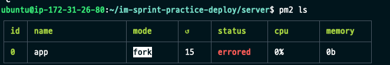

# AWG-EC2 Instance-RDS연결Practice

Chapter: Linux
강의: codestates
블로깅: No
유형: LESSON
작성일시: 2022년 2월 17일 오후 2:08

# AWG EC2 Instance

### Instance Create

- AWS EC2 서비스에 접속하여 “인스턴스 시작"을 통해 생성할 수 있다.
- 용도에 맞게 AMI(Amazon Machine Image)를 선택한다.
- 생성하는 Instance의 CPU, RAM용량을 선택한다 (Instance 유형을 선택한다고 한다)
- Instance는 SSH 프로토콜을 통해 원격으로 연결된다. 이를 위해 KEY를 생성하고 다운로드 받아야 한다. 다운 받은 다음 인스턴스 시작 버튼을 누른다.
  - 참고로 SSH프로토콜은 public network를 통해 통신을 할 때 안전하게 통신할 수 있는 규약이다.
  - Private key (.pem)이므로 노출되지 않도록 관리가 필요하다.
- Instance는 생성 시 Instance Id를 통해 인스턴스를 구분할 수 있다.

- EC2 Instance 연결은 로컬 터미널에서 SSH 프로토콜을 이용해서 인스턴스와 연결이 가능하다.
- private.pem key 의 접근 권한이 400 인지 확인한다. 아니라면 chmod 400 path/private.pem 으로 변경
- ssh 명령어를 통해 인스턴스에 접근한다

  ```bash
  ssh -i "AWS_Deploy_Practice.pem" ubuntu@ec2-52-72-93-130.compute-1.amazonaws.com
  ```

  - ssh : ssh 프로토콜을 통해
  - -i “AWS_Deploy_Practice.pem” : “AWS_Deploy_Practice.pem” 라는 이름의 key를 가지고
  - ubuntu : ubuntu 라는 사용자 이름으로
  - @ec2-52-72-93-130.compute-1.amazonaws.com : 이 주소의 가상 PC에 접속한다

- EC2 Instance에서 git clone 시 login Error
  ```bash
  remote: Support for password authentication was removed on August 13, 2021. Please use a personal access token instead.
  ```
  위와 같은 Error 가 발견됨. 비밀번호로 인증하는 것이 2021-8-13일부터 종료되었으므로 개인 access token을 사용하라는 error이다. 즉, 비밀번호가 아닌 ssh 나 토큰으로 인증을 해야한다.
  git 에서 ssh키를 만들어서 로그인을 해보자 \***\*[Generating a new SSH key and adding it to the ssh-agent](https://docs.github.com/en/authentication/connecting-to-github-with-ssh/generating-a-new-ssh-key-and-adding-it-to-the-ssh-agent)\*\***
  [참고 블로그](https://velog.io/@loakick/2019-11-19-0011-%EC%9E%91%EC%84%B1%EB%90%A8-2ck34lupye)
- Prosess Manegement tool
  - PM2 npm inatall pm2 -g 로 설치
  - pm2 start app.js를 이용하여 백그랑룬드로 앱을 실행 할 수 있다.
    - 이렇게 되면 Terminal을 종료해도 node.js application이 프로세스로 실행이 된다.
  - pm2 stop : process 중지
  - pm2 restart : process 재시작
  - pm2 ls : process 목록 보기
  - pm2 log : process log 보기
- 1024 아래의 포트 번호를 이용해서 서버를 실행시키는 경우 관리자 권한이 필요하다.
  - pm2 log로 확인하면 아래와 같은 error가 뜨는데, 이는 관리자 권한으로 실행하지 못해서 생긴 문제이다.
    
    
  - 이를 위해 authbind 하는 package를 추가적으로 설치해야 한다.
    ```bash
    $ sudo touch /etc/authbind/byport/80
    $ sudo chown ubuntu /etc/authbind/byport/80
    $ sudo chmod 755 /etc/authbind/byport/80
    $ authbind --deep pm2 update
    ```
    - 만약 이미 관리자 권한을 부여하기 전에 프로세스가 실행되고 있었다면, pm2 delete app.js 를 통해 삭제를 해주어야 한다. (authbind 설치 전에 실행된 프로세스는 관리자 우너한을 부여하지 못했기 때문)
    - pm2에 관리자 권한을 부여하기 위해서는 authbind —deep pm2 start app.js를 서버를 다시 실행하며 ㄴ딘다.
- Error → 이 문제의 경우 RDS를 생성하고 연결을 해주니 ;; 해경 되었다 ;; 당연한 것이 아직 어떤 DB와도 연결이 안 되어 있으니 나오는 문제이다 ;;
  참고한 아고라 스테이츠 키워드 : Error: getaddrinfo EAI_AGAIN mysql
  [https://github.com/codestates/agora-states/discussions/2236](https://github.com/codestates/agora-states/discussions/2236)
  [https://okky.kr/article/882507](https://okky.kr/article/882507)

  - pm2까지 마친 후 서버 실행 : 아래 스샷처럼 성공
    
  - pm2 ls
    
  - pm2 log : Error code들이 생겨있음

    

  - node 문서에서 [https://nodejs.org/api/dns.html#dns_dns_lookup_hostname_options_callback](https://nodejs.org/api/dns.html#dns_dns_lookup_hostname_options_callback)
    On error, `err`
     is an `[Error](https://nodejs.org/api/errors.html#class-error)`
     object, where `err.code`
     is the error code. Keep in mind that `err.code`
     will be set to `'ENOTFOUND'`
     not only when the host name does not exist but also when the lookup fails in other ways such as no available file descriptors.

## AWS RDS 연결

mysql에서 DB Instance에 접속하려면 아래와 같은 정보를 입력한다.

```bash
mysql -u [마스터 이름] --host [엔드 포인트 주소] -P 13306(포트 번호) -p
```

- ERror : ERROR 2003 (HY000) 발생
  - 보안상의 이슈라고 한다.
  - Security Group의 default의 source를 Al로 추가한다

일단 여기까지 EC2 생성 및 연결을 하고 RDS 연결까지 실습을 완료하였다.

### Check

- [읽어보기](https://aws-hyoh.tistory.com/53)
- EC2용어
  - AMI (Amazon Machine Image): 인스턴스에 적용하기 위한 운영체제, 소프트웨어 환겨엥 대한 템플릿이다.(소프트웨어 구성이 기재된 탬플릿이다) 다양항 Setting이 구성되어었다.
  - Instance 유형 : CPU 및 램과 같은 성능
  - EC2 사용자 데이터 : Instance가 시작할 때 실행되는 스크립트이다.
  - EBS Amazon Elastic Block Store(Amazon EBS)- 데이터를 장기적으로 유지하거나 암호화 하려는 경우에 적합하다. EC2 인스턴스를 위한 영구 스토리지이다.
- [Pricvate IP VS Public IP](https://docs.aws.amazon.com/AWSEC2/latest/UserGuide/using-instance-addressing.html)

  - Private IP :
    - 인터넷으로 연결 할 수 없으며 동일한 VPC(Virtual Private Cloud : 사용자가 정의한 가상 네트워크)에 있는 Instance 끼리 통신할 수 있다.
    - 사설 IP 대역을 사용한다. 사설 IP는 공인 IP와는 다르게 중복하여 사용할 수 있다. 사설 IP는 내부에서 사용하고 외부 망인 인터넷을 나갈 때는 고유 IP인 공인 IP를 가지고 나간다.
    - NAT(Network address Translation)을 통해 공인 IP주소로 바꿔준다.
  - VPC(Virtual Private Cloud) : Private Network를 통해 네트워크망을 구성하고 각종 Resource(EC2, ELB , RDS...)를 탑재할 수 있는 서비스이다. 외부에 공개될 Resource의 경우 공인 IP를 보유할 수 있다.
  - Public IP : 공인 IP대역. default VPC로 Instance를 생성한다면 public IP로 할당한다.
  - IP4는 32비트 , IP6은 128비트 주소 체계

- [보안그룹 기본 사항](https://docs.aws.amazon.com/ko_kr/vpc/latest/userguide/VPC_SecurityGroups.html#VPCSecurityGroups) :
  - 기본 인바운드 규칙 : 보안 그룹을 처음 만들 때에는 인바운드 규칙이 없어서 이를 추가하기 전에는 다른 호스트에서 시작하여 인스턴스로 가는 인바운드 트래픽이 허용되지 않는다.
  - 기본 아웃바운드 규칙 : 은 모든 아웃바운드를 허용한다
  - 보안 그룹규칙은 엑세스를 허용하는
  - 보안그룹은 인스턴스 레벨에서 작동하므로 VPC에 있는 subnet의 각 인스턴스를 서로 다른 보안 그룹 세트에 할당할 수 있다.
  - 보안 그룹은 같은 이전,VPC에 속해있는 여러 개의 EC2 인스턴스에 적용될 수 있다.
  - connection timed out 외에 , connection refused 에러가 발생하는 경우 일반적으로 ssh데몬이 인스턴스 상에서 실행되지 않았거나 접속을 거부할 때 발생한다.
- IP주소
  - [탄력적 IP주소](https://docs.aws.amazon.com/ko_kr/AWSEC2/latest/UserGuide/elastic-ip-addresses-eip.html) : 릴리스 할 때까지 할당된 상태로 유지된다.
  - Public IP주소는 인스턴스를 중지하고 다시 시작하면 변경된다.
  - Amazon EC2FullAccess정책이 포함된 IAM은 특정 IAM 사용자로 하여금 EC2에 대한 접근 권한을 주고자 할 때 사용된다.
- 탄력적 IP를 EC2 Instance와 연결하면 EC2 인스턴스의 IP주소가 변경될 때마다 IP는 해당 Instance를 가리키게 되므로 늘 같은 IP로 접근 가능.
- SSH접속이 되지 않을 때 할 수 있는 시도
  - Private key와 ssh 클라이언트를 이용해 접속
  - 아마존 리눅스를 쓰는 경우 ‘EC2 Instance 연결' 기능을 이용한다.
  - 보안 그룹에서 22번 포트(TCP)를 인바운드 규칙에 추가한다.

RDS

- RDS와 EC2를 사용 할 때 권장할 만한 보안 구성
  - RDS를 퍼블릭 엑세스가 가능하게 만들면 End point가 생성된다. 보편적으로 DB 티어는 인터넷 상에서 접근 불가능하도록 한다.
- EC2 인스턴스와 RDS(mysql)이 서로 통신하기 위한 보안 그룹
  - EC2가 RDS에 요청을 보내므로 트래픽은 EC2 → RDS이다. EC2의 아웃바운드는 디폴트가 모든 트래픽을 허용하는 것이므로 RDS의 인바운드만 특정 포트를 허용하게 설정하면 된다.
- RDS는 관리형 서비스이다. 운영체제 보안 패치, 데이터베이스 SW설치 등을 싱경쓰지 않아도 된다. 이런 작업들에 대해 완전한 통제권을 갖는다면 EC2에 직접 설치를 해야한다.
- 데이터 베이스의 유형
  - RDS : 관계형 데이터 베이스
  - DynanoDB : 키-값 타입의 NoSql dB
  - CloudFron - CDN(Contents Delivery Network) 서비스
  - Redshift - OLAP(온라인 분석 처리\_에 특화됨.
