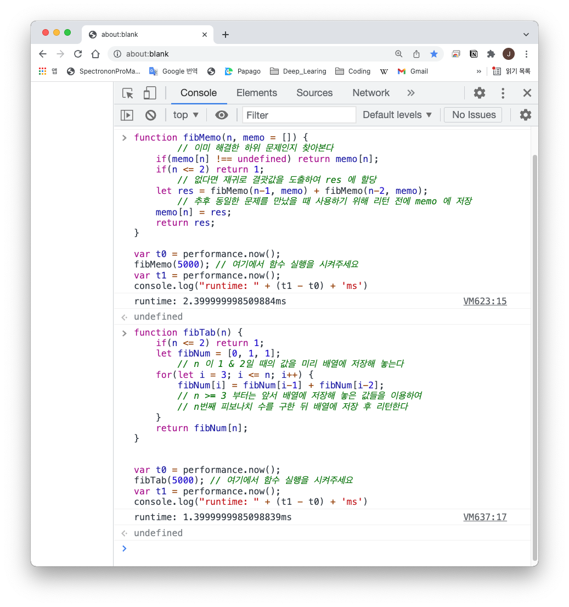

# [자료구조/알고리즘][codestates]Dynamc Programming - 재귀함수

Category: Algorithm & Data Structure
Visibility: Public
강의: CodeStates
블로깅: Yes
유형: LESSON
자료: https://velog.io/@muchogusto/%EC%9E%90%EB%A3%8C%EA%B5%AC%EC%A1%B07-%ED%8A%B8%EB%A6%AC
작성일시: 2021년 12월 17일 오후 9:53

## Dynamic Programming

Dynamic programming에 대해 배웠다. 이론에 대한 이해는 내일 좀 더 정리할 예정이다.

오늘은 Dynamic programming을 적용하여 Fibonacci 알고리즘 실습을 진행하였다.

**Recursive + Memoization** VS **Iteration + Tabulation**

```jsx
function fibMemo(n, memo = []) {
  // 이미 해결한 하위 문제인지 찾아본다
  if (memo[n] !== undefined) return memo[n];
  if (n <= 2) return 1;
  // 없다면 재귀로 결괏값을 도출하여 res 에 할당
  let res = fibMemo(n - 1, memo) + fibMemo(n - 2, memo);
  // 추후 동일한 문제를 만났을 때 사용하기 위해 리턴 전에 memo 에 저장
  memo[n] = res;
  return res;
}

function fibTab(n) {
  if (n <= 2) return 1;
  let fibNum = [0, 1, 1];
  // n 이 1 & 2일 때의 값을 미리 배열에 저장해 놓는다
  for (let i = 3; i <= n; i++) {
    fibNum[i] = fibNum[i - 1] + fibNum[i - 2];
    // n >= 3 부터는 앞서 배열에 저장해 놓은 값들을 이용하여
    // n번째 피보나치 수를 구한 뒤 배열에 저장 후 리턴한다
  }
  return fibNum[n];
}
```



- Top-down 방식과 Bottom-up의 소요시간을 비교하였을 때 차이는 무엇이고 원인은 무엇인가?
  5000번을 각각 실행해보면 Top-down 방식인 Recursive + Memoization은 2.39 == 2.4초가 나왔고 Bottom - down 방식인 Iteration + Tabulation은 1.39 == 1.4초가 나왔다. 약 1초의 차이가 난다.</br>

  1. **Top-down** 방식의 경우 5000을 구하기 위해 fiboMemo(4999) 와 fiboMomo(4998)가 필요하지만 아직 Momo에 없기 때문에 fiboMemo(4999)재귀함수를 호출한다. fiboMemo(4999)에도 fiboMemo(4998) 과 fiboMemo(4997)이 없기 때문에 계속 재귀를 호출하게 된다.

     또한 재귀를 실핼할 떄마다 memo에 있는 값인지 if문을 통해 확인을 거치게 된다.

     fiboMemo(4999)를 구하기 위한 재귀가 구해지면 fiboMemo(4998) 부터는 Momo에 기록되어 있으므로 재귀를 더이상 호출하지 않지만, 결과적으로 foboMemo(5000)을 구하기 위해 재귀를 거의 5000번을 실행한 격이 된다. 시간 복잡도는 O(n)라고 할 수 있다.

  1. **Bottom-up** 방식의 경우 5000을 구하기 위해 반복문을 3부터 5000까지 돌리게 된다. fibNum(3) = fibNum(2) + fibNum(1) 이며 각 피연산자의 값은 이미 fibNum에 있으므로 바로 계산이 된다. fibNum(4)=fibNum(3) + fibNum(2)로 각 피연산자의 값 또한 바로 계산이 된다. 첫 번째 처럼 저장되어있는 값인지 확인 절차는 진행하지 않는다. 하지만 결국 i=5000이 될 때까지 연산이 진행되며 시간 복잡도는 O(n)이 된다.</br>
  
  </br>
  1과 2의 시각 복잡도는 O(n)이라고 생각한다. 하지만 1번의 방법은 조건문화 momo에 저장하는 과정이 더 있으며 계속 재귀함수를 호출하기 때문에 2번 방법보다 시간복잡도가 더 높을 수 밖에 없다고 생각한다. 내가 생각한 것이 맞는지는 월요일에 진행하는 Office hour때 질문을 해봐야 겠다.
