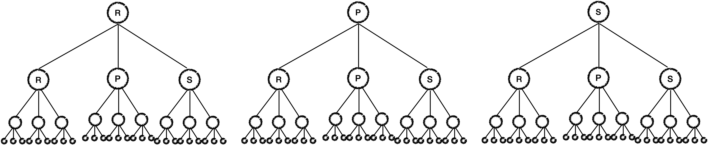

# [자료구조/알고리즘][codestates]중복순열-가위바위보(Rock Paper Scissors)

Category: Algorithm & Data Structure
Visibility: Public
강의: CodeStates
블로깅: Yes
유형: LESSON
자료: https://velog.io/@muchogusto/%EC%9E%90%EB%A3%8C%EA%B5%AC%EC%A1%B07-%ED%8A%B8%EB%A6%AC
작성일시: 2021년 12월 21일 오후 7:29

## Rock Paper Scissors

### 1. 문제

이 문제는 가위바위보를 n판 했을 때 한 사람이 낼 수 있는 모든 경우의 수를 구하는 문제이다.



R=Rock , P=Paper, S=Scissors 라고 할 떄 4판을 했을 때 트리 구조로 구성을 해보면 아래와 같다.

중학생 때 배웠던 수학을 떠올려보자, 한 판을 할 때마다 R, P, S 3개 중 중복을 허용하여 뽑는 경우의 수 3$\Pi$1  $3\prod 1$ 과 같다. 바로 중복순열이다. 중복순열은 자료구조 DFS를 이용하여 전체를 순환하는 방식을 사용한다.

DFS에 대한 개념적인 내용은 Section2의 첫부분인 자료구조 에서 이미 정리한 바가 있으니 참고하자

[[자료구조/알고리즘] Graph - BFS , DFS](https://sora9z.tistory.com/79?category=1048872)

- 입력 : depth 또는 없음
- 출력 : 2차원 배열
- 조건 : 여기에 **조건**이 한 개 더 있는데, 가중치 정렬을 사용해야 한다는 것이다. (Weighted sort) 바위 > 보 > 가위 순으로 가중치가 있다고 가정하고 정렬을 해야한다.
  가중치 정렬이란 조건이 나와서 순간 “이게 뭐지?” 싶었는데 중요도 순으로 배열이 정렬되어야 한다는 의미라고 한다. 단순히 가중치 순으로 들어있는 배열을 선언하여 rock,paper,scissor를 요소로 넣어 사용하면 dfs를 하면서 알아서 순서대로 저장이 될 것이라 생각하여 적용하였다.

### 2. 풀이

이 문제는 depth가 마지막인 경와 아닌 경우로 나누어 풀 수 있다.

depth가 마지막이 아닌 경우에는 dfs를 진행하고 마지막 depth인 경우 재귀를 종료한다.

여기서 고민을 했던 부분이 출력값이 2차원 행렬이었는데, dfs재귀를 종료 시 반환 값으로 내보낼 것인지 전역으로 배열을 선언 후 직접 재귀를 통해 전달하고 수정을 할 것인지 고민했다. 전자로 진행을 했다가 2차원 배열로 처리하는 과정이 조금 더 길어질 것 같아서 후자로 다시 코드를 고쳐서 진행하였다.

dfs 의 Sudocode를 작성해 보면 아래와 같다.

```jsx

result =[] // 전역 result

dfs(){
...

	바위보가위=[바위,보,가위]
	// depth가 마지막이 아닌 경우
	for i=0 to 3  // 가위, 바귀, 보 3가지의 경우를 중복순열로 하므로 3
		arr.push(바위보가위[i])  // 1차원 배열 경우의 수 중 1개를 의미함
		dfs(arr...) // arr에 인자를 추가하고 다음 stack으로 넘겨준다.
		arr.pop() // dfs를 돌았다면 다음 i번 째 인자를 넣기 위해 앞의 인자를 제거한다
						// 이렇게 순서대로 들어가게 되기때문에 조건을 만족할 수 있다.

	//depth가 마지막인 경우
	for i=0 to 3
		arr.pudh(바뉘가위보[i]) // 마지막 인자를 넣는다.
		result.push(arr) // 완성된 경우의 수 중 한개를 전역배열에 넣는다.
		arr.pop() // 다음 i번 째 인자를 넣기 위해 앞의 인자를 제거한다.

return ; // 반복문이 다 종료되면 재귀를 나간다.

}
```

전체 코드는 아래와 같다.

```jsx
function main(depth) {
  depth = depth ?? 3;
  let result = [];
  dfs(depth, result);
  return result;
}

const dfs = (depth, result, count, arr) => {
  count = count ?? 1;
  arr = arr ?? [];
  const rps = ["rock", "paper", "scissors"];

  // base case
  if (count === depth) {
    // 만약 가장 마지막의 node 이라면
    for (let i = 0; i < 3; i++) {
      arr.push(rps[i]); // arr에 요소를 넣고
      result.push([...arr]);
      arr.pop(); // 다시 맨 마지막에 넣은 것을 뺸다 (다른 인사를 넣기 위해)
    }
  }
  // 아니라면 다음 반복문을 실행
  else
    for (let i = 0; i < 3; i++) {
      // 아니라면 아직 마지막 node가 아니므로 재귀를 다시 잔행해야한다.
      // arr에 요소를 추가하고 재귀를 돌린다.
      arr.push(rps[i]);
      dfs(depth, result, count + 1, arr);
      arr.pop(); // 재귀를 나오면 다음 요소를 넣기 위해 맨 마지막의 요소를 제거한다.
    }
  return true;
};

let output = main(5);

console.log(output);
```

결과는 아래와 같다.

```jsx

[
  [ 'rock', 'rock', 'rock', 'rock', 'rock' ],
  [ 'rock', 'rock', 'rock', 'rock', 'paper' ],
  [ 'rock', 'rock', 'rock', 'rock', 'sicssors' ],
  [ 'rock', 'rock', 'rock', 'paper', 'rock' ],
  [ 'rock', 'rock', 'rock', 'paper', 'paper' ],
  [ 'rock', 'rock', 'rock', 'paper', 'sicssors' ],
  [ 'rock', 'rock', 'rock', 'sicssors', 'rock' ],
  [ 'rock', 'rock', 'rock', 'sicssors', 'paper' ],
  [ 'rock', 'rock', 'rock', 'sicssors', 'sicssors' ],
  [ 'rock', 'rock', 'paper', 'rock', 'rock' ],
  [ 'rock', 'rock', 'paper', 'rock', 'paper' ],
  [ 'rock', 'rock', 'paper', 'rock', 'sicssors' ],
  [ 'rock', 'rock', 'paper', 'paper', 'rock' ],
  [ 'rock', 'rock', 'paper', 'paper', 'paper' ],
  [ 'rock', 'rock', 'paper', 'paper', 'sicssors' ],
  [ 'rock', 'rock', 'paper', 'sicssors', 'rock' ],
  [ 'rock', 'rock', 'paper', 'sicssors', 'paper' ],
  [ 'rock', 'rock', 'paper', 'sicssors', 'sicssors' ],
  [ 'rock', 'rock', 'sicssors', 'rock', 'rock' ],
  [ 'rock', 'rock', 'sicssors', 'rock', 'paper' ],
  [ 'rock', 'rock', 'sicssors', 'rock', 'sicssors' ],
  [ 'rock', 'rock', 'sicssors', 'paper', 'rock' ],
  [ 'rock', 'rock', 'sicssors', 'paper', 'paper' ],
  [ 'rock', 'rock', 'sicssors', 'paper', 'sicssors' ],
  [ 'rock', 'rock', 'sicssors', 'sicssors', 'rock' ],
  [ 'rock', 'rock', 'sicssors', 'sicssors', 'paper' ],
  [ 'rock', 'rock', 'sicssors', 'sicssors', 'sicssors' ],
  [ 'rock', 'paper', 'rock', 'rock', 'rock' ],
  [ 'rock', 'paper', 'rock', 'rock', 'paper' ],
  [ 'rock', 'paper', 'rock', 'rock', 'sicssors' ],
  [ 'rock', 'paper', 'rock', 'paper', 'rock' ],
  [ 'rock', 'paper', 'rock', 'paper', 'paper' ],
  [ 'rock', 'paper', 'rock', 'paper', 'sicssors' ],

'''''''
'''''''
]

```
