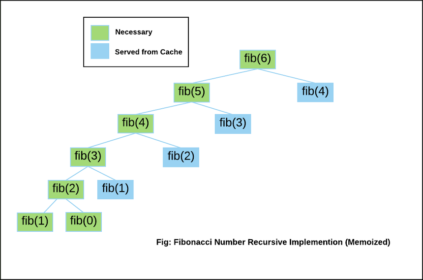

# [Python Algorithm]-Dynamaic Programming

Category: Algorithm & Data Structure
Visibility: Public
강의: Self Study
블로깅: Yes
유형: LESSON
작성일시: 2021년 12월 18일 오후 12:14

## Dynamic Programming - 동적계획법

### 1. Dynamic programmin의 패러다임

Dynamic programming은 문제를 작은 문제에서 해결한 결과를 저장해 두었다가 나중에 큰 문제의 결과에 반영시켜 풀이하는 알고리즘 이다. 이렇게 글로만 쓰면 조금 이해하기 어려운데, 예를 들면 피보나치 문제를 예로 들 수 있다.

위의 그림은 fibonacci 수열을 이진트리로 그린 그림이다. ([출처](https://aerocode.net/248)) fib(6)을 구하기 위해 fib(5) 와 fib(4)가 계산에 사용되는데, fib(5)를 계산하기 위해 fib(4)가 또 필요하게 된다. fib(4)는 fib(3)와 fib(2)를 더해서 구해진다. 만약 fib(4)의 결과를 따로 저장해 두면 fib(6)을 구할 떄 fib(4)를 다시 계산하지 않고 꺼내서 쓰면 다시 계산하지 않아도 된다.

이처럼, 작은 문제해서 해결한 결과 ( fib(4) ) 를 저장해 두었다가 큰 문제의 결과에 반영( fib(6) = fib(5) + fib(4) )시켜 풀이하는 알고리즘을 **동적계획법 (Dynamic programming)**이라고 한다.

Dynimic Programming으로 풀기 위한 조건은

1. 최적 부분 구조 (Optimal Substructure) 를 갖고있어야 한다.

   최적 부분 구조란, 문제의 최적 해결 방법이 부분 문제에 대한 최적 해결 방법으로 구성되는 경우를 만한다.

   최단 경로를 찾는 문제를 예로 들 수 있는데, 서울에서 대구를 거쳐 부산으로 가는 최단 경로는 1) 서울에서 대구까지 가는 최단경로 문제와 2) 대구에서 부산까지 가는 최단경로 문제의 합으로 구할 수 있다. 따라서 이 문제의 최적 해결 방법은 부분 문제 1) 2)에 대한 최적 해결 방법으로 구성된다.

   최적 부분 구조를 갖고있는 문제는 Greedy (그리디) 알고리즘으로도 해결할 수 있는데, Greedy **알고리즘은 항상 그 순간에 최적이라고 생각되는 것을 선택하면서 풀이해 나가는 전략**임에 비해 Dynamic programmin은 아래의 한 가지 조건을 더 충족해야 한다.

2. 중복된 하위 문제들 (Overlapping Subproblem)

   **중복**된 하위 문제들이란, 위의 피보나치 수열과 같이 작은 문제들이 중복적으로 나타나고 큰 문제를 만드는 문제를 의미한다. Dynamic programming은 중복된 하위 문제의 결과를 저장해 두었다가 풀이를 해나간다.

Dynimic programmin은 중복된 하위 문제들의 최적 해결 방법을 저장해 두었다가 문제의 최적 해결방법으로 확장하여 해결해 나가는 “전략"이다. 다이나믹프로그래밍에서는 중복이 매우 중요하며 중복되지 않는 문제들은 이 방법으로 풀지 않는다.

| 알고리즘                                      | 특징                                   |
| --------------------------------------------- | -------------------------------------- |
| 다이나믹 프로그래밍                           | - 최적 부분 구조(Optimal Substructure) |
| - 중복된 하위 문제들(Overlapping Subproblems) |
| 그리디 알고리즘                               | - 최적 부분 구조(Optimal Substructure) |
| - 탐욕 선택 속성(Greddy Choice Property)      |
| 분할 정복                                     | - 최적 부분 구조(Optimal Substructure) |

### 2. Dynamic programming 방법론

다이나믹 프로그래밍의 방법론은 크게 상향식(Buttom-Up) 과 하향식(Top-Down)으로 나뉜다.

fibonacci 수열을 사용한 실습은 아래의 포스팅에서 진행하였다.

[[자료구조/알고리즘][Codestates]Dynamc Programming - 재귀함수](https://www.notion.so/Codestates-Dynamc-Programming-daad968bc8c344e1ac50636786d82b0e)

- 상향식 (Bottom-Up)
  - 더 작은 문제의 정답을 사용하여 큰 문제의 정답을 풀어나가는 방식이다. Tabulation이라 부른다.
- 하향식 (Top-Down)
  - 하위 문제에 대한 정답을 계산했는디 확인해가며 문제를 자연스러운 방식으로 풀어나간다. Momoization이라고 부른다.
