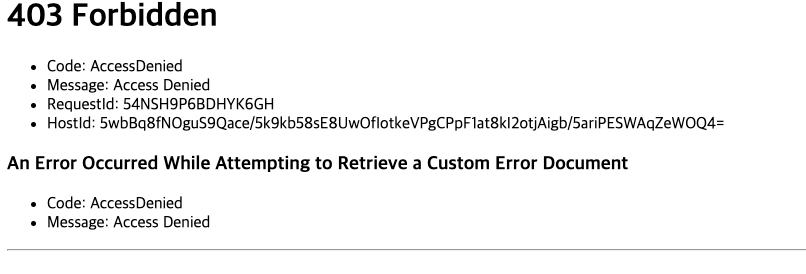

# AWG-EC2 S3-Hosting-Practice

Chapter: AWS
강의: codestates
블로깅: No
유형: LESSON
작성일시: 2022년 2월 19일 오전 9:24

# AWG S3-Hosting-Practice

정적 웹사이트를 호스팅 하는 방법

1. 정정 웹 페이지 빌드
   1. 구현이 완성된 정적 웹 페이지를 빌드한다
2. 버킷 생성 및 정적 웹 사이트 호스팅 용으로 구성
   1. S3 대시보드에 접속하여 버킷을 생성하고, 생성한 버킷을 정적 웹 사이트 호스팅 용으로 구성한다
3. 빌드된 정적 웹 페이지 업로드
   1. 빌드된 정적 웹 페이지를 버킷에 업로드 한다
4. 퍼블릭 엑세스 차단 해제 및 정책 생성
   1. 엑세스 완료 후 퍼블릭 엑세스 차단 엑세스 설정을 해지한다.
   2. 다른 사용자의 접근 원한을 부여하는 버킷 정책을 생성한다

위의 과정이 끝나면, 다은 사용자들이 버킷에 업로드된 정적 웹 페이지에 접근할 수 있다

### 1. 정적 웹 페이지 빌드

- Build란, 작성한 코드의 불필요한 데이터를 없애고 통합, 압축 하여 배포하기 이상적인 상태를 만드는 과정이다.
- 이 과정을 통해 코드를 담고있는 데이터의 용량이 줄어들고 웹 사이트의 로딩 속도가 빨라진다.

** Build 도중 Error **

```bash
src/App.js
  Line 1:34:   Strings must use singlequote                                             quotes
  Line 2:53:   Strings must use singlequote                                             quotes
  Line 3:19:   Strings must use singlequote                                             quotes
  Line 5:19:   Strings must use singlequote                                             quotes
  Line 6:18:   Strings must use singlequote                                             quotes
  Line 7:8:    Strings must use singlequote                                             quotes
  Line 12:13:  Strings must use singlequote                                             quotes
  Line 12:15:  Unexpected trailing comma                                                comma-dangle
  Line 30:57:  Strings must use singlequote                                             quotes
  Line 30:73:  Unexpected trailing comma                                                comma-dangle
  Line 31:10:  Unexpected trailing comma                                                comma-dangle
  Line 37:51:  Unexpected trailing comma                                                comma-dangle
  Line 40:25:  Strings must use singlequote                                             quotes
  Line 41:37:  Strings must use singlequote                                             quotes
  Line 52:17:  Strings must use singlequote                                             quotes
  Line 52:19:  Unexpected trailing comma                                                comma-dangle
  Line 55:33:  Strings must use singlequote                                             quotes
  Line 66:12:  Expected newline between test and consequent of ternary expression       multiline-ternary
  Line 66:22:  Expected newline between consequent and alternate of ternary expression  multiline-ternary
  Line 73:12:  Expected newline between test and consequent of ternary expression       multiline-ternary
  Line 73:22:  Expected newline between consequent and alternate of ternary expression  multiline-ternary
  Line 74:13:  Expected newline between test and consequent of ternary expression       multiline-ternary
  Line 74:22:  Expected newline between consequent and alternate of ternary expression  multiline-ternary
  Line 80:13:  Strings must use singlequote                                             quotes
```

- Eslint 설정과 pretter 사이의 rule이 충돌되어 발생된 것이라 추정..
- Eslint.json에 다름의 설정을 추가해주었다
  ```json
  				"multiline-ternary": ["error", "never"],
          "quotes": ["error", "double",{ "avoidEscape": true , "allowTemplateLiterals": true}],
          "comma-dangle": ["error", "only-multiline"]
  ```

그리고 나서 Build Success 확인

### 2. 버킷 생성 및 정적 웹 사이트 호스팅 용으로 구성

- amazon cloud serveice에 접속하여 메인 콘솔에서 S3를 검색 후 버킷을 생성한다
- 버킷은 각 리전에서 고유해야 하므로 고유한 버킷 네임을 사용한다
- 생성된 버킷의 속성 메뉴에서 정적 웹 호스팅을 활성시킨다.
- 활성화를 하면 나오는 옵션 중 index문서와 오류 발생 시 반환할 페이지를 기입하는 오류문서를 기입하고 저장을 한다.
- redirection되는 페이지의 제일 아래에 있는 생성된 정적 웹 사이트 엔드포인트를 클릭한다.
  
  - 여기서 403 Forbiden이 뜨는 이유는 1. 버킷에 웹 페이지 파일을 아직 업로드 하지 않았고 2. 퍼블릭 엑세스 설정 변경, 정책 생성을 하지 않았기 때문.

### 3. 빌드된 정적 웹 페이지 업로드

아래의 그림처럼 빌드 파일을 업로드 한다 (Build폴더 내의 모든 파일,폴더를 drag and drop


### 4. 퍼블릭 엑세스 차단 해제 및 정책 생성

- 생성한 버킷의 권한(Permission) 메뉴에서 \***\*Block public access (bucket settings) 편집을 통해 설정한다\*\***
- Block all public access를 해제후 저장한다.(권한 메뉴로 리디렉션)
- 퍼블릭 엑세스 차단(버킷 설정) 밑의 버킷 정책 옵션을 편집한다.
  - 우측의 정책 생성기를 누르고
    
  - 아래의 옵션으로 설정한다
    - SElect Type of Policy : S3 Bucket Policy
    - Principal : 권한을 적용 할 사용자를 정한다. 모두에게 공개할 것이므로 \*
    - Acrtions : GetObject : 버킷에 접근하는 모든 사용자가 버킷 내에 저장된 객체 데이터를 읽을 수 있게 된다. 이 옵션은 버킷을 웹 사이트 용도로 구성할 때 선택하면 좋다
    - ARN : arn:aws:s3:::practice-ksr-bucket-deploy/\*
    - 입력 끝났으며 정책 생성 하자
    - policy 복사
      ```json
      {
        "Id": "Policy1645242110631",
        "Version": "2012-10-17",
        "Statement": [
          {
            "Sid": "Stmt1645242099877",
            "Action": ["s3:GetObject"],
            "Effect": "Allow",
            "Resource": "arn:aws:s3:::practice-ksr-bucket-deploy/*",
            "Principal": "*"
          }
        ]
      }
      ```
      
      - 버팃 정책 편집 페이지로 돌아가서 복사한 정책을 붙여넣는다
        
        저장 후 속성메뉴로 가서 웹 사이트 엔드 포인트 링크를 열어본다
- S3에 대하여
  - S3는 Simple Storage Service의 약자로 AWS에서 제곤하는 Storeage Servic이다.
  - 장점
    - 높은 확장성 : 스토리지의 용향을 무한히 확장
    - 강한 내구성 : 99.999999999% 의 내구성 보장
    - 높은 가용성 : 99.99%의 가용성 보장
    - 다양한 스토리지 클래스를 제공
      - 저장소의 사용 목적에 따라 효율적으로 사용 할 수 있는 스토리지 클래스가 달라진다.
      - 대표적으로 아래 두 개의 클래스를 많이 선택한다
        - Standart Class : 벙용적인 목적에 사용하기 좋다. 빠른 데이터 Access 성능으로 데이터에 자주 접근해야 한는 경우 좋음 . 데이터의 장기 보관 목적으로는 좋지 않다
        - Glacier Class : 장기 보관 목적에 좋다. 엑세스 속도는 느리지만 데이터 보관 비용이 저렴하다
  - AWS에 원리?
    - Region은 AWS에서 클라우드 서비스를 제공하기 위해 운영하는 물리적인 위치를 의미한다.
    - 각 리전에는 가용 영역의 수가 적혀있는데, Available Zone이라고 하며 이는 각 리전안 존재하는 데이터 센터를 의미한다 (IDC)
      - 가용 영역은 개별적으로 떨어진 곳에 위치하기 때문에 한 곳의 가용 영역이 재난 등이 사고로 가동이 불가능해 질 때 다른 가용 영역의 백업으로 데이터를 활용할 수 있다.
  - S3사용 시 얻는 이점 ([그림 출처](https://shinesolutions.com/2019/08/15/deploying-a-static-web-application-with-serverless-and-codebuild/))
    
    - 정적 웹 호스팅이 가능하다.
      - 정적 파일이란 : 서버의 개입 없이 클라이언트에 제공될 수 있는 파일이다 (동적 파일 : 클라이언트 request→ 서버 response → client에 생성)
      - 웹 호스트(Web host)이란 : 서버의 한 공간을 빌려주어 웹 사이트를 배포하고 운영이 가능하게 만들어 주는 서비스이다.
      - 버킷 : S3에서 제공하는 공간으로. 버킷이라는 저장공간에 정적 파일을 업로드 하고, 이 버킷을 정적 웹 사이트 호스팅 용도로 구성하여 웹 사이트를 배포할 수 있다.
        - 버킷의 이름은 각 Resion에서 유일해야 한다
        - 버킷의 정책을 생성하여 엑세스 권한을 부여할 수 있다.
        - 버킷에 담기는 파일은 객체라고 부르며 키-값 으로 버킷에 저장된다.
        - S3에 저장되는 객체는 파일과 메타데이터로 구성된다.
        - 파일은 최대 5TB까지 들어간다
        - 파일의 키를 사용하여 객체를 검색할 수 있다.
        - 객체는 고유한 URL 주소를 갖고있다.
          - [http://버킷이름.S3.amazonaws.com/객체키](http://버킷이름.S3.amazonaws.com/객체키) 같은 형태를 갖는다.
- Check
  - S3는 데이터를 저장할 수 있는 스토리지 서비스이다.
  - S3는 정적 웹 사이트를 호스팅 할 수 있다.
  - S3의 버킷 레벨에서 버전 관리를 할 수 있다.
  - S3의 데이터를 외부로 노출하려면 퍼블릭 엑세스 차단을 비활성화 해야한다.
  - 403 Forbidden error가 발생했을 때
    - 해당 버킷의 퍼블릭 엑세스 차단을 비활성화한다
    - GetObject 권한을 추가해야한다.
    - GetObject에 대한 권한 추가는 모든 객체에 대한 권한 추가이다.
    - 퍼블릭 엑세스를 허용해도 URL로 접근이 가능하거나 읽기 엑세스 설정을 하지 않으면 ACL을 통해 엑세스를 허용하지 않은 객체의 경우 해당 객체를 읽을 수 없다.
  - 객체 URL에서 ap-northeast-2는 아시아 태평양 서울이다
  - **[버킷 이름 지정 규칙](https://docs.aws.amazon.com/ko_kr/AmazonS3/latest/userguide/bucketnamingrules.html) 이 있다.**
