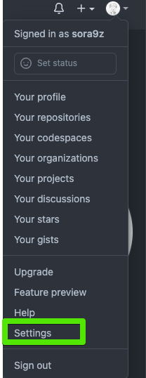

[⬅️ BACK ](./README.md)

# EC2 Instance-git ssh로 로그인 유지하기

Chapter: AWS
강의: codestates
블로깅: No
유형: LESSON
작성일시: 2022년 2월 20일 오후 10:07

# EC2 Instance-git ssl로 로그인 유지하기

[Connecting to GitHub with SSH - GitHub Docs](https://docs.github.com/en/authentication/connecting-to-github-with-ssh)

### 1. SSH 키 정보 확인하기

1. 아래의 명령어로 ssh키가 있는지 확인한다

```bash
ls -al ~/.ssh
```

id_rsa.pub 와 같은 파일이 리스트에 없다면 새로 만들어야 한다.

### 2. NEW SSH 만들기

1. 터미널에서 다음의 명령어를 붙여넣는다. email은 내가 사용하는 github email을 넣는다

   ```bash
   ssh-keygen -t ed25519 -C "your_email@example.com"
   ```

2. 위의 명령어를 입력하면 아래와 같이 경로를 지정하라는 메시지가 뜨는데 , 딱히 지정할 것이 아니면 엔터를 눌러서 Default로 받는다. (경로 등을 지정하는 것들인데 default로 하면 default 경로에 저장된다.

   ```bash
   Enter a file in which to save the key (/Users/you/.ssh/id_algorithm): [Press enter]
   ```

그 다음 나오는 메시지는 암호를 입혁하라는 메시지이다. 두 번 입력하면 된다.

```bash
> Enter passphrase (empty for no passphrase): [Type a passphrase]
> Enter same passphrase again: [Type passphrase again]
```

### 3. SSH 키 복사하기

아래의 명령어를 사용하여 SSH 키를 cat으로 열고복사해준다

ssh~끝까지 모두 복사해야한다.

```bash
cat ~/.ssh/id_rsa.pub
```

### 4. Github 저장소에 SSH키 설정하기

settings → SSH and GPO keys 로 들어간다




New SSH key 버튼을 누르고 아까 복사해놓은 SSH 공개키를 붙여넣고 생성하면 된다.


