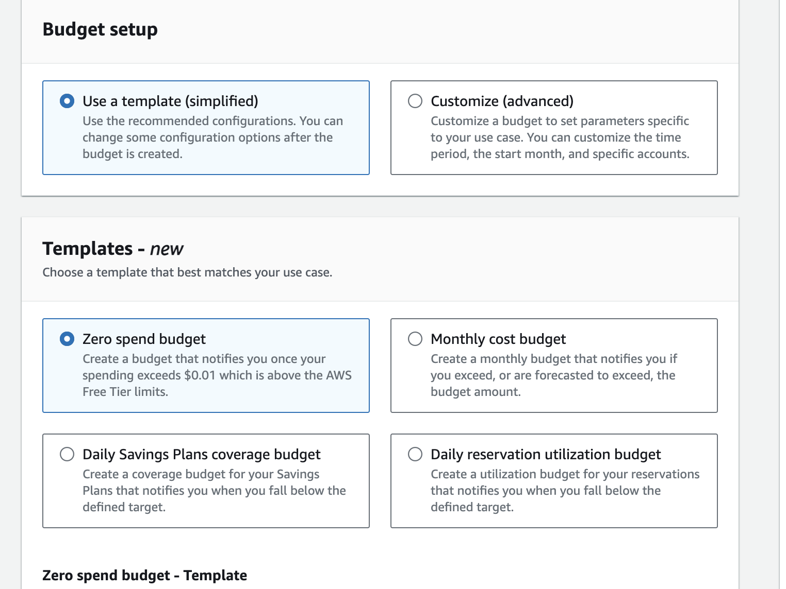

[⬅️ BACK ](./README.md)

## billing & cost management는 매우 중요하다 과금을 막아보자

- iam user가 권한이 없다면 root계정에서 권한을 줄 수 있다.
- account에 가서 스클로 다운하면 IAM user and role access to Billing information 을 설정할 수 있다.

아래와 같이 iam user access를 해주자

- iam user가 관리자 권한이 있다면 billing and cost에 접근할 수 있다.

### Budgets 설정

- 임계점에 도달할 때마다 경보를 울리게 할 수 있다.
  

- 프리티어 사용중이므로 1 센트에 도달하면 알림이 오도록
  

  - 1 센트를 쓸 때마다 설정해둔 메일이 온다

- monthly budget를 설정할 수 있다.
  

  - 아래의 세 가지 경우에 대해 메일이 온다
    - 80%를 사용했을 때
    - 100%를 사용했을 때
    - 예상 지출액이 100%에 도달할 것으로 예상될 때

- 아래와 같이 전체 budget을 볼 수 있다
  
