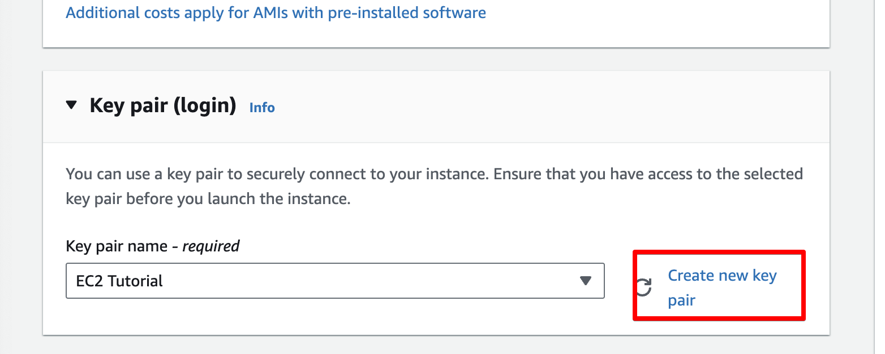
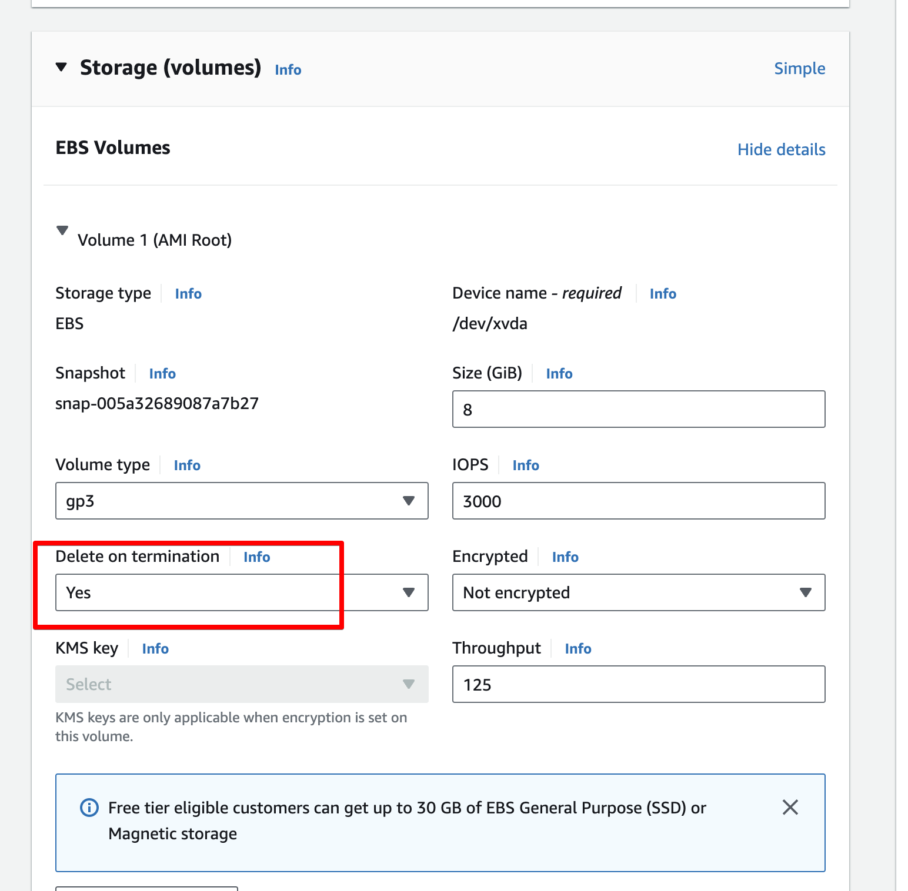
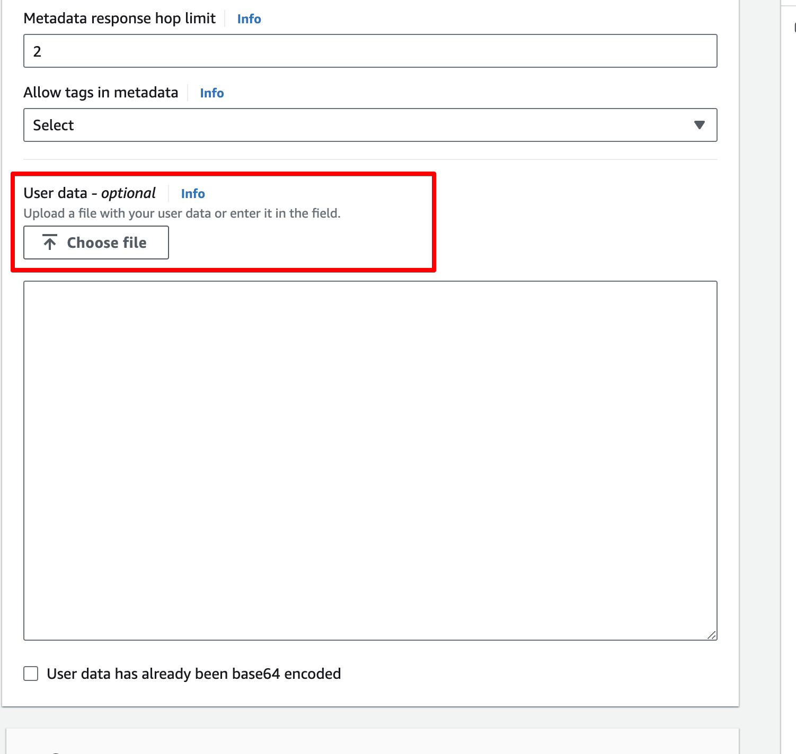
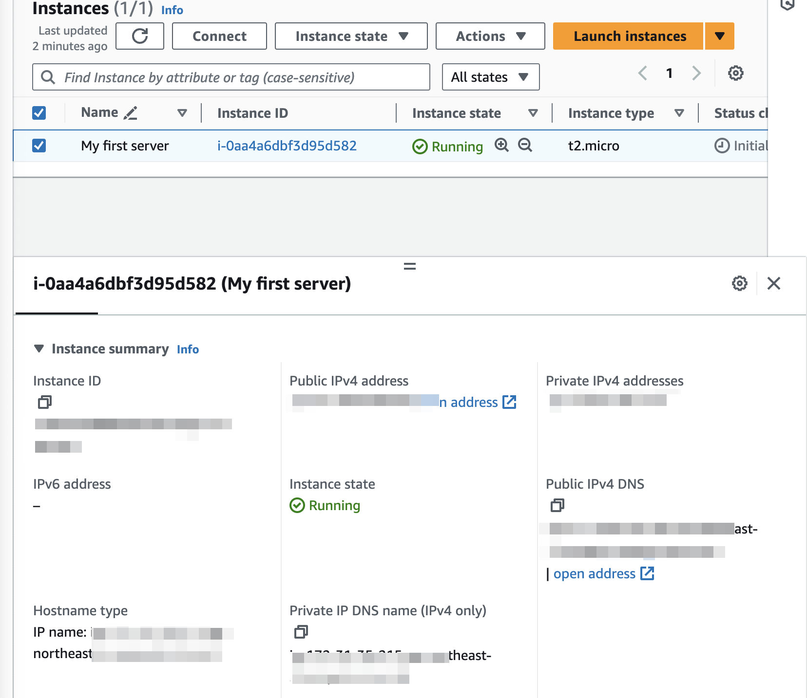

[⬅️ BACK ](./README.md)

## Amazon EC2

- EC2 = Elastic Compute Cloud = Infrastructure as a Service (IaaS)
- EC2의 가상머신을 빌릴 수 있다. EC2 Instance라고 부른다.
- 가상드라이브나 EBS 볼륨에 데이터를 저장할 수도 있다.
- machines에 부하를 분배할 수 있다 (ELB = Elastic Load Balancer)
- ASG = Auto Scaling Group을 사용하여 EC2 인스턴스를 자동으로 확장하거나 축소할 수 있다.
- AWS에서 EC2를 사용하는 법을 아는 것은 cloud가 어떻게 작동하는지 이해하는데 필수적인 부분임

### EC2 sizing & configuration options

- OS, CPU, RAM, Storage, Network, etc.
- Storage:
  - Network-attached : EBS (Elastic Block Store) or EFS (Elastic File System)
  - Hardware-attached : Instance Store (EC2 Instance Store)
- Network card : speed of the card, public ip address
- Firewall rules: security group
- Bootstrap script (configure at launch): EC2 User Data 라고 부른다.

### EC2 User Data

- `EC2 user data script`를 사용하여 EC2 인스턴스를 시작할 때 실행할 명령을 지정할 수 있다(bootstrap)
- EC2 user data는 boot task를 자동화하는데 사용된다. 부팅작업을 자동화하기 때문에 bootstrap 이라고 한다.
  - installing updates
  - installing software
  - downloading common files from the internet
  - and anything you can think of
- 이 stript는 root 권한으로 실행된다.

### Ec2 instance types (examples)

| Instance    | vCpu | Memory (RAM) | Storage (SSD)    | Network Performance | EBS Bandwidth (Mbps) |
| ----------- | ---- | ------------ | ---------------- | ------------------- | -------------------- |
| t2.micro    | 1    | 1 GB         | EBS Only         | Low to Moderate     |                      |
| t2.xlarge   | 4    | 16 GB        | EBS Only         | Moderate            |                      |
| c5d.4xlarge | 16   | 32 GB        | 1 x 400 NNMe SSD | Up to 10 Gbps       | 4,750                |
| r5.16xlarge | 64   | 512 GB       | EBS Only         | Up to 20 Gbps       | 13,600               |
| m5.8xlarge  | 32   | 128 GB       | EBS Only         | Up to 10 Gbps       | 16,800               |

- 1 x 400 NNMe SSD : 연결된 저장소 SSD
- Gnps : Giga bits per second
- t2.micro : 프리티어 사용 가능한 인스턴스. 한 갈에 750 시간까지 가능하다

### Create EC2 Instance

- key pair를 생성하고, 해당 key pair를 사용하여 EC2 인스턴스에 접속할 수 있다.
  
- storage 설정시 delete on termination을 설정하면 EC2 인스턴스가 종료될 때 같이 삭제된다.
  
- advanced details에서 user data를 입력할 수 있다. 맨 밑으로 스크롤하자
  
- instance 생성 후 정보 확인
  
  - 공용 IP :
    - 외부에서 EC2에 접근하기 위한 IP
    - 동적 할당: EC2 인스턴스를 시작할 때 자동으로 할당되며, 인스턴스를 중지하고 다시 시작하면 새로운 Public IP가 할당된다.
    - Elastic IP : 고정 IP가 필요한 경우 사용. 인스턴스를 중지하고 다시 시작해도 IP가 유지된다.
    - 용도 : 웹서버, 외부 api서버등 외부와의 여러 통신이 필요한 경우 사용한다.
  - Private IP :
  - AWS VPC내부에서 할당되는 내부 IP 주소이다.
  - 외부 인터넷과는 연결되지 않고 VPC내에서 다른 리소스와 통신할 때 사용된다.
  - private ip는 인스턴스를 중지하고 다시 시작해도 유지된다.
  - 데이터베이스서버, 애플리케이션 서버 등 내부에서만 통신이 필요한 경우 사용한다.
    - 예를들어 같은 VPC내에 다른 EC2 인스턴스와의 통신시 사용된다.
