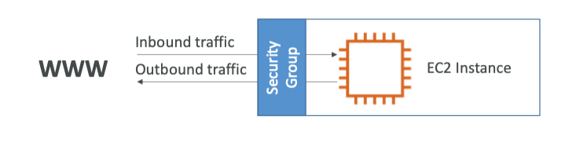
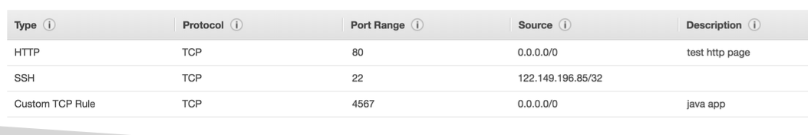
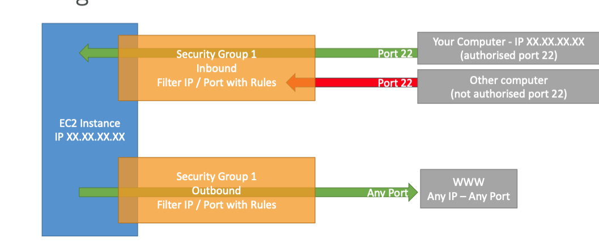
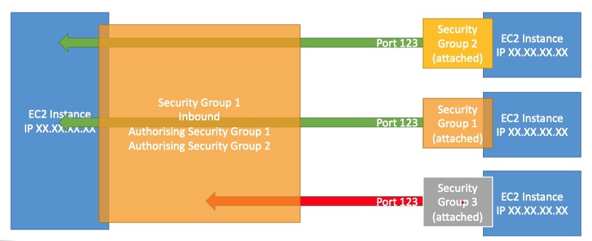

[⬅️ BACK ](./README.md)

# Security Groups

## Security Groups & Classic Parts Overview

### Introduction

- security group은 네트워크 보완에 있어 아주 필수적이다.
- EC2 인스턴스에 들어오고 나가는 트래픽을 제어하는데 사용된다.

- security group은 단지 Allow rule만 가지고 있다.
- security group은 rule을 만들 수 있고 이 룰은 IP 또는 다른 security group을 참조할 수 있다.
  - 보안그룹은 서로를 참조할 수 있다.

### serurity groups deep dive

- 보안 그룹은 firewall(방화벽)과 같은 역할을 한다
- security group은 regulate한다
  - access to Ports
  - Authorized IP range (IPv4 or IPv6)
  - Control of inbound network(from other to the instance)
  - Control of outbound network(from the instance to other)
- 보안 그룹 규칙은 아래와 같다.
  
  - type, protocol, 트래픽이 허용되는 port range, IP address range(source)가 있다.
  - 여기서, 0.0.0.0/0는 모든 IP를 의미한다.
  - IP가 명시되어있다면 하나의 IP만 허용한다는 의미이다.

### Security Groups Diagram

- Inbouund 규칙에의해 허용되지 않은 other computer는 ec2 Instance에 접근할 수 없다
- outbound 규칙에 따르면 기본값으로 모든 IP에 대해 트래픽을 허용한다.

### Security Groups에 대해 알아야 할 것

- 여러 개의 Instance에 부착할 수 있다. 보안그룹과 Instance는 다대다 관계이다.
- 보안 그룹은 `region/VPC `조합으로 이루어져있다. 따라서 다른 지역의 경우 새로운 보안 그룹을 만들어야 한다.
- 보안그룹은 EC2인스턴스의 외부에서 작동한다. 따라서 트래픽이 차단되면 EC2 인스턴스에 도달하지 못한다.
- SSH access를 위해 개별적인 보안그룹은 유지하는 것이 좋다.
- application이 timeout이 발생한다면,이런 경우 security group issue이다.
- application이 connection refused error를 받는다면 security group이 작동되고 있다면 application에 문제가 있던가 실행이 되지 않은 것이다.
- 모든 Inbound traffic의 default는 blocked이다.
- 모든 Outbound traffic의 default는 authorized이다.

### Referencing other security groups

- 보안 그룹은 다른 보안 그룹을 참조할 수 있다.

- 위의 다이어그램의 보안그룹1의 Inbound 규칙은 보안그룹1, 보안그룹2를 허용한다는 의미이다.
- 우측의 보안그룹1,2가 붙은 다른 인스턴스는 접근을 허용한다는 의미이다.
- 이 EC2인스턴스의 IP에 상관없이 보안그룹만으로도 접근이 허용된다.(IP를 신경쓰지 않아도 된다.)
- 이는 부하분산장치(load balancer)에 사용하면 유용하다(자주 사용되는 패턴이다.)

### 시험에서 알아야 할 것들

- classic port to know
  - 22 = SSH (Secure Shell) - log into a linux instance(리눅스 EC2 인스턴스에 로그인 하게 함)
  - 21 = FTP (File Transfer Protocol) - upload files into a file share(파일 공유에 파일을 업로드 하는데 사용)
  - 22 = SFTP (Secure File Transfer Protocol) - upload files using SSH(SSH를 사용하여 파일을 업로드 하는데 사용, 보안 파일 전송 프로토콜)
  - 80 = HTTP - access unsecured websites
  - 443 = HTTPS - access secured websites
  - 3389 = RDP (Remote Desktop Protocol) - log into a windows instance(윈도우EC2 인스턴스에 로그인 하게 함)
