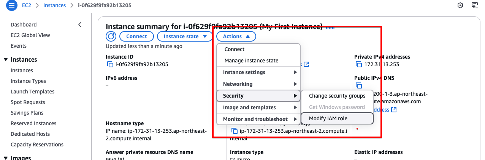

[⬅️ BACK ](./README.md)

## EC2 Connect


- 브라우저기반 EC2 Instance session을 할 수 있다.
- ec2 conenct는 임시 ssh키를 업로드하여 연결을 설정하도록 한다.
- 이 방법은 ssh키를 관리할 필요가 없다.

- 연결을 클릭하면 아래왕 같이 새 탭이 나온다.
  

- 하지만 해당 EC2 Instance는 기존에 설정한 SSH에 의존한다. 만약 security group의 Inbound rule에서 SSH 포트가 열려있지 않다면 연결할 수 없다.

## EC2 Role

- EC2 connect에서는 aws configure를 통해 IAM API key를 입력하지 않는 것이 좋다. 그 이유는:
  - EC2 Connect 세션은 공유될 수 있으며, 다른 사용자가 접근할 수 있다
  - IAM 자격 증명이 노출될 위험이 있다
  - 대신 `EC2 IAM Role`을 사용하는 것이 권장된다
- EC2에 IAM Role을 설정하는 방법

  - 아래의 그림처럼 Modify IAM Role을 클릭한다.
    
  - 아래의 그림처럼 IAM Role을 선택 또는 생성하고 Update IAM Role을 클릭한다.
    
  - EC2 Instance의 Security 탭에서 Security Details를 보면 IAM Role이 설정된 것을 확인할 수 있다.
    
  - EC2 instance에 들어가서 아래와 같이 확인할 수 있다

    ```
    aws iam list-users
    ```

    
