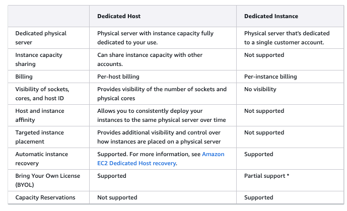
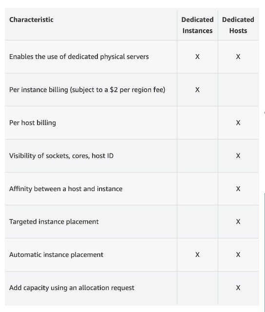
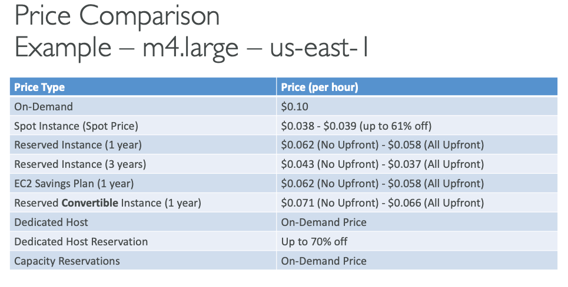

## EC2 Instance Purchasing Options

- 작업 유형에 따라 할인 및 가격을 최적화할 수 있다.
- `시험은 작업에 근거하여 어떤 인스턴스가 옳은지 묻는다.`

- On-Demand Instance

  - [On-Demand Instance](https://docs.aws.amazon.com/AWSEC2/latest/UserGuide/ec2-on-demand-instances.html)
  - 주요 특징
    - 요구에 대한 Instance를 생성하게 해준다
    - 짧은 작업(워크로드)에 좋다.
    - 단기적이고 un-interrupted 작업에 적합하다.
    - application의 작동을 예측할 수 없을 때 적합
  - Pricing
    - 예측 가능한 가격이 나와 매초 지불하게 된다.
      - 사적 1분후 초당 청구서를 받는다.
      - 다른 운영체제에 대해서도 시간당 청구서를 받는다.
    - 원가는 높지만 선급 및 장기간의 계약도 없다.

- Reserved (1년 또는 3년)

  - Reserved Instance

    - [Reserved Instance](https://docs.aws.amazon.com/AWSEC2/latest/UserGuide/ec2-reserved-instances.html)
    - 주요 특징
      - 긴 작업을 위한 Instance이다. 데이터베이스를 오랫동안 실행하는 경우 적합하다.
      - 특정 인스턴스 속성을 정한다(Instance Type, Region, Tenancy,OS)
      - Regional 또는 Zonal 의 scope를 선택할 수 있다.(reserve capacity in an AZ)
      - Stady-state application에 적합하다(데이터베이스와 같음)
      - Reserved Instance를 Marketplace에서 사거나 팔 수도 있다.
    - Pricing
      - on demand보다 72%(강의 시점) 정도 할인된다.
      - 할인을 받기위해 1년 또는 3년의 예약 기간을 명시하고 부분적으로 선금을 지불할지 결정한다.선불인 경우 할인율이 크다

  - Convertible Reserved Instance

    - 주요 특징
      - flexible instances with long workloads
      - 시간이 지나면서 Instance 유형이 변경될 수 있는 경우 적합
      - EC2 Instance type, instance family, OS, spoce and tenancy를 바꿀 수 있다.
      - 예를 들어 에플리케이션의 워크로드가 증가하여 더 큰 인스턴스 유형이 필요한 경우 t2.large->m5.xlarge로 변경하는 경우
      - 또는 AWS에서 새로운 인스턴스 유형을 출시하는 경우
      - 인스턴스를 다운그레이드 할 때 등
    - Pricing
      - Reserved Instance와 달리 Convertible RI는 유연하지만 할인율이 더 낮다.
      - Up tp 66% discount (강의 시점)

- Savings Plans (1년 또는 3년)

  - 주요 특징
    - commitment to an amount of compute usage(사용량에 따라 비용 최적화)
    - Compute Savings Plans
      - EC2, Lambda, Fargate에 적용 가능
    - EC2 Instance Savings Plans
      - 틀정 Instance 패밀리 내에서만 유연성 제공
    - 여러 AWS서비스에 걸쳐 적용이 가능하다.
    - Flexible across
      - Instance size ( ex ) m5.large, m5.xlarge, m5.2xlarge
      - OS ( ex ) Linux/UNIX, Windows
      - Tenancy ( ex ) Host, Dedicated,Default
  - Pricing
    - 시간당 특정 금액(달러)을 사용하기로 약정한다.
      - 시간당 10$ 사용을 1년 또는 3년 약정
    - 초과된 사용량은 on-demand 요금으로 청구한다.
    - RI와 비슷하게 장기간 계약에 따라 up to 72% discount
    - 저축 플랜은 특정 인스턴스 family와 AWS region에 묶이게된다. (ex) m5.large in us-east-1)

- Spot Instance

  - [Spot Instance](https://docs.aws.amazon.com/AWSEC2/latest/UserGuide/using-spot-instances.html)
  - 주요 특징
    - 짧은 작업을 위해 만들어졌다.
    - 저렴하다.
    - AWS의 여분 컴퓨팅 용량을 활용하는 방식이다. AWS의 미사용 EC2용량을 매우 할인된 가격(최대 90%)으로 사용한다.
    - 시장 가격에 따라 가격이 변동된다(spot Price)
    - 하지만 AWS에서 해당 용량이 필요해지면 2분 전 통지 후 인스턴스를 회수해간다.(언제든지 중단될 수 있음)
    - 만약 spot price가 max price를 초과하면 instance를 잃을 수 있다.
    - 적절한 작업(중단을 허용할 수 있는 작업들)
      - 배치 작업
      - 데이터 분석
      - 이미지 처리
      - 분산 워크로드
    - database 또는 중요한 job에는 적합하지 않다.
  - Pricing
    - On-demand 보다 최대 90% discount
    - Most cost-efficient instances in AWS

- Dedicated Host

  - [Dedicated Host](https://docs.aws.amazon.com/AWSEC2/latest/UserGuide/dedicated-hosts-overview.html)
  - 전체 물리적인 서버를 사용하는 것을 의미한다.
  - Purchasing Options
    - On-demand - pay per second for actice Dedicated host
    - Reserves
  - 주요 특징:
    - 인스턴스 배치를 상세하게 제어할 수 있음
      - 일반 EC2인스턴스는 AWS가 자동으로 인스턴스 배치를 관리한다.
      - 물리적 서버에서 EC2 Instance가 정확히 어디에 배치될지 직접 제어할 수 있다.
    - 물리적 서버의 소켓, 코어 수 등을 확인할 수 있음
    - 시간이 지나도 동일한 물리적 서버에 인스턴스를 일관되게 배치 가능
    - 다른 AWS 계정과 인스턴스 용량을 공유할 수 있음
    - BYOL(Bring Your Own License) 완벽 지원
  - 인스턴스 placement를 컨트롤할 수 있다.

  - 사용 사례
    - 소프트웨어 라이센스가 물리적 서버에 종속된 경우
      - 일부 소프트웨어 라이선스는 특정 물리적 서버에 바인딩 되어야 하는 경우도 있다.
    - 규정 준수나 규제 요구사항이 엄격한 경우
    - 특정 워크로드들을 물리적으로 가깜게 또는 멀게 배치하여 성능 최적화도 가능하다
    - 하드웨어를 조직 전용으로 사용할 수 있다.
    - 보안이 매우 엄격한 경우에 적합하다.

- Dedicated Instance

  - [Dedicated Instance](https://docs.aws.amazon.com/AWSEC2/latest/UserGuide/dedicated-instance.html)

  - 주요 특징
    - 다른 고객과 물리적인 서버를 공유하지 않는다.
    - 서버 배치는 제어할 수 없다.
    - 같은 계정 내에서 다른 인스턴스와 하드웨어를 공유할 수 있다.
    - 하드웨어 제어가 필요 없지만 보안사항을 준수해야할 때 적합하다
      - Dedicated Instance는 다른 고객과 하드웨어를 공유하지 않아야 하지만, Dedicated Host만큼의 세밀한 제어나 복잡한 관리가 필요없는 경우에 적합한 중간적인 옵션

- Dedicated Host와 Dedicated Instance의 차이점
  

- 시험에도 나오는듯

- 두 옵션 모두 전용 물리적 서버를 사용할 수 있다.
- Dediacted Instance는 인스턴스 단위로 청구한다(리전당 $2추가 요금)
- Dedicatde Host는 호스트 단위로 청구한다
- Dedicated Instance는 소켓,코어,호스트ID 확인이 불가능하다
  - Dedicaged host는 가능하다
- Dediacated host는 특정 호스트와 Instance간의 affinity(선호도)를 설정 가능하다
- Dedicated Instance는 자동배치만 가능하며 불가능하다 Dedicaded Host는 수동배치도 가능하다
- Dedicated host는 할당 요청을 통해 용량 추가가 가능하다. Dedicated Instance는 불가능하다

- 결론적으로 Dediatated host가 더욱 세밀한 제어가 가능하다

- Capacity Reservations

  - [Capacity Reservations](https://docs.aws.amazon.com/AWSEC2/latest/UserGuide/capacity-reservation-overview.html)
  - 특정 AZ의 용량을 일정 시간동안 예약할 수 있게 한다.
  - 필요로 할 때마다 EC2 capacity에 접근할 수 있다.
  - 시간 제한이 없으며 청구 할인도 안된다.
  - 용량을 비축하는 것이 유일한 목적이다.
  - 특정 AZ가 있어야 하는 짧은 작업에 적합하다.
  - 만약 할인을 받고싶다면 Regional Reserved Instance와 Savings Plans를 결합해야한다.
  - Instance를 돌리든 안돌리든 고정요금이다.(예약된 용량이 요금으로 청구되는 것이다)

### pricing comparasion

