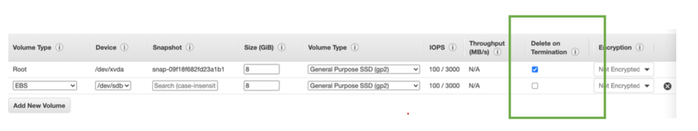

[⬅️ BACK ](./README.md)

# EBS Overview

- EBS(Elastic Block Store)Volume : 인스턴스가 실행되는 동안 연결할 수 있는 네트워크 드라이브
- 주 목적은 Instance가 종료되더라도 데이터를 지속되도록 하는 것이다.
- 다시 생성하고 이전의 같은 EBS볼륨에 마운트할 수 있다.
- CCP레벨에서 한 번에 한 인스턴스에만 마운트 될 수 있다.
  - CCP 레빌잉란 ? Certified Cloud Practitioner
- EBS볼륨을 생성하면 특정 availibility zone에 묶이게 된다.
- network USB stick 이라고 생각하면 편하다
  - 이런 기능 덕분에 Free tier : 30 GB for free EBS storage of type General Purpose (SSD) or Magnetic per month를 제공할 수 있는 것이다.

### EBS Volume 정리

- 네트워크 드라이브이다 (물리적인 드라이브가 아니다)
  - instance와 Network를 통해 통신한다.
  - 따라서 약간의 지연이 있을 수 있다.
- EC2 인스턴스에서 다른 인스턴스로 빠르게 분리하고 붙일 수 있다.
- 특정 AZ에 묶여있다
  - 다른 AZ으로 옮겨갈 수 없다
  - 스넵샷을 찍어서 볼륨을 이동시킬 수 있다.
- 미리 볼륨을 프로비전해야한다
  - 얼마나 많은 GB를 필요로 한지, 초당 IO연산인 IOPS도 설정해야 한다.
    - 프로비전 용량에 대한 고지서를 받게되고
    - 필요에 따라 용량을 증가시킬 수 있다.

### DBS - Delete on Termination attribute

- 시험에 나올 수도 있다
- EC2 Instance가 종료될 때의 EBS Volume의 행동을 결정한다.
- 기본으로 root volume에는 체크가 되어있고 새로운 볼륨에는 기본값으로 체크는 안되어있다
- Instance를 생성할 때 Storage 의 advanced option에서 디폴트 변경할 수도 있다.

# EBS Snapshots

- EBS 스넵샷은 EBD 볼륨의 어떤 시점에서의 백업이다.
- volume과 snapshot을 분리 할 필요는 없지만 권장된다.
- 이 스냅샷은 다른 AZ나 Reion에 복사할 수 있다.

## EBS spanshot feature

- EBS Snapshot Archive
  

  - 스냅샷을 archive tier로 이동한다. 75% 저렴하다
  - 24 시간 ~ 72 시간의 복구 시간을 갖는다
  - 즉각적이지는 않다

- Recycle Bin for EBS Snapshot

  

  - 삭제된 스냅샷에 보관할 룰을 지정하여 예상치못한 삭제시 복구할 수 있다.
  - 1일 또는 1년을 선택할 수 있다.

- Fast Snapshot Restore(FSR)

  - 스냅샷 전체의 초기화를 강제한다.
  - 첫 번째 사용에 대기시간을 없애기 위함
  - 스냅샷이 아주 큰 경우 도움이 된다
  - EBS 볼륨을 초기화하거나 빨리 인스턴스를 사용해야 할 경우 유용
  - 하지만 비싸다
