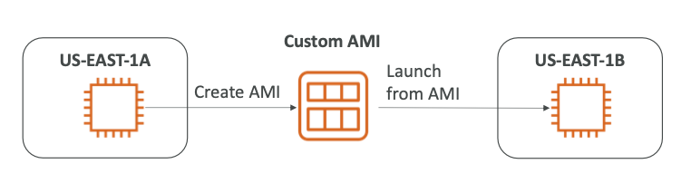
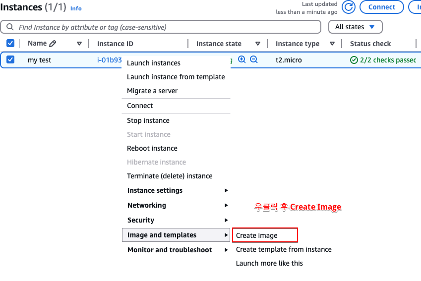
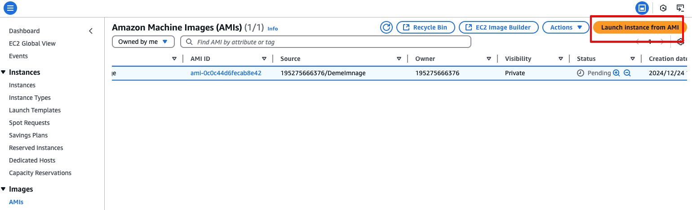

[⬅️ BACK ](./README.md)

# AMI overview

- AMI = Amazon Machine Image
- EC2 인스턴스의 사용자 지정을 나타낸다.
  - 나만의 소프트웨어 구성, OS, 모니터링 등등
  - 부팅 시간이 빨라짐 이미 모든 소프트웨어가 AMI를 통해 미리 패키지화 되기 때문
- Region에 맞게 만들어서 그 Region에 걸쳐서 복사할 수 있다.
- 다양한 AMI로부터 EC2인스턴스를 보낼 수 있다
  - 공용 AMI : AWS가 제공함. Amazon Linux 2 AMI는 AWS에서 아주 인기있는 AMI임.
  - 사용자화 AMI : 만들고 관리는 스스로
  - Marketplace에서 다른 사람이 만든 AMI를 사용할 수도 있다. 사람이 직접 만들어서 사고 팔 수 있는 것이다.

# AMI Process (From an EC2 Instance)

- ec2의 ami과정은 어떻게 작동되는가?
- EC2 인스턴스를 시작하고 사용자 지정을 한다.
- 그 다음 데이터 무결성을 위해 Instance를 멈춘다.
- AMI를 구축한다. 여기서 EBS 스냅샷도 생성한다.
- 다른 AMI에서 Instances를 실행한다.

- us-east-1a 에서 인스턴스를 만들고
- 커스텀 AMI를 만든다
  
- us-east-1b에는 커스텀 AMI를 시용해 EC2를 인스턴스를 복사할 수 있다.
  

  - 위와 같은 방법도 가능하지만 ec2 생성시 My AMIs를 선택해서 생성할 수도 있다
    

- AMI를 EC2를 통해 만들고 그것을 통해 다른 인스턴스를 만든다면 처믄 EC2의 초기 설정을 그대로 가져오기 때문에 중복적인 설정을 하지 않아도 된다.
- 예를 들면 첫 번째 Instance를 생서할 때 초기 스크립트로 httpd 웹서버를 설정했다면 두 번째 인스턴스는 이미 그 설정을 따라 갖는다.
