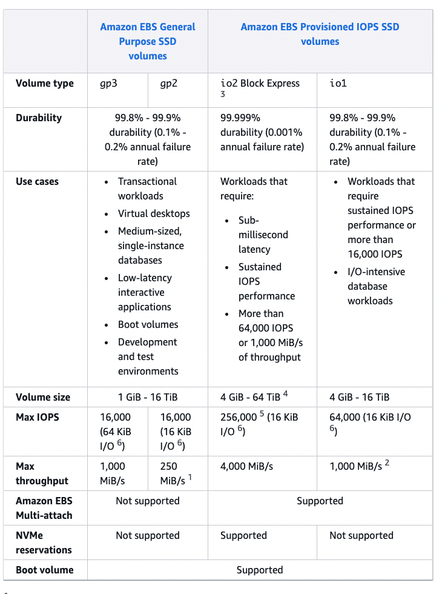
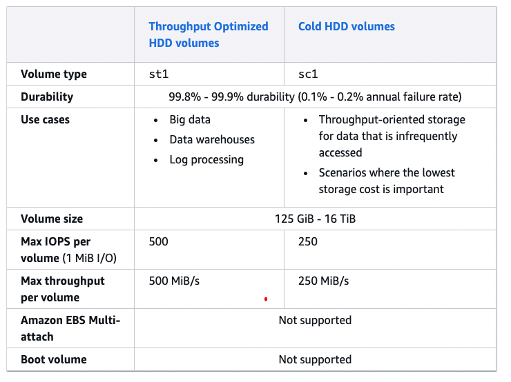

[⬅️ BACK ](./README.md)

# EC2 Instance Store

- EBS volume은 성능이 제한적이다.
- 더 높은 성능을 원한다면 고성능 하드웨어인 EC2 Instance Store를 사용할 수 있다.
- EC2는 가상 컴푸터이지만 실제 하드웨어 서버에 연결되어있을 것이고 서버가 갖고있는 물리적인 디스크 공간이 있다.
- 특별한 타입의 EC2 Instance는 EC2 Instance Store라는 것을 사용할 수 있다.
- EC2 Instance Store는 서버에 연결된 하드웨어이다.
- 더 좋은 I/O 성능을 위해 사용한다.
- 하지만 EC2 Instance가 멈추거나 종료되면 저장소가 사라진다.
- 버퍼, 케시, scratch data, 임시 content 등을 하기에는 좋지만 장기 저장소에는 좋지 않다.
- risk of data loss if hardware fails
- 스스로 백업하고 필요에 따라 복제하여야 한다

# EBS Volume Types

- 6가지가 있다

  - gp2, gp3(SSD) : 일반적인 목적의 볼륨이다. 다양한 워크로드를 위해 가격과 성능의 균형을 맞추는 범용 SSD 볼륨
  - io1,io2 Block Express(SSD) : 고성능 SSD 볼륨 mission-critical-low-latency 또는 high-throughput workloads
  - st1(HDD) : 자주 액세스하고 처리량이 많은 워크로드를 위해 설계된 저비용 HDD 볼륨
  - sc1(HDD) : 작업량이 적은 워크로드를 위해 설계된 저비용 HDD

- EBS volume은 size, throughput , iops(io per sec)에 따라 정의된다.

- Boot volume 으로는 gp2,gp3, io1,io2 만 사용될 수 있다.

## EBS Volume Type Use Case

- https://docs.aws.amazon.com/ebs/latest/userguide/ebs-volume-types.html

### General Purpose SSD

- gp2, gp3
- 대기 시간이 짧고(지연이 짧고) 비용 효율적인 저장소
- 시스템 부트 볼륨, 가상 데스크탑, 개발이나 테스트 환경에 사용할 수 있다.
- 1GiB ~ 16 TiB
- gp3 :
  - new version
  - 3000 IOPS, 125 Mib/s 쓰로풋,
  - IOPS를 16,000까지 증가시킬 수 있고 쓰로풋은 1000 MiB/s 로 `독릭적으`로 증가시킬 수 있다.
- gp2 :
  - order version
  - small size gp2는 IOPS를 3000까지 버스트될 수 있다
  - volume의 사이즈와 IOPS는 `연동되어있다`. 최대 16,000 IOPS까지
  - 3 IOPS per GB는 5,334 GB에서 MAX IOPS임을 의미한다.

### Provisioned IOPS SSD

- IOPS 성능을 유지해야하는 중요한 비즈니스 애플리케이션에 적합
- 또는 16,000 IOPS가 필요한 애플리케이션

- 시험 관잠에서 저장소 성능과 데이터 일관성에 매우 민감한 데이터베이스 작업을 볼 때마다 프로비전된 EBS 볼륨을 고려해볼 수 있다.
- IO1 (4 Gib - 16 TiB)
  - MAX PIOPS : 64,000 for Notro EC2 Instance & 32,000 for other
  - PIOPS를 storage size와 독립적으로 증가시킬 수 있다.
- IO2 Block Express(4 Gib - 64 TiB)
  - sub-milisecond latency
  - MAX PIOPS:256,000 with and IOPO 대 GiB비율은 1000 대 1 이다.(IOPS:GiB ratio of 1,000:1)
- EBS multi-attach 기능도 제공한다.

### Hard Dist Drives(HDD)

- boot volume으로는 불가능하다
- 125 Gib ~ 16 TiB까지 있다
- st1 :
  - 처리을 최적화한 HDD
  - 빅 데이터, data warehouses, log processing
  - 최대 처리량 500MiB/s - max IOPS 500
- sc2

  - Cold HDD
  - access가 적고 적은 비용을 필요로 할 때 사용
  - 최대 처리량 : 250 MiB/s - max IOPS 250

- `시험에서는 큰 부분에서의 차이점 정도만 기억하자`
  - 높은 처리량, 낮은 비용을 필요로 할 때 등

### 볼룸 타입 구분 요약 표

https://docs.aws.amazon.com/ebs/latest/userguide/ebs-volume-types.html

- SSD
  

- HDD
  
