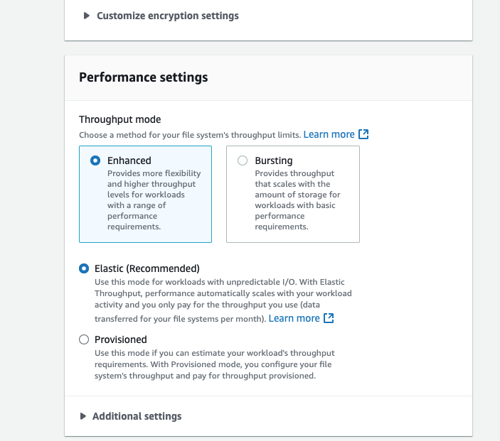
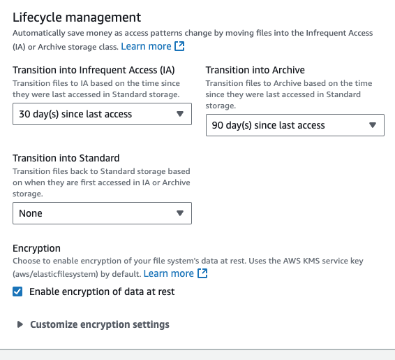
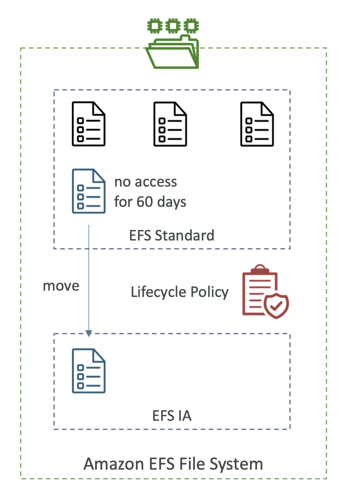
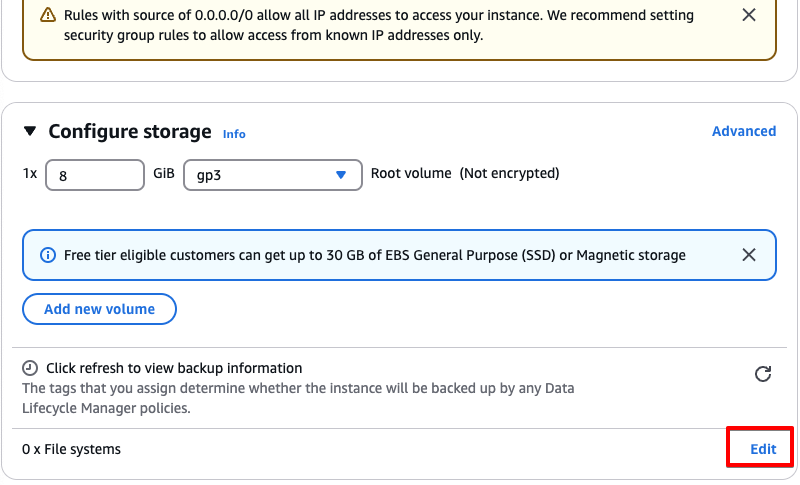
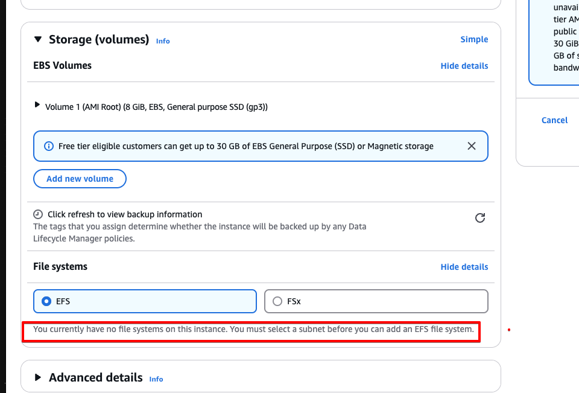
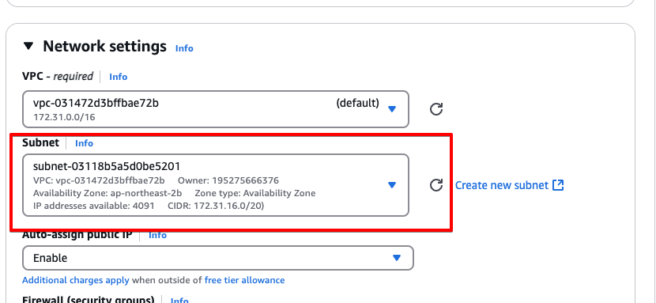
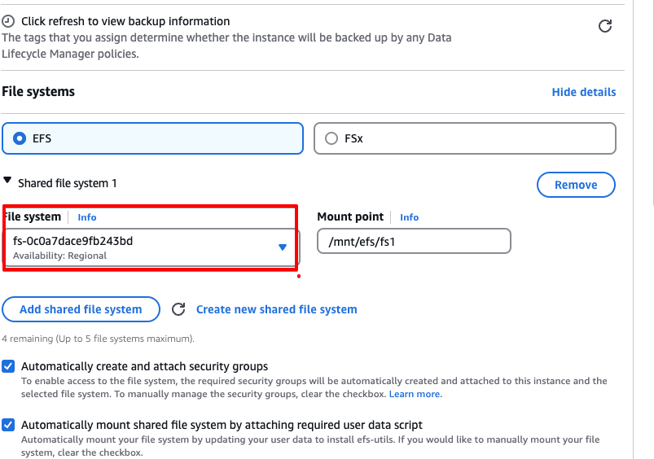
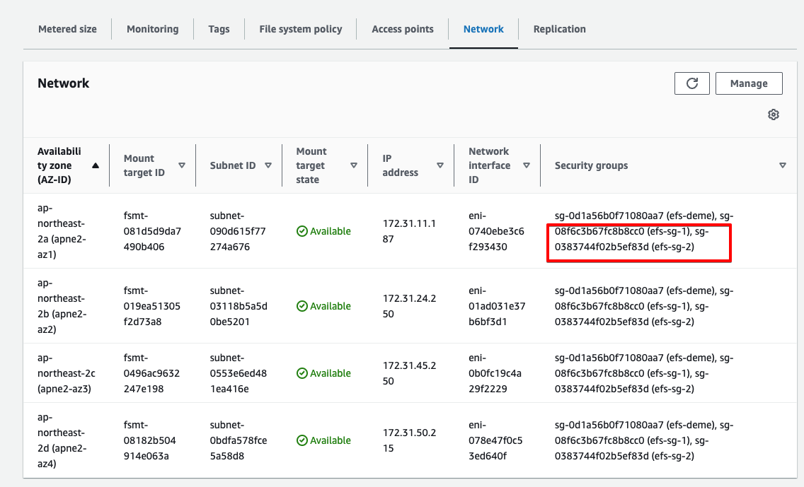

# EFS (Elastic File system)

- 관리되는 NFS(Network file system)이다. 많은 EC2에 마운트될 수 있다.
- EC2들의 AZ가 달라도 가능하다
- 고가용성, 확장성 높고 비싸다. 미리 용량을 프로비전할 필요 없다.
- 사용사럐
  - 콘텐츠 관리
  - 웹 서빙
  - 데이터 공유, 워드 프레스 등이 있다.
- NFSv4.1 protocol을 사용한다
- EFS에 접근하기 위해서는 security group을 사용함
- only 리눅스 기반의 AMI와만 호환 가능하다.(window XX)
- EFS 드라이브에서 KMS를 사용하여 암호화 가능

- POSIX file system(리눅스)을 사용하고 표준 file api를 갖고있다.
- 장점 : 파일시스템이 자동으로 sacle을 조정한다. 사용한만큼 지불한다. 용량 걔획을 하지 않아도 된다.

## EFS - Performance & Storage Classes

- EFS Sacle
  - 수천개의 NFS 클라이언트와 10 GB 이상의 쓰로풋
  - 페타바이트 규모의 네트워크 파일시스템을 자동으로 확장
- Performance Mode를 설정할 수 있다.(EFS 생성 시간에 설정 가능)
  
  - General Purpose(default) - latency-sensitive use case에 사용한다(web server, CMS,,)
  - MAX IO - 시스템의 대기 시간이 높고 처리량도 높다,높은 병행처리 가능 (data, medis,processing) 빅데이터 유형의 설정에서는 좋다.
- Throughput Mode
  - Bursting - 1TB = 50MiB/s + burst of up to 100MiB/s
  - Provisioned - storage 크기 상관 없이 처리량을 설정(1 GiB/s for 1 TB storage 가능)
  - Elastic - 작업에 따라 자도응로 처리량을 늘렸다 줄였다 할 수 있다.
    - up to 3GiB for read and 1 GiB for write
    - 예측 불가능한 작업인 경우 적절하다.

## EFS - Storage Classes

- Storage Tiers
  - 수명 주기 관리 기능으로 시간이 지나면 파일을 다른 파일로 옮길 수 있게 해준다.
    
  - 비용 절감을 위해 데이터를 다른 스토리지 계층으로 이동시키는 것이다.
  - Standard : 자주 접근하는 파일들
  - Infrequent access(EFS-IA) : 비용을 들지만 저장 비용은 낮다.
  - Archive: 거의 접근이 안되는 데이터. 50% 싸다.(일 년에 몇 번 접근 등)
  - 파일을 storage tier 사이를 이동하려면 Lifecycle 정책을 구현할 수 있다.(몇일 후에 이동되어야 하는지 등등)

- 가용성(availability) / 지속성(durability)

  - Standard : Multi-AZ , 가용성 영역에 걸쳐 EFS가 있어서 운영에 적합함 (재난등에 대비가 됨)
  - One Zone : One-AZ, 개발에 적합 IA와 호환이 된다.(EFS One Zone-IA 타입이 옴셥으로 있다.) 개발에 적합한 이유는 만약 AZ가 사용 불가능하게되면 사용이 불가능해지기 때문?

- EFS storage class를 사용하면 최대 90% 까지 비용을 절감할 수 있다.

- 참고로 EC2를 생성할 때 Configuration storage에서 아래와 같이 file system을 마운트 할 수 있다.

- 그리기 위해서는 서브넷을 선택해야한다
  

- 위로 스크롤 올려서 Network settings에서 서브넷 선택
  

- 그 후 file system 선택
  

- 아랴는 두 개의 instance를 마운트 한건데 ec2 console이 자동으로 EFS에 부착한다.
  
