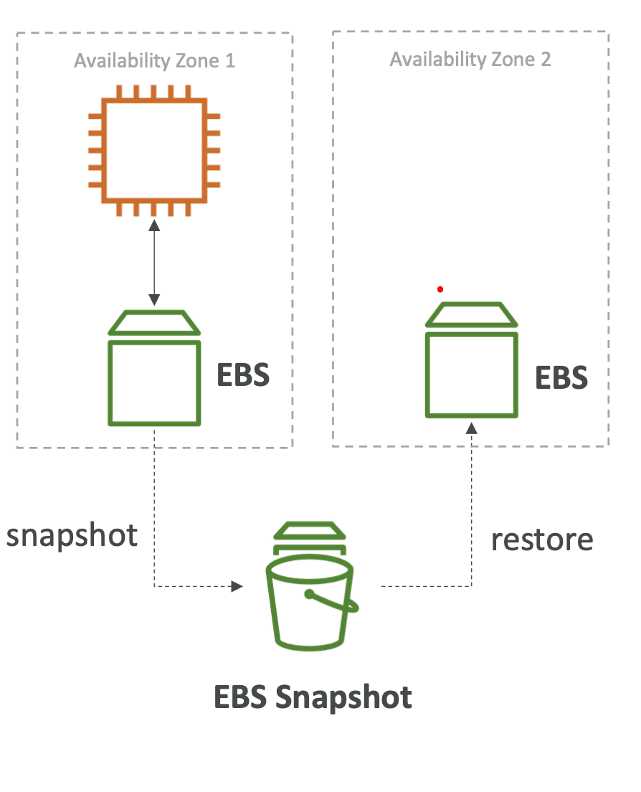
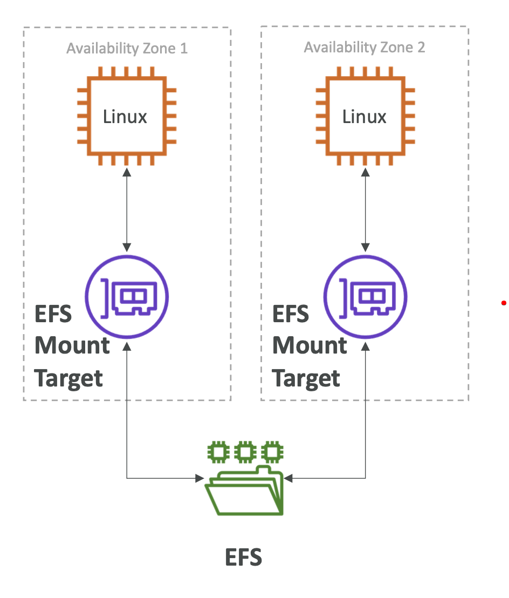

# EFS VS EBS

### EBS Volume

- 한 번에 하나의 Instance와 연결.
- io1,2의 경우 multi attach가 가능하긴 하다 (하지만 max 16) 그리고 특정 use case에 대한 것임
- EBS Volume은 AZ레벨로 고정되어있다.(다른 AZ에서는 사용불가능)
- gp2의 경우 disk의 사이즈가 커지면 IO가 증가한다
- gp3, io1의 경우 io는 독립적으로 증가할 수 있다.
- migration을 하기 위해서는 스냅샷을 찍어야 한다. 그리고 다른 AZ에 스냅샷을 복원한다.
- EBS Volume은 IO를 사용하기 때문에 애플리케이션이 많은 트래픽을 처리하는 동안 백업을 실행할 수 없다.
- Root EBS Volume은 EC2 인스턴스가 종료되면 EBS Volume도 종료된다.(disable 할 수도 있다.)

### EFS

- Network file system이다.
- AZ에 걸쳐 수백개의 인스턴스를 첨부할 수 있다.
- EFS는 웹사이트의 파일을 공유한다(WordPress)
- 리눅스 인스턴스만 가능하다.(POSIX)
- EBS보다 가격이 높다.
- 비용 절감을 위해 저장소 예층을 활용할 수 있다.

### EFS VS EBS vs Instance Store의 차이를 기억하자

- Instance Store는 ec2 instance에 물리적으로 부착되어있다
- Instance를 잃으면 저장소도 잃는다.
