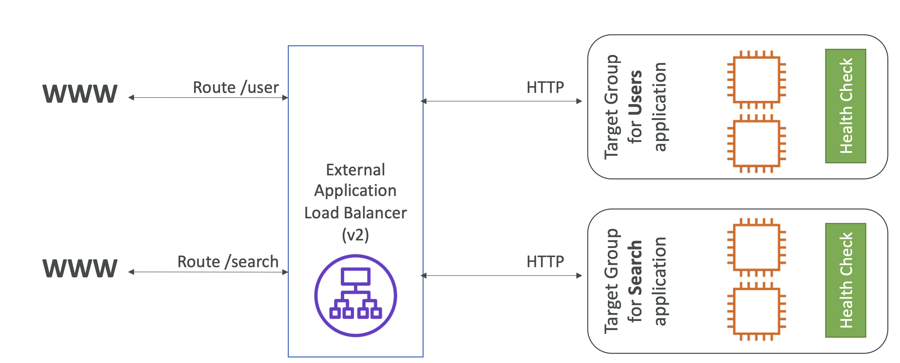
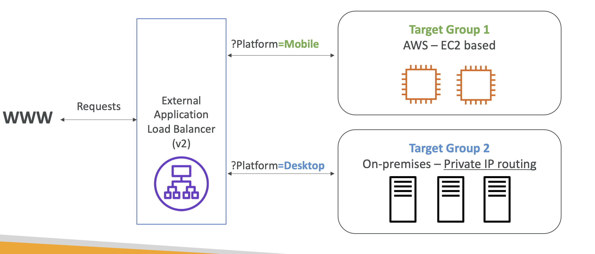
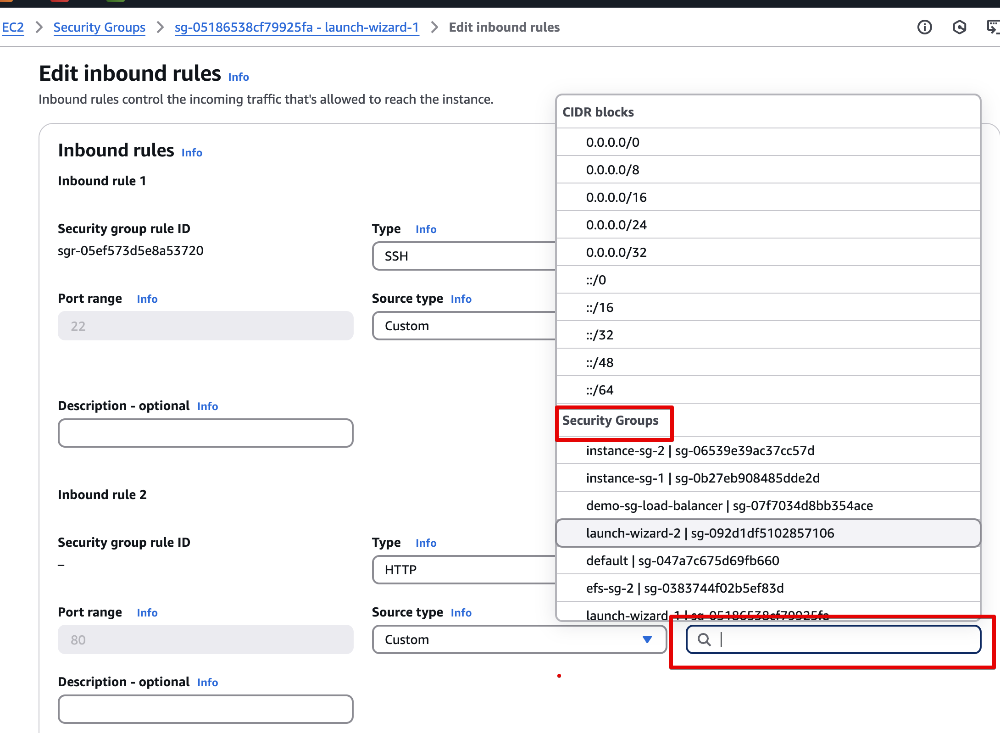
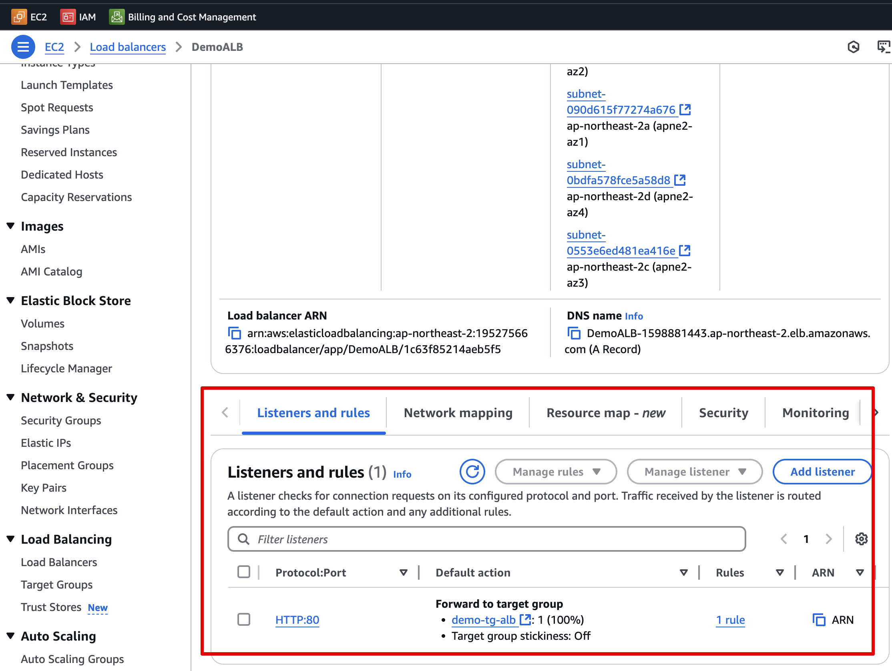
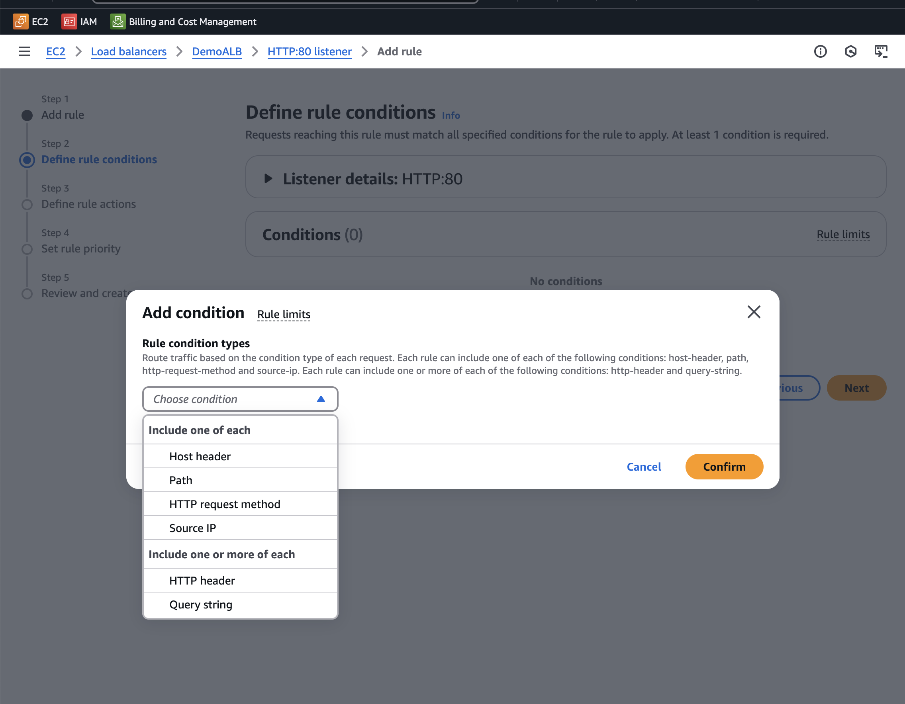

[⬅️ BACK ](./README.md)

# Application Load Balancer(ALB)

## Abput

- Layer7 (HTTP)에서 작동한다
- 컴퓨터 전반에 걸쳐 여러 HTTP 응용프로그램으로 라우팅할 수 있게 한다.

  - ALB는 여러 서버로 트래픽을 분산시킬 수 있고 이 서버들은 target group으로 묶인다

- 같은 EC2 Instance에서 다중 앱에 부하 분산을 할 수 있다.
  - container와 ECS를 사용
- HTTP/2 and WebSocker 지원
- redirect 지원 (ex HTTP to HTTPS)
- 서로 다른 target group에 대한 routing tables
  - 예를 들면 경로를 기반으로 하는 라우팅(example.com/users, example.com/products)
    - 두 가지의 다른 경로를 다른 target group으로 라우팅할 수 있다.
  - URL hostname 이름을 기반으로 라우팅 (one.example.com & other.example.com)
    - 위의 두 가지의 다른 hostname을 다른 target group으로 라우팅할 수 있다.
  - Query String, Headers 기반의 라우팅
    - example.com/users?id=123&order=false
      - id=123과 order=false는 다른 target group으로 라우팅할 수 있다.
- ALB는 micro service 또는 container 기반 애플리케이션에 적합하다. (docker or ecs)
- Hort mapping 기능이 있다. ECS의 dynamic port에 redirect 할 수 있다.
- CLB의 경우 하나의 애플리케이션에 여러 개의 CLB가 필요하지만 ALB는 여러 애플리케이션에 하나의 ALB가 필요하다.

- ALB 그림으로 이해
  

  - External APB는 /user 와 /search route에 따라 각각 다른 target group으로 라우팅을 해준다.

## Target Group

- EC2 Instance (Auto Scaling Group으로 관리뵐 수 있다) - HTTP
- EC2 task(EC2 자체에서 관리된다) - HTTP
- Lambda 함수 - HTTP 요청이 JSON 이벤트로 변환됨
- IP Address - private ip 여야한다

- ALB 는 여러 개의 target groups에 대해 라우팅을 할 수 있다.
- health check는 target group level에서 설정된다.

## Query Strings/Parameters Routing

- path에 따라 redirection하는 라우팅 규틱을 작성할 수 있다.

## Good to know

- Fixed hostname
  - 고정 호스트 이름이 로드 밸런서에서 제공된다.
  - ALB는 고유한 DNS이름을 갖고있어 클라이언트는 이 이름을 통해 요청을 보낸다
- application server는 client의 ip를 직접적으로 보지 않는다.
  - client의 실제 ip는 X-Forwared-For라는 헤더에 삽입된다
  - ALB는 클라이언트와 서버 사이에서 프록시 역할을 한다.
  - port(X-Forword-port)와 proto(X-Forward-Proto)를 얻을 수 있다. (proto는 프로토콜 정보 htts https)
    ALB는 클라이언트의 연결을 종료하고 자체적으로 EC2로 새 연결을 생성한다. 이를 connection termination이라고 한다
  - 이때문에 서버는 ALB의 프라이빗 IP만 보게되며 클라이언트 IP를 알 수 없다.

## ELB 고급?

- ALB를 생성하고 EC2의 Security Group의 inbound rule은 아래의 스크린샷과 같이 ALB의
  security group으로 설정해야 한다 (ALB를 통해서만 들어오도록 하기 위함 )

  - 이를 통해 네트워크 보안을 강화할 수 있다.
    

- ALB rule (Listeners and rules )
  
  - 별도의 rule을 설정하지 않으면 default rule로 트래픽을 타멧 그룹으로 라우팅한다.
  - 리스너를 추가할 수 있다
    
    - 죄측의 Setp의 1~5를 따라 하면서 요청이 왔을 때 리스너에 대한 설정을 할 수 있다
    - 조건을 설정하고 , 조건에 맞았을 때의 action을 설정하는 단계들이 있음
