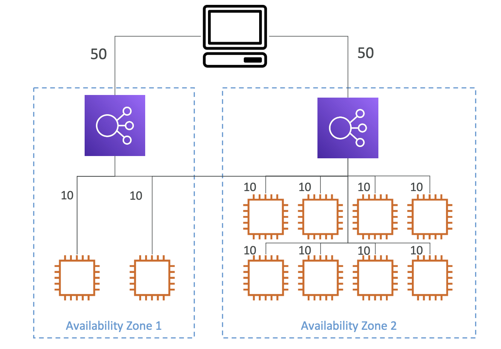
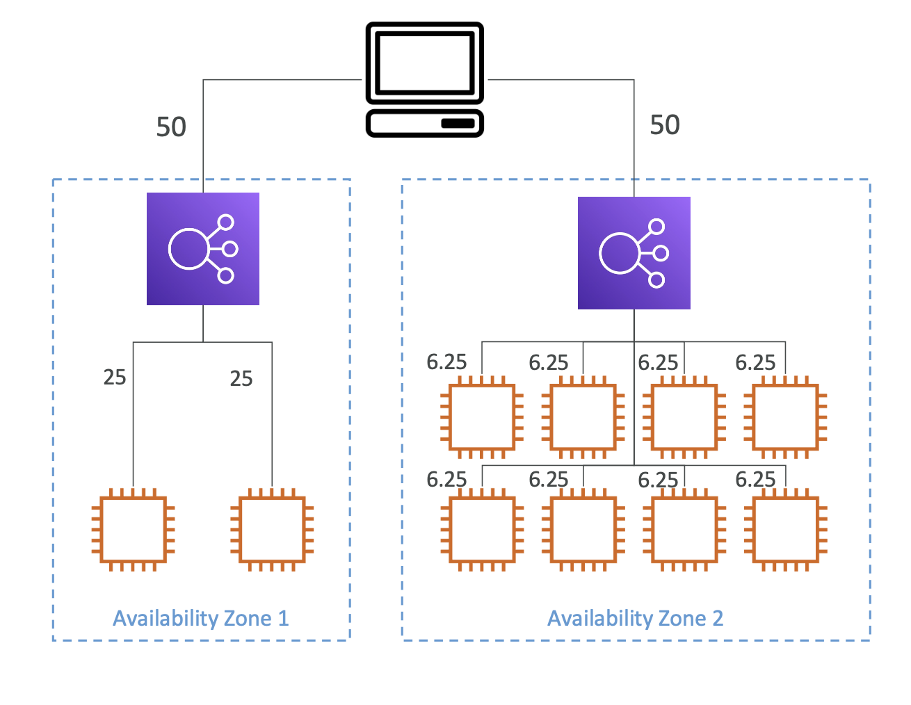

[⬅️ BACK ](../README.md)

# Cross Zone Load Balancing

- crozz zone load balancing은 각각의 가용 영역에 대한 부하를 균등하게 분산하는 기능이다.

### With Cross Zone Load Balancing



- 첫 번째 load banancer는 2개의 instance를, 두 번재 load balancer는 8개의 instance를 갖고있고 각각 AZ는 다르다
- client는 첫 번째 ALB아 두 번째에 50%의 traffic을 보낸다
- 하지만 각각의 ALB는 가용 영역고 관계 없이 10개의 EC2 인스턴스 모두에서 트래픽을 redirection 한다
- 각 Instance는 10%의 traffic을 받는다
- 각 Instance에 균등하게 트래픽을 분배한다.

### Without Cross Zone Load Balancing



- traffic은 각 AZ 내에서만 각가 분배된다.
- 이런 경우 하나의 AZ에서 더 많은 트래픽을 받는다.

## Cross Zone Load Balancing 옵션

### Application Load Balancer

- 기본적으로 활성화임
- Target Goup level에 따라 비활성화 가능
- 별도 비용이 들지 않는다

### Network Load Balancer / Gateway Load Balancer

- 디폴트로 비활성화이다
- 별도로 비용이 발생한다

### Classic Load Balancer

- 디폴트로 비활성화이다
- 별도로 비용이 발생한다
- 그런데 이건 곧 없어질것임

### 활성화 방법

- ALB의 경우 기본적으로 활성화되어있음

  - alb의 taraget group에 들어가서
    
  - target group의 attribute에서 on/off 가능하다
    

- NLB / GLB의 경우 디폴트로 비활성화되어있음

  - 콘솔에서 NLB attribute 수정에서 활성화 가능
    
  - 아래의 예시는 configuration 파일을 통해 활성화 하는 방법이다

    ```bash
    {
    "LoadBalancerAttributes": {
        "CrossZoneLoadBalancing": {
            "Enabled": false
        }
    },
    "LoadBalancerName": "my-loadbalancer"
    }

    ```
