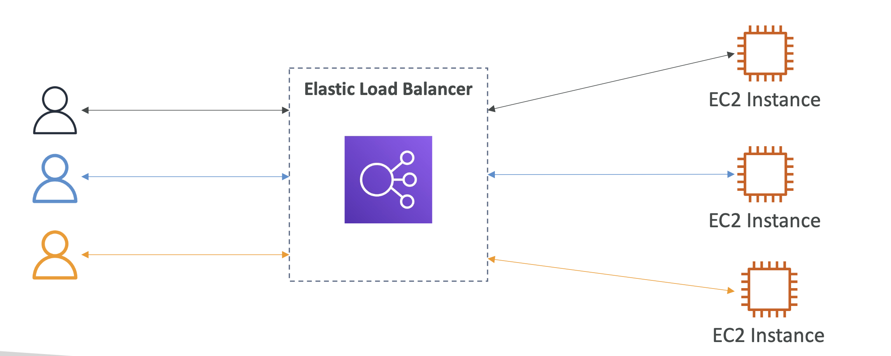
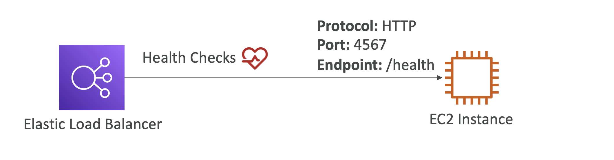
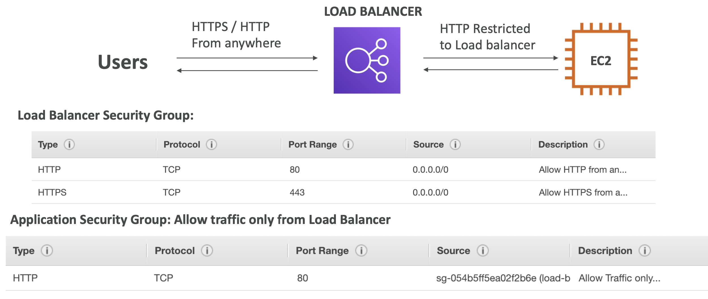

[⬅️ BACK ](./README.md)

# Scalability & High Availability

- 확장성이란 애플리케이션이나 시스템이 더 큰 부라는 처리할 수
  있도록 확장하거나 적응할 수 있는 능력을 의미한다
- 화작의 종류
  - Vertical Saclability : 인스턴스 크기를 늘리는 것
  - Horizontal Saclability( Elasticity) : 인스턴스 수를 늘리는 것
- 확장성과 고가용성은 다르다

### Vertical Scalability

- instance의 크기를 증가시키는 것
- vertical scalability는 데이터베이스와 같은 비분산 시스템에 일반적으로 사용된다.
- hardware limit이 있다.

### Horizontal Scalability(Elasticity)

- Instance의 수를 증가시키는 것
- 분산 시스템을 의미한다.

### High Availability

- 고가용성은 보통 수평 상승과 함께 사용하지만 항상 그런 것은 아니다
- 시스템을 적어도 2개의 데이터센터나 2 개의 Availability Zone
- 목표는 center 데이터의 손실 발생시 살아남기 위함임(보조 데이터와 같은 의미)
- 고가용성은 RDS 백업과 같이 수동적으로 사용될 수도 있고 수평 확장과 함께 사용될 수도 있다.

### High Availability & Scalability For EC2

- Vertical scaling = scale up / down
- Horizontal scaling = scale out / in
  - auto scaling group
  - load balancer
- High Availability
  - Auto Sacling Groip milti AZ
  - Auto Scaling Group , load balancer multi AZ 사용

# ELB(Elastic Load Balancer)

- Load Balancer는 여러 서버에 부하를 분산하는 장치임

## Why use a load balabcer

- 부하를 여러 인스턴스테 분산시키기 위함
- 단일 엑세스 지점만을 공개하기 위함
- 원활한 처리 실패를 처리하기 위함
- 주기적인 health check를 통해 instances 들의 상태 모니터링을 위함
- SSL termination(HTTPS)제공을 위함
- enforce stickiness with cookies
  - session stickiness란 같은 클라이언트가 보낸 요청이 항상 같은 서버로 전송되도록 유지하는 방식
  - 이를 통해 사용자가 특정 서버에 연결된 상태에서 일관된 세션을 유지할 수 있다.
  - 여기서, 쿠키 기반의 스티키니스는 클라이언트의 브라우저에 큭정 쿠키를 설정하고 쿠키에 서버에 대한 정보를 저장. 이후에 이를 통해서 사용자가 특정 서버에 연결된 상태에서 세션을 유지할 수 있음(로드 밸런서가 이 쿠키 정보를 확인하고 요청을 동일한 서버로 전달)
- 다른 AZ간의 고가용성을 제공
- private traffic을 통한 분리된 공공 traffic
  - 공용 트래픽과 사설 트래피글 분리하여 네트워크를 설계하는 것을 의미

### Why use an Elastic Load Balancer

- ELB는 managed load balancer(관리되는 부하 분산)
  - AWS가 무슨일이 있어도 작동하레 할 것이다
  - AWS가 업그에이트, 유지보수, 고가용성 등을 관리한다.
  - AWS는 몇 가지 knobs를 제공하여 configuration을 할 수 있다.
- It costs less to setup your own load balancer but it will be a lot more effort on your end
- 자체 로드밸런서는 구축 비용이 적게 들지만 관리에 더 많은 노력이 필요하다
- 그리고 ELB는 다양한 AWS서비스들(EC2, RDS, Rout53등)과 통합할 수 있다.

### Health checks

- EC2에서 매우 중요한 기능임
- port와 route에서 health check를 수행함 보통 /health 경로를 사용함
- health check에서 응답을 하지 않으면 ELB는 트래픽을 보내지 않는다.

### AWS의 4가지 부하분산장치

1. Classic Load Balancer(CLB) - 2009 - 구세대 V1
   - HTTP , HTTPS , TCP , SSL (secure TCP)
   - deprecated 되었을 것이다
2. Application Load Balancer(ALB) - 2016 - V2
   - HTTP , HTTPS , WebSocket
3. Network Load Balancer(NLB) - 2017 - V3
   - TCP , TLS(secure TCP) , UDP
4. Gateway Load Balancer(GWLB) - 2020 - V4
   - layer3(networ layer) - IP protocol

- 최대한 최신 버전을 사용하는 것이 좋다ELBs
- 일부 load balancer는 internal(private) 또는 external(public) elb로 사용할 수 있다.
  - 내부 로드 밸런서(Internal ELB)는 VPC 내부에서만 접근 가능한 로드 밸런서이다.
    - 인터넷 게이트웨이에 연결되어있지 않고 VPC내의 리소스 (Private Subnet)끼리만 통신한다.
  - 외부 로드 밸런서(External ELB)는 인터넷 게이트웨이에 연결되어 있고 주로 사용자의 HTTP/HTTPS 요청을 처리한다.

### Load Banancer Security Groups(강화된 보안 메커니즘)

- user는 어디서는 Http / https를 통해 로드밸런서에 엑세스할 수 있다.
- 따라서 load balancerd의 security group은 80 , 443 이 된다. source는 0.0.0.0/0(everywhere) 이 된다.
- EC2는 load balancer를 통해 들어오는 트래픽만 허용한다.
- 따라서 EC2 Instance의 serucity group은 로드밸런서의 security group에 연결되어 있어야 한다.
  - HTTP 트래픽을 port80에서 허용한다. source는 ip범위가 아닌 보안그룹이 된다.
  - EC2의 security group과 elb의 security group을 연결한다.
