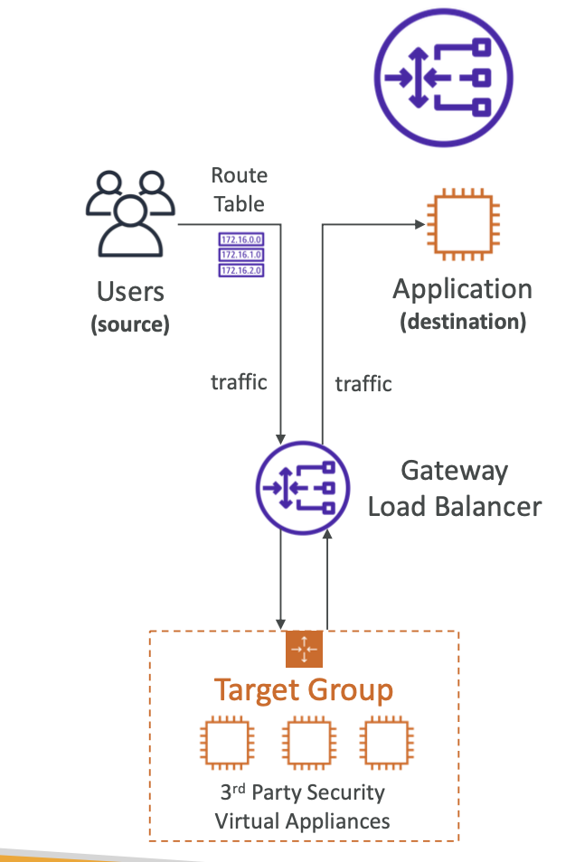
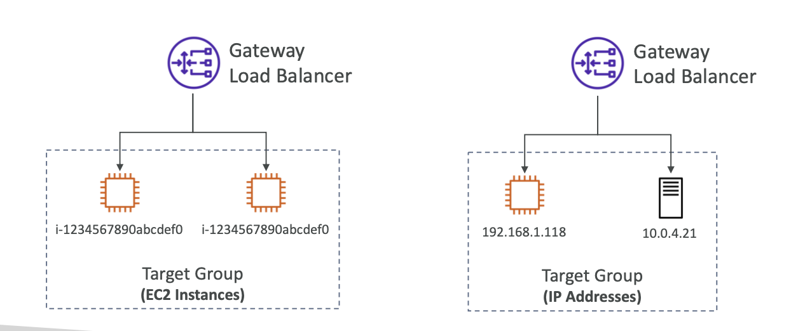

[⬅️ BACK ](./README.md)

# GWLB (Gateway Load Balancer)

## About

- AWS환경에서 타사 네트워크 가상 어플라이언스(예: 가상 방화벽, VPN 게이트웨이 등)를 배포하고,트래픽 수요에 따라 자동으로 확장하거나 축소하며, 배포된 네트워크 어플라이언스를 모니터링하고 유지,관리하는 작업
- 트래픽은 gwlb로 들어가고 서드파티 어플라이언스에서 이 트래픽에 대한 확인,검사 등의 네트워크 트래픽 분석 등을 하고 다시 gwlb로 전달된다. 그리고 application으로 전달된다.
- 아래의 다이어그램이 중요하다
  
- Lsyer3 (Network Layer) - IP packet 에서 작동한다.

### 기능

- 투명한 네트워크 게이트웨이 (Transparent Network GateWay) - VPC의 모든 traffic에 대해 단일 entry / exit
- Load Balancer - virtual appliance 에 대한 트래픽 분산

### 시험에서 본다면

- port 6081에 대해서 GENEVE 프로토콜을 사용해야 한다.
  - Generic Network Virtualization Encapsulation
  - 가상화를 위한 터널링 프로토콜
  - GENEVE 프로토콜은 기본적으로 UDP 포트 6081을 사용(다른 프로토콜과의 충돌을 방지하고 GENEVE 트래픽을 식별하기 위함)
  - UDP는 연결을 설정하지 않고 빠르게 데이터 패킷을 전달하는 전송 계층 프로토콜

### Gateway Load Balancer - Target Group

- EC2 Instance
- IP Address (must be private IP)
