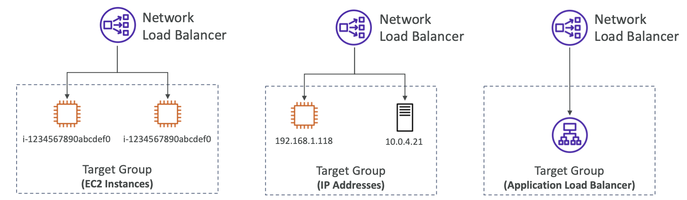

[⬅️ BACK ](./README.md)

- Network Load Balancer는 Layer 4 로드 밸런서이다.

  - TCP , UDP 트래픽을 다룰 수 있다.
  - 초당 수백만개의 요청을 처리할 수 있다.
  - 대기시간이 아주 낮다.

- AZ당 하나의 static IP(고정 IP)를 갖을 수 있고 각 AZ에 Elastic IP를 할당할 수 있다
  - 응용프로그램을 공개할 때 정적 IP는 매우 도움이 된다.
- NLB는 고성능 performance, TCP, UDP 트래틱에 사용된다.
- 고성능 TCP , UDP, 정적 ip를 보면 NLB를 생각하자
- free tier에는 사용 불가능하다
  

### Target Group

- EC2 Instance
- IP Address
- Application Load Balancer
  - NLB 다음에 오게 되면서 NLB의 고정 IP를 사용할 수 있다.
  - 그리고 ALB의 Http 유형 처리와 관련된 작업을 할 수 있다.
- 시험에서 알아야 할 것
  - nlb target group이 수행하는 health check
  - 세 개의 다른 프로토콜을 지원헌다.(TCP, HTTP, HTTPS)
