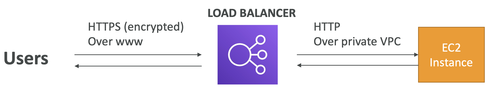
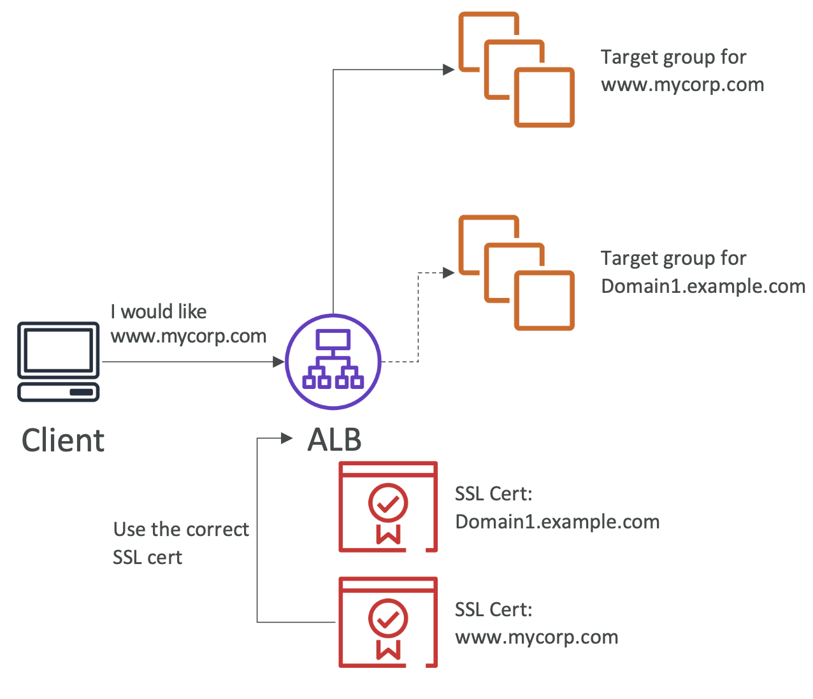

[⬅️ BACK ](../README.md)

# SSL/TLS

- SSL (Secure Sockets Layer)
- TLS (Transport Layer Security)
  - ssl의 new version

## Basics

- client와 load balancer 사이에서 암호화된 통신을 제공하는 기능이다 (in-flight encryption)
- public SSL certificates는 Certificate Authority (CA)에 의해 발급된다
- SSL certificates는 expiration date를 갖고있어서 주기적으로 갱싱해주어야 한다

### Load Balancer SSL Certificates

- User는 https를 통해 연결한다. SSL 인증서를 통해 암호화 되어있으며 load balancer의 공용 ip를 통해 로드 밸런서에 연결된다.
- load balancer는 http로 암호화되지 않은 상태로 ec2에 연결된다. 이때 private vpc 내에서 통신함으로써 안전하다
- 로드 벨런서는 X.509 certificate를 사용하여 암호화된 통신을 제공한다.
- AWS Certificate Manager(ACM)을 사용하여 인증서를 관리할 수 있다.
- 개인의 certificate를 ACM에 업로드하여 사용할 수도 있다.
- HTTPS
  - HTTPS listner를 설정할 때에는 default certificate를 설정해 주어야 한다
  - multiple domain을 사용하는 경우 인증서 목록을 추가할 수 있다
  - client는 도달해야 하는 hostname을 지정하기 위해 SNI(Server Name Indication)을 사용할 수 있다
    - SNI의 이해는 중요하다
  - 이전 버전의 SSL/TLS(레거시 클라이언트)를 지원하는 보안 정책을 지정할 수도 있다

### SNI 란? (매우 중요하다)

- Servier Name Indication
- SNI는 하나의 web server에 여러 개의 ssl certificate를 로드하는 문제를 해결해준다(다수의 website에 서비스하기 위해)
- 이것은 최신 프로토콜로, 초기 SSL handshake를 할 때 target server의 hostname을 표시하는 것을 필요로 한다. 서버는 이를 통해 맞는 certificate를 찾거나 기본 인증서를 제공한다
- 참고로 이 기능은 ALB & NLB, CloudFront에서만 작동한다

- client에서 server name은 표시하여 요청을 하면 ALB에서 그에 맞는 SSL Cert를 찾아준다.

### SSL Certificates support

#### Classic Load Banancer - 곧 deprecated

    - 하나의 인증서만 지우너한다
    - 여러 개의 인증서를 쓰려면 여러 개의 CLB를 사용해야 했다

#### Application Load Balancer / Network Load Balancer

    - 여러 개의 인증서를 사용할 수 있다
    - SNI를 통해 가능하다

### Setting

- ELB의 Secure Listners settings에서 설정할 수 있다
