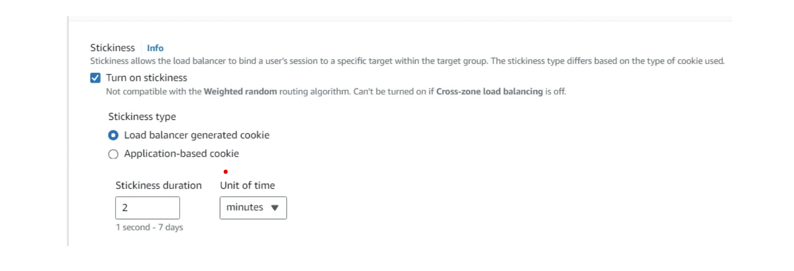

[⬅️ BACK ](./README.md)

- Sticky Session은 같은 클라이언트가 이전에 보냈던 같은 instance로 리다리엑트를 해주는 기능이다.
- Classic , Application, Network Load Balancer에서 작동한다
- stickiness에 사용되는 쿠키에는 expiration date가 있다 (참고로 NLB는 쿠키 없이 동작한다)
  - 쿠키 유효기간이 지나면 다른 instance로 리다이렉트 될 수 있다.
- 세션 데이터를 유지해야하는 경우 이 기능을 사용할 수 있다.
- 하지만 하나의 instance에 부하가 집중될 우려도 있다.

## Cookie Names

- Applicatin-based Cookie

  - Custom cookie
    - target에 의해 생성된다
    - 어떤 사용자 attribute이든 담을 수 있다.
    - cookie이름은 target grup에 따라 개별적으로 지정되어야 한다.
    - 아래와 같은 이름을 절대 사용하면 안된다
      AWSALB, AWSALBAPP, AWSALBTG - ELB에서 사용할 예약어이다
  - Application cookie
    - load balancer에 의해서 생성된다.
    - 사용하는 쿠키 이름은 AWSALBAPP 이 된다.

- Duration-based Cookie
  - loab balancer에 의해서 생성된다
  - 쿠키 네임은 AWSALB for alb , AWSELB for clb 이다.
  - 특정 기간을 기반으로 만료일을 갖는다.

### 설정하기

- aws 콘솔에서 ec2의 해당 target goup에 들어가 Actions -> Edit attributes 에서 Target selection configuration 에서 Turn on stickiness를 체크해주면 된다
- 여기에서 두 개의 타입이 있따.
