## 지난 강의

- AWS란? 기업을 위한 클라우드 플랫폼이다
- S3는
  - 정적 파일 저장소
  - CloudFront와 연동을 하여 효울적으로 고객에게 서비스를 제공
  - Data Lake로도 활용 가능하다.

## 오늘의 강의 내용 정리

### Region 과 Availability Zone 그리고 VPC에 대한 간략한 정리

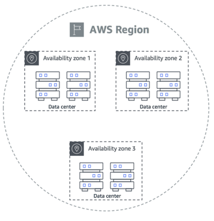

- 출처 : https://disaster-recovery.workshop.aws/en/intro/infra-aws/regions-az.html

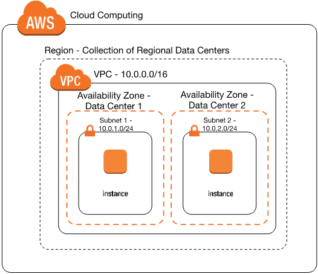

- 출처 : https://aws.amazon.com/blogs/apn/amazon-vpc-for-on-premises-network-engineers-part-one/

- Region

  - 지리적으로 분리된 물리적인 위치이며 특정 국가 및 지역에 위치한 데이터센터의 집합
  - 여러 개의 데이터센터(Availability Zone)로 구성되어 있다.
  - 각 리전은 그 지역의 법적인 규제 및 컴플라이언스 요구사항을 준수한다.
    - 예로들면 유럽의 GDPR을 준수해야한다.
  - 사용자는 자신의 요구사항에 맞는 region을 선택하여 사용할 수 있다.
  - 멀수록 지연이 있기 대문에 본인의 서비스가 많이 쓰이는 쪽의 Region을 사용하는 것이 좋다

- Availability Zone(가용 영역, AZ)

  - Region 내에서 독립적으로 운영되는 데이터세터를 의미한다
  - 각 AZ는 하나 이상의 데이터 센터로 구성되어있다.
  - 각 가용영역은 하나 이상의 데이터센터로 이루어져있고 물리적으로 분리되어있기 때문에 하나의 AZ에서 장애가 발생해도 다른 AZ에 영향을 미치지 않는다.

- 위의 그림을 보면 데칼코마니처럼 구성이 되어있다. 각 가용영역이 서로 비슷하게 구성되어있고 두 개의 리전 또한 비슷하게 구성되어있다. 이중화를 통해 가용성을 높인 것이다.

- VPC(Virtual Private Cloud)
  - 클라우드 상에서 논리적으로 분리된 가상 네트워크이다.
  - 물리적인 네트워크 인프라 없이 소프트웨어적으로 격리된 환경을 제공하여 사용자마다 독립된 네트워크 환경을 설정할 수 있다.
  - VPC는 Region 내에 생성되며 하나의 VPC는 여러 개의 서브넷으로 구성된다.

### VPC 및 보안 관련된 요어에 대해 알아보자

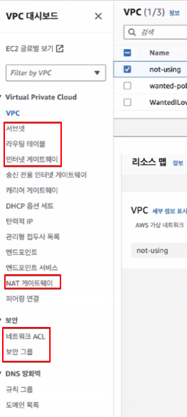

1. VPC - public subnet & private subnet

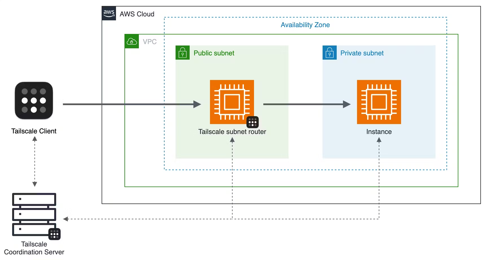

- [AWS subnet 공홈](https://docs.aws.amazon.com/vpc/latest/userguide/configure-subnets.html)
- [AWS vpc 공홈](https://docs.aws.amazon.com/vpc/latest/userguide/configure-your-vpc.html)

- subnet 이란 하나의 네트워크를 더 작은 네트워크로 나누는 것을 의미한다.

- Public Subnet

  - 외부와 통신이 가능한 서브넷이다.
  - 네트워크와 직접 연결되어있는 네크워크이다.
  - 인터넷 게이트웨이(IGW)를 통해 외부와 통신한다.
  - 외부에서 접근이 가능하기 때문에 외부 트래픽을 처리해야하는 리소스(예를 들어 웹서버, 로드밸런서)를 여기에 배치가는 경우가 많다

- Private Subnet
  - 데이터베이스 RDS나 애플리케이션 서버 EC2와같은 민감한 리소스를 배치하는 서브넷이다.
  - 외부에서 직접 접근이 불가능하다.

2. Routing Table

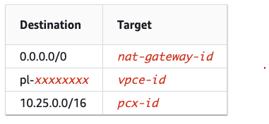

- [AWS routing table 공홈](https://docs.aws.amazon.com/vpc/latest/userguide/VPC_Route_Tables.html)

- Routing

  - routing이란 네트워크 내에서 데이터가 이동할 경로를 결정하는 것을 의미한다.
  - 네트워크 패킷(데이터)를 적적한 경로응 통해 목적지까지 전달하는 과정을 의미한다.
  - 네트워크의 각 노드가 패킷을 어느 경로로 보내야하는지 경절하는 것이 핵심이다.
  - 위의 그림에서 보듯이 목적지와 타켓을 갖고있다. 예를 들여 인터넷 게이트웨이를 통해 인터넷에 접근하려면 위와 같은 루트를 추가해야한다.

- Routing Table

  - routing table은 routing이 어떻게 정의되어 있는지를 나타내는 것이다.
  - 라우팅 테이블은 네트워크 트래픽을 어디로 보내야하는지를 규정하는 규칙들의 집합니다.
  - 서브넷은 고유한 라우팅 테이블이 있고 이 테이블에 따라 트래픽이 전달된다.

    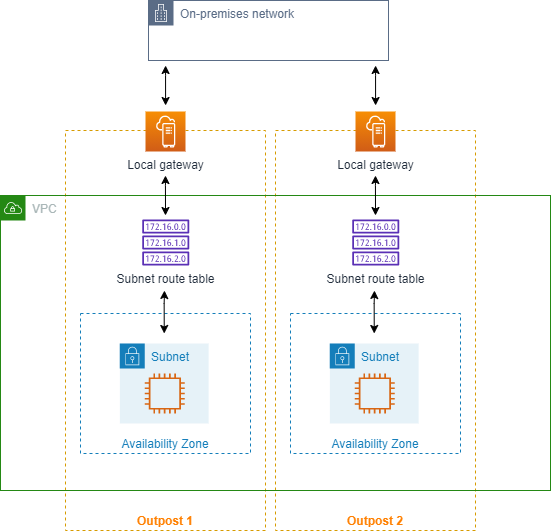

  - 예를 들어 위의 그림의 경우(위의 그림은 온프레미스 네트워크와 aws 레소스간의 네트워크 통신을 보여주고 있다) 서브넷 내에 있는 EC2같은 리소스에서 외부 네트워크로 패킷을 보낼 때 그 패킷은 라우팅 테이블을 참조하여 로컬 게이트웨이를 통해 온프레미스 네트워크로 전달된다.

3. Internet Gateway(IGW)

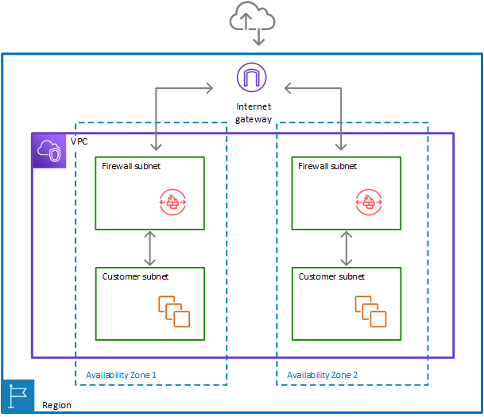

- [AWS IGW 공홈](https://docs.aws.amazon.com/vpc/latest/userguide/VPC_Internet_Gateway.html)

- Public subnet과 internet을 연결하는 네트워크 컴포넌드이다.
- igw를 통해서만 public subnet에 있는 리소스들이 외부와 통신이 가능하다.
- 참고로 라우팅 테이블에 인터넷 게이트웨이랑 퍼블릭 서비넷이 연결된다. 이는 퍼블릭 서브넷과 프라이빗 서브넷을 구분짓는 중요 요소이다.
  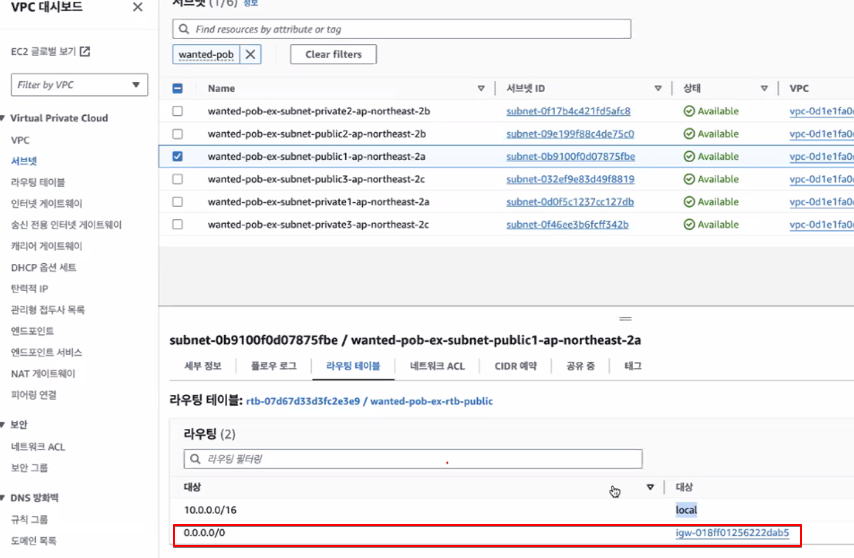

4. Nat Devices

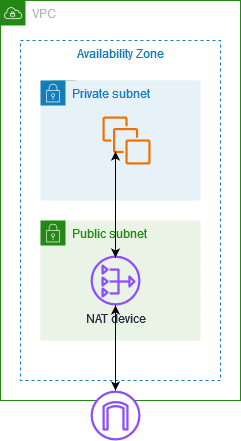

- [AWS NAT Device 공홈](https://docs.aws.amazon.com/vpc/latest/userguide/vpc-nat.html)

- private subnet을 internet과 연결하기 위한 네트워크 컴포넌트이다.
- 외부 VPC와 통신이 가능하지만 외부에서 내부로의 접근은 불가능하다.

- NAT Gateway

  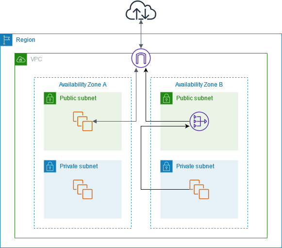

  - [NAT Agteway 공홈](https://docs.aws.amazon.com/vpc/latest/userguide/vpc-nat-gateway.html)

  - 참고로 NAT gateway는 프리티어가 없다. 개인 프로젝트에서는 고민해보자 - 퍼블릭 서브넷에 자원들을 두고 적절한 보안그룹으로도 충분하다

  - Network Address Translation(NAT)을 제공하는 서비스이다.
  - 내부 네트워크의 사설 IP주소(Private IP Address)를 공용 IP주소(Public IP Address)로 변환하여 외부와 통신이 가능하게 해준다.
  - Public subnet에 위치하여야 하며 외부와 통신이 가능하다.
  - 내부 네트워크 장치들이 공용 IP를 사용해 외부로 나가게 한다.
    - 예를들면, NAT게이트웨이를 제공하여 프라이빗 서브넷에 위치한 인스턴스들이 외부와 통신이 가능하게 한다.
  - 시간단위로 과금이 된다 ㅜ ㅜ 그러므로 사용할때 주의해야한다.
  - CIDR (Classless Inter-Domain Routing, 싸이더)
    - 네트워크 주소와 호스트 주소를 구분하는데 사용되는 IP 주소 체계이다.
    - 전통적인 클래스 기반의 IP주소 할당 방식 대신 유연한 주소 할당 방식을 제공한다.
    - 표기법 : IP주소 / 서브넷 마스크 와 같은 형식이며 이를 통해 IP주소를 네트워크와 호스트 부분으로 나눈다.
    - 예를 들여, 192.168.1.0/24는 IP주소 범위에서 네트워크 부분은 처름 24비트이고 나머지 8비트는 호스트를 위한 부분이다.
  - 내부 네트워크에서 발생한 트래픽(프라이빗 서브넷 인스턴스)이 NAT 게이트웨이를 통과할 때 NAT 게이트웨이는 인스턴스의 사설 IPv4주소를 NAT 게이트웨이의 프라이빗 IPv4로 변환한다

    - 이 변환을 통해 프라이빗 서브넷 인스터스는 외부와 연결할 수 있지만 외부에서는 내부 인스턴스의 실제 사설 IP주소를 알 수 없다. 보안 강화에 좋다

  - 사설 IP를 변환한 후 Interget Gateway를 통해 외부 인터넷과 연결된다.
    - 이때 NAT 게이트웨이의 Private IP주소는 Elastic ip로 변환된다. 이는 고정된 공용 IP주소이다.
    - 외부에서 보게되는 IP주소는 Elastic IP주소이다. 이는 항상 NAT 게이트웨이의 Private IP주소와 매핑된다.
  - 외부에서 응답이 들어오면 NAT 게이트웨이는 이 트래픽을 받아서 원래의 프라이빗 IP로 변환한다.

  - 위의 그림에 대한 설명
    - 가용 영역 A
      - public subnetdml instance는 Internet Gateway를 통해 외부와 통신이 가능하다.
      - private subnet의 Instnace는 아무런 연결이 없기 때문에 인터넷 통신이 불가능하다
    - 가용 영역 B
      - public subnet은 NAT Gateway를 포함하고있고 private subnet의 instance는 NAT Gateway를 통해 외부와 통신이 가능하다.
      - 이 private subnet instanec에서 인터넷에 접속하려고 할 때 (요청을 보낼 때) 이 인스턴스는 사설 IP를 사용하고 NAT gateway로 전달된다
      - NAT gateway에서 instance의 private ip를 Elatic UP로 변환한다
        - 이 IP는 인터넷에서 보이는 고정된 공용 IP이다.
      - 변환된 Elastic IP로 Internet gateway를 통해 외부와 통신한다.

- NAT Instance
  - NAT 인스턴스 : 직접 NAT 인스턴스를 띄워서 NAT기능을 수행하게도 할 수 있다.

5. 네트워크 ACL
   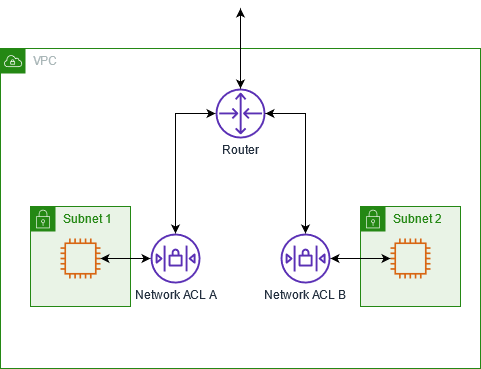

   - [AWS 공문](https://docs.aws.amazon.com/vpc/latest/userguide/vpc-network-acls.html)

   - Access Control List의 약자이다.
   - AWS VPC환경에서 서브넷 단위의 트래픽 제어에 사용된다. 네트워크 보안에 중요한 역할을 한다
   - VPC에서 `트래픽을 허용하거나 차단하는 규칙을 설정`하는 `서브넷 단위`의 보안 레이어이다.
   - 서브넷에서 들어오거나 나가는 트래필에 대해 보안 규칙을 적용한다.
   - 보안그룹(Security Gropu)이 Instance단위로 작동하는 것과 달리 네트워크 ACL은 서브넷 단위로 작동되며 서브넷을 출입하는 모든 Traffic에 대한 통제권을 갖는다.
   - `추가 요금이 없어서 쓰면 이득이다`.

   - Stateless(상태 비기만)

     - Network ACL의 중요한 특성이다. 트래픽의 상태나 연결 정보를 기억하지 않는다.
     - 따라서 들어오는 트래픽과 나가는 트래픽에 대해 각각 별도의 규칙을 설정해야한다.(Inbound, Outbound)

   - 우선순위(Rule Number)
     - Network ACL은 우선순위에 따라 평가된다. 각 규칙에는 번호가 부여되며 숫자가 낮을수록 먼저 평가된다.
     - 만약 ACL 100번 규칙이 들어오는 모든 HTTP트래픽을 허용하고 110번 규칙이 모든 트래픽을 차단한다고 했을 때 트래픽은 100번 규칙에 따라 허용된다.
   - 허용과 거부 규칙
     - 네트워크 ACL은 허용(Allow)규칙과 거부(Deny)규칙을 모두 설정할 수 있다.
     - 거부 규칙은 특정 트래픽을 차단한다. 기본적으로 ACL은 모든 Traffic을 거부하도록 설적되어있어 필요한 규칙을 추가함으로써 Traffic을 허용하게 된다.

6. 보안 그룹

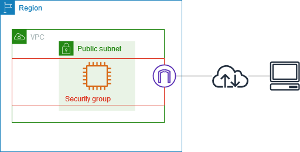

- [AWS 공문](https://docs.aws.amazon.com/vpc/latest/userguide/vpc-security-groups.html)

- 보안 그룹은 인스턴스 단위로 트래픽을 제어하는 방화벽이다.
- 보안 그룹은 해당 보안그룹이 걸려있는 Instance에 접근하고 나가는 트래픽을 제어한다.
- VPC를 만들면 default 보안그룹이 있고 새로 생성할 수도 있다.
- 보안그룹은 인바운드 규칙과 아웃바운드 규칙을 가지고 있다.
- 각 Inbound rule에 해당하는 port range, protocol을 지정할 수 있고 각 outbound rule에 해당하는 destination, port range, protocol을 지정할 수 있다.
- EC2 여러 개를 하나의 보안 그룹으로 묶던다 RDS와 EC2여러 개를 하나로 묶는다던가 할 수 있다.
- Stateful하다.

- 위의 그림 설명
  - 위의 그림은 public subnet이 있는 VPC, internet geteway, security goup, EC2 instance로 구성되어있다.
  - 보안 그룹은 instance에 할당되어있다
  - 이 보안그룹은 가상의 firewall과같은 역할을 한다
  - 이 보안그룹의 룰에 의해 허용된 트래픽만이 인스턴스로 들어오거나 나갈 수 있다.
  - 만약 보안그룹에 SSH트래픽을 허용하는 규칙이 포함되어있지 않으면 SSH를 사용하여 instance에 연결할 수 없다.

7. VPC 설정시 주의사항

- 람다를 프라이빗 서블랫 나트 게이트 만들어서 고정아이피 하나 넣고 쓰는게 좋음
- 람다는 고정아이피가 아니라서 아이피가 바뀐다
- 결제의 경우 민감해서 맞는 서버인지 확인하는 경우도 있다
- 하지만 개인 프로젝트는 퍼블릿에 자원을 두고 적절한 보안그룹으로 웬만하면 충분하다.

8. vpc 생성

- CDN은 리전을 타지 않는다
- 보안자격증명 → 사용자 → 보안자격증명 → 멀티 팩터 인증(MFA) 꼭 꼭 꼭 하자 OTP 기기 2개 정도 해두면 좋다
- 참고로 AWS에서 준 기본 VPC는 쓰지말자

  - 왜냐하면.. 뭐가 잘 안된다
  - 가용 영역들이 다 퍼블릭이다. 여기에 프라이빗 붙이고 하려면 문제 생기는 경우도 있고..
    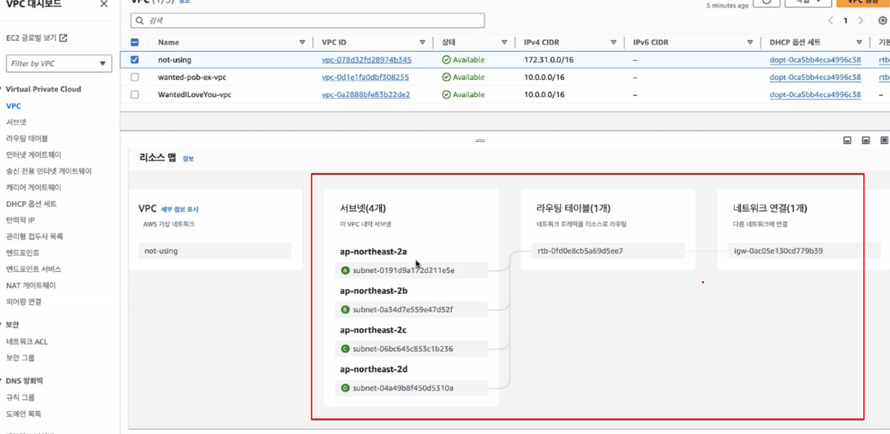

- vpc 생성시 옵션들
  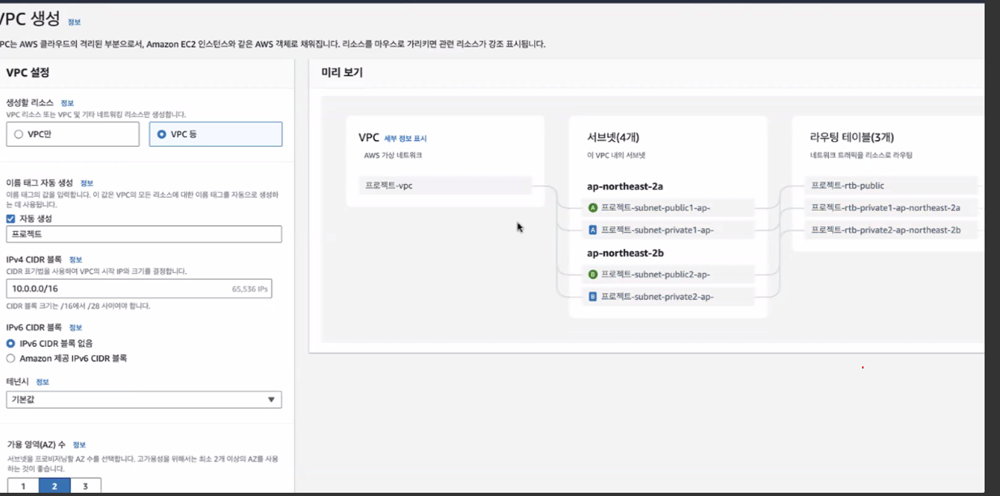

  - private 설정

    - 혼자 쓸 때에는 프라이빗 아예 안쓰거나 적게 쓰는 것 추천
    - NAT gate는 돈이 드니까 개인 프로젝트로는 안쓰는게.. 시간당 100원

  - 0.0.0.0/16

    - 네트워크 주소 IP주소가 별로 없으니까 사설 네크워크 안에서 다시 붙여주는 것 0.0.0.0/16

  - VPC 엔드포인트는 돈 안든다
    - VPC내에 EC2에서 S3를 사용할 수도 있는데 있으면 추가적인 네트워크 안들어서 이득이다

- vpc의 라우팅 테이블을 보면 igw가 있다면 public이다
  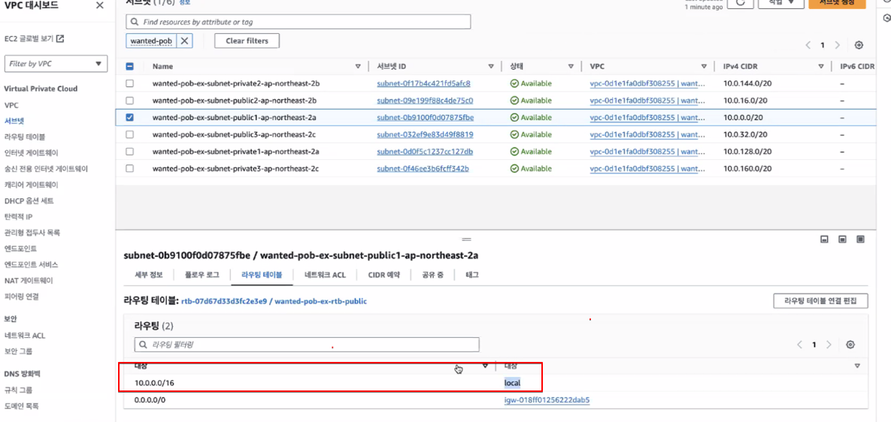

- private은 아래와 같이 모든 트래픽이 nat gateway랑 연결된다.
  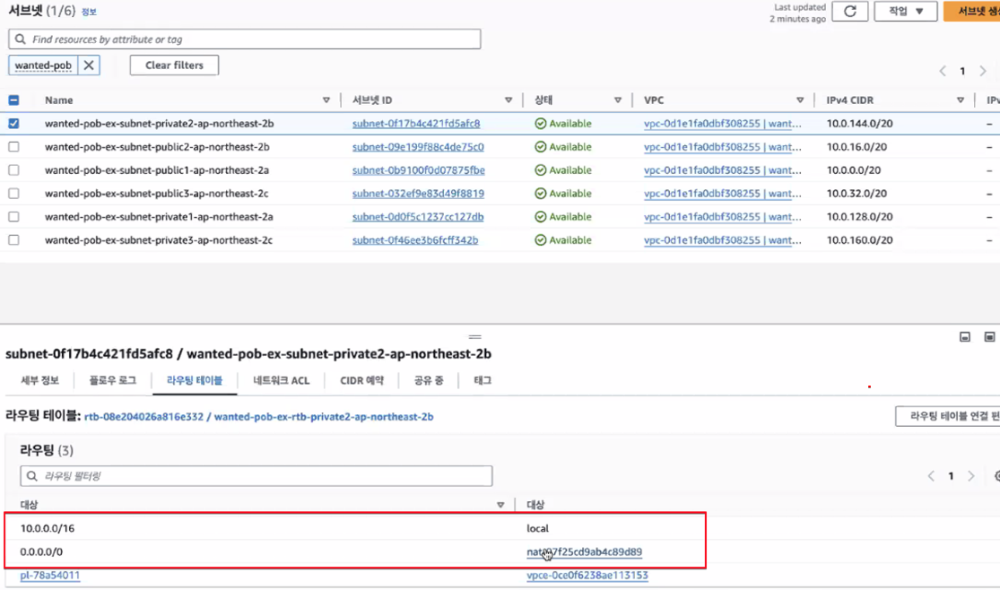

9. 강의 중 질문 내용 정리

- 프라이빗 서브넷은 어떤 상황에서 사용하는가?
- NAT 게이트웨이가 없어도 public subnet과 private subnet이 연결이 되는가?
  - 같은 VPC 내에서, 특히 같은 AZ에 있는 서브넷들 간에는 로컬 네트워크를 통해 NAT 게이트웨이 없이도 직접적으로 통신이 가능하다.
- 그럼 NAT gateway없어도 퍼블릭에서 요청을 받고 프라이빗으로 넘겨줄 수도 있는 것 아닌가?
  - 가능하다. 퍼블릭 서브넷에 있는 웹 서버가 클라이언트로부터 요청을 받는다.
    이 요청이 프라이빗 서브넷에 있는 데이터베이스 서버로 전달되어야 한다면, 로컬 네트워크를 통해 NAT 게이트웨이 없이도 직접 통신이 가능하다.
- 베스천서버란?

  - **베스천 서버(Bastion Server)**는 **외부 네트워크**와 내부 네트워크(프라이빗 서브넷 또는 내부 서버) 간의 보안 통로 역할을 하는 서버이다. 프라이빗 서브넷에 있는 서버들에 안전하게 접근할 수 있도록 돕는 역할을 한다.

  - 베스천 서버는 퍼블릭 서브넷에 배치되어 공용 IP를 가지고 있기 때문에 외부에서 직접 접근할 수 있다.
    이를 통해 외부 사용자가 프라이빗 서브넷에 직접 접근하지 않고, 먼저 베스천 서버에 접속한 후, 내부 네트워크의 다른 서버로 이동할 수 있게 한다.
  - SSH나 RDP를 통해 원격 접속할 때, 보안상 민감한 서버나 데이터베이스는 직접 인터넷과 연결하지 않고, 베스천 서버를 통해서만 접근할 수 있게 함으로써 보안이 강화된다.
    이는 네트워크 경계를 하나 더 추가하여, 불필요한 인터넷 접근을 차단하고 내부 서버로의 직접적인 접근을 막는다.ㄴ

  - 사용 시나리오:

  보통 관리자가 베스천 서버에 접속한 후, 내부 프라이빗 서브넷에 있는 인스턴스들로 SSH 또는 RDP 세션을 열어 원격으로 관리할 수 있다.

  - 동작 과정:
    - 외부 사용자가 베스천 서버에 SSH 또는 RDP로 접속
    - 베스천 서버는 프라이빗 서브넷 내의 다른 인스턴스에 접근하기 위한 중간 통로 역할을 한다
    - 내부 서버로의 접속은 베스천 서버를 경유함으로써, 외부에서 직접 프라이빗 서브넷에 접근하는 위험을 방지
