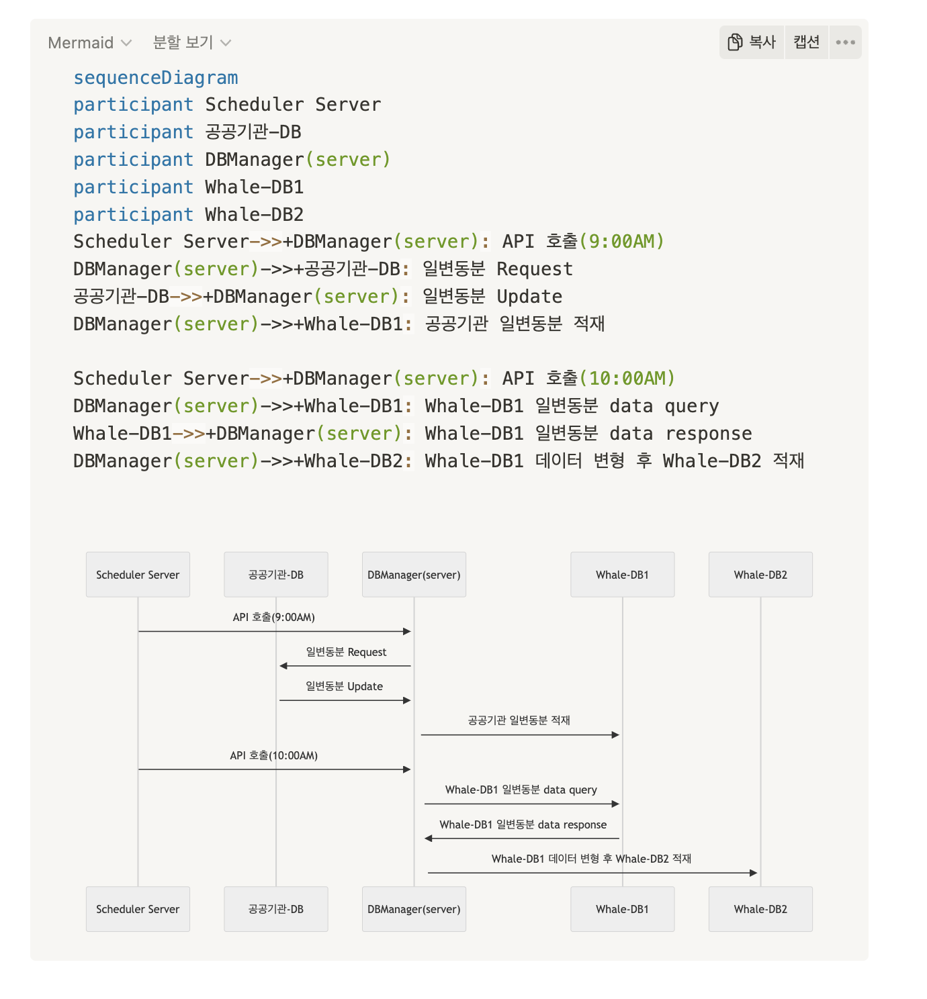

# 개요

Whale 프로젝트는 사용자에게 주소 검색 결과를 제공하는 서비스이다. 이 프로젝트를 진행하며 발생한 Heap Memory Issue에 대해 정리합니다.

# About JS Heap Memory

Node.js는 V8 엔진을 사용해 JavaScript를 실행한다. V8 엔진은 JavaScript 코드 실행을 위해 Heap Memory를 할당한다. Node.js 애플리케이션에서 할당된 Heap Memory를 초과할 경우 'JavaScript heap out of memory' 오류가 발생한다. 이 오류는 애플리케이션이 많은 메모리를 사용할 때, 특히 기본 힙 크기가 충분하지 않을 때 나타난다.

# ISSUE 발생 및 해결

### 1. ISSUE 발생

Whale은 두 개의 서버로 구성된다. 하나는 주소검색을 담당하는 api 서버이고 다른 하나는 dbmanager 라고 불리는 데이터를 생성하고 업데이트하는 작업을 하는 서버이다.
dbmanager는 공공기관의 일변동분을 가져와 내부적으로 데이터를 가공하는 작업을 거쳐서 최종적으로 database에 저장하는 작업을 한다.
매일 아침 9시부터 시작하여 약 세 번의 작업을 수행하는데, 이 작업을 수행하는 도중에 Heap Memory Issue가 발생했다.

dbmanager의 스케줄러 아키텍처를 간량하게 그려보자면 아래와 같다.



일 변동분이란 공공기관에서 제공하는 데이터로, 주소가 변경되거나 새로운 주소가 추가되는 경우에 해당 데이터가 업데이트된다.
일반적으로 일 변동분이 많은 경우 몇 백건 ~ 몇 천건 정도이지만 시/도 단위로 데이터가 변경되는 경우 몇백만개의 데이터가 한 번에 들어오게 된다.
가령 강원도 -> 강원틀별자치도 변경 이라던가 전라북도 -> 전북틀벽자치도 변경과 같은 경우에 해당된다. 이 경우엔 기존의 데이터가 삭제되고 전부 새로운 도로명코드로 생성되게 되는데 모든 전북 또는 강원 데이터의 두 배가 변동분으로 들어오게 되는 것이다.

2023년 06월에 강원도가 강원특별자치도로 변경되었을 때, 이 변동분이 들어오면서 dbmanager에서 Heap Memory Issue가 발생하면서 dbmanager 서버가 재시작되는 이슈가 있었다.

### 2. 원인 분석

첫 번째로 공공기관 DB에서 axios를 통해 가져오는 과정에는 문제가 없었지만 Whale-DB1에서 read를 하는 과정에서 out of heap memory issue가 발생했다.

두 번째 경우로는 데이터 가공 후 Whale-DB2에 write를 하는 과정에서 out of heap memory issue가 발생했다.

첫 번째 경우 Whale-DB1에서 read를 할 때 한 번에 쿼리를 해서 가져오는 과정에서 발생하였고 두 번째 경우 write을 할 때 트랜젝션 유지를 위해(데이터의 일관성과 무결성을 유지하기 위해) promise.all로 처리를 하였는데 이 때 발생하였다.

Promise.all은 모든 프로미스가 완료될 때까지 결과를 메모리에 하기때문에 대량의 데이터를 넣을 때 문제가 되었었다.

원인을 종합해보면 대량의 데이터를 한 번에 처리하면서 메모리 부족 문제가 발생했다.

### 3. 해결 방안

먼저 첫 번째 문제를 해결하기 위해 Cursor 기반 배치처리를 도입하여 데이터를 분할로딩을 하도록 구현하였다. 간략하게 코드를 보면 아래와 같다.
pg-cursor 를 사용하여 배치처리를 하여 read를 하도록 하였다.

```js
    const Cursor = require('pg-cursor');
    // get query를 batch로 가져오는 batchProcess
    const readBatchProcess = async (insertSize, query, preProcessFunc) => {
       ... 생략
      return new Promise((resolve, reject) => {
        const fetch = () => {
          dataCursor.read(insertSize, async (err, rows) => {
            if (err) {
              await dataCursor.close();
              await _disconnectDB(client);
              reject(err);
            }

            if (!rows?.length) { // 더 이상 처리할 데이터가 없을 경우
              await dataCursor.close();
              await _disconnectDB(client);
              resolve(result);
            } else {
              let dataList = rows ? [...rows] : [];
              if (preProcessFunc) {
                // Data 전처리
              }
              result.data.push(...dataList);
              fetch();
            }
          });
        };
        fetch();
      });
    };

```

두 번째 문제를 해결하기 위해 Promise.all 대신에 청크 단위로 처리하는 방식을 도입하여 메모리 부족 문제를 해결하고 서버의 안정성을 강화했다.

```js
while (data?.length > 0) {
  const chunk = data.splice(0, insertLimit);

  const options = {
    updateOnDuplicate: data,
    returnless: true,
  };
  await address.createAddress(chunk, options);
}
```

물론 문제가 되는 부분은 transaction를 하지 않았다는 점이다. 추가 구현을 통해 page 등의 인덱스를 관리해서 실패한 부분부터 다시 진행하도록 처리하자는 의견을 냈지만 공공데기관 데이터 쪽에 문제가 없지 않는 이상 애러가 발생하는 경우 대비 로직의 복잡성이 늘어날 것 같다는 의견이 있었고 내부 논의 결과 데이터 업데이트시 애러가 발생하면 그 날 업데이트분을 전부 삭제 후 다시 업데이트하는 방식으로 처리하기로 결정하였다.

개발 완료 이후 6개월간의 모니터링을 하였지만 이슈는 아직 발생하지 않았다.

하루에 한 번만 도는 로직이기도 하고 유지보수가 쉽기 때문에 괜찮을 것 같지만 여유가 있다면 트랜젝션을 도입하여 안정성을 더 강화하는 것도 좋은 방법이라고 생각한다.
