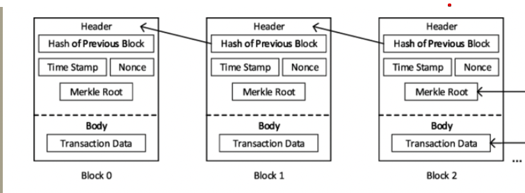
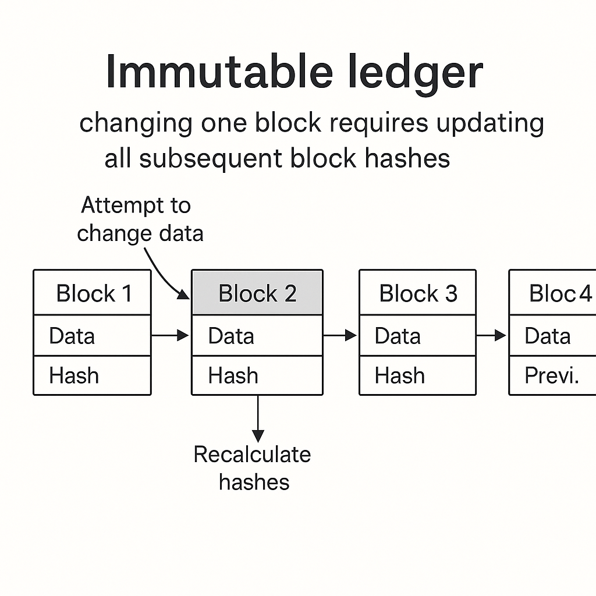
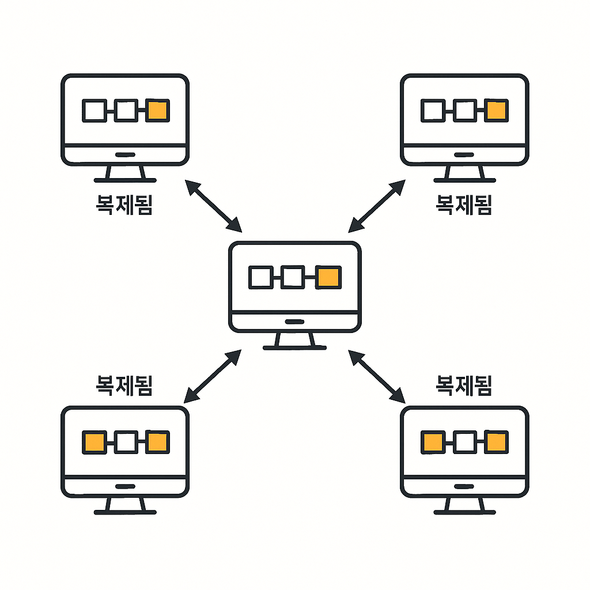
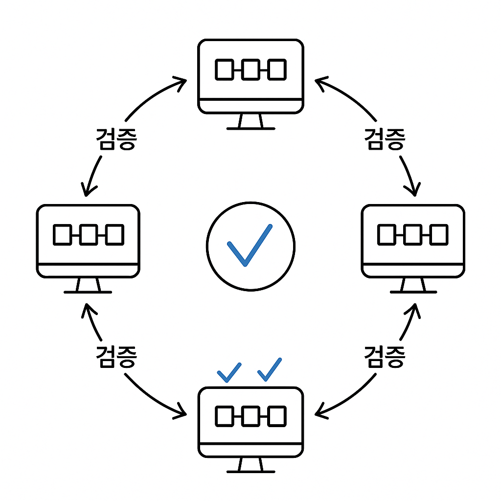
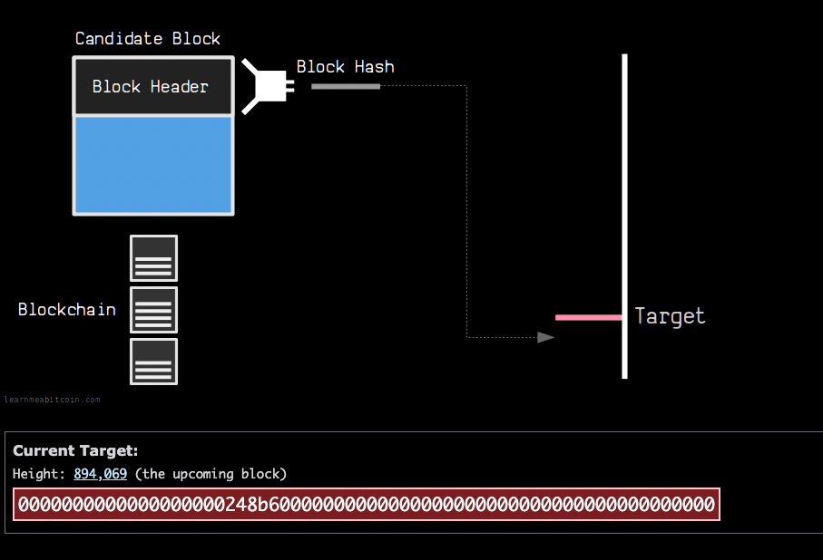

# Section3 - Intuitive understanding of blockchain

## What is blockchain



- What is a Blockchain
  - a blockchain is a continuously growing list of records
  - Block의 구성
  - data, prev.hash, hash 로 구성된다.
  - 이전 블록에 대한 hash를 참조하고 있고, 현재 블록의 hash를 생성 할 때에도 이전 블록의 hash도 data로 사용된다.
  - 이렇게 블록끼리 연결된 구조이기 때문에 블록체인이라고 부른다.

## Understanding sha 256

- 64길이 해시의 문자는 각각 4비트를 차지함 64\*4 = 256
- 5 requirements for hash algorithms
  - one-way (단방향)
  - deterministic (같은 것은 무조건 헤시 값이 같아야한다)
  - fast computation( 해싱이 빨라야함)
  - the avalanche effect(쇄도 효과)
    - 아주 작은 변화에도 해시값은 완전히 달라야한다
    - must withstand collisions 충돌 저항성
      - 알고리즘이 인위적인 충돌에 견딜 수 있어야 함을 의미한다.

## Immutable Ledger



- 한 블록의 내용을 변경하는 것은 매우 어렵다. 연결되어있는 다른 블록들의 헤시 내용도 모~두 변경되어야 하기 때문이다. 이런 특성 때문에 불변 원장이라고 한다
- 한 블록(Block2)의 데이터를 변경하려면 해당 블록의 헤시 뿐 아니라 이후에 연결된 모든 블록들의 이전 헤시를 다시 계산해야 한다.
- 위와 같이 연결된 모든 블록의 헤시를 수정해야하기 때문에 블록체인은 불변성을 갖느다.
- 이런 특징으로 신뢰성이 중요한 경우 추적이 필요한 경우 아주 적합하다.
- 읽을 거리

  - 초보자를 위한 제도적 암호화폐 경제의 안내서
    - https://medium.com/cryptoeconomics-australia/the-blockchain-economy-a-beginners-guide-to-institutional-cryptoeconomics-64bf2f2beec4
    - 이 글은 블록체인이 단순한 화폐가 아니며 거래 내역의 불변성을 보장하는 원장 기술로서 어떻게 작동하는지, 기업, 정부 탈중앙 조직등 다양한 제도를 혁신할 수 있는 가치임을 설명한다.

- Q. 그런데 이 블록체인 데이터들의 원본은 어디에 저장되는 것일까?
  - 블록체인이 어디에 어떻게 저장되는지는 아래에서 알아보자

## Distributed p2p network

- 아래의 두 가지에 대해 질문할 수 있다
  - 만약 악의적인 누군가가 데이터를 변경하고 시간을 들여 모든 연결된 블록들을 변경한다면 위조가 되는 것이 아닐까?
  - 만약 데이터를 수정했는데 시스템 오류가 나는 경우 어떻게 복원을 하는가?
- 블록체인은 P2P 네트워크로 구성된다.
- 분산된 모든 컴퓨터에 블록체인이 모두 복사되어있다. 하나의 컴퓨터에서 블록을 추가하면 네트워크를 통해 모든 블록이 똑같이 복제된다.



- 블록체인은 끊임없이 피어가 일치하는지 확인한다(피어간 일관성 검증)
  - 서로의 데이터를 검증하며 합의 메커니즘(Consensus Machanism)의 일부로 작동한다.
  - 이를 통해 문제가 있는 컴퓨터에 다른 컴퓨터들이 신호를 보낸다.
    
    - 만약 어떤 노드의 데이터가 다른 노드들과 다르다면, 네트워크는 즉시 감지한다.
  - 문제가 있는 노드는 다른 노드들의 데이터를 받아서 자동복구를 한다.
  - 해커가 조작을 하려면 모든 블록체인을 동시에 공격해야 가능해진다.
    - 헤커가 블록체인을 조작하려면 다은 네트워크의 51% 이상을 동시에 공격해야한다.
- 다수가 합의를 하였기 때문에 서로 신뢰가 가능하다.

- Q. 블록체인의 크기는 많이 크지 않나? 하나의 컴퓨터가 다 들고있지 못하는 상황이 존재하지 않을까?

- 읽을 거리
  - https://medium.com/@VitalikButerin/the-meaning-of-decentralization-a0c92b76a274

## How to mining works

- 어떻게 여러 트랜잭션을 한 블록에 넣는가?
- Block의 구성은 블록 번호, Nonce, Data, prev.hash, Hash 로 구성된다.

```
Block :#3
Nonce : 한 번만 사용되는 숫자
Data :
    - kirill → hadelin 500 hadcoins
    - kirill → Ebay 100 hadcoins
    - Hadline → Joe 700 hadcoins
prev.hash : 0000DF~
Hash : Block number, Nonce,data , prev hash를 해싱 알고리즘에 넣어서 도출
```

- 채굴자들은 nonce를 바꿔가면서 target에 맞는 헤시를 지속적으로 찾는다.(무차별 대입)

  - 헤시를 찾으면 블록을 블록체인에 추가할 수 있는 것이다. 그리고 보상을 받는다.

- target이란?
  
  - target이란 채굴자가 찾아야 하는 해시값의 기준이다.
  - target은 채굴 난이도를 조절하는 값이다.
  - 하드웨어 기술이 좋아져 블록이 너무 빠르게 생성되면 난이도를 조절한다.
  ```
  To compensate for increasing hardware speed and varying interest in running nodes over time, the proof-of-work difficulty is determined by a moving average targeting an average number of blocks per hour. If they're generated too fast, the difficulty increases.
  Satoshi Nakamoto, Bitcoin Whitepaper
  ```
  - 참고 설명 https://learnmeabitcoin.com/technical/mining/target/
  - 해시가 target보다 작아야만 블록을 볼록체인에 추가할 수 있다.
- 선행제로란?(Leading Zero)
  - 해시 값의 맨 앞 부분에 연속적으로 나타나는 0의 개수를 의미한다.
  - 유효한 해시는 특정 개수의 선행제로를 가져야만 한다.
  - Target이 요구하는 조건이 해시의 앞 10자리가 0으로시작 이라고 한다면, 채굴자는 논스를 계속 바꿔가면서 해시를 계산하여 이 조건을 만족하는 값을 찾아야만 한다.
  - 더 많은 선행제로가 요구될수록 유효한 헤시를 찾는 난이도가 높아간다.
