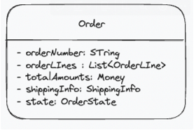

# 책 내용 정리

## 1.3 도메인 모델

- 도메인 모델은 도메인 자체를 이해하기 위한 개념모델이다. 도메인을 이해하는데 도움이 된다면 어떤 표현 방식이든(UML이든 상태 다이어그램이든) 상관없다.
- 하위 도메인과 모델
  - 하위 도메인을 공유하면 안된다. 예를들어 카탈로그 도메인의 상품과 배송 도메인의 상품은 다르다. 그러므로 하위 도메인은 모델을 따로 만들어야 한다.
- 개념 모델과 구현 모델
  - 개발을 하면서 도메인을 포현하는 모델은 변경될 수 밖에 없다.
  - 프로젝트 초기에는 개요 수준의 개념 모델로 도메인에 대한 전체적인 윤곽을 이해하는데 집줄하고, 구현 과정에서 개념 모델을 구현 모델로 점진적으로 발전시켜 나가야 한다.

### 1.4 도메인 모델 패턴

- 일반적인 애플리케이션의 아키텍처
  표현 | 응용 | 도메인 | 인프라스트럭처 | 데이터베이스
  | 영역 | 설명 |
  | ------------------------------- | ---------------------------------------------------------------------------------------- |
  | presentation(사용자 인터페이스) | 사용자의 요청을 처리하고 사용자에게 정보를 보여줌. 사용자는 외부 시스템일수도 사람일수도 |
  | Application(응용) | 사용자가 요청한 기능을 실행, 업무 로직을 직접 구현하지 않음, 도메인 계층을 조합해서 기능을 실행|
  | Domain | 시스템이 제공할 도메인 규칙 |
  | Infrastructure | 데이터베이스, 메시징 시스템과 같은 외부 시스템과의 연동 |

  - 여기서 도메인 모델은 도메인 자체를 이해하는데 필요한 모델이 아닌 마틴파울러의 - 엔터프레이즈 애플리케이션 아키텍처 패턴 의 도메인 모델을 의미
  - 도메인 계층을 객체지향 방법으로 구현한 패턴을의미함
  - 예를 들면 주문 도메인의 경우 아래 두 가지의 규칙은 주문 도메인계층에서 구현되어야 한다.
    - 출고 전에 배송지를 변경할 수 있다
    - 주문 취소는 배송 전에만 할 수 있다
  - 규칙이 바뀌거나 규칙을 확장해야할 때 다른 코드에 영향을 덜 주고 모델을 반영할 수 있다.

### 1.5 도메인 모델 도출

- 요구사항을 통해서 도출한다.
- 아래의 요구사항을 통해 `주문 항목`이 어떤 데이터로 구성되어있는지 뽑아낼 수 있다.

  - 요구사항
    - 한 상품은 한 개 이상의 주문을 할 수 있다.
    - 각 `상품`의 구매 `가격 합`은 `상품 가격`에 `구매 개수`를 곱한 값이다
  - 코드

    - OrderLine은 적어도

    ```java
    public class OrderLine {
        private ProductId productId;
        private Money price;
        private int quantity;
        private Money amounts;

        public OrderLine(ProductId productId, Money price, int quantity) {
            this.productId = productId; // 상품
            this.price = price; // 가격
            this.quantity = quantity; // 구매 개수
            this.amounts = calculateAmounts(); // 합
        }

        private Money calculateAmounts() {
            return price.multiply(quantity);
        }

        public Money getAmounts() {
            return amounts;
        }
    }
    ```

- 아래의 요구사항으로 Order와 OrderLIne의 관계를 알 수 있다
  - 요구사항
    - 최소 한 종류 이상의 상품을 주문해야 한다. → Order는 최소 한 개 이상의 OrderLine을 포함해야한다
    - 총 주문 금액은 각 상품의 구매 가격 합을 모두 더한 금액이다. → 총 주문 금액은 OrderLine에서 구할 수 있다
- 이런식으로 요구사항을 통해 각 도메인모델에서 가져야 할 제약 등을 정할 수 있다.

### 1.6 엔티티와 벨류

도메인 모델을 크게 에티티와 벨류로 구분된다. 이를 제대로 구분해야 도메인을 올바르게 설계하고 구현할 수 있다.

- 엔티티
  - 가장 큰 특징은 식별자를 갖는다는 것이다.
  - 예를 들면 주문 도메인에서 각 주문은 주문번호를 갖고 이는 유일하다.
    
  - 식별자를 만드는 방법들로는
    - 특정 규칭에 따라 생성
    - UUID나 Nano ID와 같은 고유 식별자 생성기 사용
    - 값을 직접 입력 (사용자가 직접 이메일을 입력한다던지)
    - 일련변호 사용(database의 자동 시퀀스)
- 값(벨류타입)

  - 벨류 타입은 개념적으로 완전한 하나를 표현할 때 사용한다
  - ShippingInfo는 받는 사람과 주소에 대한 데이터를 갖고있다
    ```java
    public class ShippingInfo {
        private String receiverName;
        private String receiverPhoneNumber
        private String shppingAddress1;
        private String shppingAddress2;
        private String shppingAddress3;
    }
    ```
  - receiverName, receiverPhoneNumber 은 개념적으로 ‘받는사람’ 이라는 하나의 의미가 들어있다
  - address들도 개념적으로 주소라는 하나의 개념을 포함한다.
  - 이를 receiver라는 벨류 타입과 address라는 벨류타입으로 표현할 수 있다

    ```java
    public class Receiver {
        private String name;
        private String phone;

        public Receiver(String name, String phone) {
            this.name = name;
            this.phone = phone;
        }

        public String getName() {
            return name;
        }

        public String getPhone() {
            return phone;
        }
    }

    public class Address {
        private String zipCode;
        private String address1;
        private String address2;

        public Address(String zipCode, String address1, String address2) {
            this.zipCode = zipCode;
            this.address1 = address1;
            this.address2 = address2;
        }
    }
    ```

  - 벨류타입을 사용해서 ShippingInfo class를 다시 구현하면 아래와 같다
    ```java
    public class ShippingInfo {
        private Receiver receiver;
        private Address address;
    }
    ```
  - Money 라는 벨류 타입을 정의할 수도 있다 또 벨류 타입을 위한 기능을 추가할 수도 있다

    ```java
    public class Money {
    		private int value;

    		... 생성자, getValue()

    		// Money타입을 위한 기능 추가(돈계산 이라는 기능을 추가할 수 있다)
    		public Money add(Money money) {
    				return new Money(this.value + money.value)
    		}
    ```

    - set을 하는 메서드가 없는 것을 불변객체라고 한다. 불변객체는 참조 투명성과 스레드 안전한 특성을 갖고있다.

  - 벨류 타입을 이용해서 식별자 타입으로 사용하면 의미가 확실해진다. 예를들여 주문번호를 String id라고 하면 이게 주문번호인지 모를 수 있다. 하지만 벨류타입을 OrderNo 타입으로 하면 식별이 쉽다.

- 도메인 모델에 get/set 메서드를 무조건 추가하는 것은 좋지 않다.

  - set 은 도메인의 핵심 개념, 의도를 코드에서 사라지게 한다
    - 예를들어 setOrderState()는 단순 상태 값만 변경하는지, 아니면 상태에 따른 처리도 같이 변경되는지 애매하다 → 상태 변경과 관련된 도메인 지식이 코드에서 사라지게된다.
  - 또한 set 메서드는 도메인 객체를 생성할 때 온전하지 않은 상태가 될 수 있다.

    - 예를 들어 set 메서드로 데이터를 전달하도록 한다면 set 메서드로 모든 값을 전달해야한다.

      ```java
      Order order = new Order();

      // set 으로 모든 데이터를 전달해야한다.
      order.setOrderLine(lines);
      order.setShippingInfo(shippingInfo);

      // 주문자(orderer)를 설정하지 않은 상태로 주문 완료 처리
      order.setSate(OrderState.PREPARING);
      ```

  - 이런 방법보다는 생성자로 필요한 것을 모두 받고 생성자를 호출하는 시점에 필요한 데이터가 올바른지 검사할 수 있다

    ```java
      public Order(OrderNo number, Orderer orderer, List<OrderLine> orderLines,
                     ShippingInfo shippingInfo, OrderState state) {
            setNumber(number);
            setOrderer(orderer);
            setOrderLines(orderLines);
            setShippingInfo(shippingInfo);
            this.state = state;
            this.orderDate = LocalDateTime.now();
            Events.raise(new OrderPlacedEvent(number.getNumber(), orderer, orderLines, orderDate));
        }

        private void setNumber(OrderNo number) {
            if (number == null) throw new IllegalArgumentException("no number");
            this.number = number;
        }

        private void setOrderer(Orderer orderer) {
            if (orderer == null) throw new IllegalArgumentException("no orderer");
            this.orderer = orderer;
        }
    ```

    - 여기서 set 메서드는 private으로 외부에서는 접근할 수 없다.
    - 각 set 메서드에서는 데이터가 올바른지 검사하는 로직이 있다.

### 1.7 유비쿼터스언어

- 코드를 작성할 때 도메인에서 사용하는 용어가 코드에 들어가야한다. 그렇지 않으면 코드의 의미를 해석하는데 어려움이 있음
- 시간이 지날수록 도메인 지식이 높아지는데 새롭게 이해한 내용을 잘 표현할 수 있는 용어를 찾아내고 이를 다시 공통의 언어로 만들어 다같이 사용해야한다
- 도메인 전문가 - 기획사 - 개발자 간의 소통을 위함이기도하다. 이를 통해 도메인의 핵심 내용이 코드에 잘 스며들 수 있다.

---

# 요약

- 도메인 모델은 도메인 자체를 이해하기 위한 모델이다.
- 도메인 모델을 만드르 때 한 번에 완벽하게 만들기보다는 점진적으로 발전시켜 나가는 것이 좋다. (도메인 지식이 시간이 지날수록 높아지기 때문)
- 문서화를 하자
- 도메인 모델은 엔티티와 벨류로 구분된다. 엔티티는 식별자를 갖는다. 벨류는 개념적으로 완전한 하나를 표현할 때 사용한다.
- 도메인 모델에 get / set 은 좋지 않다. 생성자로 필요한 것을 모두 받고 생성자를 호출하는 시점에 필요한 데이터가 올바른지 검사할 수 있다.
- 도메인 모델은 요구사항으로부터 도출된다. 어떤 제약사항이 어떤 도메인 모델에서 구현되어야 하는지, 해당 도메인에 어떤 메서드와 필드가 필요한지 요구사항을 통해 도출해 내야 한다.
