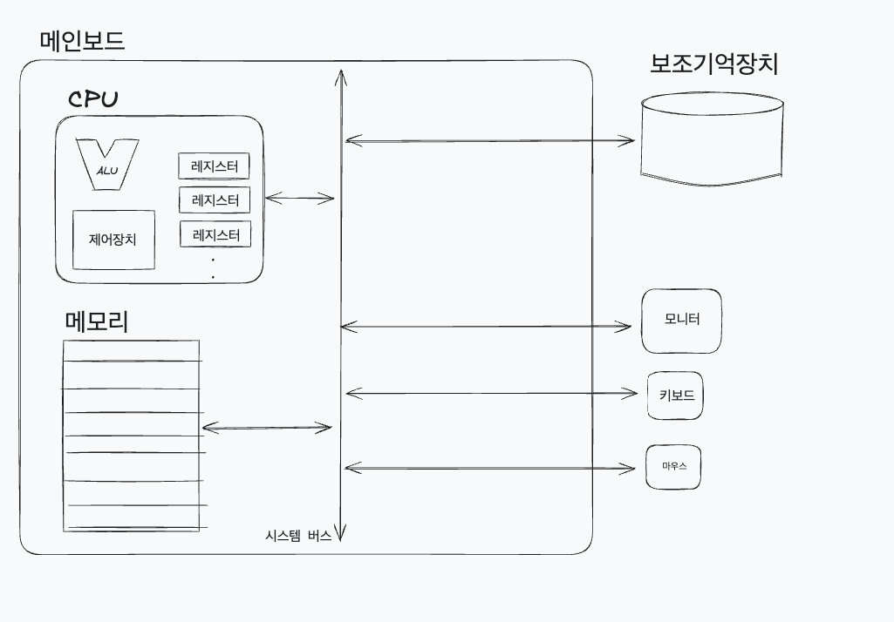
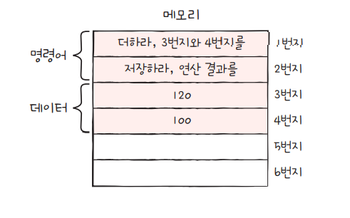
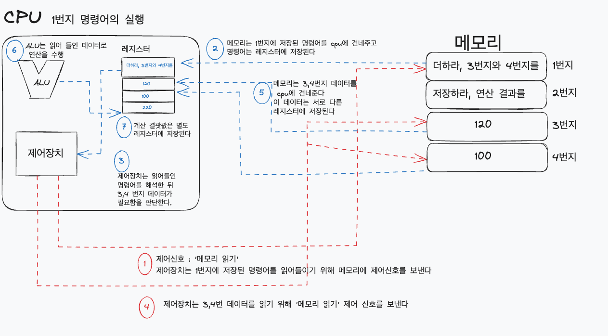
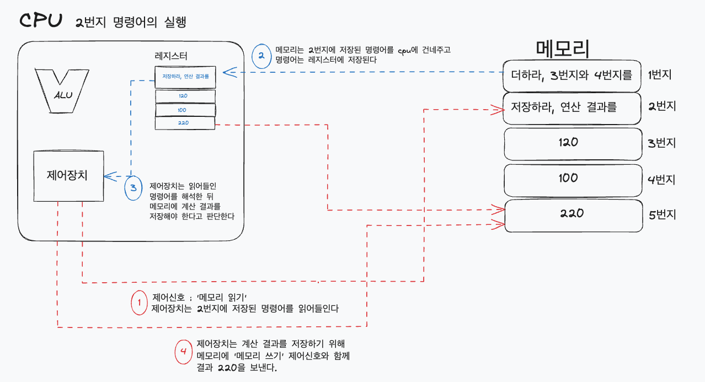
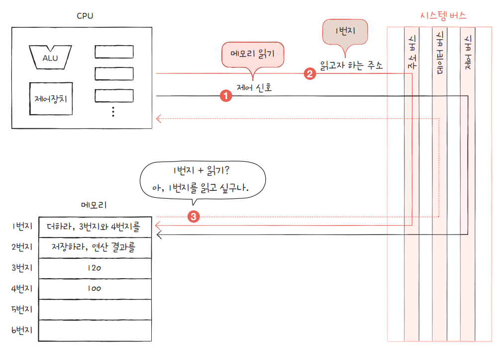
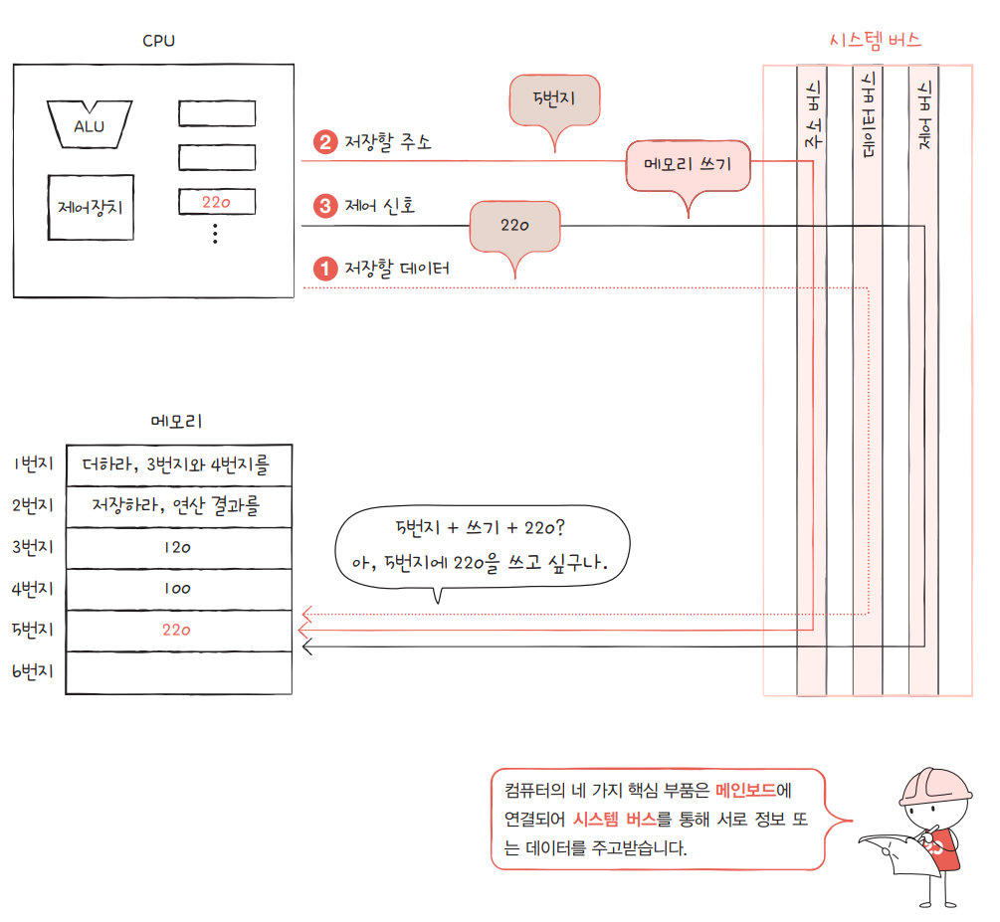

[⬅️ BACK ](./README.md)

## 컴퓨터 구조를 왜 알아야 하나?

- 컴퓨터 구조를 이해하고 있다면 문제 상황을 빠르게 진단하고 문제 해결의 실마리를 다양하게 찾을 수 있다
- 채용 공고에서도 이런 역량을 왕왕 요구한다
- 클라우드든 온프레미스든 서버 컴퓨터를 선정할 때 성능,용량 선정에 대한 고민이 생긴다. 이는 비용과도 연관이 있다.
  - 어떤 CPU를 사용할지 어떤 메모리를 사용할지, 어떤 저쟝용량을 사용할지 등
- 즉, 컴퓨터 구조를 아는 것은 성능, 용량, 비용 까지 고려하여 개발하는데 도움이 된다.

## 컴퓨터 구조의 큰 그림

- 컴퓨터를 한 마디로 정의 : 컴퓨터는 사용자가 입력한 명령을 받아 0,1로 이루어진 형태로 변환하여 명령을 수행하고 그 결과로 데이터를 출력하는 기계

- 컴푸터의 구조
  - 컴푸터가 이해하는 정보
    - 데이터
    - 명령어
  - 컴퓨터의 네 가지 핵심 부품
    - 중앙처리장치(CPU)
    - 주기억장치(main memory)
      - RAM(Random Access Memory)
      - ROM(Read Only Memory)
    - 보조기억장치(secondary memory)
    - 입출력장치(I/O devices)

- 메모리

  - 프로그램이 실행되기 위해서는 메모리에 올라가야 한다.
  - 메모리는 현재 실행되는 프로그램의 명령어와 데이터를 저장한다
  - 메모리에는 빠르게 접근하기 위해 `주소`라는 개념을 사용한다
    
    - 주소로 메모리 내 원하는 위치에 접근한다.

- CPU

  - 메모리에 저장된 명령어를 읽고 해석하여 실행하는 부품
  - 크게 산술논리연산장치(ALU : Arithmetic Logic Unit), 레지스터(register), 제어장치(control unit)로 구성
    - ALU
      - 쉽게 말해 계산기
      - 대부분의 계산을 수행
    - 레지스터
      - CPU 내부의 작은 임시 저장장치
      - 프로그램을 실행하는데 필요한 값들을 임시로 저장
      - 여러 개의 레지스터가 존재하며 각각 이름과 역할이 다르다.
    - 제어장치
      - 제어신호 라는 전기 신호를 내보내고 명령어를 해석하는 장치
      - 제어신호란, 컴푸터 부품들을 관리하고 작동시키기 위한 일종의 전기신호
      - `메모리 읽기` 및 `메모리 쓰기` 라는 제어신호를 보내 메모리에 저장된 값을 읽고 쓴다
  - CPU를 구성하는 세 가지 부품의 역할 예시

    - 메모리에 아래와 같이 명령어가 저장되어 있다고 가정
      

    - 첫 번째 명령어인 1번지 명령어 실행 예시
      

    - 두 번째 명령어인 2번지 명령어 실행 예시
      

  - 정리
    - CPU는 메모리에 저장된 값을 읽고,해석하고,실행하는 장치이다.
    - CPU 내부에는 ALU,레지스터,제어장치가 있다.
    - ALU는 계산하는 장치, 레지스터는 임시 저장장치, 제어장치는 제어신호 발생 미치 명령어 해석 하는 장치

- 보조기억장치

  - 메모리는 전원이 꺼지면 저장된 데이터가 사라지지만 보조기억장치는 데이터를 영구적으로 저장한다.
  - 하드디스크, SSD, USB 등이 있다.

- 입출력 장치

  - 키보드, 마우스, 모니터, 프린터 등과 같이 컴퓨터 내부와 외부를 연결하여 정보를 교환할 수 있는 부품
  - 보조기억장치도 입출력장치와 같아 보이지만 보조기억장치의 경우 일반적인 입출력 장치에 비해 메모리를 보존한다는 특별한 기능을 수행하는 입출력 장치이다.

- 메인보드와 시스템 버스
  - 메인보드(main board)는 마더보드(mother board)라고도불린다
  - 메인보드에는 여러 부품을 부착할 수 있는 슬롯과 연결 단자가 있다
  - 메인보드에 연결된 부품들은 버스(bus)라는 통로를 통해 데이터를 주고 받는다
  - 다양한 종류의 버스가 있는데 그 중에서 시스템 버스(system bus)는 컴퓨터의 네 가지 핵심 부품을 연결하는 가장 중요한 버스이다.
    - 주소버스(address bus)
      - 주소를 주고 받는 통로
    - 데이터버스(data bus)
      - 명령어와 데이터를 주고 받는 통로
    - 제어버스(control bus)
      - 제어신호를 주고 받는 통로
      - 제어장치는 제어버스를 통해 제어 신호를 내보낸다.
  - cpu가 메모리에 '메모리 읽기' 라는제어신로를 보내는 경우 제어 신호만 보내지 않는다
    1. 제어 버스로 '메모리 읽기' 신호를 보낸다
    2. 주소 버스로 읽고자 하는 주소를 읽는다
    3. 메모리는 데이터 버스로 cpu가 요청한 주소에 저장된 값을 읽어 cpu로 보낸다
       
  - cpu가 메모리에 어떤 값을 저장할 때
    1. 제어 버스로 '메모리 쓰기' 신호를 보낸다
    2. 주소 버스로 저장하고자 하는 주소를 보낸다
    3. 데이터 버스로 저장하고자 하는 값을 보낸다
    4. 메모리는 데이터 버스로 받은 값을 주소에 저장한다
       

## 정리

- 메모리는 `현재 실행되는 프로그램`의 `명령어`와 `데이터`를 `저장`하는 부품
- cpu는 `메모리`에 `저장된` `명령어`를 `읽고 해석하여 실행`하는 부품
- 보조기억장치는 전원이 꺼져도 보관할 프로그램을 저장하는 부품
- 입출력장치는 `컴퓨터 외부에 연결`되어 `컴퓨터 내부와 정보를 교환`할 수 있는 부품
- 시스템 버스는 컴퓨터의 네 가지 핵심 부품들이 `서로 정보를 주고받을 수 있는 통로`로 `주소버스, 데이터버스, 제어버스`로 구성된다.
