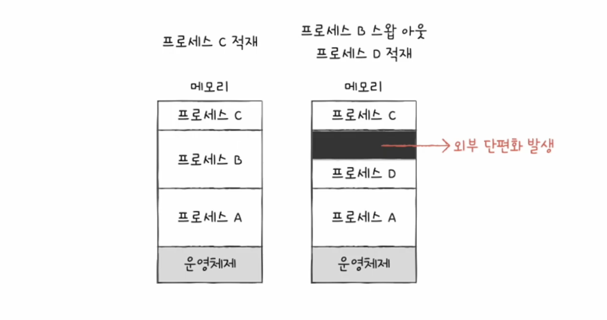
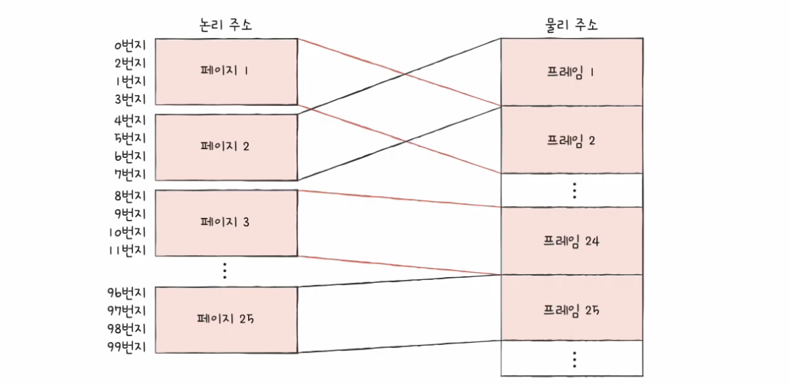
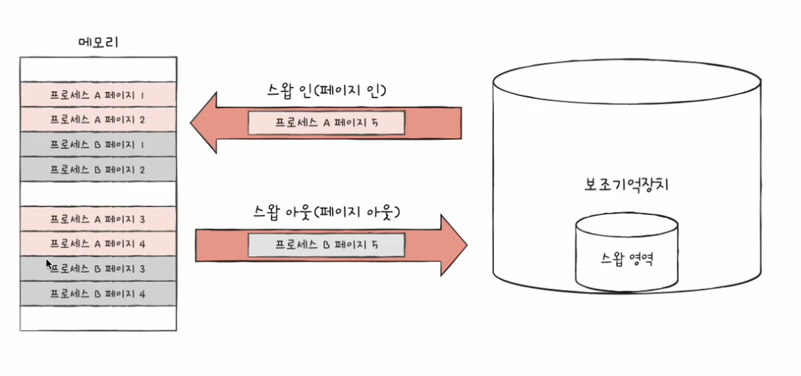
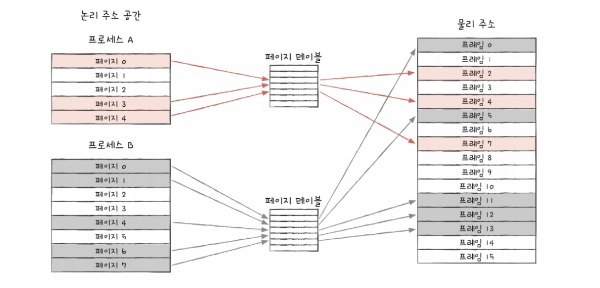
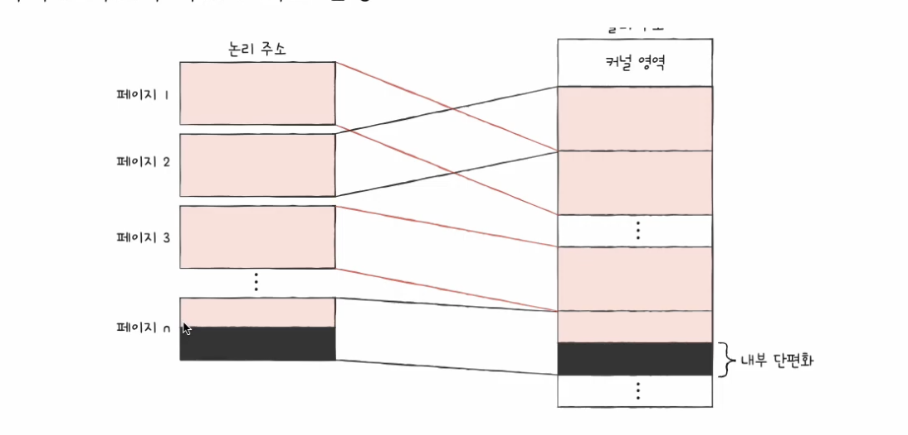
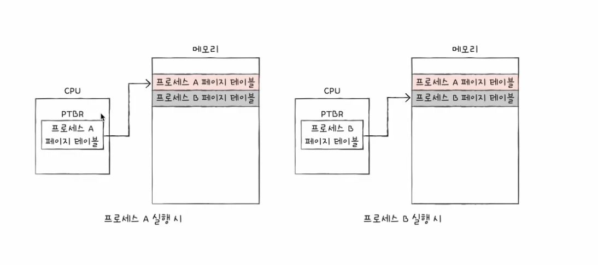
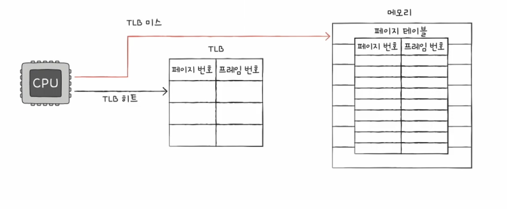
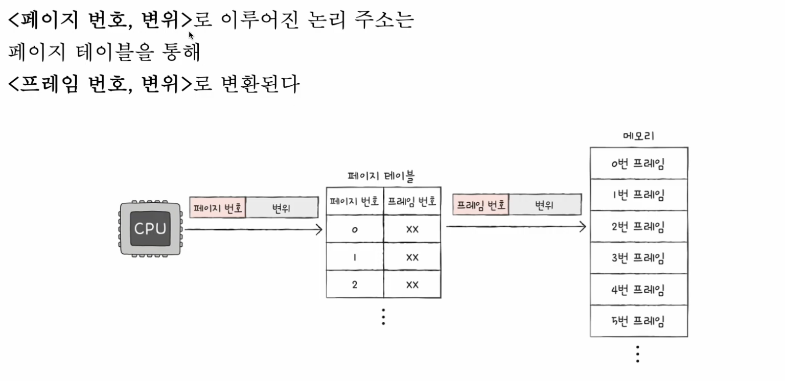
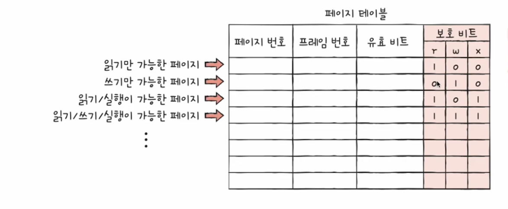
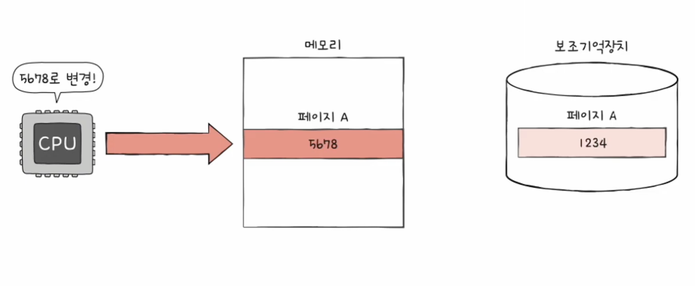

[⬅️ BACK](../README.md)

# 14. 가상 메모리

## [목차]

### 14-1 연속 메모리 할당

### 14-2 페이징을 통한 가상 메모리 관리

### 14-3 페이지 교체와 프레임 할당

## 14-1 연속 메모리 할당

### 연속 메모리 할당 방식

연속메모리 할당방식이란, 프로세스들을 메모리에 연속적으로 할당하는 메모리 할당 방식이다.

#### 스와핑

- 스와핑이란 사용되지 않는 일부 프로세스를 보조기억장치로 내보내고 실핼할 프로세스를 메모리도 들여보내는 관리 기법이다.
- 보조기억장치의 일부 영역을 `스왑 영열` 이라고 한다
- 프로세스가 메모리 -> 스왑영역으로 옮겨지는 것을 `스왑 아웃(Swap Out)`이라고 한다.
- 스왑영역 -> 메모리로 옮겨지는 것을 `스왑 인(Swap In)`이라고 한다.

- 스와핑을 사용하면 오래 사용하지 않는 프로세스, 대기상태가 된 프로세스 등을 보조기억장치로 옮기고 다른 프로세스를 적재할 수 있다.
- 스와핑을 이용하면 여러 프로세스들을 동시에 실행시킬 수 있다. 여러 개의 프로세스를 합하면 메모리 크기보다 크지만 스와핑을 통해 여러 프로세스를 실행시킬 수 있다.
  

#### 메모리 할당

비어있는 메모리 공간에 프로세스를 연속적으로 할당하는 방식이 있다
대표적으로 최초 적합, 최적 적합, 최악 적합이 있다.

1. 최초 적합

- OS가 메모리 내의 빈 공간을 순서대로 검색하다가 프로세스가 적재될 수 있는 `공간을 발견하는 즉시` 메모리를 할당하는 방식
- 검색 최소화.빠른 할당 가능

2. 최적 적합

- 빈 공간을 모두 검색해본 후` 프로세스가 적재될 수 있는 공간 중 가장 작은 공간`으로 배치하는 방법

3. 최악 적합

- 빈 공간을 모두 검색해본 후 `프로세스가 적재될 수 있는 공간 중 가장 큰 공간`으로 배치하는 방법

#### 외부 단편화 (External Fragmentation)

- 외부 단편화는 프로세스를 할다하기 어려운 만큼 작은 메모리 공간들로 인해 메모리 공간이 낭비되는 현상이다.
- 전체 남은 공간은 충분하지만 각 공간이 작은 경우 발생한다.

- 메모리 단편화를 없앨 수 있는 방법으로는 메모리 압축(조각 모음)도 있지만 메모리 압축은 비용이 많이 들어 실제로 사용하지 않는다.
- 또 다른 방법으로 `가상메모리 기법` 중 하나인 `페이징 기법이` 있다. 많이 사용한다.

## 14-2 페이징을 통한 가상 메모리 관리

- 페이징은 운영체제에서 메모리 관리 기법중 가장 중요한 개념이다.
- 연속적인 할당 방식의 문제점에서 외부 단편화 이외에 프로세스가 메모리 크기보다 큰 경우 메모리를 할당할 수 없는 문제점이 있다.
- 가살 메모리(Virtual momoey)는 실행하고자 하는 프로그램의 일부만 메모리에 적재하여 실제 물리 메모리보다 더 큰 프로세스를 실행할 수 있도록 하는 기술이다.(실제 메모리보다 많아보이게 하는 기술이다)
- 가상메모리 관리 기법으로 `페이징` 기법과 `세그먼테이션` 기법이 있다. 대부분 현대 운영체제는 페이징 기법을 사용한다.

### 페이징이란

- 외부단편화의 근본적인 이유는 다른 크기의 프로세스가 메모리에 연속적으로 할당되었기 때문이다.
- 페이징은 메모리의 물리적 주소를 `프레임` 이라는 고정 크기로 나누고, 프로세스의 논리 주소 공간을 `페이지` 단위로 자른 뒤 각 페이지를 프레임에 할당하는 메모리 관리 기법이다.
- `페이지단위로 스와`핑이 가능하다.
  
- 스왕 아웃 = `페이지 아웃`
- 스왕 인 = `페이지 인`
- 프로세스를 이루는 페이지 중` 실행에 필요한 일부 페이지만을 메모리에 적재`하고 당장 필요하지 않는 페이지는 보조기억장치에 남겨둔다.
- 이를 통해 `물리 메모리보다 더 큰 프로세스를 실행`할 수 있다.

### 페이지 테이블

- 페이지 번호와 그에 맞는 프레임 번호를 명시하여 cpu가 불연속적으로 배치되어있는 프레임을 찾을 수 있도록 하는 테이블이다.
- cpu가 바라보는 테이블을 사용하여 찾을 수 있기 때문에 논리 주소 공간에는 연속적으로 배치되도록 할 수 있다.
- 프로세스마다 각자의 테이블이 있으며 페이지는 메모리에 적재된다.

#### 내부 단편화

- 모든 프로세스가 페이지 크기긔 배수는 아니므로 공간이 남을 수 있다. 이러한 메모리 낭비를 내부 단편화 라고 한다.
- 페이지 크기를 작게도 할 수 있지만 작게 한다면 그만큼 페이지테이블 크기도 커진다.
- 적당한 크기를 조정하는 것이 중요함

#### PTBR(Table Page Base Register) 페이지 테이블 베이스 레지스터

- 프로세스마다 각자의 페이지 테이블을 갖고있고 각 프로세스의 페이지 테이블들은 메모리에 적재되어있다.
- CPU 내부의 PTBR은 각 프로세스의 페이지 테이블이 적재된 주소를 가리키고 있다.
- 이런 정보들은 PCB에 기록된다.

#### TLB(Translation Lookaside Buffer)

- 페이지 테이블의 케시 메모리이다. 페이지 테이블 일부를 저장한다.
- 일반적으로 MMU 내에 있다.
- 최근에 사용된 페이지 위주로 가져와 저장함으로써 cpu에서 메모리로 참조하는 시간을 줄여준다.

- TLB Hit : 참조하는 페이지가 TLB에 있는 경우
- TLB Miss : 참조하는 페이지가 TLB에 없는 경우

### 페이징에서의 주소 변환

- 논리주소는 기본적으로 `페이지번호` + `변위`(offset)으로 구성되어있다.(이외에 더 있긴 하지만 간한다게)
- 논리주소 <페이지번호,변위>는 페이지테이블을 통해 <프레임번호,번위> 로 변환된다.
  

### 페이지 테이블 엔트리

- 페이지 테이블의 각 행을 페이지테이블 엔트리 라고 한다.
- 페이지 엔트리에는 페이지번호, 프레임번호, 변위 외에도 유효 비트, 보호 비트, 참조 비트, 수정 비트가 있다

#### 유효비트

- 해당 페이지에 접근이 가능한지 알려준다
- 1이라면 현재 페이지가 메모리에 적재되어 있다는 것을 의미하며 0이라면 메모리에 적재되어있지 않다는 것을 의미한다.
- 만약 유효비트가 0인 페이지에 접근하려고 하면 `페이지폴트`(page fault)가 발생한다.
- 페이지 폴트가 발생하였을 때 처리하는 과정은, `페이지 폴트 처리 루틴을 실행`하여 `원하는 페이지를 메모리로 가져온 뒤 유효비트를 1로 변경`해준다.

#### 보호비트

- 부호비트는 읽기만 가능한지, 쓰기만 가능한지 또는 읽기 쓰기, 실행 모두 가능한지를 알려준다
- 세 개의 비트로 구성되어있는데, r(read), w(write), x(execute)이다.
- 0이라면 해당 권한이 없음을, 1이라면 해당 권한이 있음을 의미한다.
- 만약 110 이라면 읽기,쓰기만 가능하다.
  

#### 참조비트

- CPU가 페이지에 접근한 적이 있는지의 여부
- CPU가 읽거나 쓴 페이지라면 1이다

#### 수정비트

- 페이지에 데이터를 쓴 적이 있는지에 대한 여부이다.
- 더티비트 라고도 한다
- 1이라면 변경,0이라면 변경된 적이 없음을 의미한다.
- 페이지가 메모리에서 사라질 때 보조기억장치에 쓰기 작업을 해야하는지, 할 필요가 없는지의 판단 기준이 된다.
- 1이라면 보조기억장치에 저장된 내용이 서로 다르기 때문에 수정된 페이지그 스왑 아웃 될 경우 변경된 값을 보조기억장치에 기록하는 작업을 한다.
  

### 페이징의 이점 - 쓰기 시 복사

- 쓰기 시 복사 (Copy on write)
- 보통 fork를 통해 자식프로세스를 만들면 프로세스끼지는 자원을 공유하지 않는다는 개념에 입각하며 메모리 영역까지 복제를 하게된다.
- 프로세스 페이지 테이블은 자신의 고유한 페이지가 할당된 프레임을 가리킨다. 이렁 방식은 `불필요한 메모리 낭비와 프로세스 생성 시간을 늦춘다`.
- 자식 테이블이 생상되면 자식테 이블의 페이지테이블은 부모프로세스의 프레임을 가리키게하고, `자식 또는 부모 프로세스가 쓰기를 하는 경우 해당 프레임만 복제를 하는 방식`이 쓰기 시 복사이다.
- 프로세스 생성 시간을 줄여주고 메모리 공간 절약도 가능하다

### 계층적 페이징

- 페이지 테이블의 크기는 생각보다 작지않다.
- 모든 페이지 테이블 엔트리를 항상 메모리에 유지하지 않을 수 잇는 방법이 있고 이를 계층적 페이징이라고 한다.
- 다단계 페이지 테이블 이라도고 불린다.
- 페이지 테이블을 여거 개의 페이지로 쪼개고 이 페이지틀을 가리키는` 바깥 페이지 테이블(outer page table)을 만드는 방식`이다.
- 계층적 페이징을 사용하는 환경에서의 논리주소는 `바깥 페이지 번호`, `안쪽 페이지번호`, `변위` 로 이루어진다.
- 아래의 그림과 같이 페이지 테이블의 페이지를 찾고, 페이지테이블의 페이지를 통해 프레임 번호를 찾고 물리주소를 얻는 방식이다.
  
- 페이지테이블의 계층은 여러 개로 할 수도 있는데, `계층이 늘어날수록 페이지폴트가 발생하는 경우 메모리 참조 횟수가 많아지므로` 계층이 많다고 해서 좋은 것은 아니다.₩

## 14-3 페이지 교체와 프레임 할당
