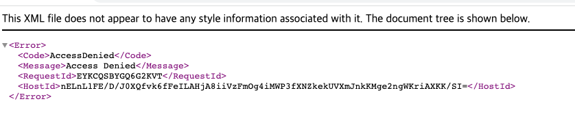

# [해결]AWS https 배포연습 중 - net::ERR_CERT_COMMON_NAME_INVALID 그리고 Error는 꼬리를 물고

작성일시: 2022년 2월 24일 오전 12:00

# AWS https 배포연습 중 - net::ERR_CERT_COMMON_NAME_INVALID

[AWS Application Load Balancer throws net::ERR_CERT_COMMON_NAME_INVALID](https://stackoverflow.com/questions/63544916/aws-application-load-balancer-throws-neterr-cert-common-name-invalid)

AWS 배포 연습을 위해 CloudFront 배포 까지 완료한 다음 Http로 통신이 되는 것을 확인하고 Https로 서비스를 하기 위해 작업을 하던 중 아해와 같은 Errorr가 발생하였다.

1. HTTPS 적용 도중 Error - [참고 Stackoverflow](https://stackoverflow.com/questions/69334088/error-mixed-content-the-page-at-was-loaded-over-https-but-requested-an) , [\*\*Requiring HTTPS for communication between CloudFront and your custom origin](https://docs.aws.amazon.com/AmazonCloudFront/latest/DeveloperGuide/using-https-cloudfront-to-custom-origin.html) , [AWS CloudFront in front of S3 and ALB](https://stackoverflow.com/questions/71064028/aws-cloudfront-in-front-of-s3-and-alb)\*\*

   - ERROR:
     error: Mixed Content: The page at \_\_\_\_' was loaded over HTTPS, but requested an insecure XMLHttpRequest endpoint This request has been blocked [closed]
   - 해결 :
     Office hour때 문의를 해본 결과, ALB를 만들고 나서 S3에 있는 정적 빌드 파일의 env (요청 url이 있는)를 수정하지 않아서 발생한 error였다.
     ALB domain을 넣어주니 위의 error는 사라졌지만 로그인 시 404 not found가 나온다.
     서버와 연결이 되지 않은 것 같은데 , 이재 이 문제를 해결해야겠다..
      

2. Server와 통신이 되지 않는다
   - ERROR 발견 :
     위의 문제를 해결하고 서버를 키고 다시 로그인을 시도하였다. “ [https://client.srdeploytest.ml](https://client.srdeploytest.ml/login) “ 로 들어갔을 때 Route → CloudeFront → S3 Bucket의 정적 파일까지 client에 rendering되는 것까지 확인을 하였다.
     하지만 로그인 시도를 해보니 아래와 같은 Error가 나왔고
     
     client에서 console을 확인해보니 “GET [https://client.srdeploytest.ml/login](https://client.srdeploytest.ml/login) 403” error가 발생하였다. 그래서 Network Tap을 확인해보았더니 Server로의 모든 요청에서 403 error가 발생하였다.
     즉, 서버와의 연결이 되지 않았던 것..!
     그리고 자세히 확인해보니 요청 헤더에서 요청 도메인이 서버의 도메인이 아닌 cloudFront의 도메인 이었다.
     혹시나 해서 Postman으로 요청을 보내보았더니 잘만 된다
     

- 과정 - 해결
  그러니 이 문제는 아마 Route Certificate Manager 에 설정을 잘못 한 문제라는 생각이 들었다. 
  Route53에서 Records들의 상태들을 다 확인해보고 보안그룹들도 확인을 해보았지만 문제는 없었다. 
  구글링을 해보다가 **[AWS CloudFront in front of S3 and ALB](https://stackoverflow.com/questions/71064028/aws-cloudfront-in-front-of-s3-and-alb) 에서 나와 비슷한 문제에 대한 글을 보았다.** 
  채택이 된 각변은 CloudFront의 Origin과 Behavior를 설정하라는 답변이었다. 생각해보니 나는 CloudFront를 만들 때 오리진을 S3로 하였다. 
  한 개만 가능한줄 알았는데 origin을 더 만들어서 요청에 따라 behavior를 설정할 수 있다는 것을 지금 알아버렸다.
  —> **CloudFront에서는 Behavior에 따라 각각 Pattern의 요청을 각기 다른 Origin 혹은 Origin Group으로 보낼 수 있다.**
   
  당장 달려가서 ALB origin을 추가하고 Behavior를 추가하였지만 없어지지 않았다 😱
  다시 생각을 해보기 위해 현재 Flow를 정리해보았다. 
  Route53 → ClouidFront → S3 Bucket정적파일 로드 
  Route53 → ALB → EC2 
  이고 지금 Error가 가는 부분은 Route53 → ALB → EC2로 접근하지 못해서 발생하는 Error이기 때문에 Route53이 아니라 ALB , E2C를 확인해야 했다. 다시 Check를 해보기로 하자 

  [Check 한 부분] 

  - Rout53 Records - 잘 매칭 되어잇음 확인 완료
  - ALB Secuiry Group Inbound rule 확인 - HTTPS 확인 완료
  - HTTPS는 SSL 인증서가 필요하므로 ALB는 인증서가 있어야 한다 → 인증서 다시 확인

    - ELB Listener - HTTPS확인 - 인증서 확인 완료
      다시 구글링을 해보니 아래와 같은 글을 볼 수 있었다
      **[ELB health checks failing only for HTTPS](https://serverfault.com/questions/858704/elb-health-checks-failing-only-for-https)**
      (음 health check.. 다음엔 좀 더 잘 활용해보자)
      답변 중 아래와 같은 답변이 있었다
       

          > It sounds like the port 443 target group is configured for HTTPS, which is not what you want unless you have SSL certs on the instances themselves. You only want the ALB *listener*
          >  configured for HTTPS, not the target. Check that? –

     
          이럴수가,, 그렇구나..!
          SSL인증서는 EC2가 아닌 ALB에 적용이 되어있고 EC2에는 없다. 그리고 ALB HTTPS Targer Group이 HTTPS로 되어있는데, 이 의미는 Target Group Ec2 Instance에 요청을 할 떄 443번을 사용한다는 의미이다. 그렇기 때문에 인스턴스 자체에 인증서가 없다면 403 error가 나는 것이다.

          그렇다면 해결 방법은

  1. Instance마다 인증서를 설정해주는 방법
  2. Target Group에서 인스턴스에 요청을 할 때 https가 아닌 http를 사용하는 것.
     후자를 선택하고 적용해보니 정삭적으로 작동되는 것을 확인하였다.
