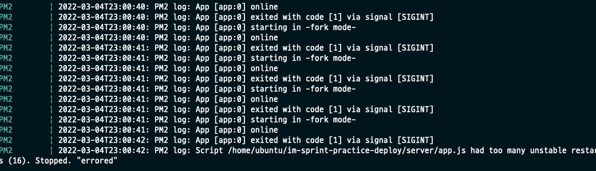

# 해결*AWS서버*배포자동화 aws환경변수 적용 중 Error*그리고*큰\_깨닳음

Error 모음: 배포
Language: BUGS
State: 해결
블로깅: No
작성일시: 2022년 3월 4일 오후 2:53

# 해결*AWS서버*배포자동화 aws환경변수 적용 중 Error*그리고*큰\_깨닳음

오늘 상당히 오랫동안, 아니 하루종일 삽질을 하였는데 그 과정을 .. 적어보려한다

결론적으로 내가 파이프라인 구축에 대한 흐름을 이해햐지 못했던 것에 있었다.

Server (EC2)를 배포파이프라인을 이용하여 자동화 + Parameter Stor를 사용한 환경변수 관리를 하려고 하는 중 pm2 log에서 계속 아래와 같은 Error가 발생했다.

1. had too many unstable restarts (16). Stopped. "errored”

b. sqlMessage: undefine & Error: connect ECONNREFUSED 127.0.0.1:3306

잘 되던 것이 파이프라인을 구축하고 배포까지 정상적으로 되는 것을 두 눈으로 보았는데 PM2로 구동한 Process가 재시동을 꼐속 하다가 결국 Error로 처리되고 , DB가 연결이 되지 않는 사태가 벌어진 것이다.

- 문제라고 생각했던 부분

  - RDS 포트는 13306 인데 ERror는 3306포트가 출력되고있다 → sqlMessage: undefined 인 것을 보니 환경변수가 undefined 되어있는듯 하여 아해와 같은 조치들을 하였다.
    - 환경변수는 오타없이 잘 작성되었는지? → 전혀 문제 없음
    - aws cli가 설치되지 않은 것인가 해서 확인해보니 아주 잘 설치되어있다.
    - IAM 권한 확인 → 문제없음
  - pm2 error를 잡기 위해 80번 포트를 확인해보니 실행되는 것을 확인하고 죽이려고 하였는데, 죽여도 죽여도 새로운 pid로 계속 생성이 되었다. (뭐지 ..??? 왜자꾸 생기지 무섭게)

  이 과정에서 진짜 삽질의 삽질이 계속되었다.

  그러다 Client의 Network에서 server로 post를 보낸 뗴 내가 설정한 도에인이 아닌 이전에 EC2를 끄기 전 (EC2는다시 켰을 때 IP랑 도에인이 바뀌기때문) 아직 이전의 도메인으로 post를 보내고 있는 것을 발견하여다.  당장 S3 버켓에 정적 빌드를 넣어주었다 ( 클라이언트 파이프라인은 구축한 다음 바로 삭제해서 수동으로 해야헸다 과금때문에) 하지만 클라이언트는 계속 이전의 엔드포인트로 요청을 보내고있었다..

- 오류는 해결되지 않았지만 DB가 연결된다..
  - 분명 클라이언트 배포는 삭제햇는데 왜 이런 현상이 벌어지는 것인지, 다시 클라이언트 배포 과정을 곱씩어보니, 이전에 실습한 Client 배포파이프라인 구축 때 만들어놓은 CodeBuild에 build project가 남아있다는 것이 생각났다.  pipeline은 프리티어라 서버 파이프라인을 위해 클라이언트 파이프라인은 삭제를 했는데, Codebuild Project가 남아있던 것 !!!
  - Client pipeline의 경우 소스공급자 : 깃에서 커밋 푸시 ⇒ 소스를 통해 받은 코드 테스트 및 빌드하여 배포자에 전달 ⇒ S3 Bucket 의 과정을 통하게 된다.  비록 Piple line은 삭제를 했지만 아직 CodeBuild project가 남아있었기때문에 계속 S3버켓에 업데이트 되지 않은 소스코드를 제공하고 있었던 것으로 추정된다...
  - 다시 삭제하고 클라이언트 → 로그인을 해보니 정살적으로 DB와 연결이 되었다
  - 하지만,, 아직도 Ec2를 실행하면 동일한 Error가 발생되어있다. (🍠🍠🍠🍠🍠🍠🍠🍠) 
- 도대체 EC2는 서버가 실행되지도 않았는데 DB가 연결이 되고 post가 된단 말인가?!?!?!?!?! 혹시나 해서 EC2에서 실행중인 pm2를 stop하고 postman으로 요청을 보내보니 보내진다..!! 😱 😱 😱 😱 😱 😱 
  이쯤이면 공포가 밀려오는 수준..! 키지도 않은 서버는 어디에 있단 말인가??
  답은 하나 밖에 없었다. “파이프라인자동베포" 내가 구축해놓은 것...
- 다시 한번 서버의 파이프라인이 어떤 플로우로 실행이 되는지 생각해보니, 깃에서 소스를 공긍하면 CodeDeploy는 EC2에 배포를 한다.  그리고 scripts들을 실행하는데,,scripts에서 Pm2 start 명령어가 있으니 당연히 실행을 하는것.....

→ 결론은, 앞으로 무엇을 배울 때 그것의 큰 흐름과 원리를 이해하는데 좀 더 집중을 해야한다는 것을 아주 많이 깨닳았다. 물론 이렇게 삽질을 통해 (삽질을 하면서 배우는 것들도 있으니) 배우는 방법도 있지만, 시간이 오래 걸리는 단점이 있으니말이다.
