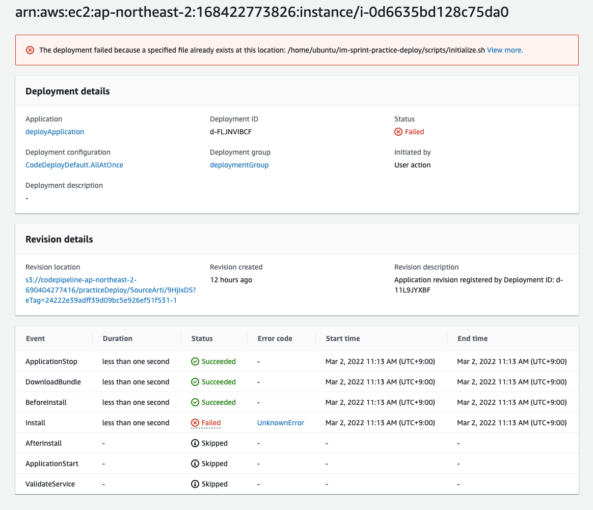

# [해결]AWS서버 배포 자동화 실습 중 Error

Error 모음: 배포
Language: BUGS
State: 해결
블로깅: No
작성일시: 2022년 3월 2일 오전 11:31

# AWS서버 배포 자동화 실습 중 Error

### 1.HEALTH_CONSTRAINTS

- 진행 중 발생한 Error

  - error code : HEALTH_CONSTRAINTS
  - description : The overall deployment failed because too many individual instances failed deployment, too few healthy instances are available for deployment, or some instances in your deployment group are experiencing problems.
  - 문서에 나와있는 해결 법

    - [Instance Health](https://docs.aws.amazon.com/codedeploy/latest/userguide/instances-health.html)
    - [Troubleshoot instance issues](https://docs.aws.amazon.com/codedeploy/latest/userguide/troubleshooting-ec2-instances.html)
    - [Troubleshoot EC2/On-Premises deployment issues](https://docs.aws.amazon.com/codedeploy/latest/userguide/troubleshooting-deployments.html)

  - log 확인
    ```bash
    2022-03-01 23:59:50 INFO  [codedeploy-agent(30929)]: Version file found in /opt/codedeploy-agent/.version with agent version OFFICIAL_1.3.2-1902_deb.
    2022-03-02 00:00:35 INFO  [codedeploy-agent(30929)]: [Aws::CodeDeployCommand::Client 200 45.494617 0 retries] poll_host_command(host_identifier:"arn:aws:ec2:ap-northeast-2:168422773826:instance/i-0d6635bd128c75da0")
    ```
    
    Deploy를 확인해보니 install 부분에서 Error가 발생하였다.
    
    Event log를 찾아보니, 이미 있는 파일을 다시 생상하는 명령어때문에 fail이 된 것을 확인할 수있었다.

  ```bash
  The deployment failed because a specified file already exists at this location: /home/ubuntu/im-sprint-practice-deploy/server/.gitignore
  ```

  아래의 글을 보면 AfterInstall에 Overwrite에 대한 논의가 있었지만 반영은 되지 않은듯 하다
  **[Add Support for "Overwrite" instruction in appspec.yml "Files" section](https://github.com/aws/aws-codedeploy-agent/issues/14)**
  이에 대한 해경 발법으로 BeforeInstall.sh를 만드어서 존재한다면 삭제를 해주는 구문을 넣고 배포를 해보니 다른 Error가 나왔다 (띠용)</br>
  다시 log 확인 (/opt/codedeploy-agent/deployment-root/deployment-logs)
  음.. node, npm 버전문에가 발생하였다.
  
  npm , node version 문제 → 현재 npm, node 버전은 sudo로 확인해보니 요구하는 버전이 아니었다는 것을 발견. node와 npm을 최신화 시킨 뒤 배포를 진행하닌 정상적으로 되는 것을 확인하였다.</br>
  그런데, beforeInstall을 제외하고 배포를 해도 정상적으로 되는 것을 확인하였다. 아마도 처음부터 Npm, node의 버전문제인 것 같다는 생각이 든다.</br> 처음부터 /opt/codedeploy-agent/deployment-root/deployment-logs 를 확인하려 했지만 그 때에는 deploument-root 경로에 logs dir이 없었다. 이 부분은 왜인지 알아봐야겠다.
  참고사이트

  [https://hyungseok.kr/developments/11](https://hyungseok.kr/developments/11) </br>
  [https://linuxize.com/post/bash-check-if-file-exists/](https://linuxize.com/post/bash-check-if-file-exists/) </br>
  [https://github.com/codestates/agora-states/discussions/2387](https://github.com/codestates/agora-states/discussions/2387)
