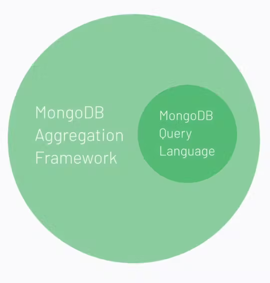

# DATABASE-NOSQL-MongoDB-lesson정리-AggregationFramework

Category: DATABASE
Chapter: Database
강의: codestates
블로깅: No
유형: LESSON
작성일시: 2022년 1월 20일 오후 5:14

## DATABASE-NOSQL-MongoDB-lesson정리-Aggregation Framework

— lesson 정리

### Achievement Goals

- aggration Framework사용하여 aggregate 명명여 쿼리
  - $match, $project, $grop, 연산자 사용 할 수 있다.
- index에 대해 알아본다.

### 0. 실습을 위한 Sample Data 받기

[Load Sample Data](https://docs.atlas.mongodb.com/sample-data/)

1. 위의 사이트를 참고하여 sample data를 받는다
2. Terminal에서 mongodb 접속하기 :

   mongosh “mongodb+srv://cluster0.4ence.mongodb.net/practice” —username username

3. show dbs로 database를 확인해보면 sample data가 들어온 것을 볼 수 있다.

MongoDB에서는 Data를 파이프라인에 따라 처리할 수 있는 Aggregation Framework가 있다.

이를 이용하여 쿼리하는 방법에 대해 알아보자.

## 1. Aggregation Framework

### **Reference**

- [$match](https://docs.mongodb.com/manual/reference/operator/aggregation/match/)
- [$group](https://docs.mongodb.com/manual/reference/operator/aggregation/group/)
- [$project](https://docs.mongodb.com/manual/reference/operator/aggregation/project/)
- [Reference](https://faruk.hashnode.dev/mongodb-basic-shell-commands-part-7)



Aggregation Framework는 MongoDB에서 데이터를 query하는 가장 간단한 방법 중 하나니다.

Mongo DB 쿼리 언어를 사용하는 모든 작업은 Aggregation Framework를 사용해서도 수행할 수 있다.

Airbnb 데이터베이스를 사용하여 실습을 해보자.

### amenities중 하나로 Wifi가 포함된 document를 찾고 결과는 가격과 주소만 포함한다.

- MQL
  ```bash
  sample_airbnb> db.listingsAndReviews.find({"amenities":"Wifi"},{"price":1,"address":1,"_id":0})
  ```
- aggregate
  Aggregation Framework에서는 aggregate 명령어를 사용한다
  ```bash
  sample_airbnb> db.listingsAndReviews.aggregate([{$match:{"amenities":"Wifi"}},{$project:{"price":1,"address":1,"_id":0}}]).pretty()
  ```
  - Dcouemt를 필터린하지 않고 그룹으로 데이터를 집계하거나 수정할 수 있다.
  - 찾기 , projection없이 작업을 수행하거나 계산할 수 있다.
  - 파이프라인처럼 배열의 순서대로 작업을 하기 때문에 대괄호를 이용해 배열을 인자로사용한다.
    
  - $match : amenities 배열에 Wifi가 포함되는 document를 찾기
  - project : price, address만 출력\

### Aggregation Framework는 파이프라인처럼 작동한다.


- 위의 예제에서 첫 번째 필터는 $match로, Wifi가 있는 숙소만 파이프라인을 통과한다.
- 두 번째 필터인 각 Document에서 address , price가 아닌 모든 필드를 필터링 하는 $project를 지난다.

### $groop


- 들어온 데이터를 여러 개의 저장소로 빨아들여 그룹화 하는 연산자이다.
- $match등과 같은 필터링 단계가 없다면 데이터 요약, 계산, 그룹화를 수행할 때 원본 데이터를 수전하지 않는다.
- ## airbnb db를 통해 실습을 해보자.

  - address에 어떤 국가가 있는지 확인

    ```bash
    sample_airbnb> db.listingsAndReviews.findOne({},{"address":1})
    {
      _id: '10030955',
      address: {
        street: 'Rio de Janeiro, Rio de Janeiro, Brazil',
        suburb: 'Lagoa',
        government_area: 'Lagoa',
        market: 'Rio De Janeiro',
        country: 'Brazil',
        country_code: 'BR',
        location: {
          type: 'Point',
          coordinates: [ -43.205047082633435, -22.971950988341874 ],
          is_location_exact: true
        }
      }
    }
    ```

  - $group 표현식 :
    ```bash
     { $gropu:{_id:<expressiont>, // 표현식을 기준으로 그룹화를 한다
    	<field 1>:{<accumulator1>:<expression1>},
    	...}}
    ```
    - $grop 단계는 이전 단계에서 document를 받을 때 \_id 필드에 표현식을 사용하여 이 document가 속한 그룹을 식별한다.
    - $group 구문의 두 번째 부분을 사용하면 파이프라인을 통해 들어오는 데이터에 대해 더 많은 양적 분석을 할 수 있다.
  - listingsAndReviews collection에서 숙소가 있는 국가과 국가 당 위치한 숙소의 총계 목록을 가져오는 쿼리를 작성해보자.$grop을 사용하여 기준에 따하 그룹화를 할 수 있다.

    - 1 단계 ) 먼저 address 필드만을 $project한다
    - 2 단계 ) $grop 연산자를 사용하여 address.country값으로 데이터를 그룹화 한다 
        {_id:”$address.country”}
    - 3 단계 ) 국가에 위치한 숫소의 수를 세기 위해 두 번쨰 인자에서 $sum 연산자를 사용하여 국가에 얼마나 많은 숙소가 있는지 집계할 수 있다. (Js의 reduce 메서드의 작동 방식과 유사하다) → count필드를 만들고 $sum연산자를 사용하여 각 document에 대해 1씩 추가한다.

    ```bash
    sample_airbnb> db.listingsAndReviews.aggregate([{$project:{"address":1,"_id":0}},{"$group":{_id:"$address.country","count":{"$sum":1}}}])

    [
      { _id: 'Brazil', count: 606 },
      { _id: 'United States', count: 1222 },
      { _id: 'Turkey', count: 661 },
      { _id: 'China', count: 19 },
      { _id: 'Australia', count: 610 },
      { _id: 'Hong Kong', count: 600 },
      { _id: 'Canada', count: 649 },
      { _id: 'Portugal', count: 555 },
      { _id: 'Spain', count: 633 }
    ]
    ```

  - 각 category별 식품에 대한 price의 totla을 구하는 쿼리이다.
    1. category를 기준으로 document를 그룹화 한다.
    2. total이라는 새로운 필드를 만들어 price의 총 합을 구한다. ($sum사용하고 $price로 해당 값 참조)
       

### → Aggregation Framework 정리

- Aggregation Framework는 데이터를 계산, 재구성, 재정립하는 기능을 통해 MQL보다 더 강력한 기능을 하는 도구이다.
- Aggregation Pipe line 데이터는 pipe내에 있기 때문에 원본 데이처를 수정 또는 변경하지 않는다.

## 2. Index

- 데이터의 크기가 클 수록 쿼리 결과의 시간도 비례하게 늘어난다. 이를 해결하기 위한 방법 주 하나로 indexing을 들 수 있다.
- MongoDB의 index는 데이터를 탐색하기 쉬원 형식으로 저장하기 위해 특정한 자료구조로 나열되어있다.

### createIndex() 메서드 : Index 생성

createindex로 index를 생성한다.

```bash
db.collection_name.createIndex({<field name>:1,<field name>: -1})
# 1은 오름차훈 -1은 내림차순을 의미한다.
```

두 번째 파라미터로 속성을 추가할 수 있다.

```bash
db.collecion_name.createIndex({<field_name>:1},{<property>:true})
```

인덱스에 적용할 수 있는 속성

- Unique(유일한 속성) :
  - \_id 필드와 같이 collection에 단 한 개의 값만 존재할 수 있는 속성이다.
  - 이 속성을 각 인덱스에 적용할 수 있다.
  - members라는 collection의 각 document에 존재하는 user_id필드의 index를 중복값이 없는 유일한 필드로 생성
    ```bash
    db.members.createIndex({"user_id":1},{unique:true})
    ```
- Partial(부분 속성) :
  - document의 조건을 정해 일부 document에만 index를 적용한다.
  - partialFilterExpression 옵션을 사용한다.
  - restaurants 하는 collectionsdp cuisine, name이라는 두개의 필드를 사용하여 다중 인덱스(compound index)를 생성한다. 이 인덱스는 별졈이 (rating이) 4점 이상인 document에만 적용된다.
  ```bash
  db.restaurants.createIndes({"cuisine":1,"name":1},{partialFilterExpression:{rating:{$gt:4}}})
  ```
- TTL(Time-To-Live)
  - Date or Date 배열타입 필드에 적용.
  - 특정 시간이 지나면 document를 collection에서 삭제한다.
  - lastModifiedDate와 3600초가 차이나면 document 를 collection에서 삭제한다
  ```bash
  db.eventlog.createIndex({"lastModifiedDate":1},{expireAfterSecondes:3600})
  ```

### getindexes : index 조회

```bash
db.collection_name.getIndexes()
// index를 생성하지 않았다면 _id값만 index로 생성되어있다.

sample_airbnb> db.listingsAndReviews.getIndexes()

[
  { v: 2, key: { _id: 1 }, name: '_id_' },
  {
    v: 2,
    key: { property_type: 1, room_type: 1, beds: 1 },
    name: 'property_type_1_room_type_1_beds_1',
    background: true
  },
  { v: 2, key: { name: 1 }, name: 'name_1', background: true },
  {
    v: 2,
    key: { 'address.location': '2dsphere' },
    name: 'address.location_2dsphere',
    background: true,
    '2dsphereIndexVersion': 3
  }
]
```

### dropindex : index 삭제

```bash
db.collection_name.dropIndex(name)

# or

db.collection_name.dropIndex({<field>:1})

db.collection_name.dropIndexes() # 모든 인덱스 삭제
```

### index 활용

infrantsInfo Database가 있을 때 인덱스를 생성해보자.

- 각 document에서 키가 80cm인 영유아의 몸무게 정보를 오름차순으로 받아온다고 했을 때
  ```bash
  db.infrantsInfo.find({"tall":80}).sort("weight":1)
  ```
  이런 경우엔 tall과 weight에 대한 다중 인덱스를 만들 수 있다.
  ```bash
  db.infrantsInfo.createIndex({"tall":1,"weithg":1})
  ```
  → 이 인덱스를 기준으로 특수한 자료구조가 생성이 되고 이 인덱스 값을 기준으로 조회하면 더 이상 모든 데이터를 조회하지 않고 해당 자료구조만 조회하여 빠른 쿼리가 가능하다.
