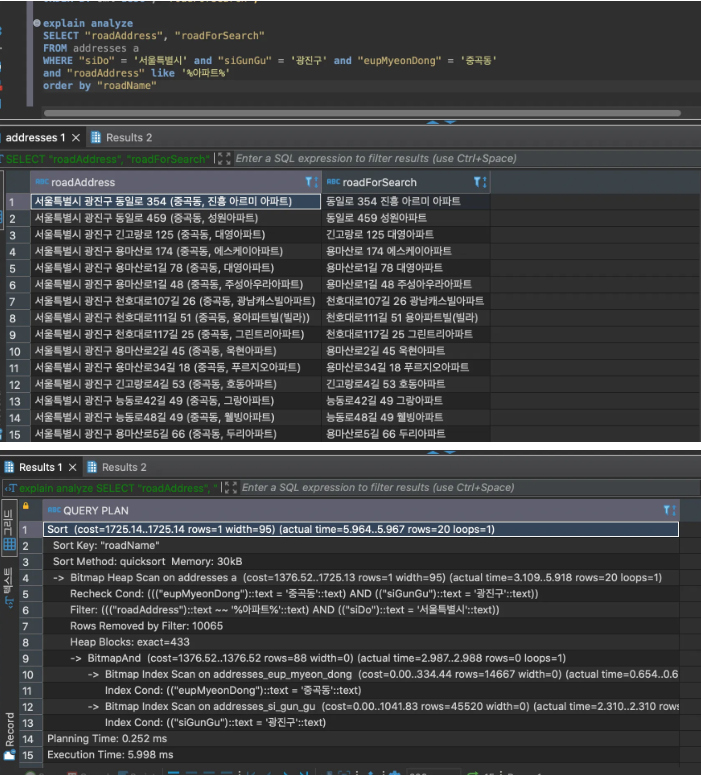
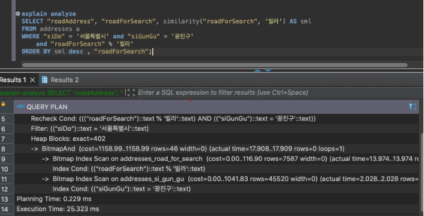

# PostgreSQL GIN Index 에 대하여

- 주소검색 서버 개발 당시 고민했던 gin index와 like query에 대해 정리했던 문서

## 조사

### GIN - %LIKE% 검색에 대한 GIN index 효율성 [참고](https://medium.com/vuno-sw-dev/postgresql-gin-%EC%9D%B8%EB%8D%B1%EC%8A%A4%EB%A5%BC-%ED%86%B5%ED%95%9C-like-%EA%B2%80%EC%83%89-%EC%84%B1%EB%8A%A5-%EA%B0%9C%EC%84%A0-3c6b05c7e75f)

- 위의 참고에 따르면

  - GIN (Generalized Inverted Index) 인덱스는 인덱스를 적용하는 컬럼의 값을 일정한 규칙에 따라 쪼개고(split), 이렇게 쪼갠 요소들을 사용합니다. 이에 따라 포함 여부를 확인하는 경우 보다 효과적으로 동작할 수 있습니다.

  - 또한 값을 쪼개는 방법 및 값의 타입에 따라 적합한 여러가지 operator class들이 있는데, PostgreSQL의 경우 12버젼 기준으로 array_ops, tsvector_ops, jsonb_ops, jsonb_path_ops 의 operator class를 built-in으로 [지원](https://www.postgresql.org/docs/12/gin-builtin-opclasses.html)하고 있으며, 그 외에도 확장 모듈(extension)을 통해 [pg_trgm](https://www.postgresql.org/docs/12/pgtrgm.html) 을 사용할 수 있습니다.

  - 한편 pg_trgm은 문자열을 3글자 (trigram) 씩 쪼개는 방식이기 때문에 3글자 이상 부터 인덱스를 통한 탐색이 Full Scan 대비 효율적이라는 한계점이 있습니다.

  - 검색 창에 입력한 값이 DB에 저장된 값과 완전히 일치하는 경우가 아니라 부분적으로 일치하는 경우에도 조회 되어야 하므로 GIN 인덱스를 사용하는 것이 보다 적합함을 알 수 있습니다.

⇒ pg_trgm 은 3글자 이상만 가능함?

⇒ 아닌거 같던데??!

⇒ 1~2 글자는 seq 검색보다 느리다는 단점이 있음

### GIN - pg_bigm ? 사용

- pg_bigm 공식 문서
- 활용 문서 [인프런 향로님 블로그](https://jojoldu.tistory.com/590)


- 유사성 검색이 된다
- 그런데 pg_trgm 으로 extention 설치 후 테스트 해보니,, 한글도 되는데?

- Sample query

```sql
SELECT "jibunAddress", "jibunForSearch", similarity("jibunForSearch", '빌딩') AS sml
FROM addresses a
WHERE "jibunForSearch" % '빌딩'
ORDER BY sml DESC, "jibunForSearch";

SELECT "roadAddress", "roadForSearch", similarity("roadForSearch", '자하문로') AS sml
FROM addresses a
WHERE "roadForSearch" % '자하문로'
ORDER BY sml DESC, "roadForSearch";
```

[pg_trgm 함수 및 Operator](https://www.postgresql.org/docs/11/pgtrgm.html)

**similarity(text, text)**

- 두 text 비교하여 유사도(number)를 return (0~1)
- 비슷한 함수 word_similarity, strict_word_similarity 도 있는데, 비교 논리가 좀 차이가 있어서 유사도 결과가 다르게 나옴. (근데 크게 차이를 잘 모르겠음.. 알아보자)

**text % text**

- pg_trgm.similarity_threshold 보다 큰 경우 return true
- pg_trgm.similarity_threshold default is 0.3
- similarity (0~1)

## similarity_threshold 값에 따른 결과 비교

- pg_trgm.similarity_threshold = 0.3 인 경우 (default)

```sql
SELECT "roadAddress", "roadForSearch", similarity("roadForSearch", '유원빌라') AS sml
FROM addresses a
WHERE "roadForSearch" % '유원빌라'
ORDER BY sml DESC, "roadForSearch";
```


```sql
SELECT "roadAddress", "roadForSearch", similarity("roadForSearch", '빌라') AS sml
FROM addresses a
WHERE "roadForSearch" % '빌라'
ORDER BY sml DESC, "roadForSearch";
```


⇒ pg_trgm.similarity_threshold (0.3) 로 인해 검출이 안됨

pg_trgm.similarity_threshold = 0.1 설정 후 검색

```sql
SET pg_trgm.similarity_threshold = 0.1;

SELECT "roadAddress", "roadForSearch", similarity("roadForSearch", '빌라') AS sml
FROM addresses a
WHERE "roadForSearch" % '빌라'
ORDER BY sml DESC, "roadForSearch";
```


pg_trgm.similarity_threshold = 0.0 설정 후 검색

```sql
SELECT "roadAddress", "roadForSearch", similarity("roadForSearch", '빌라') AS sml
FROM addresses a
WHERE "roadForSearch" % '빌라'
ORDER BY sml asc, "roadForSearch";
```


⇒ ‘빌라’ 단어가 포함되지 않는 항목도 검색이 됨

같은 케이스 또 다른 예시로


⇒ ‘`자하문로`’ 검색 시, 관련이 없는 리스트가 다수 보이기도 하고, ‘`문로`' 단어가 포함되어 있는 애들도 보임

⇒ 유사 검색 논리가 단어의 포함 검색이 아닌 유사도 기준이라, 이럴 수 밖에 없음..!!

⇒ 그래서 similarity_threshold 잘 설정해야 됨.

<이슈>

만약 적용 시, pg_trgm.similarity_threshold 기준은..?

- 테스트하면서 조정이 필요할듯..?

### 성능은?

- 해당 index만 테스트 하기 위해 다른 조건 없이 수행
- 대상 rows: 7586635
- 로컬 환경

  1.검색어 : 1 (한 글자)
  

- similarity (similarity_threshold = 0.0)
  
- similarity_threshold = 0.2
  

⇒ threshold 값에 영향이 있음

- 검색어 : 11 (두 글자)
  
  ⇒ 한 글자와 별 차이 없음

  ⇒ 세 글자(111)도 해봤지만, 별 차이 없음

- 검색어 변경하여 다시 검색 빌딩
  

  ⇒ 속도가 훨씬 나아졌지만,, 더 개선이 필요할 듯함

- %like% 검색은?
  

### 시도/시군구/읍명동 조건과 같이 사용

- 각 컬럼별 단일 btree index 적용 상태

- 검색어: 서울특별시 광진구 중곡동 빌라
- 1만개 row임
  

  - similarity_threshold = 0.0 으로 설정


- %like% 검색


⇒ GIN index 검색보다 빠르다??

- 3.7만개 로우로
- 시도/시군구 범위로
  

- GIN index
  

- %like% 검색
  

⇒ GIN index 보다 느리다!
⇒ row 수에 따라 어떤 시점부터는 row 수가 증가할 수록 GIN index 성능이 나아보임
