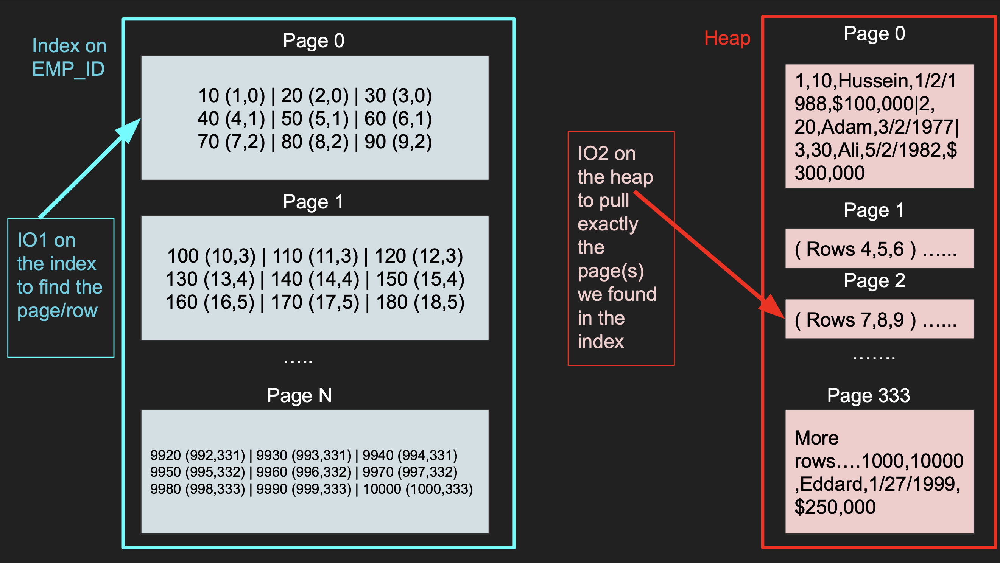
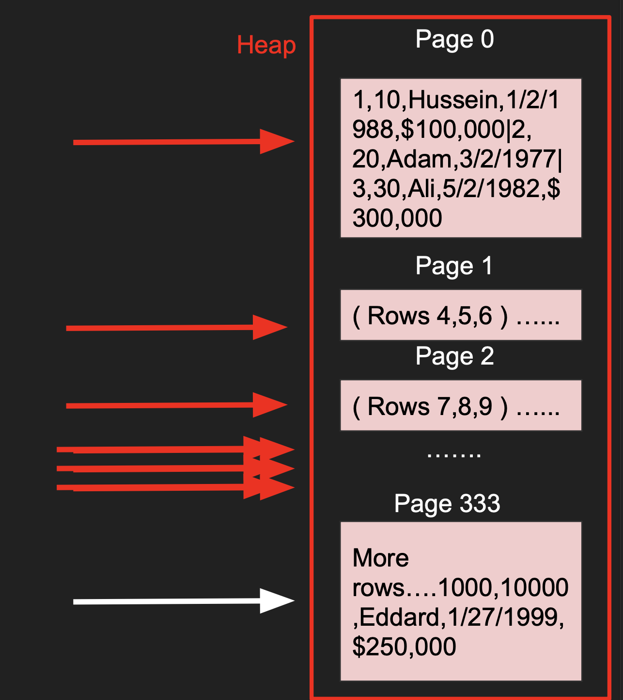
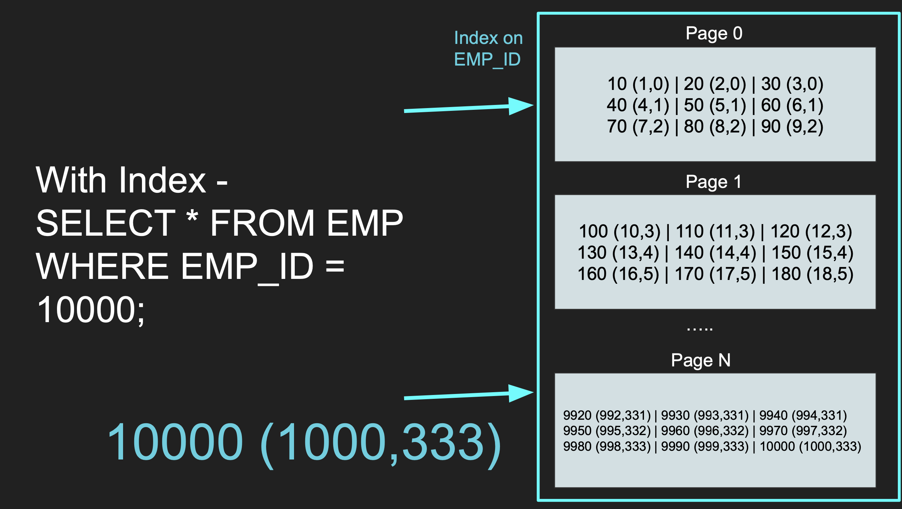
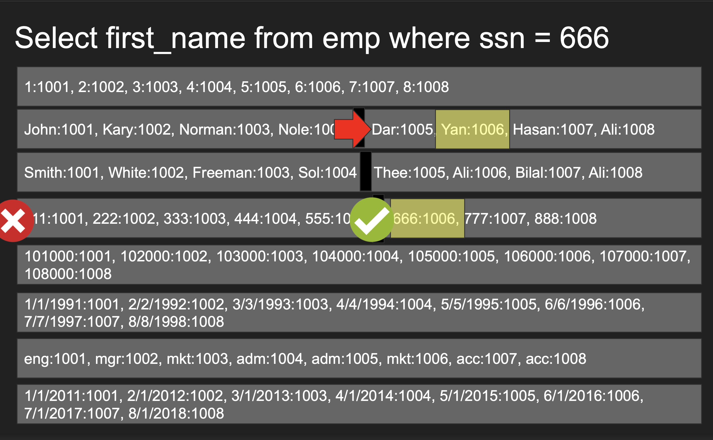
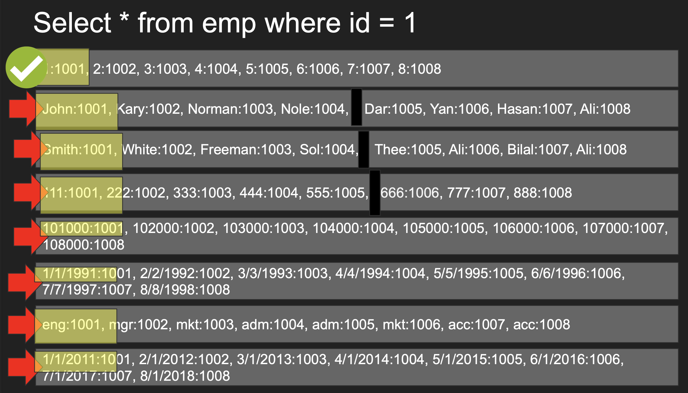
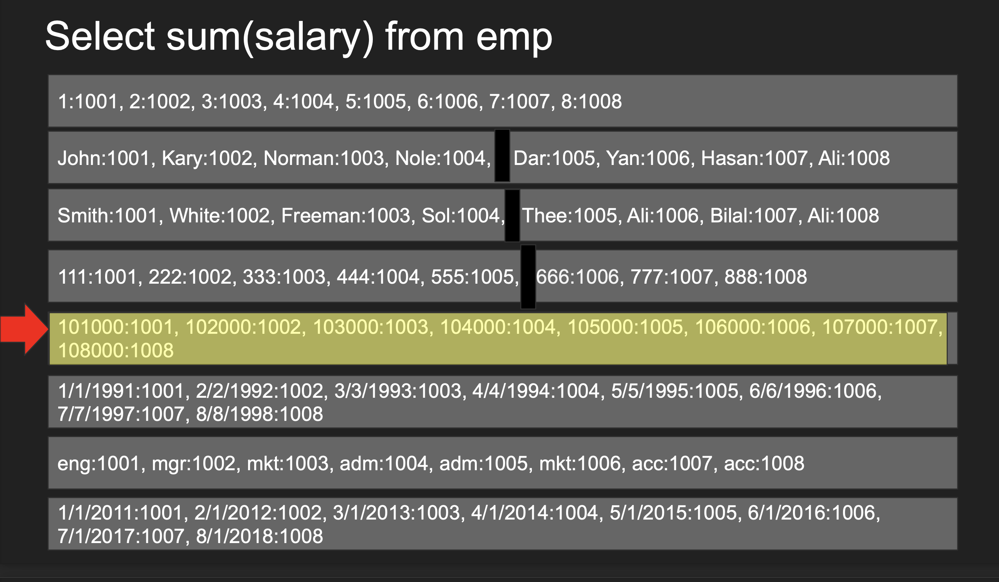

# 개요

- Udemy 강의 중 데이터베이스 엔지니어링 마스터 강의를 듣고 정리한 내용
- [데이터베이스 엔지니어링](https://barogo.udemy.com/course/database-engineering-korean/learn/lecture/40778704#overview)
- Section3 SECTION3 UNDERSTANDING DATABASE INTERNALS

# 강의 정리

## 1. How tables and indexes are stored on disk

- disk에 저장되는 방식, query가 이루어지는 방식, 비용에 대하여 논의
- Storage concepts
- table
- row_id
- page
- io
- heap data structure
- index data structure b-tree
- 추가적응로 행 저장소와 열 저장소에 대해 알아보자

### Row_id

- internal and system maintained
- In certain database(mysql) it it the same as the pk but toher database(postgres) hava a system column row_id(tuple_id)

### Page

- Depending on the storage model (row store, column store), the rows are stored and read in logical pages(논리적인 페이지에 저장됨).
  - page는 고정된 크기의 메모리 위치로, disk 위치로도 변환되는 일련의 바이트이다.
  - Page에 얼마나 많은 rows가 들어가는지는 row의 크기에 따라 다르다.
  - 열의 크기와 이러한 열의 데이터 type의 크기에 달려있다.
- page를 열 기준으로도 구성할 수 있다
- The database doesen't read a single row, it reads a page or more in a single IO and we get a lot of rows in thet IO

  - disk는 실제로 page를 읽고 IO를 실행해서 데이터를 가져온다.
  - disk or hdd , ssd partition에, format 등등 따라 다르지만 IO를 통해 하나 이상의 page를 얻게된다.

- Each page has a size(ex 8KB in postgres, 16KB in mysql)
- if each page holds 3 rows, with 1001 rows you will have 1001/3 = 333 ~ page
- page는 disk에 저장이 된다.
- 물리적으로는 시작과 끝이 있으며 database에서 정의한다.
- 얼마나 많은 page를 가져오는지, 얼마나 많이 IO를 실행해야 하는지를 결정한다.

### IO

- IO operation is a read request to the disk
- We try to minimize this as much as posibble
  - 요청을 줄일수록 쿼리가 더 빨라진다.
  - 데이터베이스 회수율과 관련이 있다.
  -
- An IO can fetch 1 page or more depending on the disk partitions and other factors
- An IO cannot read a single row, its a page with many rows in them, you get them for free. kkk
- You want to minimize the number of IOs as they are expensive
- Some IOs in operationg systems goes to the operating system cache and not dist
  - 특히 postgres가 그러는데 postgres는 운영 체제 cach에 크게 의존하기 떄문에 IO가 실제 disk로 가는 것을 의미하지 않는다.

### Heap

- The Heap is data structure where the table is stored with all its page one after another
  - data table을 가리키는 페이지의 모음이다.
  - heap에는 테이블 자체에 대한 모든 정보가 담겨져있다.
- This is where the actual data is stored including everthing
  - 많은 정보가 들어잇어서 비용이 많이 든다.
- Traversing the heap is expensive as we need to read so many data to find what we want
- That is why we need indexes that help tell us exactly what part of the heap we need to read . What page(s) of the heap we need to pull

### Index

- An Index is another data structures separate from the heap that has "pointers" to the heap
  - 이 pointer는 row_id를 가리키는 숫자일 뿐임
  - row_id에는 가져와야하는 heap page에 대한 더 많은 데이터가 있음
- It has part of the data and used to quickly searching for something
- You can index on one culumn or more
- Once you find a valud of the index, you go to the heap to fetch more information where everything is there
- index tells you EXACTLY which page to fetch in the heap instead of taking the hit to scan every page in the heap.
  - 모든 page를 scan하는 대신 정확인 어떤 페이지를 가져와야 하는지 알려준다.
- The index is also stored as pages and cost IO to pull the entries of the index.
  - 즉, index를 검색하는 것은 또다른 IO이다.
- The smaller the index, the more it can fit in memory the faster the search
  - index도 데이터 구조들의 모음이다.
  - disk에 저장되어잇으며 database를 구동할 때 disk에서 index를 읽고 메모리로 가져와야 한다.
  - index가 너무 크다면 메모리에 맞지 않을 수 있다. 이런 경우 어떤 정보를 heap에서 가져와야 할 지 알기 위해 index를 검색하는 것이 비용이 많이 들 수 있다.
    -> 이건 중요한 point 같은데..index가 있다고해서 이걸 탄다고해서 무조건 빠른 것은 아니라는 것을 의미하나?
- Popilar data structure for index is b-trees

### EXAMPLE

1. index scan구조 단순화



- emp_id = 70 을 찾는다고 할 때 IO1 에서 원하는 page 2, row_id가 7임을 알 수 있다.
- heap 에서 page2의를 가져오게 된다.
- 하지만 원하는 것은 emp_id = 70 이므로 결과는 row_id 7만을 받게된다.

2. No-index

```
SELECT * FROM EMP WHERE EMP_ID = 100000;
```



- 일부 database는 다중 스레드를 사용하여 동시에 scan하는 것으로 구현한다.
- 하지만 일반적으로 비용이 많이 든다.

3. With-index



1. b-tree query가 필요한 페이지를 찾을 때까지 tree를 통해 이동한다.
1. tuple 정보를 가져오면 heap으로 이동하여 page 333으로 가서 행 10,000을 사용자에게 반환한다.

### Notes

- Sometimes the heap table can be organized around a single index. This is alled a clustered index or an index Organized index.
  - heap은 떄떄로 순서가 없다.
  - 하지만 index 기준으로 정렬된 수 있다. 이것을 clusterd index라고 한다.
  - oracle 용어에서도 cluster형 index라고 불린다. (IOT. Index Organized Table)
- PK is usually a clustered index unless otherwise specified
- MySQL InnoDB always have a PK (clustered index) other indexes point to the primary key "value"
  - 만약 pk가 무작위 uuid라면 쓰기 성능을 저하시킬 것이다. heap은 무작위 uuid 기준으로 구성되기 때문이다.이렇게 무작위이기 때문에 완전 무작위인 page에 존재하게 될것임
- Postgres only have secondary indexes and all indexes point directly to the row_id which lives in the heap
  - 모든 index가 사실상 보조키이다. index는 row_id를 가리킨다.
  - 즉, postgres는 어떤 수정사항이 있으면 모든 index가 업데이트 된다는 것을 의미한다.
  - 이런 사항에 따른 비용을 생각해야한다.

## 2. 행 기반 VS 열 기반 데이터베이스

- 데이터베이스가 테이블을 디스크에 저장하는 두 가지 방식이다.
- 예시에 사용할 쿼리는 아래와 같다
  - Select first_name from emp where ssn=666
  - Select \* from emp where id = 1
  - Select sum(salary) from emp

1. Row-Oriented Databse(Row store)
   - Tables are stored as row in disk
   - A single block io read to the table fetcheds multiple rows whti all their columns
   - More IOs are required to find a particular row in a table scan but once you find the row you get all columns for that row
   - row를 찾은 후 추 가 열을 요청하는 비용은 저렵함 - block을 가져오면 ram에 저장하기 때문이다.
2. Column-Oriented Database (Column store)

   - Tables are stored as columns first in disk
   - A single block io read to the table fetcheds multiple columns with all matching rows
   - Less IOs are required to get more values of a given column. But working with multiple columns require more IOs.
   - OLAP
   - 수전사항이 발생 할 때 또는 새로운 행이 추가될 때 논리적 구조 전체에서 업데이트가 되어야 한다.
   - 참고로 하나의 block에 들어있는 것이 아니라 여러 개의 block에 저장되어있을 수 있다.
   - Indexing이 작동하는 방식과 비슷하다.
   - EX

     - Select first_name from emp where ssn = 666
       

       - ssn을 제외한 다른 논리적 구조를 살표볼 필요가 없다.
       - 첫 번째 block부터 시작해서 순차적으로 읽기 시작한다.
       - 666을 찾았고 1006 행이라는 정보를 알 수 있다.
       - 원하는 행인 first_name 이 들어잇는 block의 1006이 들어잇는 block으로 이동하여 (행 번호를 알고있기 때문에) 1006번째 행의 데이털르 찾는다.

     - Select \* from emp where id = 1
       

       - id = 1 인 것을 찾았지만 모든 행에 대한 정보를 요청했으므로 많은 IO를 하게된다.
       - 최악의 쿼리임. 특히 AND 쿼리가 많거나 여러 행을 찾아야 하는 경우.. 이렇게 하면 안됨
       - 매우 많은 오버헤드가 일어날 것임

     - Select sum(salary) from emp
       
       - 한 번의 읽기로 DONE
       - 만약 동일한 값이 있다면 압축 및 집계를 한다.
       - postgers13은 Index 중복을 시작했다고 한다(b-tree 중복) 이라고 하며 더 많은 중복된 값을 하나의 리프 노드에 넣기 시작하여 압축할 수 있도록 한다고 한다.

3. Pros & Cons

- Row-Based
  - Optimal for read/writes
  - OLTP (Online Transactional Processing)
  - Transaction 처리는 행 기반에 적합하다.
  - Transaction을 시작하면 어떤 행, 어떤 블록을 건드려야하는지 알고있음
  - 정확이 어떤 부분을 변경하는지 알기 때문에 Write Ahead Log를 효율적으로 작성할 수 있다.
  - Compression isn't efficient
  - Aggregation isn't efficient
  - 전체 테이블을 쿼리해야해서 원하지 않는 정보들을 가져와야함
  - Efficient queries w/multi-columns
- Column-Based
  - Writes are slower
  - OLAP(Online Analytical Processing)
  - Compress greatly
  - Amazing for aggregation
  - Inefficient queries w/multi-columns

## 3. 기본 키 VS 보조 키
