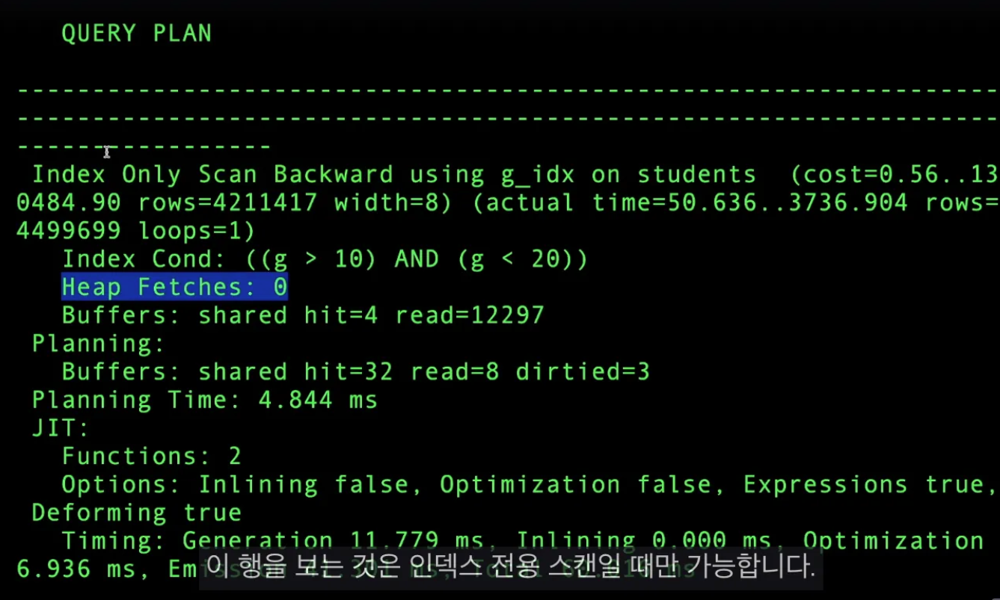

[⬅️ BACK ](../README.md)

# SECTION4-INDEXING-3

## Index only scan

- Disk IO를 하지 않아서 빠르다



- Heap Fetches는 index에서 찾은 레코드를 다시 테이블(힙 영역)에서 가져오는 동작을 의미한다.
- Head Fetched: 0이라는 의미는 스캔 과정에서 모든 데이터를 오직 인덱스만으로 가져왔기 때문에 추가적인 힙 스캔을 하지 않았음을 의미함

## none-key column

- index 생성시 선택적으로 필드를 포함할 수 있다. 인덱스의 검색 조건으로는 사용되지 않지만 조회할 때 함께 가져올 컬럼을 포함하도록 할 수 있다.
- 추가적인 Heap scan을 하지 않고도 index only scan을 할 수 있다.
- 하지만 인덱스에 비식별자 작업을 많이 할수록 인덱스의 크기가 커질 수 있다. 이런 경우 쿼리하는데 더 느려질 수밖에 없다.

  ```sql
  create index id_idx on grades(id) include (name)
  // index에 name을 포함한다.
  ```

## index를 생성하는 동안 다른 작업이 락되거나 트랜잭션이 잠길 수 있다

- 여러 번의 스캔을 수행하고 완료하기 전에 쓰기 트랜잭션을 모두 기다리거나 쓰기 크랜잭션이 있는 동안에는 일시 중지될 것임
- 테이블의 쓰기작업을 차단하기도한다.
- 읽기작업은 잘 작동한다.
- postgresql은 동시인덱스(concurrently)를 이용한 인덱스 생성 기능이 있다. 쓰기 읽기가 가능하다.
- mysql은 없는듯 하다.

```sql
create index concurrently g on grades(g)
```
