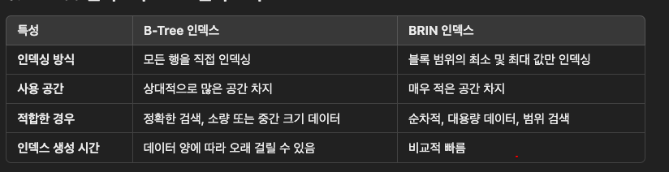

### Postgresql Indexes

- https://www.postgresql.org/docs/17/indexes-types.html
- postgresql에서 제공하는 index를 대량 알아보자

  - B-Tree

    - 주로 `<   <=   =   >=   >` 이 연산을 사용하는 경우 적용된다.
    - `BETWEEN and IN, IS NULL or IS NOT NULL ` 도 가능하다
    - Like나 ~ 구문도 가능한 경우가 있는데 문자열의 시작 부분이 고정되어있는 경우에만 가능하다
      - `col LIKE 'foo%' or col ~ '^foo`
      - `LOKE %검색어5`와 같은 경우는 불가능하다
    - Btree 인덱스는 벙렬된 순서로 저장이 된다. LEFT-TO-RIGHT 방식으로 왼쪽에서 오른쪽으로 정렬되는 방식으로 데이터를 저장하고 탐색한다. 첫 번째 문자부터 순차적으로 비교하도록 최적화 되어있다. 시작문자로 되어있는 Like검색은 이게 적용이 된다.
      다라서 특정 값, 범위 내의 있는 값을 찾을 때 적절하다
    - 하지만 %like%의 경우엔 정렬된 순서를 사용할 수 없어서 전체 테이블을 검색하게 된다. %나 와일트카드가 중간에 있는 경우도 마찬가지다

  - GiST

    - 다양한 데이터 타입을 지원하는 범용 인덱스 구조
    - GiST 인덱스는 데이터의 범위를 기반으로 한 유연한 트리 구조
    - pg_trgm에서 GiST 인덱스는 삼중문자를 비트맵 서명 형태로 근사화하여 저장한다. 이는 각 행의 모든 삼중문자들을 하나의 서명으로 결합하여 인덱싱하는 방식이다.
    - PostGis와 같은 확장 툴을 통해 공강 데이터를 처리할 때 사용된다. 좌표, 다각형, circle등
    - pg-trgm 확장 등을 사용해서 GiST인덱스를 통해 문자열 유사도 검색, 패턴 매팅칭 가능
    - 문자열은 3-gram 단위로 인덱싱하여 패턴 검색을 최적화한다.

  - SP-GiST

    - 데이터의 공간 분할을 기반으로 하는 인덱싱 방법
    - 데이터를 공강적으로 분할하는 데 최적화 되어있다
    - space partitioning을 기반으로 하는 인덱싱 구조
    - PostGIS와 함께 사용하여 공간 데이터의 위치나 범위 검색을 빠르게 처리

  - GIN

    - inverted index이다.(역인덱싱)
    - 역색인은 보통 감섹엔진에서 사용하는 방식으로 각 키워드가 어느 문서에 등장하는지 기록하는 구조이다. 책의 맨 뒷장에서 특정 문장이 어느 페이지에 포함되어있는지 보여주는 것이 있는게 그것과 비슷하다고 볼 수 있음
    - 배열,JSON,TEST검색 등 다중 값이 포함된 데이터에서 효율적으로 검색을 수행할 수 있도록 설계됨
    - tsvector 데이터타입을 사용해서 문서의 단어를 인덱싱할 때 유용함 Full-Text Search 에서 빠른 검색 수행 가능
      - tsvector는 문서의 단어들을 저장하는 정렬된 토큰임. 각 단어의 위치 정보도 함께 저장됨
      - "the quick brown fox 라는 것을 tsvector로 변환된면 아래와 같이 저장됨
        - `'quick':2 'brown':3 'fox':4`
        - 각 단어는 해당 단어가 문서에서 등장하는 위치와 함게 인덱싱 된다.
        - 불용어(의미없는 단어는 제거)
    - 단점은 인덱스 생성 속도가 느려서 업데이트 비용이 높다. 잦은 업데이트라면 성능
      고려해야한다
      

  - BRIN(Block Range Indexes)
    - 테이블의 물리적 순서와 값이 잘 연관되어있는 열에 효과적임
    - 대용량 테이블에서 범위 검색을 수행할 때 효율적으로 동장되도록 설계됨
    - 데이터를 직접 인덱싱하지 않고 데이터를 저장하는 디스크 블록 범위에 대한 최소, 최대값을 인덱싱하는 빙식으로 작동
    - Postgresql에서 데이터를 저장할 때 여러 행이 하나의 디스크블록에 들어간다(기본 8Kb). BRIN은 블록을 묶어서 범위로 처리하고 각 범위의 최솟값 최댓값을 인덱싱한다.
    - 오호,, 예를 들면 날짜 데이터가 있고 1~100번 블록의 값이 2020-01-0~2020-02-10까지 있으면 BRIN인덱스는 최소 2020-01-01과 최대 2020-01-10을 저장한다.
    - 하지만 데이터가 분산되어있거나 범위 내 데이터가 다양하다면 정확도가 떨어질 수 있다.
      
