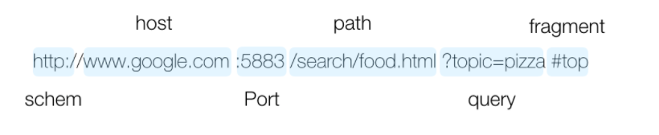

# [Computer Science][codestates] - HTTP/Network 기초 - 1 : Client -Server Architecture , HTTP, IP, Port

Category: Computer Science
Chapter: Network
강의: codestates
블로깅: Yes
유형: LESSON
작성일시: 2021년 10월 14일 오후 11:25

## 1. 클라이언트 - 서버 아키텍쳐 (Client - Server architecture)

### Client - Server

- **Client** : 클라이언트는 인터넷에 연결된 디바이스 또는 웹 접근할 수 있는 Software를 의미하며, 대표적으로 Browser가 있다. Browser는 API에 따라 Server에 Resource를 요청하고 HTML, CSS, Javascript등으로 작성된 코드를 내부 엔진을 통해 해독하며 Server의 Response에 따른 화면을 표시한다.
- **Server** : API를 통해 보내온 Client의 Request를 처리한다.

### **Client - Server architecture 설계 방식**

- 2Tier 아키텍처 라고도 불리는 설계방식
  - 리소스가 존재하는 곳(server), 리소스를 사용는 앱(browser)를 분리시킨 것을 말한다.
  - Client와 Server는 request와 response를 주고 받는 관계이다
- 3-Tier 아키텍처 : 2-Tier 아키텍처에 데이터베이스가 추가된 형태

### **Client 와 Server는 HTTP Protocol을 사용하여 통신한다.**

- HTTP로 주고받는 메시지를 "HTTP Message"라고 부른다. 이 HTTP Protocol을 통해 Client는 request를 server에 보내고 resource를 받는다.
  [HTTP | MDN](https://developer.mozilla.org/en-US/docs/Web/HTTP)
  - 프로토콜 (Protocol)이란?
    - 프로토콜른 통신규약이다. 프로토콜마다 지켜야 하는 규약이 존재한다.
    - Network 통신 계층에 따라 사용하는 Protocol이 다르다. 주로 사용되는 protocol은 7계층인 응용계층과 4계층인 전송계층에서 사용되는 protocol이다. 아래의 표를 참고하여 알아두자.
      - 주요 프로토콜
        [주요 프로토콜 - 7 응용계층](https://www.notion.so/005cd64aa2924f24880211193562cf91)
        [주요 프로토콜 - 4 전송 계층](https://www.notion.so/bb0aa38725e04130aaa9ec9362de8c07)

### API **란?**

API란 Application Programing Interface의 약자로 아래와 같은 기능을 한다.

- Client가 리소스를 잘 활용할 수 있도록 Server에서 제공하는 Interface이다.
- API가 구축되어있어야 client가 이를 활용할 수 있다.
- 보통 인터넷에 data를 요청할 때에는 HTTP 프로토콜을 사용하며 주소(URL , URI)를 통해 접근할 수 있다. 적절한 API를 디자인하여 이를 통해 URI를 디자인하는 것이 중요하다.

- HTTP API 디자일을 하는 Best Practice: 사용자 관리 API
  [사용자 관리 API](https://www.notion.so/8f5977e72ba2472884fc8baf303f63be)
  \*HTTP 요청에는 CRUD 각각의 행동과 일치하는 메소드가 존재하며 아래와 같다. 이 HTTP 메소드는 자원(resource)으로 하고자 하는 작업에 맞게 적절하게 사용되어야 한다.
  [기억해야 할 HTTP 메소드](https://www.notion.so/6c550c749d464e3d99983514a56ce2a1)

## 2. 브라우저의 작동 원리

Network 통신을 위해 알아야 하는 기본적인 용어들을 공부하면서 브라우저가 작동되는 원리를 알아보자.

### 1) **URL과 URI**

- **URL (Uniform Resource Locator)** : Network 상에서 웹 페이 지, 이미지, 동영상 등의 파일이 위치한 정보를 나타낸다. URL은 **scheme**, **hosts**, **url-path** 까지를 URL 이라고 한다. 초반에는 URL과 URI를 혼동하지 말자. query, fragmant는 URL에 포함되지 않는다.

[URL의 구성](https://www.notion.so/5dd9d9a1df244666b55ec705b4fe4f7c)

URI는 URL의 상위 개념이다.

- **URI (Uniform Resource Idenrifier)** : 특정 Resource를 식별하는 통합 지원 식별자
  URL은 network 상에서 resource가 어디있는지 알려주기 위한 규약이다. URI는 식별하고 , URL은 위치를 가르킨다. [그림추처](https://www.charlezz.com/?p=44767) 조금 이해하기 힘든 정의이다.
  
  URL의 기본 요소인 **schem, host , port, path**에 **quey**와 **fragment를** 포함한다.
  [URI의 구성](https://www.notion.so/21159858cc214e2c85c390bd2f7f4a75)

### 2) IP와 PORT

- **IP (Internet Protocol address , IP 주소) : Network에 연결된 특정 PC의 주소를 나타내는 체계**
  - IPv4 : Iterenet Protocol version 4를 의미하며 네 개의 숫자 덩이(?)로 구분된 주소체계이다.
    - 각 덩이마다 0~255까지 나타낼 수 있다. 2^(32) 인 43억 개의 IP주소를 표현할 수 있다.
    - 기억해야하는 IP주소 (이미 용도가 정해져있는 주소가 있다)
      - [localhost](http://localhost) , 127.0.0.1 : 현재 사용 중인 로컬 PC를 지징한다
        [file://127.0.0.1/Users/username/Desktop/](file://127.0.0.1/Users/username/Desktop/) (username에 사용자 이름 입력)을 하면 크롬 브라우저를 탐색기로 사용할 수 있다...!
      - 0.0.0.0 , 255,255,255,255 : broadcast address로 로컬 네트워크에 접속된 모든 장치와 소통하는 주소. 서버에서 접근 가능 IP 주소를 broadcast address로 지정하면 모든 기기에서 거버에 접근할 수 있다.
    - IPv6 : IPv4로 할당할 수 있는 PC가 한계를 넘어서 생긴 표기법. 2^(128)개의 주소를 표현할 수 있다.
- **PORT**
  - PORT는 IP주소가 가리키는 PC에 접속할 수 있는 통로 (채널)을 의미한다.
  - port 번호는 0~65,535까지 사용할 수 있다.
  - port 번호는 중복해서 사용할 수 없으며 다른 프로그램에서 사용중이라면, 다른 포트 번호로 실행이 된다.
  - 기억해야 할 port 번호 (이미 정해진 port번호라도 필요에따라 자유롭게 사용이 가능하다. )
    - 22 : SSH
    - 80 : HTTP
    - 443 : HTTPS
    - FTP (file transfer protocol) 같은 경우 생략하면 21번이 기본값입니다.
    - [기타 다양한 포트번호](https://en.wikipedia.org/wiki/List_of_TCP_and_UDP_port_numbers)

### 3) 도메인과 DNS

- **Domain name**
  Domain name은 IP주소를 대신하여 사용하는 주소이다.
  - DNS (Domain Name System)
    - 모든 IP주소가 Domain Name을 갖는 것은 아니다. 일정 기간동안 대여하여 사용한다..
    - Domain name으로 해당 사이트로 이동하기 위해서는 Domain name과 매칭된 IP주소를 확인하는 작업이 필요하다.
    - DNS는 host의 domain 이름을 IP주소로 변환하거나 반대의 경우를 수행할 수 있도록 개발된 Database system이다.
    - 브라우저의 검색창에 Domain name을 입력한다면 , 이 요청은 DNS에서 IP주소를 찾고 해당 웹 서버로 요청을 전달하여 Client와 Server가 통신하게 해준다.
      DNS의 동작은 조금 더 공부를 해서 포스팅을 해보겠다...!
