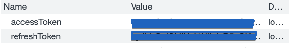

# WebServer-cors-cookie-setting

Category: WEB SERVER
Chapter: Web Server
강의: Study
블로깅: No
유형: Self Study
작성일시: 2022년 3월 11일 오후 1:00

# WebServer-cors-cookie-setting

시험 대비를 위해 3 tier architecture의 token인증을 구현하던 와중에 Client에 cookie가 제대로 생성되지 않는 문제가 발생하였다. 로그인 과정을 아래와 같다

1. 로그인 : Client ID,Pw응 입력하고 POST login 요청을 보낸다 → Server느 DB에서 사용자를 확인 후 Access Token과 Refresh Token을 발급 후 JWT Token을 cookie를 통해 보낸다. 추가적으로 response로 access token을 보낸다.
2. 로그인 후 사용자 정보 요청 : Client가 사용자 정보를 요청한다. 요청 시 access header에 Access token을 같이 보낸다. → Server는 Access token의 validation과 db정보 validataion을 마치고 정보를 전달한다.
3. 새로운 access token 발급 : Client에서 Endpoint로 요청을 보낸다 → Server는 request에 있는 cookie에서 refresh token의 유효성 검사를 한 뒤 새로운 accesstoken와 userinfo를 전달한다.

위의 과정에서 분명 cookie에 refresh token과 access token을 넣어 보냈는데 Client에 확인해보니 cookie정보가 없었다.

Error도 404 Error가 뜨고 어떤 정보도 나오지 않았다. access token을 확인하는 과정과 refresh token을 확인하는 전체적인 과정은 크게 다르지 않았기 때문에 비교를 해보았다. 차이점은 사용자를 확인하는 과정에서 access token은 req의 access header 에 있는 토큰을 검증하고, refresh token은 cookie에 있는 토큰을 사용한다는 점이 다르기 때문에 아무래도 cookie를 전송할 때 어떤 “정책"을 추가해야하지 않나 싶었다.

구글링을 해보니 Origin의 경우에는 req.header에 cookie가 추가되지만, Cross Site의 경우 client는 withCredential : true로, server의 cors 정책에서도 credentials: true 로 설정해주어야 했었다.

- [express.cors](https://www.npmjs.com/package/cors)

  • `credentials`: Configures the **Access-Control-Allow-Credentials** CORS header. Set to `true` to pass the header, otherwise it is omitted → 즉, CORS 요청의 경우 header를 전달하려면 이 옵션을 true로 설정해야한다.

- [axios](https://github.com/axios/axios)로 통신한다면 withCredentials :true
  ```jsx
  axios
        .get(url + "refreshtokenrequest", { withCredentials: true })
        .then((data) => {
  				...
  				...
  			}
  ```

적용 후 확인해보니 정상적으로 Cookie에 Token이 설정된 것을 확인할 수 있었다.



http 통신에 대한 이해도 이해지만, 모듈을 사용할 때 메뉴얼을 보는데, 꼼꼼히 보지는 않았던 것 같다. 앞으로 좀 거 시간을 투자해서 제공하는 기본 옵션들의 내용은 미리 읽어보고 사용하는 습관을 들여야 겠다고 생각한다.

이번 시험이 끝나고나서 이번에 사용했던 모듈들에 대해 정리를 해보는 시간을 갖도록 해보자.
