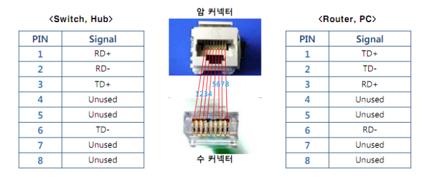

제로베이스 컴퓨터 공학자 따라잡기 온라인 완주반 강의를 듣고 정리한 포스팅

# Network-L7-Devices_and_Cable

HA3를 보고나서 프로젝트 기획 준비에, 이력서,면접 준비에 CS공부를 조금 미뤘던 것 같다.

바빠도 일주일에 한 개를 듣더라고 꾸준히 공부하자! 언젠간 필요하게 될 것이고 언젠간 써먹게 되니까 꾸준히 해둬야 한다.

### Achievement goals

- 네트워크 계층 중 물리 계층에 사용되는 장비에 대해 알아본다.
- 물리계층에서 사용되는 케이블과 커넥터에 대해 알아본다
- 물리계층의 성능을 표시하는 단위,성능에 대해 알아본다.

### 1. 물리계층 장비

물리계층 장비로는 허브(hub)와 리피터(repeater)가 있다.

- repeater는 신호가 약해지기 전에 신호를 재생성하여 먼 거리까지 통신이 가능하게 해준다. 신호를 증폭하는 것이 아니라 bit 단위로 신호를 복사하여 original 세기를 갖는 신호로 다시 생성하는 장비이다. (요즘엔 거의 사용하지 않는다) [이미지 출처](http://commonerrors.blogspot.com/2013/06/hub-vs-switch-vs-repeater-lan-devices.html)

- Hub는 전기 신호를 증폭하여 연결된 여러 PC끼리 통신을 하게 한다.HUB는 단순한 중계기의 역할을 하며 H데이터를 필터하지 않기 때문에 연결되어있는 모든 Pc에 데이터를 보낸다. 이를 broad casting이라고 한다 데이터를 받은 PC들은 필요 없는 데이터라면 거부를 할 수 있다. [이미지 출처](https://afrozahmad.com/blog/ethernet-switch-vs-hub-vs-router/)
  
  Hub의 통신 방식은 [CSMA/CD](https://geek-university.com/csma-cd-explained/) 이라 불리는 알고리즘을 사용한다. Carrier Sense Multiple Access with Collision Detection 의 약자이다. 이 알고리즘은 동인 네트워크에 있는 장비들이 언제 packets을 보내고 충돌 시 수행을 작업을 결정하는 데 도움이 된다.
  기능을 살펴보면 아래와 같다.
  1. Carrier Sensing : 데이터를 보내기 전에 다른 노드에서 데이터를 보내는 중인지 확인한다. 만약 보내고 있다면 기다린다.
  2. Multiple Access : 데이터를 보내는 곳이 없다면 전송을 시작한다
  3. Collision Detection : 동 시간대에 데이터를 보내게 되면 충돌이 일어나고 정지한다. 그 후 Idel tile이라는 특정 시간이 지나면 다시 첫 번째 단계부터 반복한다.
     이러한 방식을 허브의 반이중 전송방식 이라고 한다(Half Duplex)
  - 전송방식
    - Simplex : 단방향 통신으로 수신측은 송신측에 응답이 불가능하다.
    - Half Duplex : 반이중 전송방식. 양방향 통신이지만 송.수신 시간이 정해져있다. 마치 무전기와 비슷하다.
    - Full Duplex : 전이중 전송방식으로 동시 양방향 통신이 가능하다. 전화기와 같다

### 2. LAN CABLE의 종류, Connector

Hub를 연결하는 케이블과 커넥터를 의미한다.

신호를 전달하는 통로로, TP, 동축, Fiber등을 사용한다.

1. TP(Twisted Pair)

   - 8개의 구리선을 꼬아 사용한다. 꼬아 사용하는 이유는 자기장의 간섭을 최소화 하여 속도와 거리 성능을 향상시키기 위함이다.
   - UTP와 STP로 나뉘는데 UTP는 Unshiel Twisted Pair)이고 STP는 Shielded Twisted Pair이다. 쉴드는 각 선의 자기장의 간섭을 최소화 하기 위해 씌워진다. 하지만 UTP가 단가가 낮아 더 많이 쓰인다.
   - RJ-45라는 커넥터를 사용한다 (Registed Jack) [이미지 참조](https://m.blog.naver.com/lunarispars/221435195633)

   

2. 동축(Coaxial)

   선 중앙에 심선이 있으며 그 주위를 절연물과 외부 도체로 감싸고 있다.

3. Fiber 광

   - 전기 신호의 자기장이 없는 빛으로 통신한다
   - 장거리 고속 통신이 가능하다
   - IDC(Internet Data Center)에서 많이 쓰인다.
   - Single, Multi 두 종류가 있고 사용하는 커텍터는 LC, SC가 있다.

4. [광 트랜시버](http://m.itooza.com/view.php?ud=2015081909571211103)

   관통신망을 연결하는 광케이블과 데이터 전송을 담당하는 전송장비 사이에서 전기 신호 → 빛 신호 또는 반대로 변환 시켜주는 역할을 한다.

   

SFP(Small Form-factor Pluggable transceiver)와 GBIC(Gigabit Interface Connector)가 있다.

### 3. 단위와 성능

- 1Byte=8bit이고, bit는 일반적으로 회선 speed (100Mbps = 100 Mega bit per second), byte는 Data size에 쓰인다 (50 GB = 50 Giga Byte)
- Performance
  장비의 Capacity는 아래와 같은 성능을 비교하여 설명한다.
  - [Bandwidth](<https://ko.wikipedia.org/wiki/%EB%8C%80%EC%97%AD%ED%8F%AD_(%EC%8B%A0%ED%98%B8_%EC%B2%98%EB%A6%AC)#:~:text=%EB%8C%80%EC%97%AD%ED%8F%AD(%E5%B8%B6%E5%9F%9F%E5%B9%85%2C%20%EC%98%81%EC%96%B4,bandwidth)%EB%A1%9C%20%EB%B6%80%EB%A5%BC%20%EC%88%98%20%EC%9E%88%EB%8B%A4.>)(대역폭) : [이미지 출처](https://m.blog.naver.com/PostView.naver?isHttpsRedirect=true&blogId=ki630808&logNo=221927880095)
    
    주어진 시간대에 네트워크를 통해 이동할 수 있는 정보의 양을 의미한다. 헤르츠 단위로 측정된다. 대역폭이 클수록 한 번에 주고 받을 수 있는 데이터도 많아진다. 그리고 대역폭은 속도의 개념이 아닌, 속도에 대한 “용량” 이다
  - Throughput(처리량) [이미지 출처](https://m.blog.naver.com/PostView.naver?isHttpsRedirect=true&blogId=ki630808&logNo=221927880095) [참고사이트](https://www.dnsstuff.com/latency-throughput-bandwidth)
    
    특정 시간동안 전송하고 받을 수 있는 데이터의 양을 의미한다. Bandwidth가 도로라고 한다면 Throughput은 그 도로를 달리는 자동차의 양과 같다.
  - BackPlane
    Network장비가 최대로 처리할 수 있는 데이터 용량을 의미한다.
  - CPS(Connections Per Second) [이미지 출처](https://tutledeveoper.wordpress.com/2017/08/26/cps-tps-%EC%B0%A8%EC%9D%B4/)
    
    초당 TCP 커넥션 연결을 생성할 수 있는 최개 개수를 의미하며 L4, session 단계에서 사용된다.
    [이 블로그](https://realforce111.tistory.com/48)에 자세히 설명을 해놓았다. Client가 load balancer의 vip로 접속을 하고 특정 서버로 분산 후 다시 세션을 끊는 과정을 1CPS라고 한다고 한다.
    예를 들면, 어떤 장비에서 100,000CS를 지원하면 초당 100,000개의 커넥션을 동시에 처리할 수 있다는 의미이다.
  - CC(Concurent Connections) : 최대 수용 가능한 커넥션을 의미한다.
  - TPS(Transactions Per Seconds)
    초당 Transaction연결 수를 의미하며 L7에서 주로 HTTP 성능을 측정하는데 많이 쓰인다.
    위의 의미들에 대해서는 나중에 L4 부분에 가서 조금 더 보충을 해보자.
  ### 예시
  성능에 대한 예를 들어보자. 아래와 같이 인터넷 전용선- 방화벽 - backbone..과 같은 연결이 있다고 했을 때 각 부분에서 성능을 다음과 같이 예로 들 수 있다
  Internet —→ FW —→ Backbone —→ PC1,PC2,...
  1. Internet 전용선의 대역폭은 2Gbps이다.
  2. 방화벽의 Throughput은 1024byte = 3Gbps , 512byte = 2Gbps 로 다양하다 → 방화벽은 데이터를 검사해야 하므로 데이터가 클수록 오래 걸린다.
  3. Backbone의 Backplane은 총 100Gbps이다. → PC가 여러 대가 연결될 수 있고 모든 통신을 수용하는 것은 Backbone이므로 단위가 크다.
     물리계층에 사용되는 장비와 장비의 Capacity에 대해 정리해 보았다. 성능을 나타내는 지표에 대해서는 조금 더 설명이 필요하긴 하지만 이후 L4 레이어 부분에서 더욱 공부해 보기로 한다.
