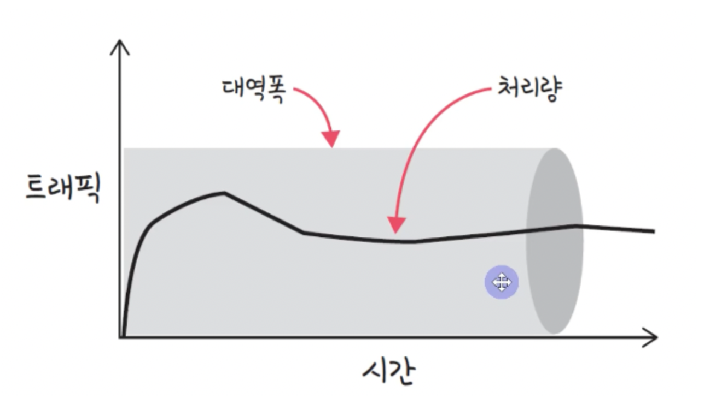

## 개요

- 전반적인 기초적인 네트워크 관련 내용을 정리한다.
- 비전공자 출신으로 네트워크에 대한 이해를 위해 큰 개념 위주로 정리한다
- 면접을 위한 CS 전공지식노트를 참고하여 작성하였다.
- 네트워크 공부의 큰 가닥을 잡기 위한 정리이며 세부적인 내용은 다른 책을 참고하여 추가할 예정이다.

## 네트워크 기초

- 처리량(throughput) & 지연시간(latency)
  - 처리량(throughput)
    
    - 단위 시간당 처리량 이다. 단위는 bps(bits per second)이다.
    - 처리량이란 성공정으로 전달된 데이터의 양을 의미하며 `'많은 트래픽을 처리했다' = '많은 처리량을 가진다'` 라고도 할 수 있다.
    - 실제 사용시 측정된 값이다.
    - 트래픽을 모니터링 하기 위한 지표중 하나이다. 이를 통해 네트워크의 성능을 평가할 수 있다.
    - `트래픽`이란 네트워크를 통해 전송되는 데이터의 양을 의미한다. `트래픽이 많아졌다는 것은 네트워크에 많은 데이터가 전송`되고 잇다는 것을 의미한다.
    - 이에 반해 `처리량`은 이 트래픽을 처리하는 것을 의미한다.` 처리량이 많아졌다고 하는 것은 처리되는 트래픽이 많아짐`을 의미한다.
    - 참고로 위의 그림에서 대역폭(bandwith)이란 주어진 시간동안 전송가능한 데이터의 양을 의미한다.
      - 만약 대역폭이 1Mbps라면 1초동안 1Mbps의 데이터를 전송할 수 있다는 것을 의미한다.
  - 지연시간(latency)
    - 요청이 처리되는 시간을 의미한다.
    - 메체의 타입(유선인지 무선인지), 라우터의 패킷 처리 시간, 패킷의 크기, 네트워크의 혼잡도 등에 따라 달라진다.
- 네트워크 토폴로지 & 병목현상

  - 토폴로지는 중요하다. 병목현상을 찾을 때 중요한 기준이 되기 때문이다.

  - 네트워크 토폴로지(network topology)

    - 네트워크의 물리적인 구조를 의미한다.
    - 노드와 링크가 어떻게 배치되어 있는지에 대한 방식이며 연결 형태를 의미한다.

  - 트리 토폴로지

    - 계층형 토폴로지이며 트리 형태로 배치한 방식
    - 루트 노드에서 시작하여 끝 노드로 향하는 방식이다.
    - 노드추가 및 삭제가 쉽다.
    - 특정 노드에 트래픽이 올리면 하위 노드에 영향을 끼필 수 있다.
    - 루트 노드가 다운되면 네트워크가 붕괴된다.

  - 버스 토폴로지

    - 버스 형태로 배치한 방식
    - 중앙 통신 회선 하나에 여러 개의 노드가 연결되어 공유하는 방식
    - 근거리 통신만(LAN)에서 사용한다.
    - 중앙 통신 회선에 노드를 추가하거나 삭제하기 쉽다.
    - 하지만 스푸핑이 가능한 문제가 있다
      - 스푸핑이란 LAN 상에서 송신부의 패킷을 다른 호스트에 가지 않도록 하는 스위칭 기능을 마비시키서나 속여서 특정 노드에 해당 패킷이 오도록 처리하는 것을 말한다.
        - 얘를 들면 신뢰할 수 있는 사이트의 도메인 이름과 동일하게 하거나 비슷한 웹사이트 디자인을 사용하여 사용자를 속이고 민감한 정보를 입력하게 만드는 등

  - 스타 토폴로지

    - 중앙에 있는 노드에 모두 연결된 네트워크 구성
    - 노드 추가 및 애러 탐지가 쉽다.
    - 패킷의 충돌 발생 가능성이 적다
    - 장애노드가 중앙노드가 아닌 경우 다른 노드에 영향을 끼치는 것이 적다.
    - 설치 비용이 고가

  - 링형 토폴로지

    - 각 노드가 양 옆의 두 노드와 연결하여 전체적으로 고리처럼 연속된 통신망을 구성하는 방식
    - 데이터는 노드에서 노드로 이동
    - 각 노드는 고리 모양의 길을 통해 패킷을 처리한다.
    - 노드 수가 증가되어도 네트워크 손실이 거의 없다. 충돌 발생 가능성이 적고 노드의 고장 발견이 쉽다.
    - 하지만 네트워크 구성 변경이 어렵고 회선에 장애가 발생하면 전체 네트워크에 영향을 끼친다.

  - 메시 토폴로지

    - 망형 토폴로지
    - 하나의 단말 장치에 장애가 발생해도 여러 개의 경로가 존재하여 네크워크를 계속 사용할 수 있다.
    - 트래픽의 분산처리가 가능하다.
    - 노드의 추가가 어렵고 비용이 많이 든다.

  - 병목현상(bottleneck)
    - 토폴로지가 중요한 이유는 병목현상을 찾을 때 기준이 되기 때문이다.
      - 예를 들어 만약 지연시간이 길어 대역폭을 늘렸지만 해결되지 않은 경우 서버 간 그리고 게이트웨이로 이어지는 회선을 추가함으로써 병목을 해결할 수 있다.
    - 전체 시스템의 성능이나 용량이 하나의 구성요소로 인해 제한을 받는 현상을 의미한다.

- 네트워크의 분류

  - WAN(World Aread Network) : 광역 네트워크 국가 또는 대륙등
  - MAN(Metropolitan Area Network) : 지역 네트워크
  - LAN(Local Area Network) : 근거리 통신망. 같은 건물, 캠퍼스 등

- 네트워크의 성능을 볼 수 있는 명령어

  - 만약 코드상 무제는 없는데 사용자가 데이터를 받지 못한다면 네트워크의 병목현상일 수 있다.
  - 네트워크의 병목현상은 주로
    - 대역폭, 토폴로지, 서버cpu, memory사용량, 비요율적인 네트워크 구성 등이 있다.
  - 발생되는 문제가 네트워크 문제인지를 확인하기 위하 명령어들은 아래와 같다.

    - ping(packet internet gropter)

      - 대상에 일정 크기의 패킷을 전송
      - TCP/IP 프로토콜 중에 ICMP 프로토콜을 통해 동작한다. 따라서 이 프로토콜을 지원하지 않는 기기를 대상으로는 실행불가능

      ```bash
      >ping www.google.com
      PING www.google.com (142.250.207.100): 56 data bytes
      64 bytes from 142.250.207.100: icmp_seq=0 ttl=116 time=30.554 ms
      64 bytes from 142.250.207.100: icmp_seq=1 ttl=116 time=32.240 ms
      ```

    - netstat

      - 접속되어있는 서비스들의 네트워크 상태를 보여준다.
      - 네트워크 접속, 라우팅 테이블, 네트워크 프로토콜 등 리스트를 보여준다.
      - 주로 서비스의 포트가 열려있는지 확인용

      ```bash
        > netstat
        Active Internet connections
        Proto Recv-Q Send-Q  Local Address          Foreign Address        (state)
        tcp4       0      0  000.000.000.000.000    000.000.000.000.000.https ESTABLISHED
        ...
        ...
      ```

    - nslookup

      - DNS에 관련된 내용을 확인하기 위해 쓰는 명령어
      - 특정 도메인의 IP확인

      ```bash
      nslookup
      > google.com
      Server:		168.126.63.1
      Address:	168.126.63.1#53

      Non-authoritative answer:
      Name:	google.com
      Address: 142.250.76.142
      ```

    - tracert
      - 리눅스에서는 traceroute
      - 목적지 노드까지 네트워크 경로를 확인할 때 사용
      - 어느 구간에서 응답 시간이 느린지 등 확인 가능
      ```bash
        >traceroute www.google.com
        traceroute to www.google.com (142.250.207.100), 64 hops max, 52 byte packets
         1  000.00.000 (000.00.000)  2.730 ms  1.803 ms  2.162 ms
         2  000.00.000 (000.00.000)  3.291 ms *  11.921 ms
         ...
         ...
      ```
    - ftp : 대형 파일을 전송하여 테스트
    - tcpdump : 노드로 오가는 패킷을 캡쳐

## TCP/IP 4계층 모델

## 네트워크 기기

## IP 주소

## HTTP
