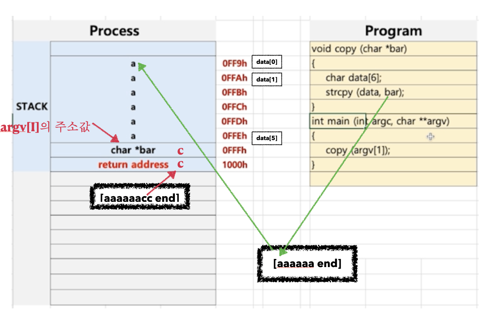

# [Computer Science][제로베이스 ]-운영체제 - 프로세스 구조- Stackoverfloew

Category: Computer Science
Chapter: Operating System
강의: Zerobase
블로깅: Yes
유형: LESSON
작성일시: 2021년 12월 23일 오후 1:25

제로베이스 컴퓨터 공학자 따라잡기 온라인 완주반 강의를 듣고 정리한 포스팅

# 프로세스와 컨텍스트 스위칭 - Stackoverfloew

이전 강의에서는 Context Switching을 이해하기 위해 Process의 구조와 process 실행 과정에 대해 공부를 하였다.

[[Computer Science][제로베이스 ]-운영체제 - 프로세스 구조](https://sora9z.tistory.com/104)

이번 강의에서는 Context Switching에 대하여 확실히 이해는 것을 목표로 공부하였다. 들어가기 전에, Process 구조를 이용하여 해커들의 공격에 활용되었던 사례에 대해 알아보자!

### Stackoverflow

아래 code에 대한 pocess 실행 과정을 예로 들어보자



- 위의 code의 process 실행은 아래와 같이 실행된다.(간략하게)

1. Main에서 Copy 힘수 호출문을 만나면 return address가 stack에 추가된다.
2. Copy 의 매개변수 bar pointer가 Stack에 추가된다.
3. Char data[6] : 6byte의 stack 공간이 추가된다.
4. Strcpy 함수가 호출되고 return address가 stack 에 추가된다.
5. Strcoy에 의해 data에 값이 추가된다.
6. strcpy의 return address로 pc를 이동하고 Strcpy 가 종료된다.
7. copy 함수까지 종료된 후 차례로 main이 종료된다.

위의 code에서 사용된 strcpy main의 매개변수로 들어간 argv와 argc에 대해 알아보자

1. strcpy()

```c
char* strcpy(char* destination, const char* source);
```

- `strcpy()` 함수는 destination이 가리키는 string을 string의 끝을 의미하는 null character까지 포함하여 byte단위로 복사하는 함수이다.
  예를들어 [aaaaaa null]을 복사 할 떄 a를 한 개씩 넣는다.
- `strcpy()` 는 복사한 string을 return 한다.

1. argv, argc
   이에 관한 자세한 내용은 아래의 글을 참고하자.

[Command line arguments in C/C++ - GeeksforGeeks](https://www.geeksforgeeks.org/command-line-arguments-in-c-cpp/)

- 간단히 정리하자면 아래와 같이 쓰이며 의미는 다음과 같다.

  - main 함수는 함수를 실행하는 시작점이다. main 함수에 command line을 인자로 넣어서 사용할 수 있다.

  ```c
  int main(int argc, char **argv) { /* ... */ }

  // main 함수의 실행 파일이 text.exe라고 할 떄 인자를 넣는 방법은 command line에서
  text.ext hello hi 456 // 이렇게 넣을 수 있다
  ```

  - argc : argument count 전달 된 argument의 개수
  - argv : argument vector 인자로 전달한 내용이 저장되는 문자열 argv[0]번 째에는 실행파일이 들어가고 argv[1]부터 인자가 들어간다.

이제 stackoverflow가 어떻게 발생되는지 확인해보자.


위의 code를 실행파일 program.exe라고 하자. 위의 프로그램을 실행하면서 “aaaaaa” 이라는 길이가6인 문자열을 인자로 넣었다고 가정해보자. 여기서 argc는 1개이고 argv=[”program.exe”, ”aaaaaa”]이다.

1. copy함수의 bar는 argb[1]의 주소값을 갖게된다.
2. strcpy에서 bar는 data의 첫 번째 주소부터 시작해서 data에 하나 씩 복사를 하게된다. (end를 만나면 끝)
3. char data는 stack에서 각각 주소를 담게된다.

하지만 만약 aaaaaa이 아니라 aaaaaaccc와 같이 3개의 문자가 더 있다면 길이6인 data의 범위를 넘게 되므로 오히려 위의 그림과 같이 덮어씌워질 수 있다. 이런 경우 해커에 의대 다른 code를 실행하게 될 수도 있다.
